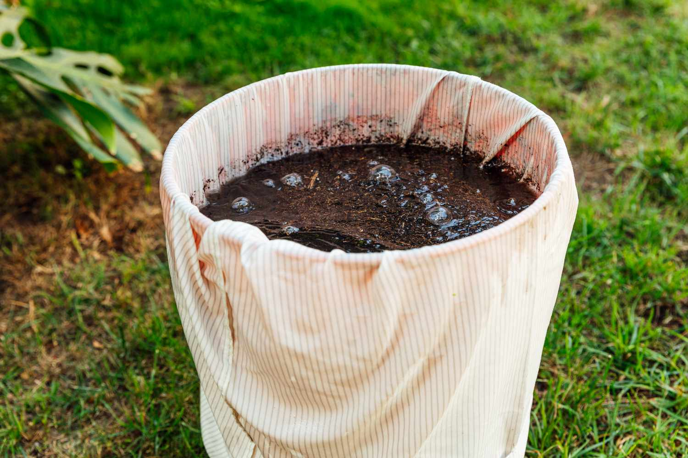
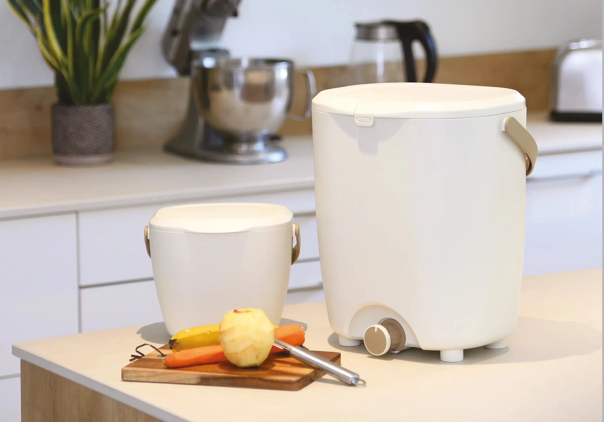
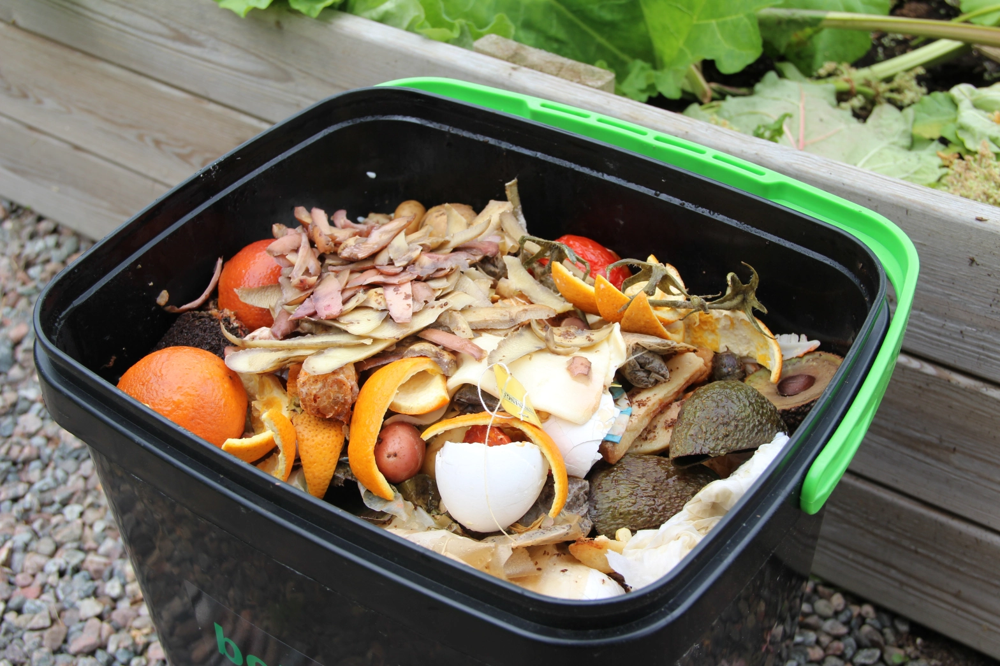
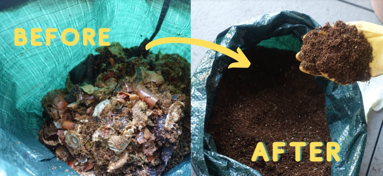

import Columns from '@site/src/components/Columns'
import Column from '@site/src/components/Column'
import ReactPlayer from 'react-player'

## What is anaerobic composting?

Anaerobic composting is a method of breaking down organic materials in an environment without oxygen. Unlike aerobic 
composting(aka [hot composting](https://en.wikipedia.org/wiki/Compost#Hot_and_cold_composting_%E2%80%93_impact_on_timing)),
which relies on oxygen, anaerobic composting uses special microorganisms that work in oxygen-free conditions to decompose organic waste.

<!-- truncate -->

### Key Features of Anaerobic Composting:

#### 1.	No Oxygen
Anaerobic composting happens in environments where oxygen is absent. Organic materials are sealed in
containers or pits to keep the air out.

#### 2.	Microbial Breakdown
In these conditions, anaerobic microbes (like methane-producing bacteria) break down the organic matter,
releasing gases like [methane(CH₄)](https://en.wikipedia.org/wiki/Methane) and [carbon dioxide(CO₂)](https://en.wikipedia.org/wiki/Carbon_dioxide).

    The decomposition of organic matter:
    $$
    \begin{gather}
        CO_2 + 4H_2 \rightarrow CH_4 + 2H_2O \\
        CH_3COOH \rightarrow CH_4 + CO_2 \\
        CO_2 + 4H_2 \rightarrow CH_4 + 2H_2O
    \end{gather}
    $$
:::info
Major output:
- Water (H2O)
- Methane(CH4)
- Carbon dioxide(CO2)
:::

#### 3.	Fermentation Process
The process is similar to fermentation. It tends to be slower than aerobic composting and can
produce some strong odors, like acidic smells or even rotten egg odors (from hydrogen sulfide).

#### 4.	Sealed Environment
Anaerobic composting requires the waste to be sealed off from air. Bokashi composting is a great
example of this method, where food waste is fermented in airtight containers.

### Pros of Anaerobic Composting

#### Space-saving
Since the waste is sealed, it’s ideal for small spaces, like apartments or urban areas where there’s no room for large compost piles.

#### Low-maintenance 
Unlike aerobic composting, anaerobic composting doesn’t need to be turned or aerated because it doesn’t rely on oxygen.
People use a bucket and easily start practicing.

#### Versatility 
Anaerobic methods like Bokashi can handle food scraps that most aerobic composting can’t, like meat and dairy.

### Cons of Anaerobic Composting

#### Odor 
Anaerobic composting can produce strong smells because of the gases released during the breakdown process.

#### Slower Decomposition
The process takes longer than aerobic composting.

#### Gas Emissions
Anaerobic composting releases methane,  a potent greenhouse gas, which can be an environmental concern if not properly managed.
However, if well captured and reused, it will be a good [Biogas](https://en.wikipedia.org/wiki/Biogas) energy. 

#### Outcome Usage
Another concern is the waste cannot be used directly as compost in the garden but must first be buried in soil or added
to a traditional compost pile to finish decomposing.

## What is the difference between aerobic composting and anaerobic Composting?

| **Aspect**                   | **Aerobic Composting** 🌬️                         | **Anaerobic Composting** 🔒                                                                                    |
|------------------------------|----------------------------------------------------|----------------------------------------------------------------------------------------------------------------|
| **Oxygen Requirement**        | Requires oxygen (air) for decomposition. 🌬️        | Occurs without oxygen. 🚫🌬️                                                                                   |
| **Microorganisms Involved**   | Aerobic bacteria and fungi. 🦠                     | Anaerobic bacteria (e.g., methane-producing bacteria). 🦠💨                                                    |
| **Decomposition Speed**       | Faster decomposition (weeks to months). ⏳⚡         | Slower decomposition (months to a year). 🐢⏳                                                                   |
| **Odor**                      | Minimal to no odor if managed properly. 🌿         | Can produce strong odors (e.g., rotten egg smell). 🤢                                                          |
| **Byproducts**                | Produces carbon dioxide (CO₂), water (H₂O), and heat. 🔥💧 | Produces methane (CH₄), carbon dioxide (CO₂), and organic acids. 💨🧪                                          |
| **Temperature**               | Generates heat, reaching up to 140°F (60°C) or more. 🌡️🔥 | Little to no heat produced. ❄️                                                                                 |
| **Types of Materials Used**   | Primarily yard waste, food scraps, and paper products. 🍂🥕📄 | Can include a wider variety, such as meat and dairy. 🥩🧀                                                      |
| **Maintenance**               | Requires regular turning or aeration to supply oxygen. 🔄🌀 | No need for turning, just sealed and left to decompose. 🚫🔄                                                   |
| **End Product**               | Fully decomposed humus-like compost. 🌱             | Partially decomposed material (often needs further processing). 🧪                                             |
| **Suitable Environment**      | Best for outdoor areas with ample space. 🏡🌳        | Suitable for indoor, urban areas with limited space. 🏙️🚪                                                     |
| **Energy Production**         | Does not produce energy. ❌⚡                       | Can produce biogas (methane), which can be used as a fuel source. ⚡🛢️ |
| **Environmental Impact**      | Lower greenhouse gas emissions if done correctly. 🌎💚 | Produces methane, a potent greenhouse gas, if not captured for energy use. 🌎💨                                |

## Anaerobic composting produces greenhouse gases, still deserve to be promoted?

Even though anaerobic composting produces greenhouse gases like methane, it’s still worth promoting, especially when managed properly. 
Modern anaerobic systems can capture methane and use it as clean energy, reducing overall carbon emissions. 

Plus, anaerobic composting, like [Bokashi](https://en.wikipedia.org/wiki/Bokashi_(horticulture)), handles a wider variety of waste, 
including meat and dairy, which traditional composting can’t. 
It also reduces the amount of waste sent to [landfills](https://en.wikipedia.org/wiki/Landfill), where it would otherwise
produce methane without being reused. 
The final product improves [soil health](https://en.wikipedia.org/wiki/Soil_health), which is a huge benefit for gardening and farming. 

When combined with aerobic composting, anaerobic methods can offer a powerful solution for 
[managing organic waste](https://en.wikipedia.org/wiki/Waste_management), even in small spaces.

## Are all kitchen composters use anaerobic composting method?

Not any more. Well, before [GEME Composter](https://www.gemebio.com/products/geme) is invented. Most of the kitchen composters are almost
Bokashi compost bin. People use such bins to store their kitchen waste, food scraps, making compost tea from them.
It's good. But now GEME kitchen composter is the one not using anaerobic composting method. Instead, GEME use the 
aerobic composting way, which [simulates a hot composting pile in a box](https://www.gemebio.com/pages/how-it-works), making home 
composting effortless.

