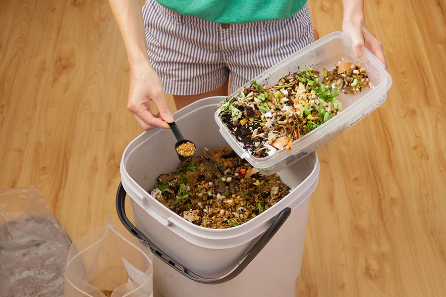
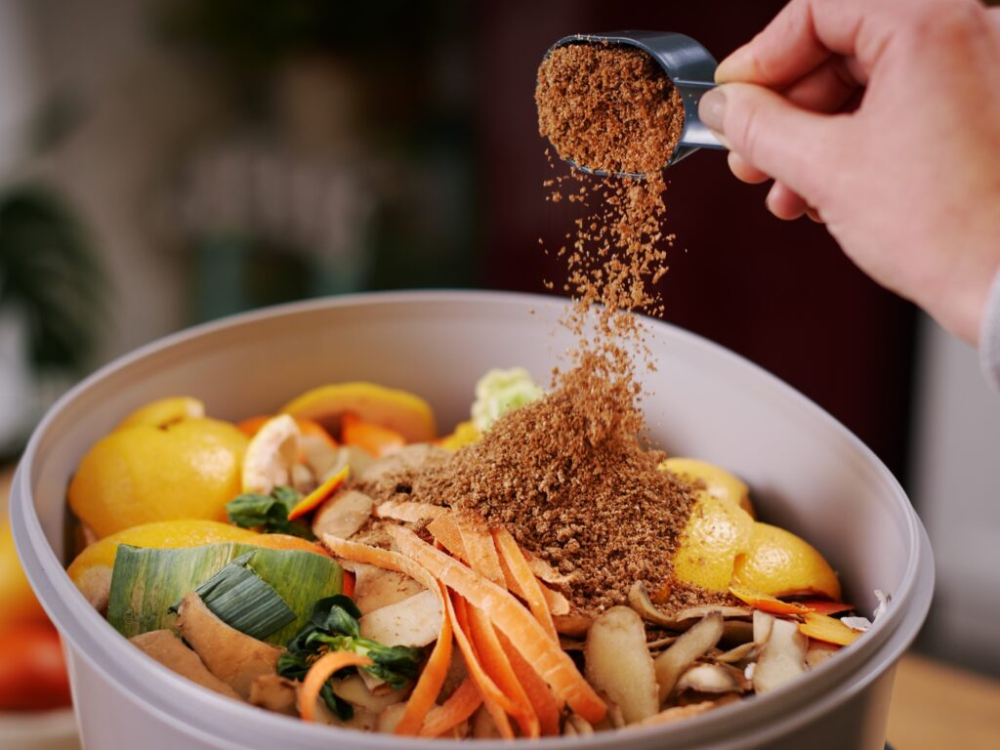
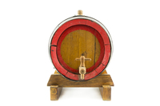
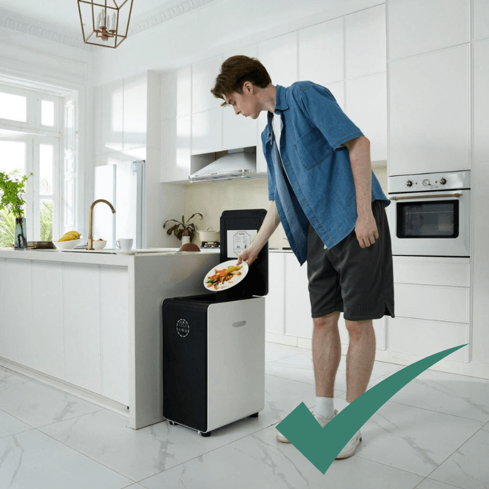
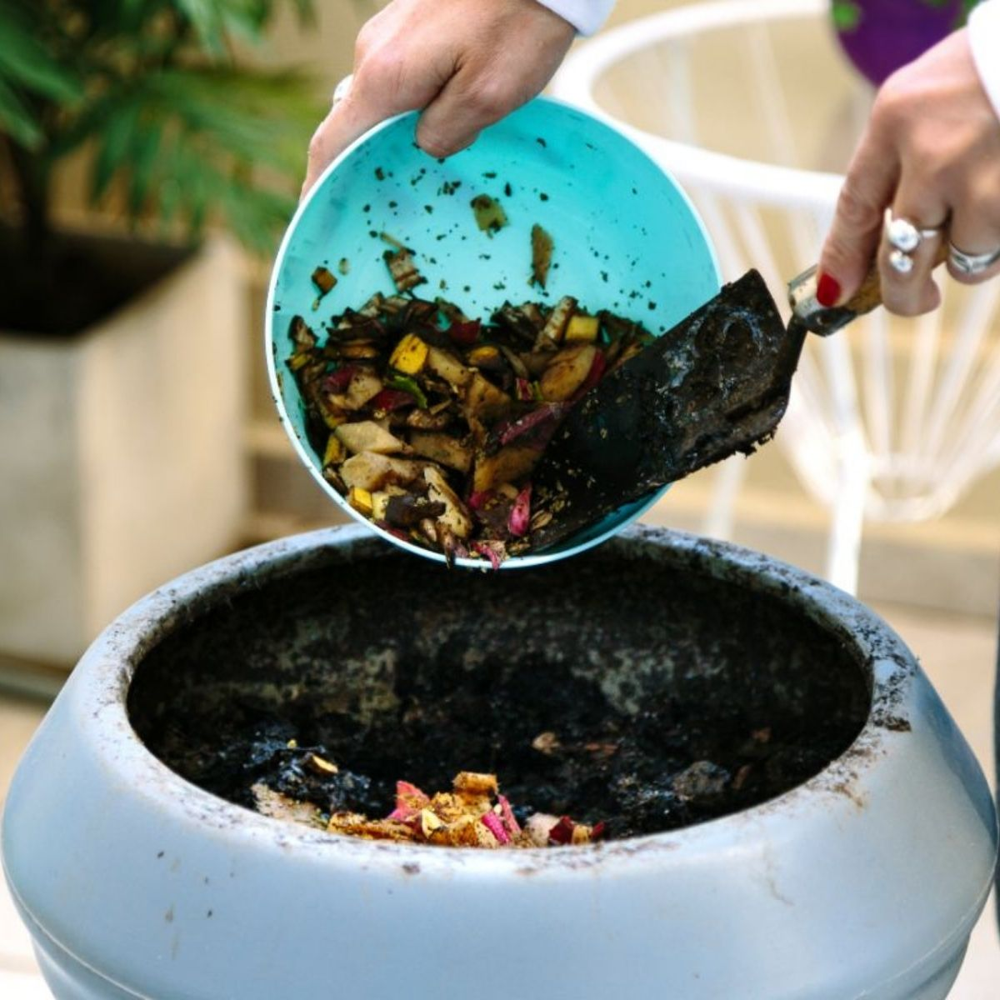

import Columns from '@site/src/components/Columns'
import Column from '@site/src/components/Column'
import ReactPlayer from 'react-player'

## What is bokashi?

Bokashi is an effective method for turning food waste and organic matter into a valuable soil amendment,
often categorized as a form of composting. Unlike traditional composting, Bokashi uses anaerobic fermentation,
which means the process occurs without the need for oxygen. The outcome of Bokashi usually called compost tea,
it is kind of liquid contains a lot of good bacteria and nutrient.

<!-- truncate -->

## The history of Bokashi 

Bokashi comes from a Japanese word, “ぼかす”（bokasu), means something slowly turning into blur or obscure. 

Bokashi has its roots in Japan and was developed in the 1980s by Dr. Teruo Higa, a professor of horticulture. 
He is best known for his discovery of Effective Microorganisms (EM), a combination of beneficial bacteria, fungi, 
and yeasts that accelerate the fermentation process in organic matter. These microorganisms play a central role in the 
Bokashi method by breaking down organic waste, condiering one of the [anaerobic composting](/blog/what-is-anaerobic-composting-and-what-are-the-pros-and-cons).

### Pros of Bokashi

#### Can be indoor
This is making it possible for every family to do it at home. 
Home composting 

#### Device is cheap
You can use ordinary bucket to do it if you know the working principle. 

#### Does no require oxygen 
Which means it can be sealed. While it producing fermented material that gives off less odor.

#### Can handle meat and dairy products
Bokashi system is handy for kitchen scraps, traditional composting pile majorly handle yard waste, leaves, vegetables 
and fruits, they can not handle meat and liquid product very well, but Bokashi can make it easily.

#### Bokashi system can be easily maintained

Some people tend to have multiple bokashi bucket in their farms or houses.
When carefully designed, some bokashi systems come with bucket and spigot, it can let beneficial microbes that flourish
in anaerobic, acidic environments but smell less foul than do those in unfettered, natural anaerobic conditions.

### Cons of Bokashi

#### Create greenhouse gase like methane
While it is a good energy source if well managed, but for most people, it is difficulty to capture and reuse it.
Somehow it ends up polluting the environment.   

#### Strong odor leak
If you walk close the bin, and it is not well sealed, there will be a strong odor.
Most of the people will find it unpleasant. Especially if you live in apartment of your house is small.

#### Output is not finished compost
The main problem with Bokashi composting is that the fermented waste cannot be used directly as compost in the garden
but must first be buried in soil or added to a traditional compost pile to finish decomposing.

#### Management of liquid waste 
Most Bokashi system product liduqid by-product, which need to be taken out regulary. 
If not, the inside wil become too acidic.
Well, the liquid could be good feed to plant if you do gardening, however, it requires management effort.
If not, your house will become very smelly.

#### Learning curve
Similar to [aerobic composting](/blog/what-is-anaerobic-composting-and-what-are-the-pros-and-cons#what-is-the-difference-between-aerobic-composting-and-anaerobic-composting),
Bokashi need skills and effort to setup and maintain. You need to carefully design the layers of foodwaste, and the adding pace.
You need to understand how to maintain the right condition, like air exposure, draining liquid regulary, eg.

## What is the difference between Bokashi and GEME Composting?

| **Aspect**                  | **GEME Composter**                                        | **Bokashi**                                                        |
|-----------------------------|-----------------------------------------------------------|--------------------------------------------------------------------|
| **Oxygen Requirement**      | Yes                                                       | No                                                                 |
| **Microorganisms Involved** | Yes, GEME Kobold                                          | Yes, EM or other Bokashi Bran                                      |
| **Decomposition Speed**     | Super fast, 6-8 hours for most leftover ⏳⚡                | Slower decomposition (days to a weeks). 🐢⏳                        |
| **Odor**                    | No odor 🌿                                                | Smelly if 🤢                                                       |
| **Maintenance**             | Zero effort, GEME take care of everything. 🔄🌀           | Drain liquid, management waste layers structure. 🚫🔄              |
| **End Product**             | Fully decomposed humus-like compost. 🌱                   | Partially decomposed material (often needs further processing). 🧪 |
| **Accepted Waste**          | Food scraps, meat, diary products, liquid waste, pet poops | Food scraps, meat, diary products                                  |
| **Suitable Environment**    | Indoor, kitchen, dinner room and even living room.        | Suitable for indoor, urban areas with limited space.               |
| **Environment Impact**      | Aerobic composting, no greenhouse gas emits               | Emit greenhouse gas like methane                                   |

## Conclusion

GEME Composter provides the most effortless composting experience, it is using the aerobic composting, 
but still can compost meat and diary product. And it also can handle odor very well. 

As a modern human being, it's good to embrace the technology and living a clean sustainable lifestyle. 

<Columns>
  <Column className='text--left'>
    
  </Column>

  <Column className='text--center text--left'>
    
  </Column>
</Columns>
