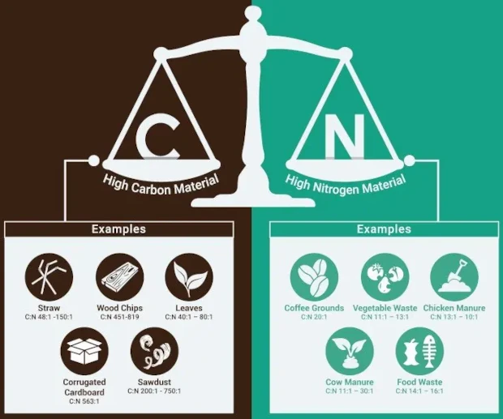
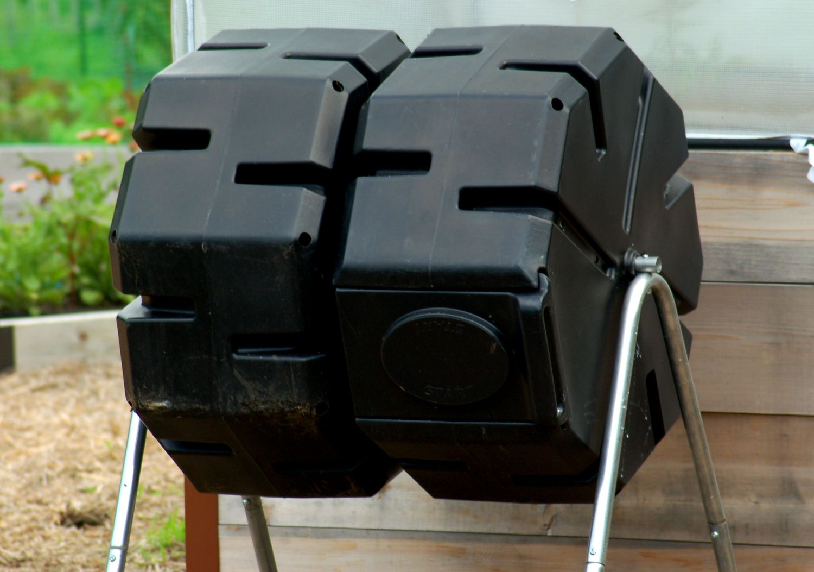
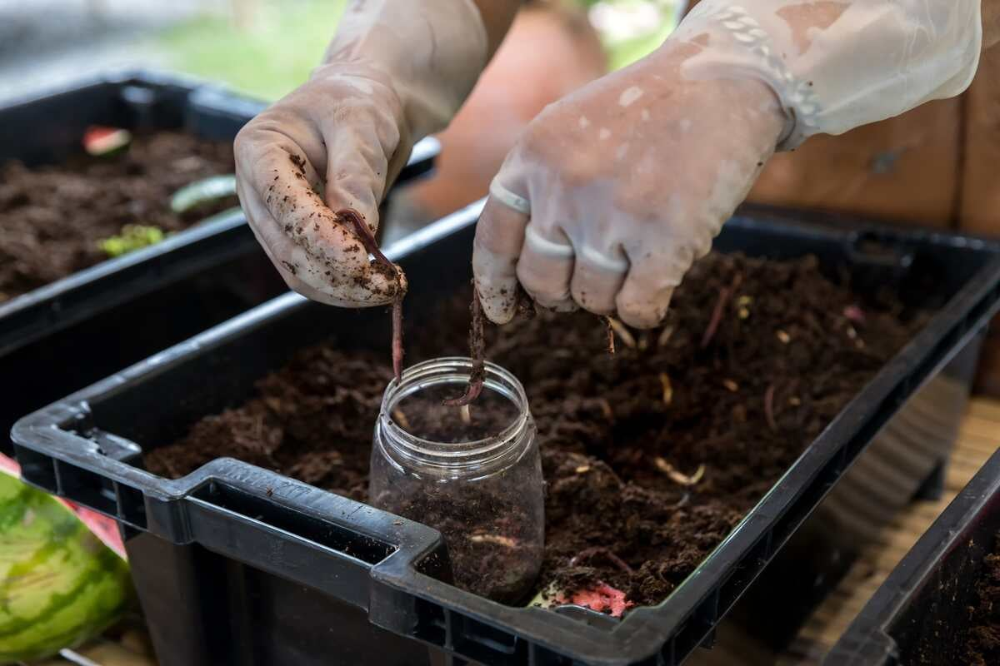

import Columns from '@site/src/components/Columns'
import Column from '@site/src/components/Column'
import ReactPlayer from 'react-player'

Composting without attracting rats requires some specific strategies, as rats are often drawn to food waste and warm, 
sheltered spots. Here are several ways to reduce the risk of attracting rats to your compost pile.

## Avoid composting with rat attracting foods

- No Meat or Dairy: Avoid adding meat, fish, dairy, or fatty foods, as these are highly attractive to rats.
- Minimize Cooked Food Scraps: Limit the amount of cooked food in your compost, as this can also lure rats.
- Turn Compost Regularly: Frequently turning your compost pile will prevent it from becoming a warm, cozy nesting site for rats.

:::info
In short, use yard waste, no food waste will help to reduce rats issues. If nothing to eat, rats maybe will play around 
but won't stay. 
:::

## Build your compost pile away from buildings
- Location: Keep your compost bin away from your house or sheds where rats might already be nesting.
- Rat Deterrents: Surround your compost area with plants that repel rodents, such as peppermint or garlic.
- Setup some traps to kill some rats before they trying to enter your pile.

    <ReactPlayer 
        className="video__player" 
        controls height="100%" 
        url="https://youtu.be/5Qk8W5uf-Dw" width="100%" 
    />
    
rolling log rats trap

## Compost in smaller batches

Smaller batches of compost reduce the likelihood of creating a large, large compost pile provide bigger place for the rats
to hide, and warm environment that could attract rodents. 
Rats love place with more condition to hide and don't like place easy to expose to the sun.

## Balance greens and browns, maintain good C/N ratio 

Good Carbon Nitrogen ration is the good factor for composting, and create good soil. 
Mice love food, they don't love soil.

- Cover Food Scraps: Always cover food waste with “browns” (leaves, straw, paper). 
This hides the food and helps with odor control as well.

- Keep Moisture Levels Low: A wet compost pile can attract rats, so try to maintain a balance in moisture by adding dry 
materials if it becomes too soggy.

## Use a rat-proof compost bin

- Enclosed Bins: Use a compost bin with a secure lid to prevent rats from accessing the compost. Sturdy plastic or metal bins work well.
- Raised Bins: Raising the compost bin off the ground can prevent rats from burrowing underneath.
- Wire Mesh: Line the bottom of the compost bin with wire mesh to block entry from below.

## Use a worm bin, vermiculture 

While it will be a bit disgusting to raise earth worms for composting, but it works really well to protect your compost 
away from rats, by just simply close your lid. Also earth worms can be tiny and perfect for home composting, can be easily
practice in apartment and other place without a big yard. It's a popular indoor composting method for people live in cities.

## Use an electric composter, save your life

Nowadays, technology is good enough to invent some high tech product to solve composting problems. 
There are [electric kitchen composter](https://www.geme.bio//product/geme) like [GEME Composter](/blog/geme-2023-summary-and-early-meet-geme-ii) available.

These products definitely can keep your food waste composting far away from the annoying rats.
They also save your significant effort to maintain a compost pile, which could require a lot of knowledge and caring time.
Electric composter can also solve the odor problem that most people try composting at home will encounter. 

    <ReactPlayer 
        className="video__player" 
        controls height="100%" 
        url="https://youtu.be/CVoDNDONFAk?t=996" width="100%" 
    />
    
GEME Composter runing

BTW, when you choose [electric composters](https://www.geme.bio/industrial-equipments), be careful for some fake composters on the marketing.
Those products are actually just dehydrators but they love to marketing themselves as "composters".
GEME, as a brand of real composters, works [completely different](/blog/what-is-the-difference-between-geme-composter-and-other-electric-kitchen-composters) 
than those [electric compost bins](/blog/how-does-a-real-electric-composter-work) trying to do something good for consumers. 
[GEME is calling for industry standards for composters](/blog/geme-is-calling-for-industry-standards-for-composters). 
