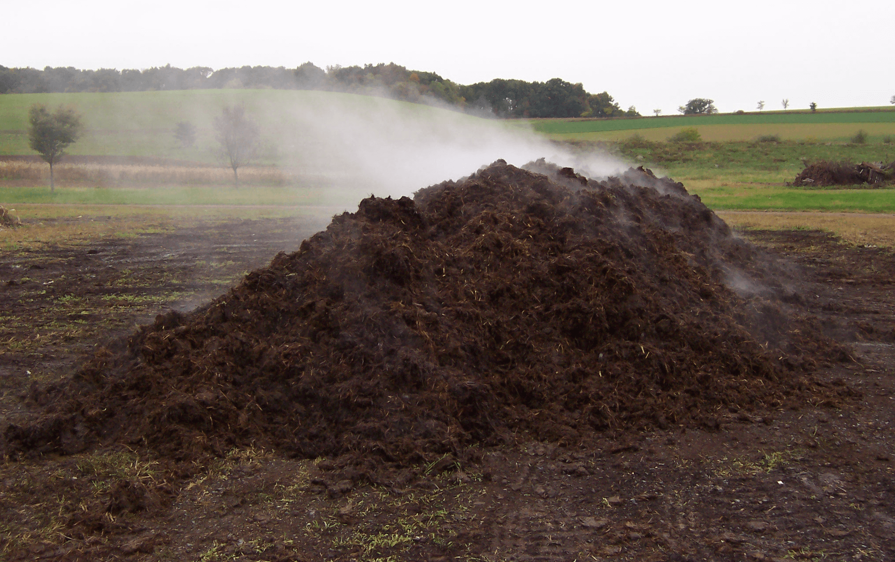
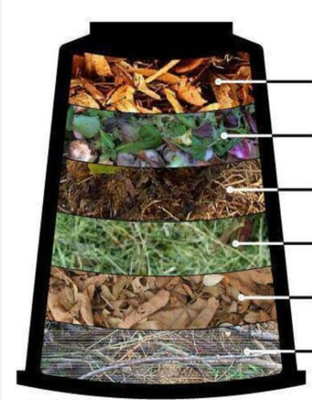
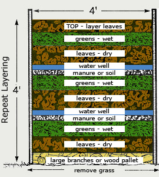
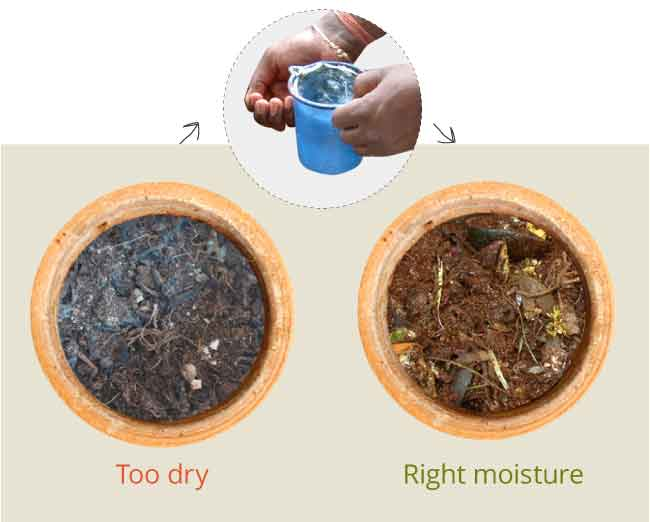
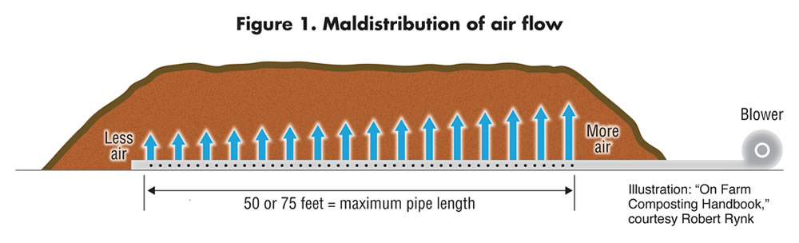
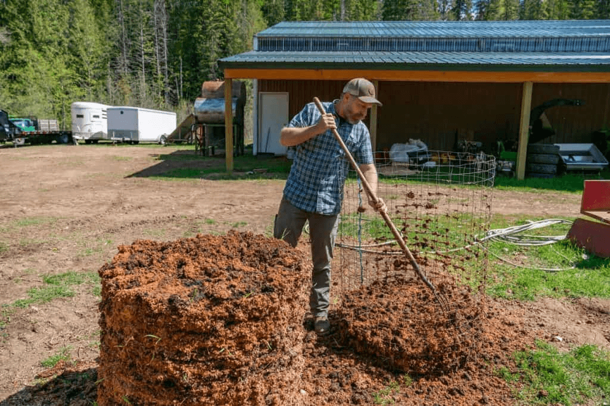

import Columns from '@site/src/components/Columns'
import Column from '@site/src/components/Column'
import ReactPlayer from 'react-player'

Composting is the process of breaking down organic waste—like food scraps, leaves, and yard trimmings—into nutrient-rich 
material that can be used to improve soil health. It’s a natural recycling method that turns what would otherwise be trash 
into valuable fertilizer for plants. 

In terms of sustainability, composting plays a key role by reducing the amount of waste sent to landfills, which in turn
cuts down on methane emissions—a potent greenhouse gas. It also helps enrich the soil, making it better at retaining water 
and nutrients, which is essential for farming and gardening. Composting is an easy, eco-friendly way to recycle organic waste
and contribute to a greener planet.
<!-- truncate -->

## Composting process

There are 2 popular way to composting, one is [aerobic composting](https://en.wikibooks.org/wiki/Horticulture/Hot_Composting), 
the other one is [anaerobic composting](/blog/what-is-anaerobic-composting-and-what-are-the-pros-and-cons#what-is-anaerobic-composting).
We have discussed the difference in [this article](/blog/what-is-anaerobic-composting-and-what-are-the-pros-and-cons).

Basically, in majority, when talking about composting, we are referring the aerobic composting, also called hot composting.  
Which usually use a form of compost pile to make it.

## How to make compost pile?

Build an effective compost pile requires technology and skill to maintain. It is not easy to master. Even experience farmer
need time to practice and tune it well.

Typically, there are 5 steps to build a compost pile from scratch. 

### 1. Choose the good location
Usually, you need to choose a place can well drain water, better keep it in a cool place, and under certain temperature.
Establish a pile at least 3x3 feet, so it will be more optimal.

### 2. Collect the input material
In short, you need 2 types of material, green and brown.
- **Greens (Nitrogen-rich materials)**:
  - Food scraps: fruit and vegetable peels, coffee grounds, eggshells.
  - Grass clippings, fresh leaves, and garden waste.

- **Browns (Carbon-rich materials)**:
  - Dry leaves
  - Shredded paper
  - Cardboard 
  - Straw
  - Sawdust
  - Wood chips.

### 3. Design the layers

- **Start with Browns**: 
Create a base layer of browns, about 4-6 inches thick, to promote airflow.

- **Add Greens**: 
Add a layer of greens (about 4-6 inches), followed by another layer of browns.

- **Alternate Layers**: 
Continue alternating between greens and browns, ensuring the compost stays moist but not soggy.

<Columns>
  <Column className='text--center text--left'>
    
  </Column>
  <Column className='text--left'>
    
  </Column>
</Columns>

### 4. Control the moisture and aeration

**Controlling moisture** and **ensuring proper airflow** are crucial for successful composting. Here’s a simple guide:

1. **Moisture Control**:
  - **Maintain Moisture Levels**: The compost pile should feel like a damp sponge—not too dry, not too wet. If it's too dry, the decomposition process slows down. If it's too wet, it can become anaerobic and produce odors.
  - **Add Water**: If the pile becomes too dry, sprinkle water over it or add moist materials like fruit and vegetable scraps.
  - **Absorb Excess Moisture**: If the pile becomes too wet, add dry materials like straw, leaves, or cardboard to absorb moisture.

2. **Airflow**:
  - **Turn the Compost**: Regularly turning the compost (every 1-2 weeks) introduces oxygen into the pile, helping beneficial aerobic bacteria thrive and speeding up decomposition.
  - **Use Coarse Materials**: Add coarse materials like wood chips or branches at the bottom to help improve airflow within the pile.
  - **Proper Size**: Keep the compost pile to about 3x3 feet (1x1 meter) for optimal aeration and heat retention.

This balance of moisture and airflow helps ensure faster decomposition and prevents unpleasant odors or pest issues.

### 5. Maintain the pile

### Maintaining a Compost Pile: The Challenges

Maintaining a compost pile requires regular monitoring and effort. You need to turn the pile frequently, ideally every 1-2 weeks, 
to ensure adequate airflow and to prevent the pile from becoming anaerobic, which causes foul odors.

Moisture control is also tricky; the pile must stay damp but not soggy. Overly dry piles slow down decomposition, 
while too much water leads to rotting. 

This constant balancing act can be labor-intensive and time-consuming.

## How to make compost pile the easy way?

Frankly, composting is easy for some people by nature. People who live in village seems born to learn how to make it perfectly.
However, it seems hard for some people in the opposite. 
As composting concept more and more popular, people try to composting in their yards, even in their apartment. 
It's a good way and probalbly the best way to solve food waste management problem, one of our common problem in our daily live.

In this article, kindly follow the 5 steps, you might be bale to learn how to start a compost pile in your yard, or in your garden.
However, if you live in a apartment. You can try [bokashi](/blog/geme-vs-bokashi). 
Or you can give [GEME Composter](/) a try, it is the world's easiest way to practice hot composting. 
Worth a look of [how it works](https://www.geme.bio/how-it-works).

## Can I compost without compost pile?

Yes, there are 3 ways you can try. 

### Verminculture 

[Vermiculture](https://en.wikipedia.org/wiki/Vermicompost) is the process of using earthworms to decompose organic waste, 
turning it into nutrient-rich compost called vermicompost. 
This method is efficient at recycling food scraps and other biodegradable materials, producing high-quality fertilizer for gardens. 
Vermiculture is environmentally friendly but requires careful maintenance of temperature, moisture, and pH levels to keep 
the worms healthy and active. It can be labor-intensive and may attract pests if not properly managed.

### Bokashi 

Bokashi is a composting method that uses anaerobic fermentation to break down food waste, including meat and dairy. 
It requires adding a special mix of microorganisms (Bokashi bran) and can be done indoors, producing nutrient-rich soil 
amendments quickly with minimal odor.

### Electric Composter

Using [an electric composter](/) is an efficient way to quickly turn food waste into nutrient-rich compost. 
The device speeds up the composting process by grinding, heating, and aerating organic waste, typically break down daily
food waste in few hours to days. Like GEME Composter, is one of the products design to simulate a compost pile in a box.
Makes the [composting at home](https://www.epa.gov/recycle/composting-home) the most effortless way.

It requires minimal effort, operates indoors, and can handle various types of food scraps, 
including items that traditional composters might struggle with, like meat and dairy. 
More detail check this article [what are the difference between GEME Composter and composting pile](/blog/traditional-composting-vs-geme-composter).

