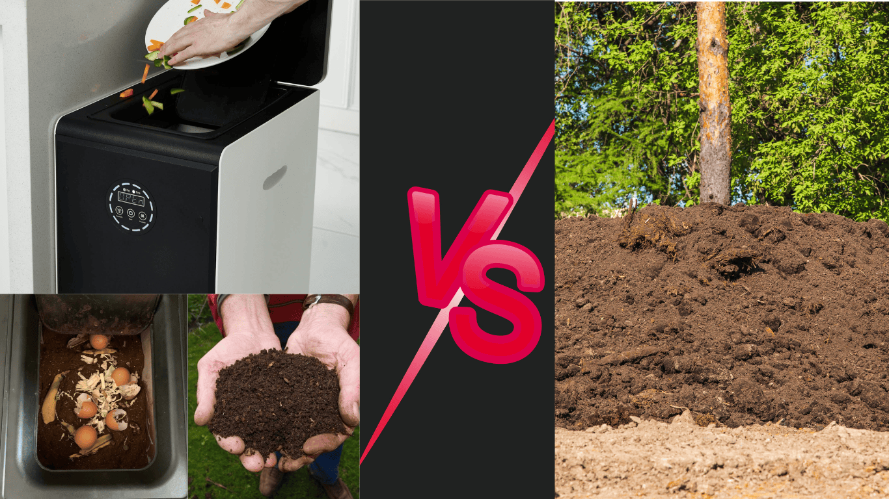

import Columns from '@site/src/components/Columns'
import Column from '@site/src/components/Column'
import ReactPlayer from 'react-player'

When comparing [traditional composting](/blog/how-to-start-a-simple-compost-pile-quickly) to the GEME electric composter, both methods offer unique advantages for managing organic waste. 
Traditional composting relies on natural decomposition and requires outdoor space, time, and regular maintenance, 
making it ideal for larger gardens or farms. In contrast, the GEME composter uses modern technology to accelerate the process, 
breaking down the food scraps quickly, it simulates compost pile in a box and is suitable for indoor use in urban environments. 
While traditional methods are more cost-effective, GEME provides convenience and speed for busy households looking to 
compost with minimal effort.

<!-- truncate -->

## Common and difference between GEME composter and compost pile 

| Feature                        | [GEME Electric Composter](/)                                 | Traditional Composting                  |
|:-------------------------------|:-------------------------------------------------------------|:----------------------------------------|
| **Breakdown Time**             | 6-8 hours for most leftover                                  | Weeks to months                         | 
| **Finished Compost**           | Weeks                                                        | Months                                  |
| **Location**                   | Suitable for indoor use                                      | Requires outdoor space                  |
| **Maintenance**                | Minimal effort, fully automated                              | Needs regular turning and monitoring    |
| **Handling Meat/Dairy**        | Can process meat and dairy                                   | Not recommended                         |
| **Manure Waste**               | Support and well prevent pollution design                    | Not recommended                         |
| **Apartment Composting**       | Yes                                                          | No                                      |
| **Winter is Coming**           | Come on, no problem!                                         | Oh no!                                  |
| **Energy Use**                 | Requires electricity                                         | No energy required                      |
| **Odor Control**               | Minimal odor due to sealed, filter, and deodorization system | Requires management to avoid odor       |
| **Waste Capacity**             | Ideal for small to medium households                         | Large-scale, suitable for big gardens   |
| **Cost**                       | Higher initial cost, low running costs                       | Low setup cost, almost free to maintain |
