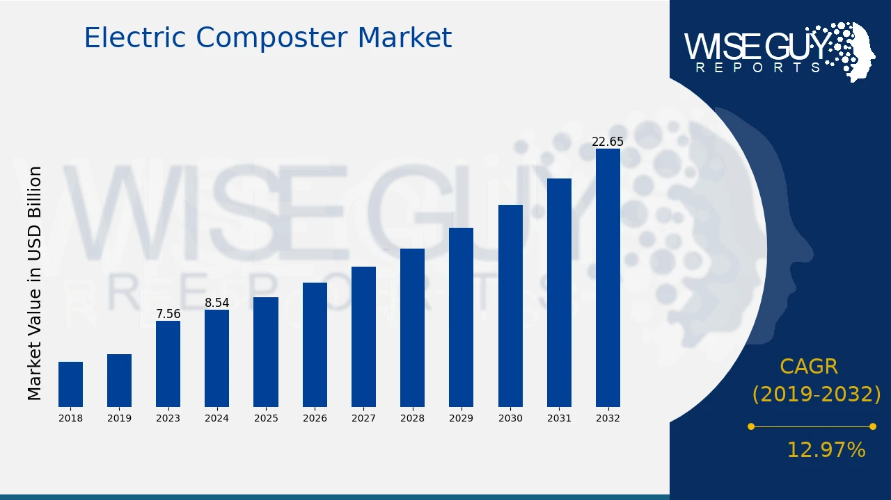
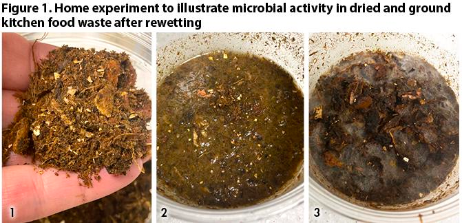
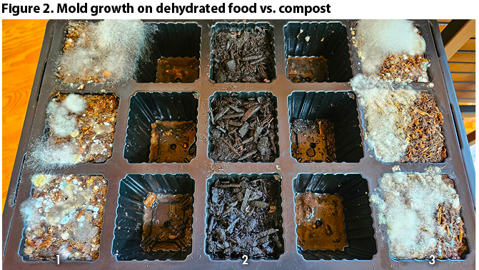
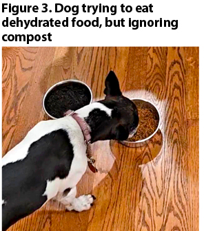
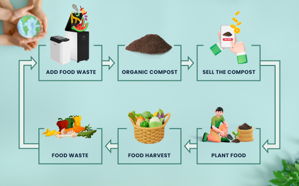

import Columns from '@site/src/components/Columns'
import Column from '@site/src/components/Column'
import ReactPlayer from 'react-player'

## I. The Rise of Home Electric Composters Driven by Composting Market Trends
In recent years, increased environmental awareness has driven many individuals to adopt sustainable lifestyles. 
Home composters have become a popular solution for managing kitchen waste, leading to a significant rise in market demand. 
According to the 2023 BioCycle Nationwide Survey on Residential Food Waste Collection Access, 14.9 million U.S. 
households now have access to food waste collection through 400 programs across 710 communities. Since 2021, there has 
been substantial growth in these programs, with options for curbside collection including opt-in, standard, or mandatory 
participation. 

<!-- truncate -->

California's S.B. 1383 regulation and New York City's new law mandating residential food waste collection provide strong 
policy support for the development of home composters. These regulations align with the government's environmental goals 
and aim to reduce the environmental impact of food waste while promoting organic waste recycling. As a result, 
home electric composters are emerging and gaining popularity among users.

## II. The Confusing Landscape of Electric Composters
Home electric composters claim convenience and efficiency, allowing for easy indoor composting without complex knowledge 
or experience. However, as the market for these devices expands, skepticism has emerged in composting forums and 
environmental magazines.

Experts and seasoned composters have highlighted the confusion in the current market. Ron Alexander, author of BioCycle, 
conducted experiments showing that dehydrated food samples are prone to mold and attract flies. In plant growth tests, 
soil mixtures from dehydrated food lacked seed germination and produced strong odors, while composted soil mixtures supported
healthy grass growth. DNA sequencing revealed no measurable microbial DNA in dehydrated food samples, indicating a lack
of microbial stabilization. Analysis of these materials also showed high electrical conductivity, elevated sodium and 
chloride content, low moisture levels, and unsuitable pH values, which undermine their effectiveness as soil amendments 
(source: [BioCycle](https://www.biocycle.net/residential-food-waste-collection-access-in-u-s/)).

Professor Sally Brown from the University of Washington's School of the Environment noted that some home electric composters 
fail to produce usable compost. Using the output of these appliances on indoor plants can result in strong odors, mucus, 
and plant death. True composting requires specific environmental conditions and microbial action. These appliances merely
stabilize food waste by removing moisture; when water is reintroduced, decomposition resumes, often leading to unpleasant
results. For instance, testing of the Mill composter showed that its output, when mixed into soil in large amounts, 
required extensive washing to remove excess salt and negatively affected plant germination. The output only becomes useful 
after prolonged transformation.

Some appliances, like Lomi and FoodCycler, have been criticized for their misleading use of the term "compost." 
A report in The Guardian revealed that Lomi admitted its product output differs significantly from real compost, 
while FoodCycler refers to its by-products as "food residue," which, if not properly composted before soil application,
may lead to issues such as mold or attracting pests. Ron Alexander's tests further confirm that these appliances' outputs 
fall short of true composting standards, potentially misleading consumers and creating inappropriate comparisons with 
actual compost (source: [The Guardian](https://www.theguardian.com/environment/2023/nov/21/pros-cons-electric-composters-solution-food-waste)).

## III. The Dilemma of GEME Composter

As a key player in the indoor composter market, GEME's core technology includes not just the composter itself but also 
its microbial composting agent, Kobold. Athom, GEME's CTO, acknowledges the challenges posed by current market skepticism, 
which has led to unfair criticisms of GEME's products. Some users mistakenly attribute the characteristics of "dehydrators" 
to GEME's composters and question their effectiveness. GEME's chief scientist,  Marcoena, a professor from University of 
Liège in Belgium, asserts that GEME's composting method is essentially an accelerated biodegradation process using microbial agents,
aligning with traditional composting principles. Kobold, GEME's key innovation, utilizes aerobic composting. 

The GEME machine creates an optimal environment for kitchen waste composting, providing aeration, timely stirring, and 
heating functions, thereby simulating traditional composting more efficiently. Kobold's acid-tolerant Bacillus bacteria
and sulfur bacteria thrive under specific conditions, facilitating the decomposition of organic matter into stable, mature 
compost with no odor, meeting true compost standards.

## IV. GEME's Active Efforts to Break Through the Dilemma through Compost Trading Software

GEME is actively working to address the current market challenges. Athom, former principal software engineer work in 
Garbage Collection at TikTok infrastructure team, is now leading the development of a large scale distributed compost trading network. 
This platform allows GEME users to sell surplus fertilizer and enables buyers to purchase high-quality fertilizer at 
lower prices than the market rate.

Athom, humorously referring to himself as a cross-dimensional scavenger, emphasizes the need for a macro perspective on 
the composting industry as a more advanced Garbage collection algorithm.
He views the goal of sustainable lifestyles and food health as the industry's ultimate objective, with convenient 
kitchen waste management being a means to that end. GEME's microbial agents were developed with long-term goals in mind.

Home composters often produce more fertilizer than a household needs. According to the BioCycle Nationwide Survey, 
as environmental awareness increases, so does home composting, creating a surplus of fertilizer for trading platforms. 
This platform allows producers to sell excess fertilizer at more affordable prices.

Farmers and orchard operators have a constant demand for fertilizer. As in Community Supported Agriculture ([CSA](https://en.wikipedia.org/wiki/Community-supported_agriculture)), 
direct connections between producers and consumers are essential. GEME's platform promotes direct transactions, 
reducing the role of middlemen and lowering fertilizer prices. The platform also offers a positioning system to connect 
buyers with nearby sellers, cutting transportation costs and lowering carbon emissions, aligning with sustainable development goals.

With growing environmental awareness and emphasis on sustainable food management, the platform benefits both fertilizer
producers and consumers. The vision is to enhance organic food production, reduce kitchen waste treatment costs, 
and promote universal composting. By increasing the value of fertilizer, the platform aims to boost composting motivation among users.

GEME also plans to introduce a new model, Terra 2, featuring a compact design adaptable to various kitchen layouts and
a more affordable price. This model aims to reach more households and encourage broader participation in composting.

## V. Call for Industry Standards for Composters

The current composter market is chaotic, with some food waste dehydrators misleadingly labeled as "composters," 
and their outputs not truly compost. This mislabeling damages the reputation of real compost and negatively impacts the 
industry's development. As noted by Ron Alexander in "Electric Kitchen 'Composter' Confusion," calling dehydrator outputs 
"compost" or marketing these devices as "composters" without considering their actual effects can mislead consumers and 
harm the market's healthy growth (source: [BioCycle](https://www.biocycle.net/electric-kitchen-composter-confusion/)).

GEME calls for the intervention of relevant institutions to establish industry standards. 
Clear standards should define the characteristics and performance of genuine compost products, including microbial 
decomposition time, reduction of volatile solids, pathogen and weed seed inhibition, carbon stabilization effects, 
and benefits to plant growth. For devices incorrectly labeled as "composters," specifications should clarify their functions
and applications to prevent consumer misinformation. Strengthening market supervision is also crucial to ensure compliance 
with standards and protect consumer rights and industry reputation.

By advocating for industry standards, GEME aims to standardize the market, foster fair competition, drive healthy industry 
development, provide high-quality compost products, and contribute positively to environmental protection and sustainable
development.

## References

[BioCycle Nationwide Survey on Residential Food Waste Collection Access](https://www.biocycle.net/residential-food-waste-collection-access-in-u-s/)  
[BioCycle article on electric kitchen composters](https://www.biocycle.net/electric-kitchen-composter-confusion/)  
[The Guardian article on electric composters](https://www.theguardian.com/environment/2023/nov/21/pros-cons-electric-composters-solution-food-waste)  
[U.S. Environmental Protection Agency report on sustainable food management](https://www.epa.gov/sustainable-management-food/composting)  
[Composting infrastructure report in the United States](https://www.biocycle.net/us-food-waste-composting-infrastructure/)  
