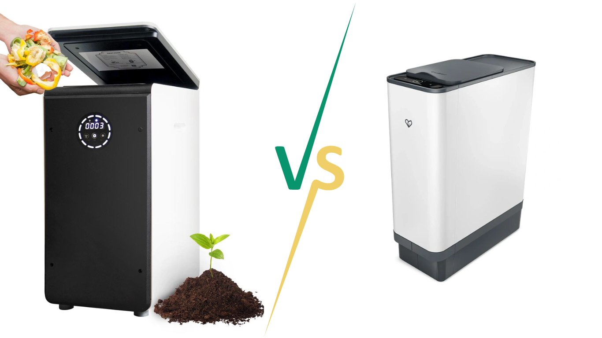
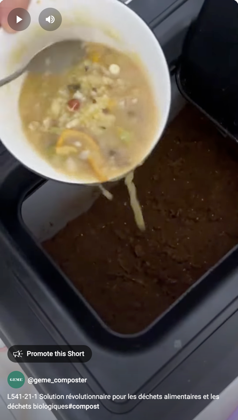
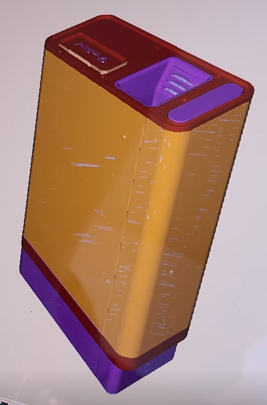

import Columns from '@site/src/components/Columns'
import Column from '@site/src/components/Column'
import ReactPlayer from 'react-player'

After [IFA 2024 event](https://www.geme.bio/ifa) in Berlin, GEME team get a lot of inquiries and partnership cooperation.
Some of the people ask us, there is a new brand called **Soilkind** also in the IFA exhibition.
When comparing the **Soilkind** and **GEME** composters, both offer efficient ways to turn organic waste into compost 
but vary in their technology and functionality. 
We will have a detailed commonalities and differences breakdown to compare and check.

<!-- truncate -->

## Commonalities and Differences between Soilkind and GEME Composter

| Feature                   | GEME Composter                                                                                                                                                                                                              | Soilkind Composter                                                                                                                                                                  |
|:--------------------------|:----------------------------------------------------------------------------------------------------------------------------------------------------------------------------------------------------------------------------|:------------------------------------------------------------------------------------------------------------------------------------------------------------------------------------|
| **Working Mode**          | 24x7 continuously, similar to refrigerator                                                                                                                                                                                  | Cycle based, 24 hours per cycle                                                                                                                                                     |
| **Energy Consumption**    | Around 1.7 kWH per day, similar to a MacBook Pro                                                                                                                                                                            | 7-8 kWh per cycle                                                                                                                                                                   |
| **Breakdown Time**        | 6-8 hours for most leftover                                                                                                                                                                                                 | 48 hours                                                                                                                                                                            |
| **Finished Compost**      | Weeks                                                                                                                                                                                                                       | Unknown                                                                                                                                                                             |
| **Microorganism Method**  | Yes                                                                                                                                                                                                                         | No                                                                                                                                                                                  |
| **Volume**                | 19L                                                                                                                                                                                                                         | 10L                                                                                                                                                                                 |
| **Process Capacity**      | 5kg/day                                                                                                                                                                                                                     | Unclear                                                                                                                                                                             |
| **Family Members**        | Up to 10, even for small restaurant                                                                                                                                                                                         | Family less than 4 people                                                                                                                                                           |
| **Technology**            | Mechanic + microbe                                                                                                                                                                                                          | Pure mechanic                                                                                                                                                                       |
| **Odor Control**          | Metal ion catalytic oxidation                                                                                                                                                                                               | Active charcoal filter                                                                                                                                                              |
| **Filter Replacement**    | No need                                                                                                                                                                                                                     | Quarterly                                                                                                                                                                           |
| **Electricity Energy**    | Yes                                                                                                                                                                                                                         | Yes                                                                                                                                                                                 |
| **Composting Process**    | Microbes and rotating mixer                                                                                                                                                                                                 | Shreds, dries, and wait                                                                                                                                                             |
| **Composting Live Video** | Yes, [Uncut, 7 hours no edit video](https://youtu.be/asNRoqkC_BA)     
<ReactPlayer className="video__player" controls height="100%" url="https://youtu.be/asNRoqkC_BA" width="100%"/>
 | Not provided                                                                                                                                                                        |
| **Design**                | Trash bin shape, wide and open input                                                                                                                                                      | Mill shape, narrow Input                                                                                                                                  |
| **Clog Risk**             | Zero, food waste drop into bin directly                                                                                                                                                                                     | Depends of food size go through the gate                                                                                                                                            |
| **Carbon/Nitrogen**       | GEME Kobold provide enough carbon source, use mixer to make it balanced                                                                                                                                                     | Food scraps contribute nitrogen source, carbon source not found                                                                                                                     |
| **Meat and Diary**        | Yes                                                                                                                                                                                                                         | Not Recommended                                                                                                                                                                     |
| **Manure Waste**          | Yes                                                                                                                                                                                                                         | Food scraps only                                                                                                                                                                    |
| **Dog poops**             | Yes                                                                                                                                                                                                                         | Food scraps only                                                                                                                                                                    |
| **Liquid Waste**          | Yes                                                                                                                                                                                                                         | Food scraps only                                                                                                                                                                    |
| **Cleaning**              | No need                                                                                                                                                                                                                     | Removable, washable parts                                                                                                                                                           |
| **App Integration**       | None, keep it simple, no over design                                                                                                                                                                                        | Mobile app launching Q4 2024                                                                                                                                                        |
| **Brand From**            | Belgium                                                                                                                                                                                                                     | Germany                                                                                                                                                                             |
| **Start Time**            | 2022 July launched on [Kickstarter](https://www.kickstarter.com/projects/geme/geme-harvest-ready-to-use-organic-compost-easily), Go to market on March 2023 on [Amazon](https://www.amazon.com/dp/B0BR7XCFL2)               | 2020, first seen in kickstarter campaign rebrand from [mykalea](https://www.kickstarter.com/projects/mykalea/kalea-turns-kitchen-waste-into-real-compost-in-only-48h/posts/2985783) |
| **Kickstarter Fulfilled** | Yes, in less than 1 year                                                                                                                                                                                                    | Not Yet, more than 4 year                                                                                                                                                           |
| **Sales Market**          | United States, Canada, Europe, United Kingdom                                                                                                                                                                               | Germany, and other few Europe countries                                                                                                                                             |
| **Pricing**               | €999                                                                                                                                                                                                                        | €1,490.00                                                                                                                                                                           |

## Note

At the moment of 26th September, all info of soilkind are from [kicksterter](https://www.kickstarter.com/projects/mykalea/kalea-turns-kitchen-waste-into-real-compost-in-only-48h/comments) and it's official website.

Soilkind was the original called mykalea, somehow it rebrand as Soilkind and under [Karcher](https://www.karcher.com/ph/inside-kaercher/kaercher-stories/make-compost-not-waste.html).
The origin website mykalea.de(https://www.mykalea.de) is now not accessible.

It's always not easy for innovation, and we hope soilkind and make a success and the Kickstarter backers can get satisfied eventually.

## Mics
Discover more of the comparison, check more articles.

[Bokashi vs GEME Composter](/blog/geme-vs-bokashi)
[Traditional Composting vs GEME Composter](/blog/traditional-composting-vs-geme-composter) 
