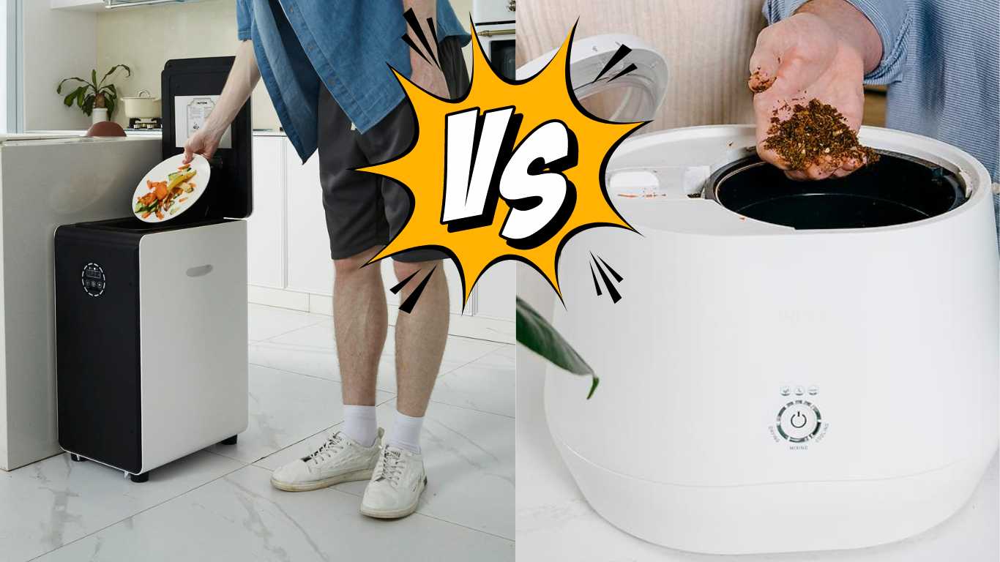

<head>
    <meta charSet="utf-8" />
    <meta name="twitter:card" content="summary_large_image" />
    <meta data-rh="true" property="og:image" content="https://www.geme.bio/assets/images/geme-vs-lomi-0665d40117eb11460690b102cffde728.png" />
    <meta data-rh="true" name="twitter:image" content="https://www.geme.bio/assets/images/geme-vs-lomi-0665d40117eb11460690b102cffde728.png"/>
    <meta data-rh="true" property="og:url" content="https://www.geme.bio/blog/lomi-vs-geme-composter"/>
    <meta data-rh="true" property="og:locale" content="en"/>
</head>

import Columns from '@site/src/components/Columns'
import Column from '@site/src/components/Column'
import ReactPlayer from 'react-player'

When comparing the **Lomi** and **GEME** composters, both offer effective ways to reduce your food waste. 
However, they differ significantly in technology, functionality, and the overall composting process. 
Each offers unique advantages based on individual needs such as speed, capacity, and the type of materials they can handle.
Let's dive into a comparison to help you decide which composter is best suited for your household or business.

<!-- truncate -->

## Commonalities and Differences between Lomi and GEME Composter

| Feature                     | GEME Composter                                                                                                                                                                                                   | Lomi Composter                                                                                                                                                                                          |
|:----------------------------|:-----------------------------------------------------------------------------------------------------------------------------------------------------------------------------------------------------------------|:--------------------------------------------------------------------------------------------------------------------------------------------------------------------------------------------------------|
| **Design**                  | 
<ReactPlayer className="video__player" controls height="100%" url="https://youtu.be/KTn9HMf1DBc" width="100%"/>
                                                            | 
<ReactPlayer className="video__player" controls height="100%" url="https://youtu.be/L_Fn_Tb2de0" width="100%"/>
                                                   |
| **Working Mode**            | Continuous operation, simulate composte pile in a box, not dehydrate, designed for large households or small businesses                                                                                          | Cycle-based, 3 operational modes with durations ranging from 3-20 hours, cook and dehydreate food waste, not composting                                                                                 |
| **How to Use**              | Add waste anytime, then go about your day—GEME handles the work in the background for you                                                                                                                        | 1. Add food waste 2. Spread it evenly  3. Push the button to start  4. Wait for the process to complete 5. Remove the byproduct  6. Empty the bin, and clean it up                  |
| **Energy Consumption**      | Approximately 1.7 kWh/day                                                                                                                                                                                        | Varies per cycle; around 1 kWh per cycle, power more than 500 W                                                                                                                                         |
| **Breakdown Time**          | 6-8 hours for most food scraps, you don't really need to care since you can add waste anytime                                                                                                                    | 3-20 hours depending on mode (Eco-Express, Lomi Approved, Grow Cycle)                                                                                                                                   |
| **Finished Compost**        | Weeks to fully mature                                                                                                                                                                                            | Never, unless put it with soil and take months to rehydrate and natural composting again. However, Lomi calls it pre-compost                                                                            |
| **Outcome Result**          | Real organic compost
<ReactPlayer className="video__player" controls height="100%" url="https://youtu.be/bYzh9ZUJKxs&t=1188s" width="100%"/>
                                | Dehydrated waste, not compost
<ReactPlayer className="video__player" controls height="100%" url="https://youtu.be/_tt5gnNpVsw?t=435s" width="100%"/>
               |
| **Microorganism Method**    | Yes, relies on microbial technology for decomposition                                                                                                                                                            | No. They sell some pills called Lomi Pod, it's placebo, even it contains microbes which will get killed in high temperature                                                                             |
| **Volume**                  | 19L bin capacity                                                                                                                                                                                                 | 3L bin capacity                                                                                                                                                                                         |
| **Shape**                   | Trash bin                                                                                                                                                                                                        | Bread maker, rice cooker                                                                                                                                                                                |
| **Process Capacity**        | 5 kg/day, [maybe more](https://youtu.be/bYzh9ZUJKxs?t=841)                                                                                                                                                       | No official statement, but less than 1kg from all kind of review videos.                                                                                                                                |
| **Family Members**          | Suitable for up to 10 members or small businesses                                                                                                                                                                | Ideal for signle or couple families                                                                                                                                                                     |
| **Technology**              | Mechanical with microbial assistance                                                                                                                                                                             | Mechanical shredding, drying                                                                                                                                                                            |
| **Odor Control**            | Metal ion catalytic oxidation                                                                                                                                                                                    | Active charcoal filter                                                                                                                                                                                  |
| **Filter Replacement**      | No need                                                                                                                                                                                                          | Quarterly filter replacements required, extra cost                                                                                                                                                      |
| **Electricity Energy**      | Yes                                                                                                                                                                                                              | Yes                                                                                                                                                                                                     |
| **Composting Process**      | Microbes and rotating mixer                                                                                                                                                                                      | Not applicable                                                                                                                                                                                          |
| **Carbon/Nitrogen Balance** | Balanced carbon and nitrogen using [GEME Kobold](https://www.geme.bio/geme-kobold) feature                                                                                                                       | Lomi relies on only food scraps, which are often nitrogen-heavy, that's the reason why it can not produce compsot                                                                                       |
| **Meat and Dairy**          | Yes                                                                                                                                                                                                              | Not recommended for meat or dairy                                                                                                                                                                       |
| **Manure Waste**            | Very good at processing manure                                                                                                                                                                                   | Primarily designed for kitchen waste                                                                                                                                                                    |
| **Liquid Waste**            | Yes, less than 500ml one time OK, just don't poure over 1 or 2L at one time                                                                                                                                      | Designed for food scraps only                                                                                                                                                                           |
| **Use Mode**                | Add waste anytime                                                                                                                                                                                                | Can not add new waste when it runs                                                                                                                                                                      |
| **Use Habit**               | Open and put, just like trash bin
<ReactPlayer className="video__player" controls height="100%" url="https://youtu.be/LZzssf_gebU" width="100%"/>
                           | Need to wait for cycle completed
<ReactPlayer className="video__player" controls height="100%" url="https://youtu.be/_tt5gnNpVsw?t=416s" width="100%"/>
            |
| **Cleaning**                | No regular cleaning required, it works continuously
<ReactPlayer className="video__player" controls height="100%" url="https://youtu.be/CVoDNDONFAk&t=1176s" width="100%"/>
 | Clean every cycle finished, sometimes clogged
<ReactPlayer className="video__player" controls height="100%" url="https://youtu.be/X4KYdPAehfU?t=14" width="100%"/>
 |
| **App Integration**         | No, keep it simple, no over design                                                                                                                                                                               | Yes                                                                                                                                                                                                     |
| **Subscribe Trap**          | No                                                                                                                                                                                                               | Membership subscribe pay offer                                                                                                                                                                          |
| **Extra Cost**              | Only Kobold refill, no others                                                                                                                                                                                    | Membership, carbon filter fee, Lomi Pod, Lomi Blend. Fancy concepts, complicated subscription plans                                                                                                     |
| **Brand Origin**            | Belgium                                                                                                                                                                                                          | Canada                                                                                                                                                                                                  |
| **Sales Market**            | United States, Canada, Europe, United Kingdom                                                                                                                                                                    | Canada, United States                                                                                                                                                                                   |
| **Price**                   | $899.99                                                                                                                                                                                                          | $599                                                                                                                                                                                                    |
| **Reviews**                 | [Amazon reviews](https://www.amazon.com/dp/B0BV31KTCN?th=1#customerReviews)                                                                                                                                      | [Trustpilot Review](https://www.trustpilot.com/review/lomi.com), [Amazon reviews](https://www.amazon.com/Kitchen-Composter-Compost-Electric-Countertop/dp/B0BGQJ5KNN/ref=sims_dp_d_dex_ai_speed_loc_mtl_v5_t1_d_sccl_2_6/136-2399195-8872135?pd_rd_w=ESTFw&content-id=amzn1.sym.da3a5e11-8f5f-413b-a68b-31ceac43c758&pf_rd_p=da3a5e11-8f5f-413b-a68b-31ceac43c758&pf_rd_r=VB5G06Q9W41FJ6AEWTW2&pd_rd_wg=hLZsJ&pd_rd_r=7ebeb846-ef58-45b3-97e4-b2d366257918&pd_rd_i=B0BGQJ5KNN&th=1)                                                                                                                     |

## Summary

Both Lomi and [GEME](/) are solid options for those looking to reduce food waste. However, GEME stands out in terms of its higher capacity, 
continuous operation, and ability to handle more challenging waste materials like meat, dairy, and manure. On the other hand, 
Lomi shines with its compact, sleek design and gift friendly looking and package.

Actually Lomi is one of those [dehydrate food recycler](/blog/what-is-the-difference-between-geme-composter-and-other-electric-kitchen-composters) appliances, they shows up popular in the marketing. 
In deed those 
machines can help reducing people's food waste, but they should not call composters as they did not create compost at all.
However, this [composter marketing is a bit chao](/blog/geme-is-calling-for-industry-standards-for-composters) at the current moment. I hope this article helps you.  

