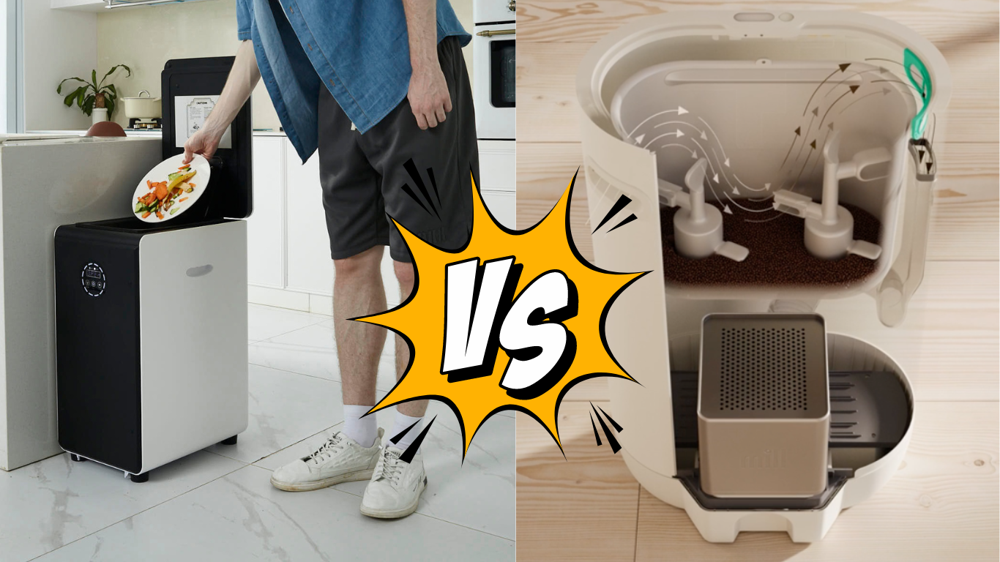
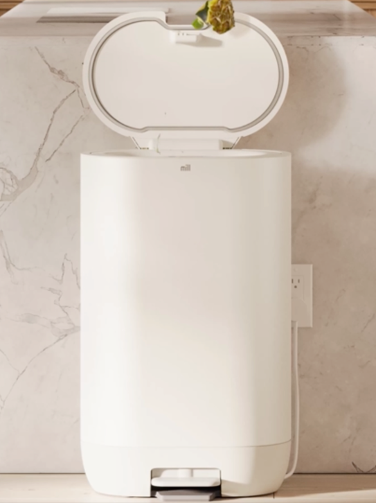
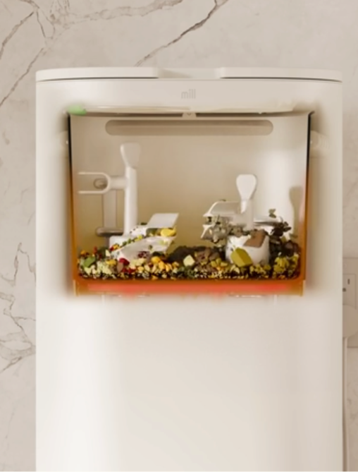
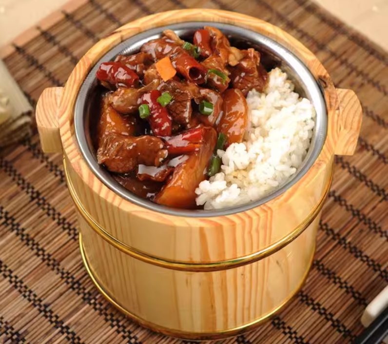
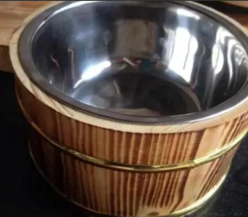
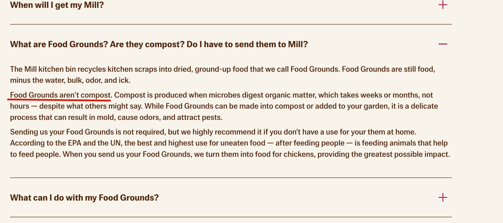
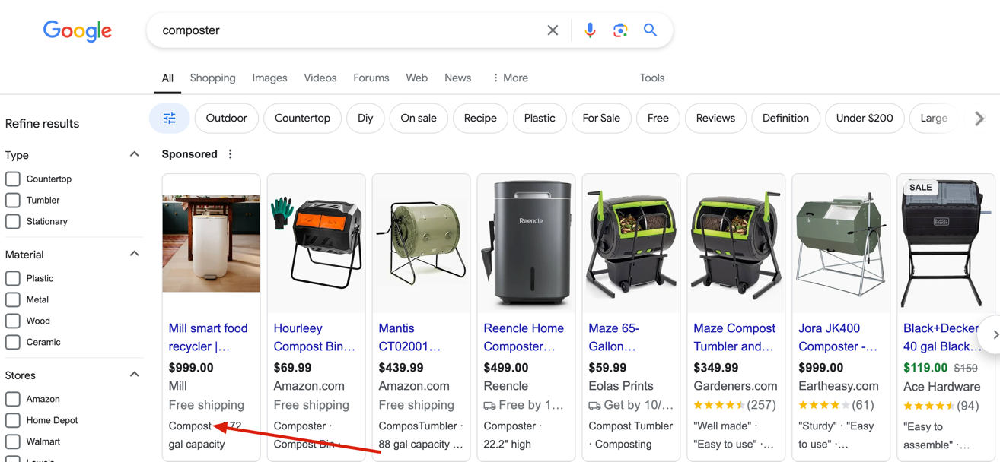
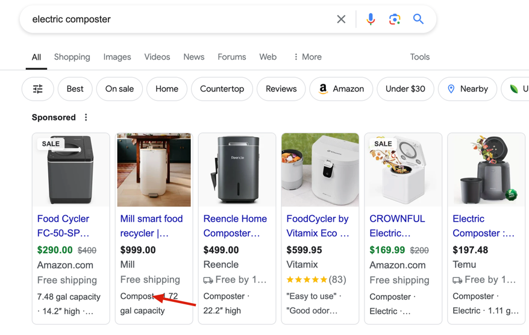
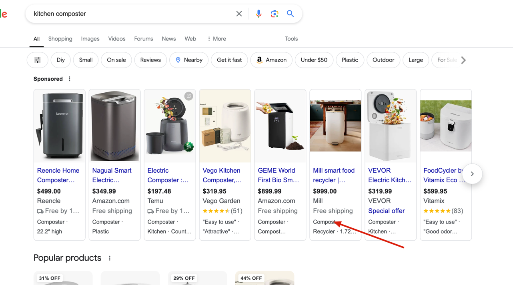

<head>
    <meta charSet="utf-8" />
    <meta name="twitter:card" content="summary_large_image" />
    <meta data-rh="true" property="og:image" content="https://www.geme.bio/assets/images/geme-vs-mill-69dea0c402948f36a29bdf55e7ec0d37.png" />
    <meta data-rh="true" name="twitter:image" content="https://www.geme.bio/assets/images/geme-vs-mill-69dea0c402948f36a29bdf55e7ec0d37.png"/>
    <meta data-rh="true" property="og:url" content="https://www.geme.bio/blog/mill-vs-geme-composter"/>
    <meta data-rh="true" property="og:locale" content="en"/>
</head>

import Columns from '@site/src/components/Columns'
import Column from '@site/src/components/Column'
import ReactPlayer from 'react-player'

Many people ask us, “What’s the difference between the GEME and Mill food recyclers? At first glance, they seem quite
similar—both resemble trash bins with electric plugs designed for recycling food waste.” However, when you take a closer look,
the Mill and GEME composters use different technologies, offer distinct functionalities, and provide unique user experiences.
This article will be one of the most comprehensive and definitive comparisons available online,
outlining their key differences in detail.

<!-- truncate -->

## Commonalities and Differences between Mill and GEME Composter

| Feature                     | GEME Composter                                                                                                                                        | Mill Food Recycler                                                                                                                                              |
| :-------------------------- | :---------------------------------------------------------------------------------------------------------------------------------------------------- | :-------------------------------------------------------------------------------------------------------------------------------------------------------------- |
| **Overview**                | 
<ReactPlayer className="video__player" controls height="100%" url="https://youtu.be/KTn9HMf1DBc" width="100%"/>
 | 
<ReactPlayer className="video__player" controls height="100%" url="https://youtube.com/shorts/-T0841TDHMM" width="100%"/>
 |
| **Design**                  | Trash bin shape, bigger volume                                                                                                                        | Trash bin shape, but shallower                                                                                                                                  |
| **Working Mode**            | Continuous operation, simulating a compost pile in a box                                                                                              | Operates primarily through dehydration and grinding                                                                                                             |
| **How to Use**              | Add waste anytime                                                                                                                                     | Cycle based                                                                                                                                                     |
| **Energy Consumption**      | Approximately 1.7 kWh/day                                                                                                                             | Unclear statement, but it keep heating when work                                                                                                                |
| **Breakdown Time**          | 6-8 hours for most food scraps                                                                                                                        | Varies depending on the cycle, typical 12 hours                                                                                                                 |
| **Finished Compost**        | Weeks                                                                                                                                                 | Produces dehydrated food waste, not compost                                                                                                                     |
| **Odor Control**            | [Aerobic composting](/blog/what-is-anaerobic-composting-and-what-are-the-pros-and-cons) + ion catalytic oxidation                                     | Carbon filter-based odor control system                                                                                                                         |
| **Volume**                  | 19L capacity, ideal for larger households and small businesses                                                                                        | 6.5L capacity, suitable for small households or apartment living                                                                                                |
| **Meat and Dairy**          | Yes                                                                                                                                                   | Not recommended                                                                                                                                                 |
| **Technology**              | Uses microbial technology for decomposition combined with a rotating mixer                                                                            | Primarily relies on dehydration and mechanical grinding                                                                                                         |
| **Filter Replacement**      | No need                                                                                                                                               | Carbon filters need to be replaced periodically, leading to additional costs                                                                                    |
| **Process Capacity**        | Up to 5 kg/day, suitable for large families or businesses                                                                                             | Limited to small amounts of waste per cycle (about 1 kg or less)                                                                                                |
| **Composting Process**      | Microbes and rotating mixer                                                                                                                           | Not applicable                                                                                                                                                  |
| **Carbon/Nitrogen Balance** | Balanced carbon and nitrogen using [GEME Kobold](https://www.geme.bio/geme-kobold) feature                                                            | Not applicable                                                                                                                                                  |
| **Meat and Dairy**          | Yes                                                                                                                                                   | Not recommended for meat or dairy                                                                                                                               |
| **Manure Waste**            | Very good at processing manure                                                                                                                        | Primarily designed for kitchen waste                                                                                                                            |
| **Liquid Waste**            | Yes, less than 500ml one time OK, just don't poure over 1 or 2L at one time                                                                           | Designed for food scraps only                                                                                                                                   |
| **Cleaning**                | No regular cleaning required                                                                                                                          | Clean every cycle finished                                                                                                                                      |
| **Use Mode**                | Continuous; add waste anytime during operation                                                                                                        | Requires cycles                                                                                                                                                 |
| **Extra Cost**              | Only Kobold refill, no others                                                                                                                         | Membership, carbon filter fee, rental, complicated subscription plans, trouble to cancel                                                                        |
| **Family Members**          | Suitable for families of up to 10 members                                                                                                             | Designed for small households of 1-3 people                                                                                                                     |
| **App Integration**         | No, keep it simple, no over design                                                                                                                    | Yes, calculate impact score, social show off                                                                                                                    |
| **Brand Origin**            | Belgium                                                                                                                                               | United States                                                                                                                                                   |
| **Sales Market**            | United States, Canada, Europe, United Kingdom                                                                                                         | United States Only                                                                                                                                              |
| **Price**                   | $899.99                                                                                                                                               | $999 (plus possible subscription for pickup service)                                                                                                            |
| **Reviews**                 | [Amazon reviews](https://www.amazon.com/dp/B0BV31KTCN?th=1#customerReviews) and Trustpilot                                                            | No third party site reviews available, a lot of influencers voices                                                                                              |

## Mill's product design

It's decent, and looks comfortable in your kitchen.
However, there is a bit tricky for it's volume.Mill looks so big at the first glance, but when you actually use it,
it's only 6.5L volume. That might be a bit disappointed for people who are looking for big volume solution.

<Columns>
  <Column className='text--left'>
    **Looking**
    
  </Column>

  <Column className='text--center text--left'>
    **Using**
    
  </Column>
</Columns>

Worse part is when people believe they get a unit large enough, but when they buy it home, it turns out the volume is similar to
some countertop "composter" units. It reminds me the old time when we having [sumeshi](https://ja.wikipedia.org/wiki/%E9%85%A2%E9%A3%AF)
in asian restaurant.

<Columns>
  <Column className='text--left'>
    **Looking**
    
  </Column>

  <Column className='text--center text--left'>
    **Eating**
    
  </Column>
</Columns>

## Mill's marketing strategy

Mill is an advanced dehydrator, similar to [Lomi we compared before](/blog/lomi-vs-geme-composter).
While it does not claim itself as composter in it's website, they call it's output "**Food Grounds**".

However, it is still running a lot of "composter" ad words for marketing.

Which is very confusing.

## Summary

Both the Mill Food Recycler and the GEME Composter provide excellent solutions for reducing food waste, but they target different user needs.

The **GEME Composter** excels with its larger capacity, ability to handle tougher waste materials like meat and dairy,
and continuous operation without needing to wait for cycles to finish. This makes it ideal for larger families or small businesses.
In contrast, the **Mill Food Recycler** is better suited for smaller households, offering a compact design and ease of use,
though it produces dehydrated food waste that still requires further composting to create usable soil.

I hope this comparison helps you make an informed decision about which composter best fits your lifestyle!
