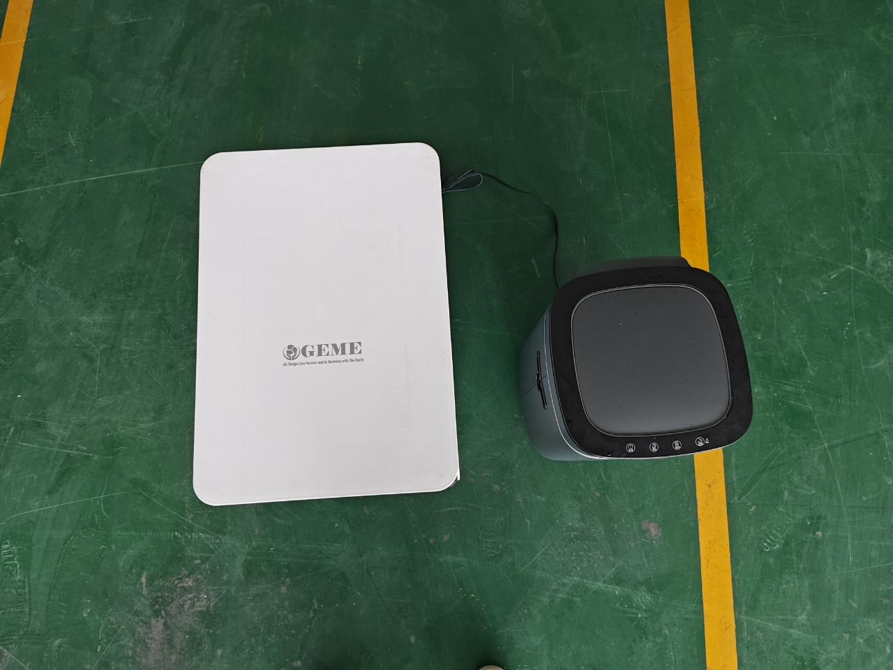

<head>
    <meta charSet="utf-8" />
    <meta name="twitter:card" content="summary_large_image" />
    <meta data-rh="true" property="og:image" content="https://www.geme.bio/assets/images/geme-vs-reencle-63804f34b568a2a8f9335bd94054e0a1.png" />
    <meta data-rh="true" name="twitter:image" content="https://www.geme.bio/assets/images/geme-vs-reencle-63804f34b568a2a8f9335bd94054e0a1.png"/>
    <meta data-rh="true" property="og:url" content="https://www.geme.bio"/>
    <meta data-rh="true" property="og:locale" content="en"/>
</head>

import Columns from '@site/src/components/Columns'
import Column from '@site/src/components/Column'
import ReactPlayer from 'react-player'

Many people ask, "What’s the difference between the Reencle and GEME composters?"

Well, so far, there are only two brands offer microbe based electric composter home units in the marketing, GEME and Reencle. 

The other brands mostly using dehydrating technology as food recycler, but not composters.

However, there are still some difference that make GEME different from Reencle composter.
This article compares the two in detail to help you make an informed decision.

<!-- truncate -->

## Commonalities and Differences between Reencle and GEME Composter

| Feature                     | GEME Composter                                                                                                                                                                      | Reencle Food Waste Composter                                                                                                                                                       |
|:----------------------------|:------------------------------------------------------------------------------------------------------------------------------------------------------------------------------------|:-----------------------------------------------------------------------------------------------------------------------------------------------------------------------------------|
| **Overview**                | 
<ReactPlayer className="video__player" controls height="100%" url="https://youtu.be/KTn9HMf1DBc" width="100%"/>
                               | 
<ReactPlayer className="video__player" controls height="100%" url="https://youtu.be/wGmt-L--V8k" width="100%"/>
                              |
| **Design**                  | Trash-bin-like design with a large capacity, put on the floor                                                                                                                       | Countertop with a smaller capacity, suited for smaller households.                                                                                                                 |
| **Technology**              | Microbes, refined from nature                                                                                                                                                       | Microbes, source unknown                                                                                                                                                           |
| **Volume**                  | 19L capacity, even for restaurants                                                                                      | 14L? 18.4"x13"x12" household only                                                                         |
| **Capacity**                | Up to 5kg per day, recommend 2kg                                                                                                                                                    | 0.7kg per day                                                                                                                                                                      |
| **Breakdown Time**          | 6-8 hours for most food scraps                                                                                                                                                      | 24+ hours for soft scraps                                                                                                                                                          |
| **Finished Compost**        | Maturing for a few weeks                                                                                                                                                            | Unknown                                                                                                                                                                            |
| **Meat and Dairy Handling** | Yes                                                                                                                                                                                 | Not recommended                                                                                                                                                                    |
| **Liquid Waste**            | Yes                                                                                                                                                                                 | Unknown                                                                                                                                                                            |
| **Pet Poo and Manure**      | Yes                                                                                                                                                                                 | Not supported                                                                                                                                                                      |
| **Odor Control**            | Advanced ion catalytic oxidation to control odor, eliminating the need for filters.                                                                                                 | Carbon filters need periodic replacement                                                                                                                                           |
| **Energy Consumption**      | Approximately 1.7 kWh/day, designed for continuous, low-energy operation.                                                                                                           | 130W, up to 3kWh/day                                                                                                                                                               |
| **Cleaning**                | No need to cleaning every use                                                                                                                                                       | Requires regular clean and filter replacements every 3-6 months, depending on use.                                                                                                 |
| **Use Mode**                | Continuously add waste anytime
<ReactPlayer className="video__player" controls height="100%" url="https://youtu.be/LZzssf_gebU" width="100%"/>
 | Use sensor, need foot to open
<ReactPlayer className="video__player" controls height="100%" url="https://youtu.be/eHi8qMaVw2I" width="100%"/>
 |
| **Brand Origin**            | Belgium 🇧🇪                                                                                                                                                                        | Korea 🇰🇷                                                                                                                                                                         |
| **Price**                   | $899.99                                                                                                                                                                             | $499                                                                                                                                                                               |
| **Extra Costs**             | Only refillable microbial packs, but no filters to replace                                                                                                                          | Regular replacement of carbon filters and microorganism packs                                                                                                                      |
| **Sales Market**            | `United States`, `Canada`, `Europe`, and the `United Kingdom`                                                                                                                       | Primarily available in `South Korea`, expanding to other regions such as the `U.S.`                                                                                                |

## First Impression

GEME and Reencle are all trash bin design. The obviously difference are the size. 

<ReactPlayer className="video__player" controls height="100%" url="https://youtube.com/shorts/l985Jx-BKOU" width="100%"/>

GEME's volume is almost 5 time larger than Reencle. 
GEME is big and design for Europe people with big house, can hold food waste up to months without cleaning it.
Reencle is from Korea and most of the Korea families get smaller apartment, hence, its design is much smaller, and cheaper price.

## Microorganism Technology

Both devices rely on microorganism-based technology to break down food waste, 
but GEME offers a more versatile system capable of handling a wider variety of waste, including meat, dairy, and manure. 
Reencle is slightly more limited, focusing more on vegetable and fruit waste.

GEME's microbe are refined from nature. No gene editing involved. 
Reencle did not mention it's origin, and it's testing report is in Korea standard.

[//]: # (![Reencle Design]&#40;./img/img_10.png&#41;)

## Marketing Strategy

GEME is a Belgium brand and marketed as a high-end, large-capacity composter for eco-conscious users or small businesses. 
Its price reflects the robust technology and versatility in handling diverse types of waste. 

Reencle is from Korea, positioned as an affordable, compact option for smaller households looking for a simple, effective food recycling solution.

## Product Philosophy

GEME is designed by technical staff and engineers, it follow the Unix design philosophy, [KISS](https://en.wikipedia.org/wiki/KISS_principle), 
similar like Apple product, it will treat people in zero knowledge assumption, building the product super easy to use while hiding
the complexity under the background. 

So far, GEME composter is popular and loved by people from 3 years old kids to 80+ aged people. 
It's as natrual as using a regular trash bin. 

Reencle is modern design and fashion looking, it involves some simple mechanical automation to make it more intelligent.
It's good, but somehow it violates [Occam's razor](https://en.wikipedia.org/wiki/Occam%27s_razor) principle. 
It will create some funny moments though.

<ReactPlayer className="video__player" controls height="100%" url="https://youtu.be/eHi8qMaVw2I" width="100%"/>

## Summary

Both the Reencle and GEME composters provide excellent solutions for reducing food waste, but they target different user needs:

- The **GEME Composter** excels in capacity, continuous operation, and its ability to handle tougher materials like meat, 
  dairy, and even pet poo and manure. It is well-suited for larger families or small businesses like restaurants, inns and hotels,
  looking for a robust composting methods for sustainable solution.
- The **Reencle Composter** is better suited for smaller households with less food waste. It is more affordable, 
  though it requires more maintenance, such as filter replacements.

We hope this comparison helps you decide which composter fits your lifestyle best!
