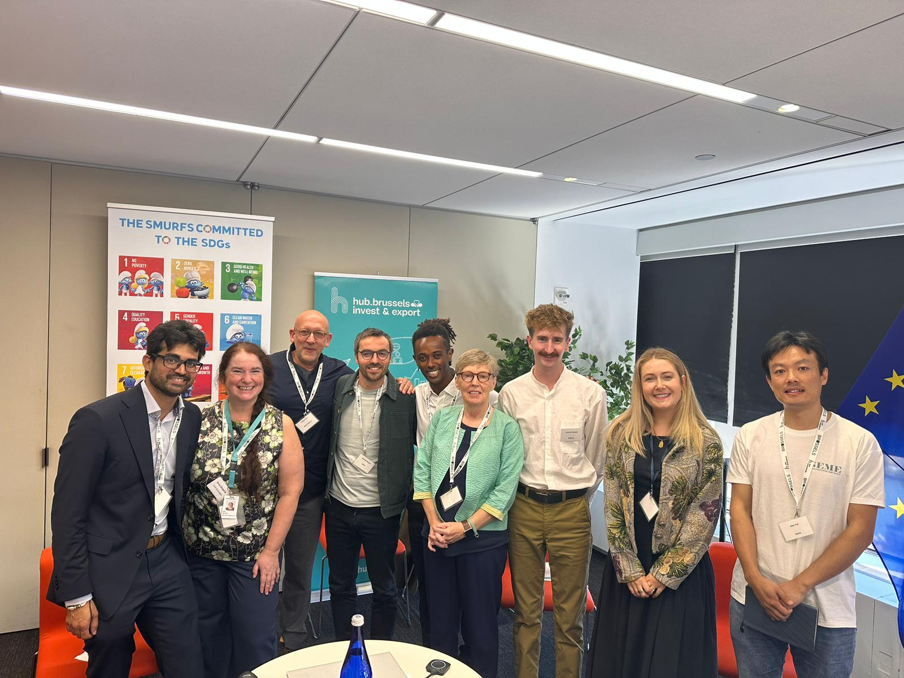
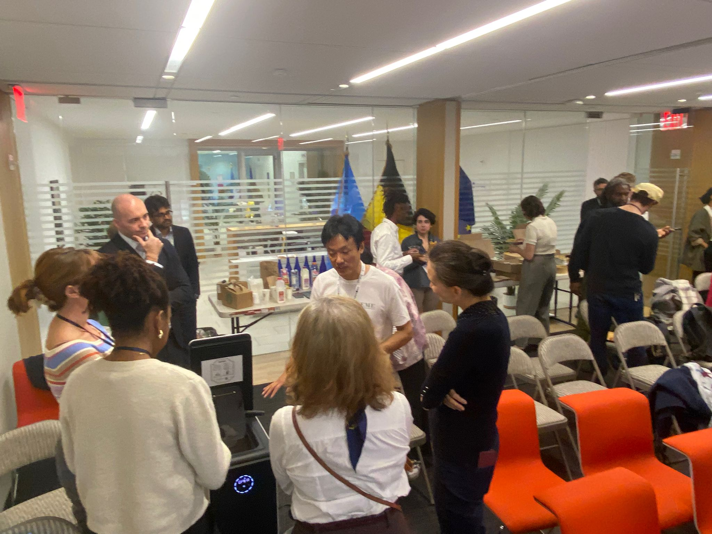
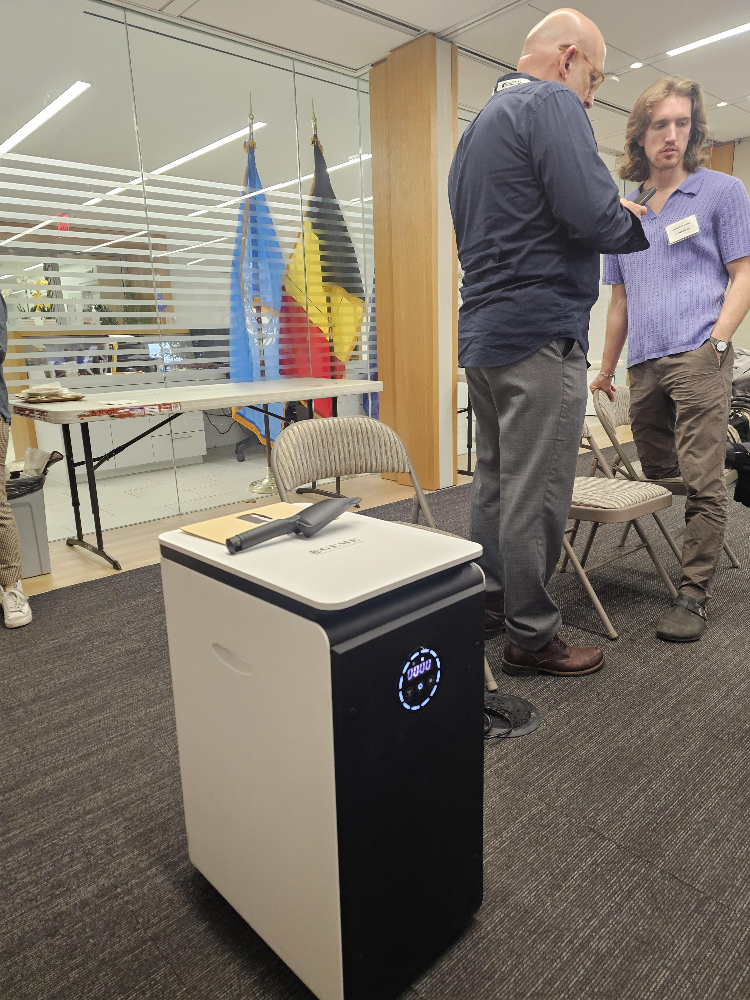
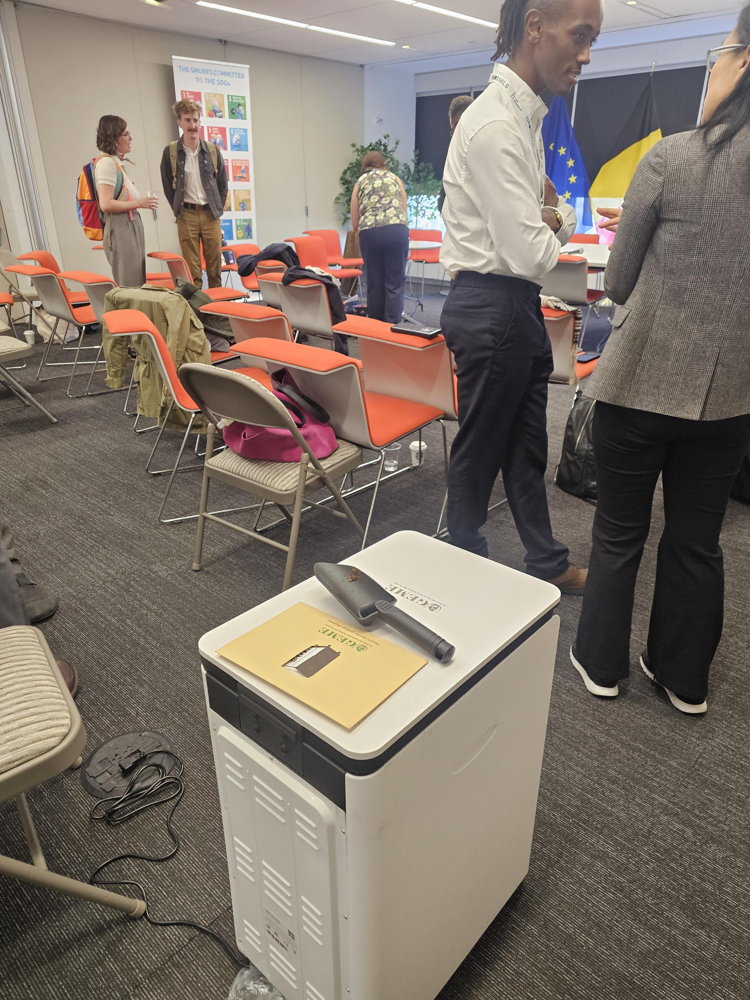
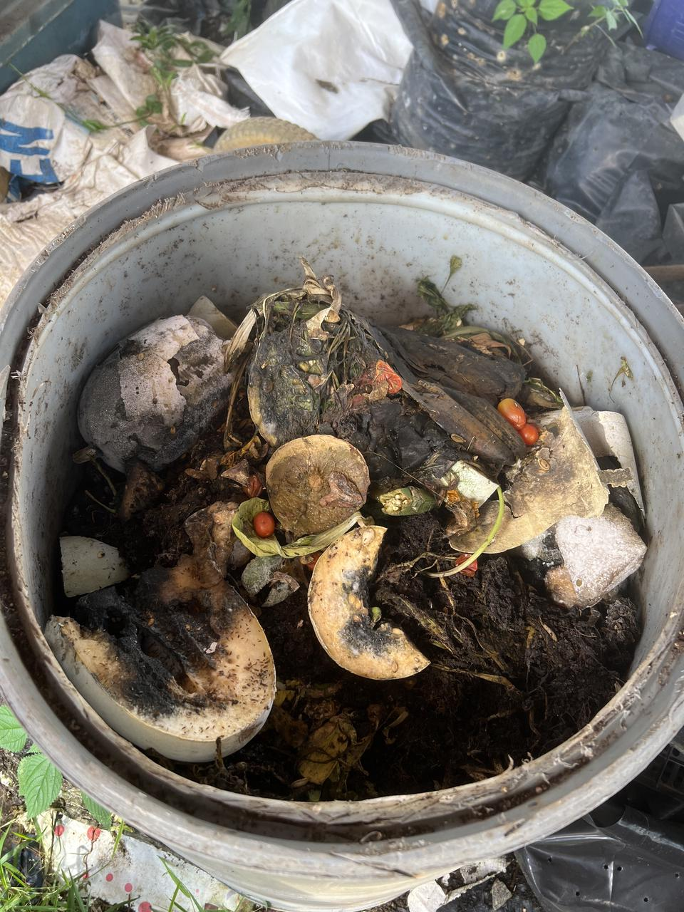
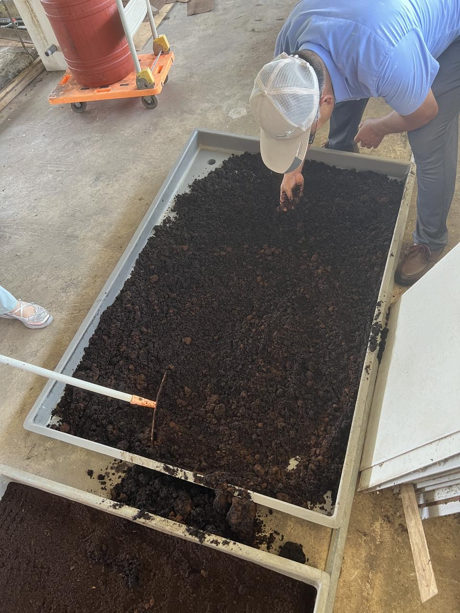
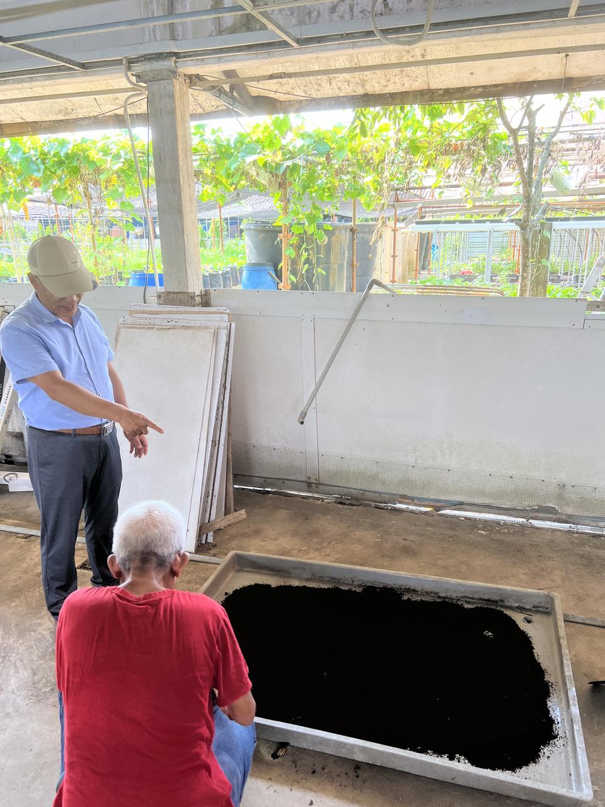

<head>
    <meta charSet="utf-8" />
    <meta name="twitter:card" content="summary_large_image" />
    <meta data-rh="true" property="og:image" content="https://www.geme.bio/assets/images/head-db4818b05ab30cc4d72793c86fe4ba5e.png" />
    <meta data-rh="true" name="twitter:image" content="https://www.geme.bio/assets/images/head-db4818b05ab30cc4d72793c86fe4ba5e.png"/>
    <meta data-rh="true" property="og:url" content="https://www.geme.bio"/>
    <meta data-rh="true" property="og:locale" content="en"/>
</head>

import Columns from '@site/src/components/Columns'
import Column from '@site/src/components/Column'
import ReactPlayer from 'react-player'

In the current process of globalization, food waste has emerged as a severe issue that urgently demands resolution and has 
captured the extensive attention of the international community. According to the statistics of the Food and Agriculture Organization 
of the United Nations (FAO), approximately 1.3 billion tons of food is wasted globally each year, which is equivalent to 
around one-third of the total global food production (FAO, 2024). Food waste not only leads to a colossal loss of precious 
resources such as land, water, and energy consumed during food production but also exerts a profound negative impact on 
the environment, including land occupation due to landfill, greenhouse gas emissions, and water pollution. Simultaneously,
it poses a serious threat to global food security.

<!-- truncate -->

The United Nations has been actively committed to addressing this global challenge. In the Sustainable Development Goals (SDGs), 
Target 12.3 explicitly states that by 2030, the per capita food waste at the retail and consumer levels should be halved globally, 
and food losses along the production and supply chains should be reduced (United Nations, 2015). To achieve this ambitious goal, 
governments, social organizations, and enterprises from all over the world have taken action to explore innovative solutions and 
construct sustainable food circular systems.

The forthcoming symposium, "[**Innovative Circular Solutions to Reduce Food Loss and Waste - New York and Brussels, Leading Cities**](https://hub.brussels/en/events/economic-mission-on-food-waste/)" in New York, 
is an event that has attracted wide attention. 
It will bring together experts, scholars, entrepreneurs, and policymakers from around the world who are dedicated to solving the 
food waste problem. At the symposium, GEME will share its successful experiences, innovative technologies, and practical 
solutions in reducing food waste, contributing its wisdom and strength to global food waste management.

The symposium's contribution to reducing food waste is multi-faceted and comprehensive. Throughout the entire chain, 
from food production to food waste disposal, different enterprises and organizations will play diverse roles.

For example, Bertrand Delubac, the co-founder of JANINE Bakery - Brewery, has practical experience in operating a circular economy 
in the brewery and combating food waste. His unique waste recycling model involves using unsold bread in beer production 
and recycling spent grains from the microbrewery in bread making. The brewery has achieved remarkable results in commercial operations, 
such as winning the Greenlab Prize and the Food Waste Awards. This model not only reduces food waste but also creates 
commercial value and provides valuable references for other enterprises in sustainable development. FoodWIN, on the other hand, 
has been collaborating with large kitchens, hotels, restaurants, food companies, and local governments to combat food waste
in an action-oriented and inspiring manner. Their efforts include implementing specific initiatives to reduce food waste
in various scenarios and promoting the entire food industry chain to pay more attention to and take action on food waste 
issues through cooperation.

GEME will represent Brussels in this symposium. GEME focuses on dealing with already wasted food. When food waste inevitably occurs, 
GEME's core product, the kitchen waste composter, plays a crucial role. These composters utilize advanced microbiological
technology to quickly and efficiently convert kitchen waste into nutrient-rich organic compost. The organic matter, nitrogen,
phosphorus, potassium, and other trace elements contained in kitchen waste are retained and enriched during the composting process,
becoming valuable resources for nourishing the soil. After being applied to the soil, this organic compost can significantly 
improve soil structure, enhance the soil's water and nutrient retention capacity, and activate soil microbial activity,
creating a favorable soil environment for crop growth. Using the organic compost produced by GEME composters to treat kitchen waste 
can make the soil more porous and conducive to the expansion of crop roots and nutrient absorption, thereby effectively 
increasing food production and quality and realizing resource recycling while reducing dependence on chemical fertilizers.

GEME's composting technology not only plays an important role in the field of agricultural production but also has a positive impact on consumer behavior and market consumption patterns. Consumers who use GEME composters can personally experience the transformation process of food waste and deeply understand the hidden resource value and environmental cost behind food waste. This awareness transformation prompts consumers to be more cautious in food consumption in their daily lives, paying more attention to reducing waste in all aspects from purchasing, storing to cooking.

<Columns>
  <Column className='text--left'>
    
  </Column>

  <Column className='text--center text--left'>
    
  </Column>
</Columns>

Meanwhile, GEME's composting practice has strongly promoted resource recycling. In Singapore, there is a farmer who is a user of GEME.
His farm inevitably generates food waste such as rotten and damaged fruits during daily operations. 
Facing this situation, he actively sought cooperation with GEME. With the help of GEME's advanced technology, he successfully 
converted these originally discarded food waste into valuable usable fertilizers and then applied them to the farm's operations. 
Besides selling composters, GEME also provides customized solutions to users. Solutions like the environmentally friendly production method 
and focus on resource recycling adopted by this farm are what GEME has been continuously promoting.

<Columns>
  <Column className='text--left'>
    
    **GEME Kobold in Compost Pile**
  </Column>

  <Column className='text--center text--left'>
    
    **After**
  </Column>
</Columns>

In addition, GEME's composting solution is of great significance in alleviating the tension between food production and the resource environment. If kitchen waste is not properly disposed of, it will place a heavy burden on the urban waste disposal system. A large amount of kitchen waste requires a significant amount of landfill space, and during landfill, it will produce greenhouse gases such as methane, exacerbating climate change. If incinerated, it will release harmful gases and pollute the atmosphere. By converting kitchen waste into organic compost, GEME realizes the resource utilization of waste, greatly reducing the amount of kitchen waste entering the waste disposal system, lowering disposal costs, and reducing environmental pressure. This creates a more favorable ecological environment for food production, as a good ecological environment is the foundation for ensuring food security and sustainable production.

GEME aspires to be a significant contributor in food waste management and the construction of a sustainable food system. By adhering to the principles of sustainable waste management and circular economy, GEME hopes to achieve remarkable results in promoting sustainable food production, guiding consumer behavior changes, and coordinating the relationship between food production and the resource environment. In the future, GEME will continue to uphold the spirit of innovation, continuously optimize its products and services, and collaborate with partners from all sectors to contribute more to the sustainable development of the global food system.

## I. Appearance Design

### 1. Trash Can Shape and Convenient Use

GEME terra 2 ingeniously adopts the shape of a trash can, integrating into daily life scenarios, allowing users to naturally and conveniently throw kitchen waste into it, greatly enhancing the usability. This design fully takes into account user habits, making the composting process seamlessly integrated into daily household chores.

### 2. Appearance Optimization and Material Properties

The main body of the machine is in simple white. The outer shell is 精心 designed with a three-dimensional cutting process. It not only effectively reduces the overall volume visually, making the equipment more lightweight and beautiful, but also optimizes the space occupation. Its white outer shell is made of high-quality ABS material, which has excellent high and low temperature resistance and can remain stable under various extreme environmental conditions. It effectively resists the erosion of acids, alkalis, and salts, ensuring long-term stable use and prolonging the service life of the equipment.

### 3. Lid and Observation Window Design

The top of the composter is equipped with a lid, and a transparent observation window is embedded in the middle. This design provides users with an intuitive and convenient way to monitor the composting process. Users can check the internal condition of the compost at any time without opening the lid, and timely understand the composting progress to ensure that the whole process is under control. Below the observation window is a display screen, integrating functions such as time reminder, water shortage reminder, and overweight reminder. Even novice users who are new to composting can easily complete the composting operation according to the clear and definite prompt information, avoiding problems caused by improper operation, and thus achieving perfect composting work.

## II. Usage Method

GEME terra 2 further innovates in terms of convenience. It is specially designed with a foot-touch opening function. Users only need to gently touch the bottom of the machine with their feet, and the lid can open automatically. This considerate design allows users to easily complete the garbage dumping operation even when their hands are holding kitchen waste containers (such as plates), effectively avoiding the possible stain contamination caused by touching the lid with hands, maintaining the cleanliness of the kitchen environment, and greatly improving the user experience.

## III. Deodorization System

### 1. Core Deodorization Technology

This composter is equipped with an advanced industrial-grade deodorization system, which is the key factor for realizing the indoor use of the composter. Adopting a triple deodorization technology, it can not only efficiently remove odors but also has a sterilization function, eliminating the odor generation from the source and ensuring that the indoor air remains fresh and clean during the composting process.

### 2. Air Purification Effect and Environmental Impact

Through this powerful deodorization system, various odor molecules generated during the composting process are effectively decomposed and adsorbed. The discharged air, after purification treatment, reaches the standards of being odorless and sterile, allowing users to carry out composting operations at ease in the indoor environment without worrying about the impact of odors on the living space. It truly realizes the harmonious coexistence of kitchen waste disposal and a comfortable living environment.

[GEME Terra 2](https://www.geme.bio/geme-terra-2), with its innovative design, convenient operation method, and excellent performance characteristics, has become a powerful assistant in the field of household environmental protection, making positive contributions to promoting green living and realizing resource recycling.
