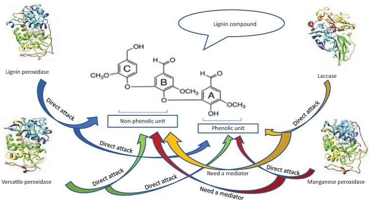
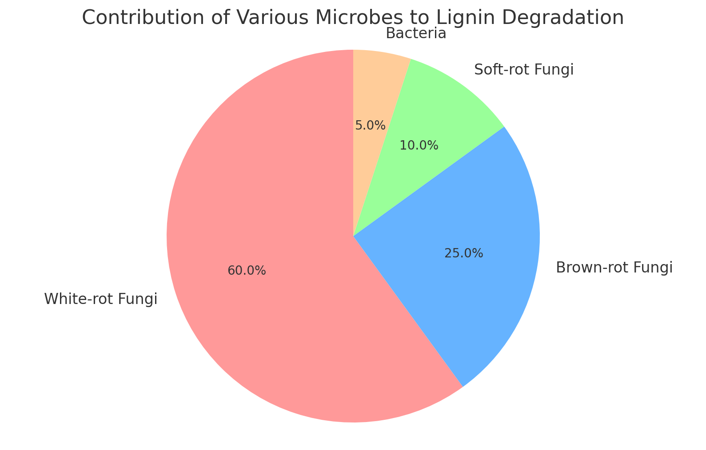
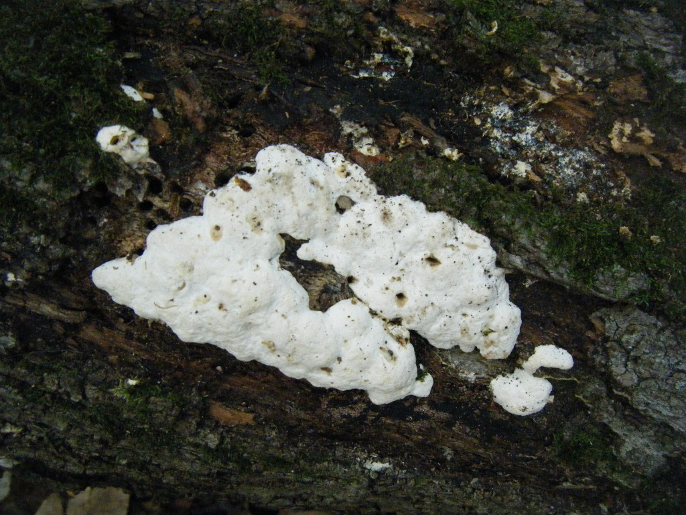
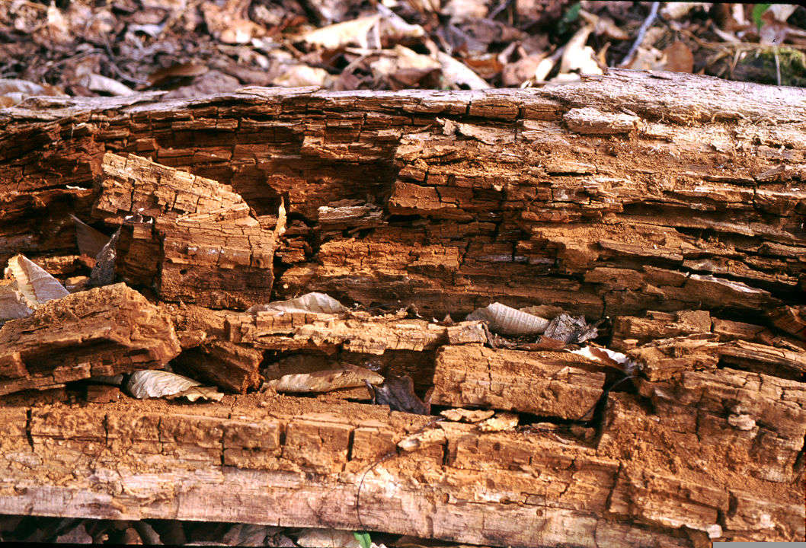
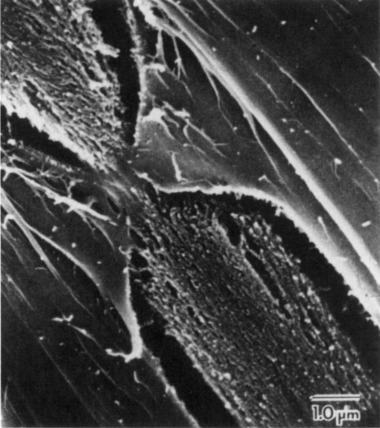
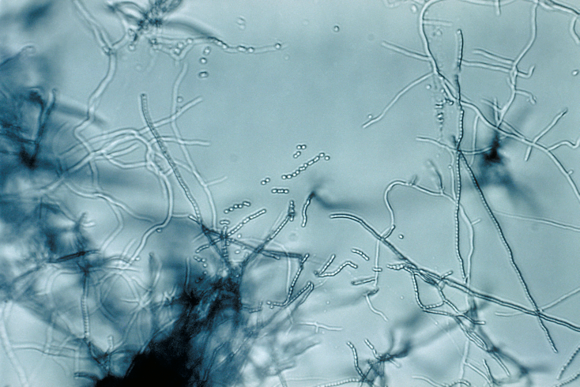
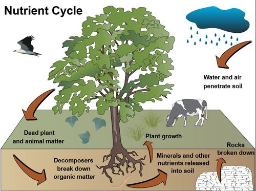

import Columns from '@site/src/components/Columns'
import Column from '@site/src/components/Column'
import ReactPlayer from 'react-player'

Ever wondered how the seemingly indestructible wood and plant material around you eventually decomposes?
The answer lies in the incredible complexity of **[lignin](https://en.wikipedia.org/wiki/Lignin)**—one of the toughest
organic compounds found in nature. But what’s even more shocking is how some extraordinary microbes have evolved to
break it down! Let’s dive into this fascinating process of lignin degradation and the key players involved.

<!-- truncate -->

## Why is lignin hard to degrade? What breaks down lignin?

Lignin is a highly complex and rigid polymer found in plant cell walls, making it difficult to degrade.
Its irregular structure and hydrophobic nature protect plants from microbial attacks. However, specialized organisms
like white-rot fungi have evolved to break down lignin using enzymes such as lignin peroxidase and manganese peroxidase.
Other fungi, like brown-rot fungi, and certain bacteria also contribute, though to a lesser extent.
These organisms play a vital role in the natural recycling of plant material.

### 1. White-Rot Fungi: The Ultimate Lignin Destroyers

**[White-rot fungi](https://en.wikipedia.org/wiki/White_rot_fungus)** are nature’s most powerful lignin degraders.
These fungi produce special enzymes like **[lignin peroxidase](https://en.wikipedia.org/wiki/Lignin_peroxidase)**,
**[manganese peroxidase](https://en.wikipedia.org/wiki/Manganese_peroxidase)**, and **[laccase](https://en.wikipedia.org/wiki/Laccase)**
that break down the complex lignin structure.

Some common types of white-rot fungi include:

- **[Trametes versicolor](https://en.wikipedia.org/wiki/Trametes_versicolor)**, also known as Turkey Tail
- **[Phanerochaete chrysosporium](https://en.wikipedia.org/wiki/Phanerochaete_chrysosporium)**

These fungi don’t just soften wood—they turn tough lignin into smaller, simpler molecules, leaving behind usable nutrients.

### 2. Brown-Rot Fungi: Selective Lignin Eaters

**[Brown-rot fungi](https://en.wikipedia.org/wiki/Brown_rot_fungus)** might not be as aggressive as their white-rot cousins, but they are just as fascinating. These fungi target cellulose and hemicellulose, leaving much of the lignin behind, but still manage to partially break it down.

Common brown-rot fungi include:

- **[Postia placenta](https://en.wikipedia.org/wiki/Postia_placenta)**
- **[Gloeophyllum trabeum](https://en.wikipedia.org/wiki/Gloeophyllum_trabeum)**

They give decayed wood that signature brown, brittle look, breaking down essential components for future decomposition.

### 3. Soft-Rot Fungi: The Slow but Steady Breakers

**[Soft-rot fungi](https://www.sciencedirect.com/topics/agricultural-and-biological-sciences/soft-rot-fungi)** might not
work as fast as white-rot or brown-rot fungi, but they thrive in wetter environments where others can’t.
These fungi are key in breaking down lignin in damp, low-nutrient conditions.

### 4. Bacteria: The Unsung Heroes of Lignin Breakdown

Though fungi are the main lignin degraders, bacteria also play a role. Certain bacteria, like **[Streptomyces](https://en.wikipedia.org/wiki/Streptomyces)** and **[Pseudomonas](https://en.wikipedia.org/wiki/Pseudomonas)**, produce enzymes that assist in breaking down lignin under specific conditions, such as low oxygen environments.

### 5. The Key Enzymes Behind Lignin Degradation

The breaking down of lignin is only possible due to some very specific enzymes:

- **[Lignin peroxidase](https://en.wikipedia.org/wiki/Lignin_peroxidase)**: Breaks lignin’s tough structure through oxidation.
- **[Manganese peroxidase](https://en.wikipedia.org/wiki/Manganese_peroxidase)**: Utilizes manganese ions to catalyze lignin breakdown.
- **[Laccase](https://en.wikipedia.org/wiki/Laccase)**: A multi-copper oxidase that speeds up lignin oxidation.

These enzymes are the biochemical powerhouses that enable fungi and bacteria to attack this robust material.

## Ecological Significance of Lignin Breakdown

Lignin degradation is crucial for the recycling of plant material in nature. Without these fungi and bacteria, woody material would accumulate, clogging ecosystems with unprocessed organic matter. The breakdown of lignin returns essential nutrients to the soil, feeding plants and maintaining the balance of our natural world.

## Lignin in composting

Lignin might be one of nature’s toughest materials, but with the help of white-rot fungi, brown-rot fungi, soft-rot fungi,
and even bacteria, it eventually breaks down. These microbes and their powerful enzymes are unsung heroes in the cycle of life,
turning tough plant material into nutrients that feed ecosystems worldwide.

If you thought wood couldn’t rot—think again! Lignin's decomposition is nature’s reminder that nothing is truly indestructible.

In composting, most people know that the natural process takes a long time. One of the main reasons for this is the tough
nature of lignin. However, if the composting process is well-designed to avoid an incorrect lignin ratio, [speeding up the
composting process is not difficult](https://www.geme.bio/how-it-works).
