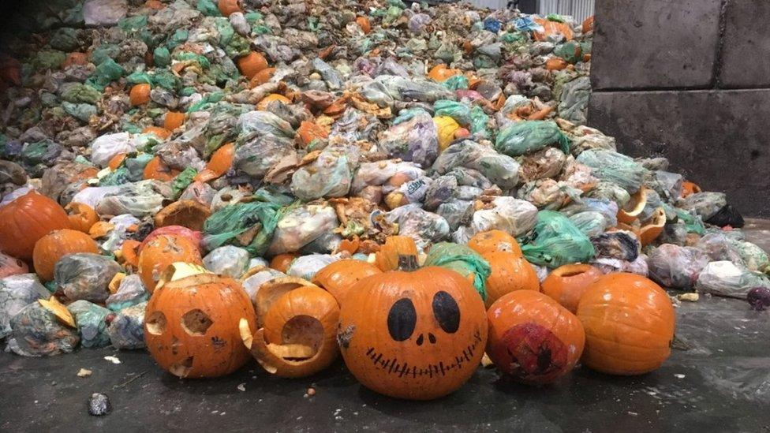
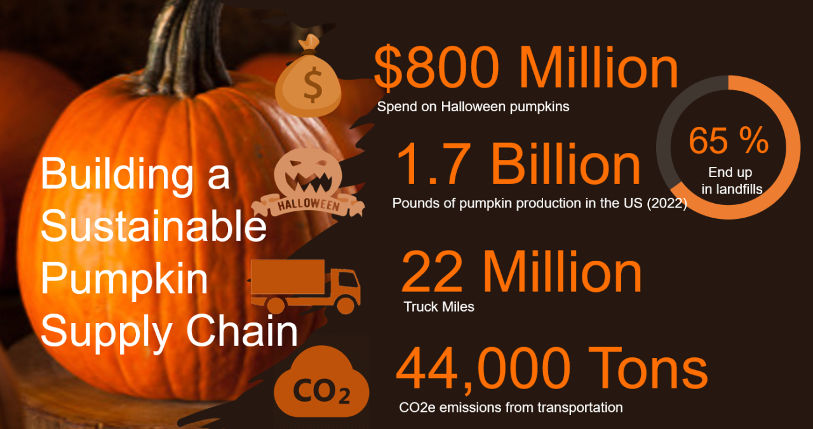
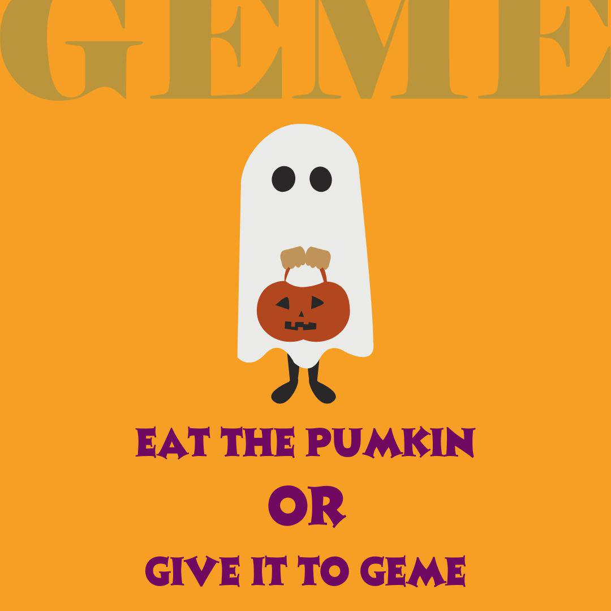
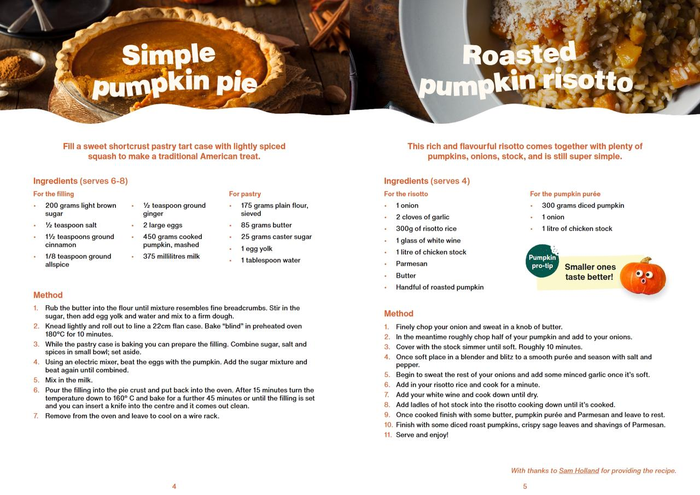
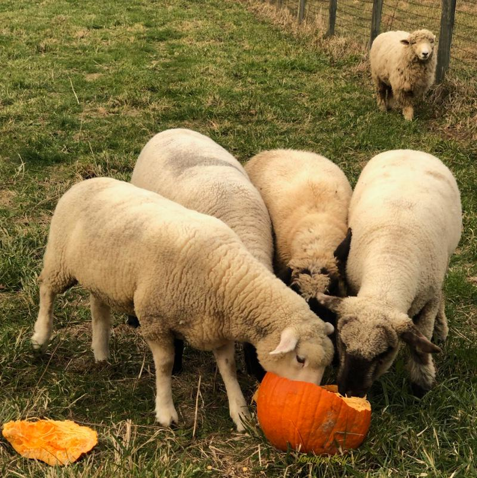
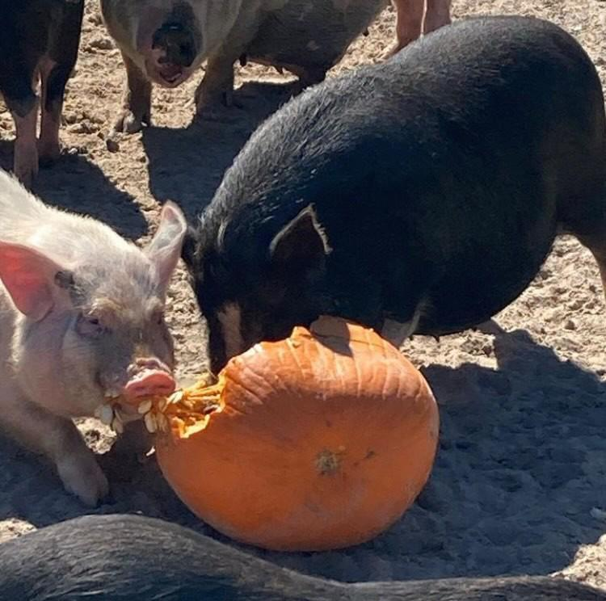

<head>
    <meta charSet="utf-8" />
    <meta name="twitter:card" content="summary_large_image" />
    <meta data-rh="true" property="og:image" content="https://www.geme.bio/assets/images/img_4-4c9665d447f4249cb562e0c00e817fb0.png" />
    <meta data-rh="true" name="twitter:image" content="https://www.geme.bio/assets/images/img-ebbc76a64033f0a420d391471bff77ab.png"/>
    <meta data-rh="true" property="og:url" content="https://www.geme.bio/blog/the-phenomenon-impact-and-solutions-of-halloween-pumpkin-waste"/>
    <meta data-rh="true" property="og:locale" content="en"/>
</head>

import Columns from '@site/src/components/Columns'
import Column from '@site/src/components/Column'
import ReactPlayer from 'react-player'

Halloween is a widely celebrated festival in many countries, and pumpkins play a significant role during this time. However, the issue of pumpkin waste after Halloween has become a matter of concern, involving both economic and environmental aspects.

<!-- truncate -->

## The Extent of Pumpkin Waste and Associated Costs

### Waste Statistics

In the UK, where Halloween traditions are as prominent as in the US, a substantial number of pumpkins are purchased each year.
For instance, this year, an estimated 39.9 million pumpkins were bought, but shockingly, 22.2 million of them are expected to go to waste.
This represents a significant portion of the total pumpkins acquired for the festivities.

### Economic Losses

The 22.2 million wasted pumpkins not only signify a vast amount of perfectly edible food that could have been utilized
to create a variety of delicious dishes such as pumpkin pies, stews, and soups, but they also result in a staggering economic loss.
The monetary value of this waste amounts to an alarming £32.6 million. During a period when the cost-of-living crisis is worsening
and more families are relying on food banks, such profligate waste is bordering on immorality.

### Environmental Impact

When pumpkins end up in landfills, they decompose and release methane gas. Methane is a potent greenhouse gas with a warming
effect that is more than 20 times that of carbon dioxide. This has significant implications for the environment, contributing
to climate change and exacerbating environmental problems.

## The Popularity of Pumpkin-related Activities and the "Instagramification" Phenomenon

### Increasing Popularity of Halloween and Pumpkin-related Events

In recent years, the popularity of pumpkins and related activities surrounding Halloween has witnessed a notable rise in the UK,
both in cultural and commercial terms. People are spending increasingly large amounts on the spooky festivities.
It is estimated that this year, the UK population will have expended over £600 million on various aspects of Halloween, including food, costumes, and decorations.
Activities such as visiting pumpkin patches and "pick your own pumpkin" have become increasingly popular traditions. People not only enjoy the experience of selecting their own pumpkins but also take pride in sharing their choices on social media platforms.

### The Impact of Social Media and Aesthetic Grading

Social media has played a significant role in promoting these pumpkin-related activities. Platforms like Instagram, Facebook,
and Pinterest are flooded with posts related to Halloween and pumpkins. For example, on Instagram alone, there are over 100
million posts using "#halloween," 17 million with "#pumpkin," and just over 4.3 million with "#pumpkinpatch."
Aesthetic grading has also influenced pumpkin waste. Similar to the situation with carrots, where a significant percentage
(24% - 50%) are discarded based on appearance, during the "pick your own pumpkin" process, consumers tend to select the most
aesthetically pleasing pumpkins, which are typically the roundest, plumpest, and brightest. This leads to a large number of pumpkins being discarded despite being perfectly edible. Social media not only encourages people to visit pumpkin patches but also creates a demand for the perfect pumpkin for sharing on these platforms, further exacerbating the waste problem.

## Solutions to Pumpkin Waste

### Education and Awareness Campaigns

One of the key solutions to combat pumpkin waste is through re-education and the dissemination of information about what to do with pumpkins after the festivities. It is surprising that only 59% of people are aware that pumpkins are edible. This indicates that the perception of pumpkins has shifted more towards their use as decorative items during Halloween, and many have forgotten or are unaware of their original purpose as a food source. By increasing public awareness and educating people about the various uses of pumpkins beyond decoration, we can encourage more responsible behavior and reduce waste.

### Composting as a Sustainable Option

Composting is not only a practical way to dispose of pumpkins but also a significant step towards combating climate change. When organic matter is sent to landfills, it decomposes anaerobically, producing methane. In contrast, composting provides an aerobic environment for organic matter to break down, which significantly reduces or even eliminates methane production.
Every part of a pumpkin is compostable, including the skin, meat, stem, and guts. Pumpkins are a great source of nitrogen for the compost pile. However, before composting, it is necessary to prepare the pumpkin. Halloween pumpkins are often decorated with non-compostable items such as glitter, stickers, and candles, which need to be removed. Additionally, the thick skin may take longer to decompose, so it is advisable to break the pumpkin into smaller pieces to increase the surface area and facilitate the decomposition process by microorganisms. A proper composting ratio of carbon-rich (e.g., dead leaves or shredded paper) to nitrogen-rich (pumpkin) materials, along with regular turning and maintaining moisture, can ensure effective composting and the transformation of the pumpkin into valuable compost that enriches the soil.

### Culinary Utilization

Pumpkin is more nutrient-dense than many people realize. A cup of cooked pumpkin contains more than 200% of the recommended daily intake of vitamin A, 20% of the recommended vitamin C, and is an excellent source of potassium. This makes it a healthy and versatile ingredient for cooking. There are numerous recipes that can be explored, such as making pumpkin soup, roasting pumpkin seeds for a healthy snack, or using pumpkin in the preparation of pumpkin pie. By incorporating pumpkin into our diet after Halloween, we can make the most of its nutritional value and reduce waste.

### Providing for Wildlife

Another option to reduce pumpkin waste is to offer them to wildlife. After removing any wax, paint, or marker from the pumpkin, it can be left outside for squirrels and birds. To further attract wildlife, birdseed can be scooped into the pumpkin bowl. For larger mammals like deer, cutting the pumpkin into quarters makes it easier for them to eat. This not only helps in reducing waste but also provides a natural food source for wildlife, contributing to the ecological balance.

<Columns>
  <Column className='text--left'>
    
  </Column>

  <Column className='text--center text--left'>
    
  </Column>
</Columns>

## Conclusion

In conclusion, the issue of Halloween pumpkin waste is a complex one with significant economic and environmental implications. By implementing a combination of solutions such as education, composting, culinary utilization, and providing for wildlife, we can reduce pumpkin waste and make more sustainable use of this resource. It is essential that all stakeholders, including consumers, supermarkets, and the wider community, work together to address this problem and promote more responsible practices during and after the Halloween season. This way, we can enjoy the festivities while also minimizing our impact on the environment and making the most of the resources available, ensuring a more sustainable future.
