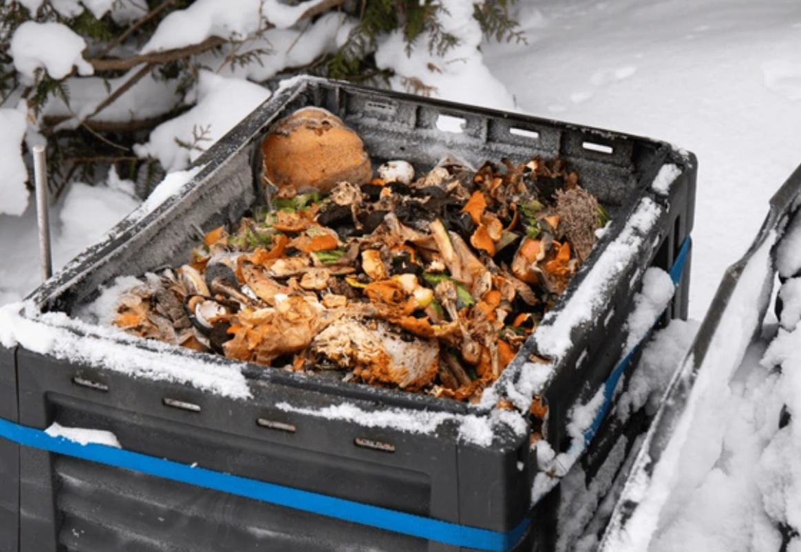
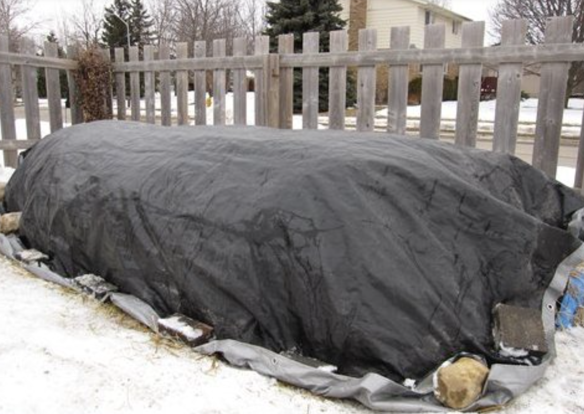
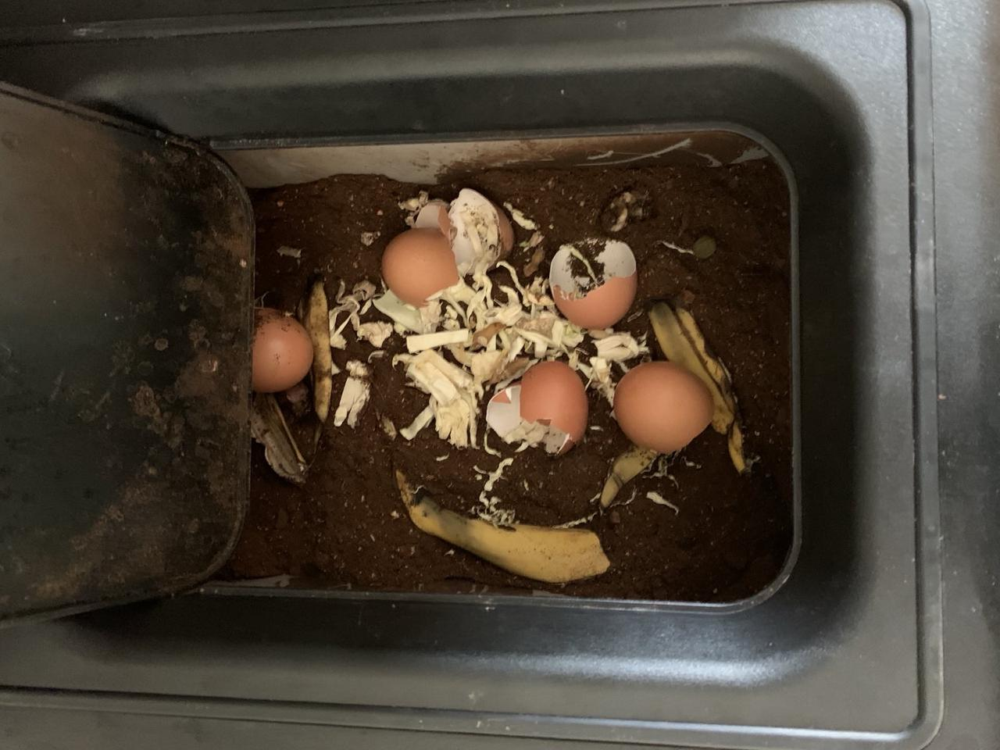
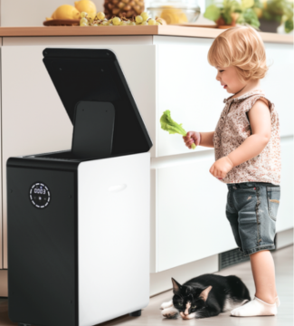
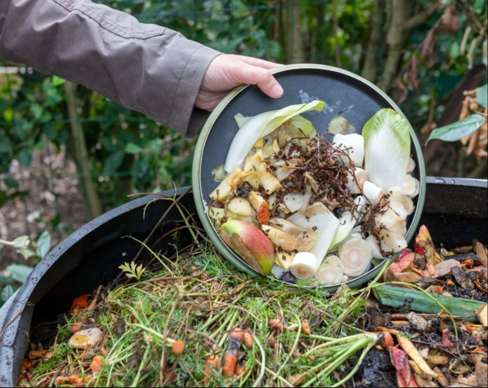

<head>
    <meta charSet="utf-8" />
    <meta name="twitter:card" content="summary_large_image" />
    <meta data-rh="true" property="og:image" content="https://www.geme.bio/assets/images/img-f44f46e270e1baa7aeda18f248c0a649.png" />
    <meta data-rh="true" name="twitter:image" content="https://www.geme.bio/assets/images/img-f44f46e270e1baa7aeda18f248c0a649.png"/>
    <meta data-rh="true" property="og:url" content="https://www.geme.bio/blog/overcoming-the-challenges-of-composting-in-winter"/>
    <meta data-rh="true" property="og:locale" content="en"/>
</head>

import Columns from '@site/src/components/Columns'
import Column from '@site/src/components/Column'
import ReactPlayer from 'react-player'

Composting in winter is a tough nut to crack for many composters. The cold weather makes it hard to control the composting temperature, and working during winter is even more arduous. Let's delve deeper into the causes of problems in winter composting and how to solve them!

<!-- truncate -->

## Several problems may be encountered during winter composting

### Reduced Microbial Activity

Microbes play a crucial role in the composting process as they promote the decomposition of organic matter. 
However, the activity of most microbes is inhibited in low - temperature environments. 
For example, the activities of mesophilic microbes (with an optimal growth temperature between 20 - 45 degrees Celsius) 
and thermophilic microbes (with an optimal temperature around 45 - 65 degrees Celsius) slow down as the temperature drops. 
In the cold winter, the internal temperature of the compost pile may become very low, slowing down the rate at which microbes 
decompose organic matter. This leads to a prolonged composting process. Composting that might take only a few weeks or months 
in warm seasons could take several months or even longer in winter.

### Slow Decomposition of Materials

Due to the reduced microbial activity, the decomposition rate of compost materials also slows down. The low temperatures 
in winter make the chemical bonds in organic matter more difficult to break. For instance, components like cellulose and 
lignin, which are the main constituents of plant cell walls, are difficult for the enzymes secreted by microbes to decompose
effectively at low temperatures. Take fallen leaves as an example. In warm seasons, they may decompose relatively quickly
in the compost pile, but in winter, they may remain unchanged in the compost for a long time, delaying the composting process.

### Moisture Variation Problems

In winter, the environmental humidity may be low, especially for indoor composting with heating or in dry and cold regions.
If the compost materials are too dry, the growth and metabolic activities of microbes will be affected because microbes 
require a certain amount of water for substance transport and enzymatic reactions. On the contrary, if the compost is outdoors, 
snow or rain may make the compost materials too wet. Excessive moisture will cause the air in the compost pile to be squeezed 
out, creating an anaerobic environment. Under anaerobic conditions, the compost will produce unpleasant odors, and the quality 
of the compost will decline because the accumulation of organic acids and other substances produced by anaerobic decomposition
may have an adverse effect on plant growth.

### Poor Ventilation

In winter, people usually focus on keeping warm, and compost containers or piles may be wrapped too tightly, resulting in poor ventilation. Good ventilation is essential for composting as it provides sufficient oxygen for microbes. In the case of insufficient ventilation, the activity of aerobic microbes will be inhibited, and anaerobic microbes will dominate. This will not only slow down the composting process but also may produce harmful gases such as hydrogen sulfide, causing the compost to smell bad and reducing its fertilizer efficiency.

## How to Solve the Problem of composting in Winter

### Controlling the Temperature of the Composting Environment

#### Using Insulating Materials

Materials such as hay, quilts, and old blankets can be used to wrap the composting container. These insulating materials can reduce the heat loss of the compost, just like putting a "warm coat" on the compost. For example, for a small compost bin, surrounding the bin with multiple layers of hay can effectively prevent the invasion of cold air from the outside. Additionally, a thick layer of polystyrene foam board can be laid on the bottom and sides of the compost pile or container. This material has good thermal insulation performance and can create a relatively warm micro - environment for the compost.

#### Selecting an Appropriate Composting Location

For outdoor composting, the compost pile can be placed in a south - facing and sheltered position. The south - facing direction can receive more sunlight, which is beneficial for heat absorption, and a sheltered place (such as the south side of a building or beside a fence) can prevent cold wind from directly blowing on the compost pile. For indoor composting, a place with relatively stable temperature should be selected, such as a basement, greenhouse, or a corner near heating equipment. However, indoor composting requires attention to ventilation to avoid odors.

#### Adding Heat - generating Materials

Some materials that can generate heat can be added during the composting process, such as fresh horse manure, sheep manure, or nitrogen - rich green manure (such as alfalfa). These materials generate heat during decomposition, which helps to increase the temperature of the compost. Taking horse manure as an example, it contains a large number of microbes and easily decomposable organic matter. During the decomposition of horse manure by microbes, heat is released, creating a suitable high - temperature environment for the compost and promoting the decomposition of other compost materials.

### Using GEME Electric Composter

#### Complete Composting at Home

The GEME electric composter allows users to avoid going outside to turn the compost in the cold winter. It also enables household kitchen waste to be disposed of immediately instead of being collected. When there is kitchen waste, it can be thrown into the compost bin at any time, avoiding the breeding of odors and bacteria.

#### Automatic Temperature Control

The GEME electric composter has an excellent temperature control system, which can fundamentally solve the problem of difficult winter composting. The composter simulates the natural composting mode inside the bucket. Microbes are added to the bucket, enabling efficient degradation of kitchen waste. This can quickly reduce the volume of the kitchen waste put in, making more space in the bucket to accommodate more kitchen waste. The bucket has a capacity of 19L. A family of four may not need to clean the compost products in the bucket within 4 - 6 months, allowing for a comfortable winter.

#### Different from Bokashi

The microbes in the GEME bucket are aerobic bacteria. Aerobic composting has better advantages in temperature control. As for the problem of odor in Bokashi composting, there is no need to worry about it with GEME. GEME is equipped with an industrial-level deodorization system, and no odor can be smelled at home.

<Columns>
  <Column className='text--left'>
    
  </Column>

  <Column className='text--center text--left'>
    
  </Column>
</Columns>

### Adjusting the Size and Proportion of Composting Materials

#### Reducing the Size of Materials

Chop or crush the raw materials before composting to increase the surface area of the materials. For example, cut branches into small sections and cut vegetable residues into small pieces. A larger surface area means that microbes can more easily access the inside of the materials, thereby accelerating the decomposition speed. It's like cutting a large piece of food into small pieces for easier digestion.

#### Optimizing the Carbon - to - Nitrogen Ratio

A reasonable carbon - to - nitrogen ratio is the key to rapid compost maturation. In winter, the proportion of nitrogen - source materials can be appropriately increased. Nitrogen - source materials include kitchen waste (such as leftovers, fruit peels, etc.) and animal manure. These materials can provide sufficient nitrogen for microbes, promoting the growth and reproduction of microbes. Generally, the carbon - to - nitrogen ratio of winter composting can be controlled between 20:1 and 30:1. Compared with 30:1 - 40:1 in summer, the proportion of carbon is appropriately reduced, providing microbes with more abundant nitrogen sources to decompose organic matter.

### Strengthening Ventilation Management of Composting

#### Setting Ventilation Openings
If using a composting container, ensure that there are sufficient ventilation openings on the container. Ventilation openings allow fresh air to enter the compost pile, providing oxygen for aerobic microbes. For example, on a self - made wooden compost box, some small holes can be drilled on the sides and top of the box. The size and number of these small holes should be determined according to the size of the compost box. Generally, 1 - 2 ventilation holes with a diameter of 1 - 2 inches (about 2.5 - 5 cm) can be set per square foot (about 0.09 square meters) of the box wall area.

#### Turning the Compost Regularly 

Regularly turning the compost can improve the ventilation inside the compost pile. In winter, the frequency of turning can be appropriately reduced, but it should not be completely stopped. For example, turn the compost once every 1 - 2 weeks during the relatively warm noon time. When turning, use a shovel or compost fork to turn the outer layer of the compost pile to the inside and the inside to the outside. This allows each part of the compost to be exposed to fresh air, which is beneficial for the activity of aerobic microbes and thus accelerates the compost maturation.

### Reasonably Controlling Composting Humidity

#### Appropriate Watering

In the dry winter, pay attention to checking the humidity of the compost. If the compost materials look dry, spray an appropriate amount of water to increase the humidity. However, be careful not to make the compost too wet. Generally, when you hold a handful of compost materials, you should feel slightly moist, but no water should drip. This humidity is more appropriate.

#### Selecting Appropriate Coverings 

Water - proof and breathable materials such as shade nets or plastic films with ventilation holes can be used to cover the compost pile. Such coverings can prevent excessive rain or snow from entering the compost pile while maintaining a certain degree of air permeability and avoiding the formation of an anaerobic environment due to high humidity in the compost pile.
