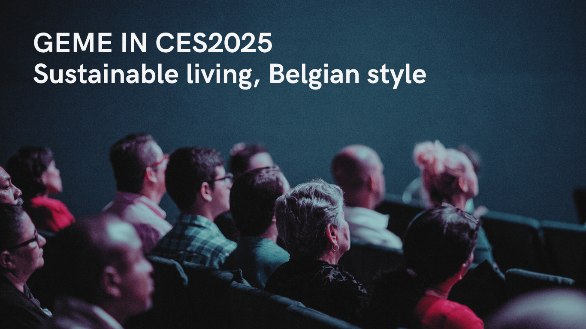
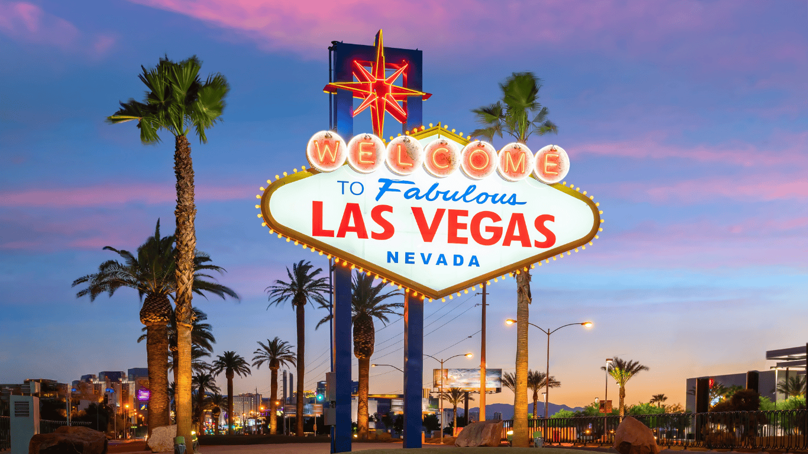
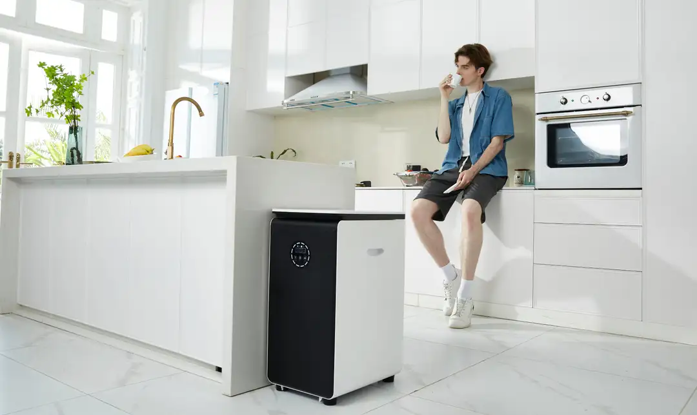
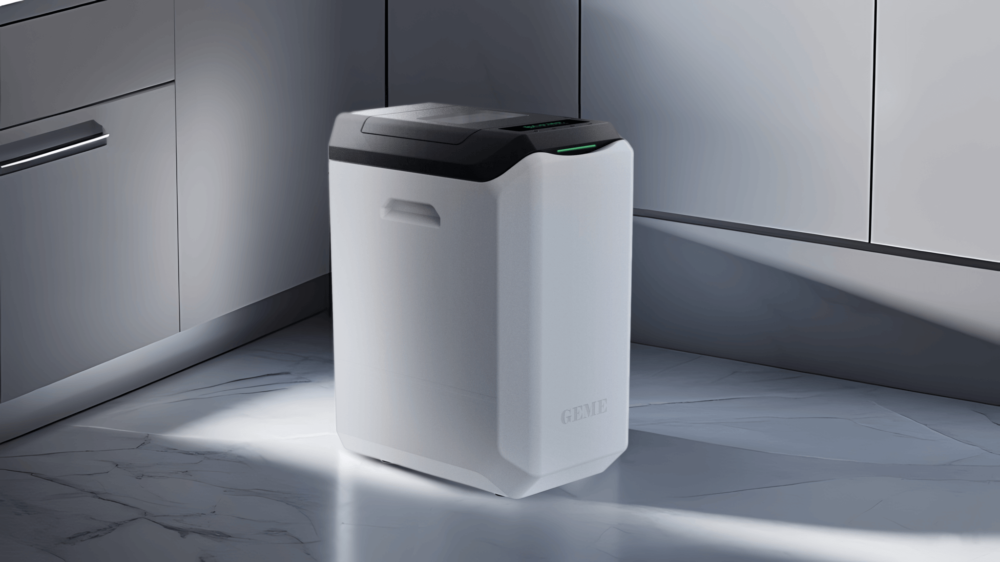
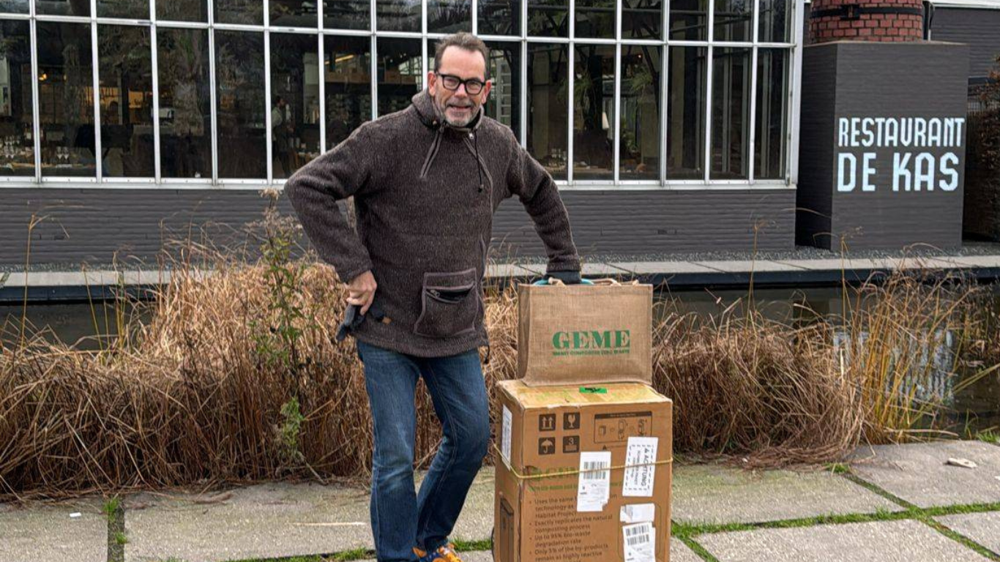
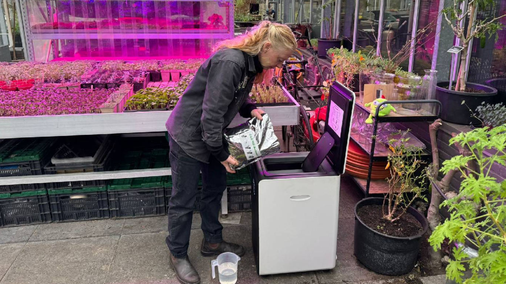
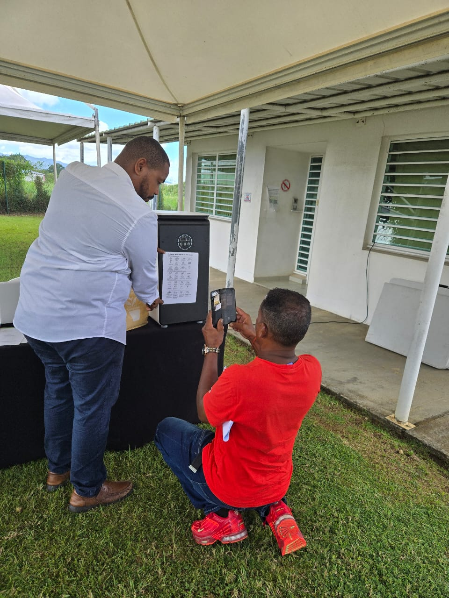
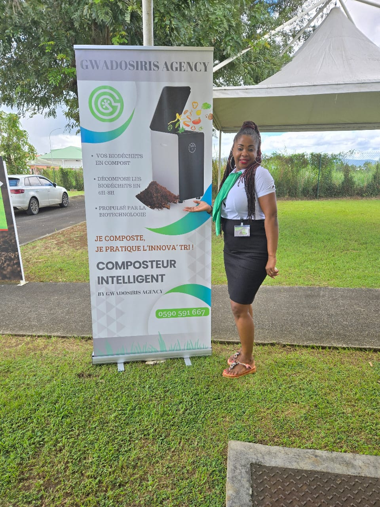
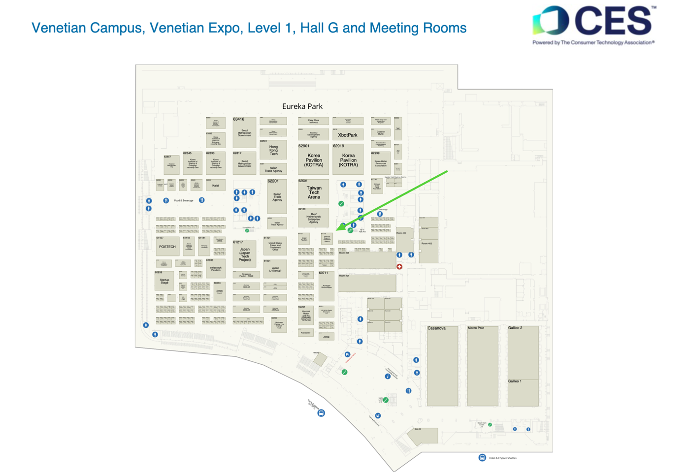

<head>
    <meta charSet="utf-8" />
    <meta name="twitter:card" content="summary_large_image" />
    <meta data-rh="true" property="og:image" content="https://www.geme.bio/assets/images/memento-acb303cbcd194fd9b39b4d611a14cb8e.png" />
    <meta data-rh="true" name="twitter:image" content="https://www.geme.bio/assets/images/memento-acb303cbcd194fd9b39b4d611a14cb8e.png"/>
    <meta data-rh="true" property="og:url" content="https://www.geme.bio/assets/images/memento-acb303cbcd194fd9b39b4d611a14cb8e.png"/>
    <meta data-rh="true" property="og:locale" content="en"/>
</head>

import Columns from '@site/src/components/Columns'
import Column from '@site/src/components/Column'
import ReactPlayer from 'react-player'

## GEME to Unveil Groundbreaking Food Waste Solutions at CES 2025

Las Vegas, Nevada — [GEME](https://www.geme.bio), a leading innovator in sustainable food waste management, is excited to announce its participation
at CES 2025. Known as the global stage for innovation, CES brings together the brightest minds in technology and sustainability.
GEME will be showcasing its cutting-edge composting solutions, designed to tackle food waste at a personal and community level.

The CES event will feature GEME’s latest composting systems that are revolutionizing the way consumers approach food waste.
With a focus on ease of use, efficiency, and sustainability, GEME’s solutions enable individuals and families to
reduce their carbon footprint and transform organic waste into nutrient-rich compost.

<!-- truncate -->

“As the world grapples with the mounting challenges of food waste, GEME is committed to providing solutions that not only
help reduce waste but also contribute to a more sustainable future,” said GEME Managing Director, Alex. “We are thrilled to
present our latest innovations at CES 2025, where we can connect with industry leaders, environmental advocates, and consumers
who share our vision for a cleaner planet.”

## What GEME Will Showcase at CES 2025

At CES 2025, GEME will debut its flagship product, the [GEME Composter](https://www.geme.bio/product/geme), and
[GEME Terra 2](https://www.geme.bio/geme-terra-2), a smart, easy-to-use device that accelerates
composting at home. With advanced sensors and AI-powered features, it offers a streamlined composting experience for
people who want to make a positive environmental impact.

<Columns>
  <Column className='text--left'>
    
    **GEME Composter(Classic)**
  </Column>

   <Column className='text--left'>
    
    **GEME Terra 2**
  </Column>
</Columns>

Visitors to GEME’s booth will be able to experience live demonstrations
of the product, see how it works in real-time, and learn about its environmental benefits.

Additionally, GEME will share its mission to eliminate food waste on a global scale, with a focus on community-driven
composting initiatives. Attendees can learn about GEME’s strategic partnerships with local governments, environmental
organizations, and businesses, aimed at reducing food waste in cities and homes alike.

## Why CES 2025 Matters for GEME

CES is one of the most influential technology events in the world, and it serves as an ideal platform for GEME to introduce
its sustainable food waste solutions to a global audience. The event will provide GEME with the opportunity to network with
industry experts, investors, and sustainability advocates, while also educating the public about the importance of composting
and responsible waste management.

“We believe that innovation plays a critical role in driving change,” said Alex. “CES allows us to showcase our
commitment to sustainable living and demonstrate how technology can be harnessed to create a more sustainable and circular economy.”

<Columns>
  <Column className='text--left'>
    
    **GEME for restaurant in German**
  </Column>

   <Column className='text--left'>
    
    **GEME for farm in Netherlands**
  </Column>
</Columns>

<Columns>
  <Column className='text--left'>
    
    **GEME in France**
  </Column>

   <Column className='text--left'>
    
    **GEME in Guadeloupe**
  </Column>
</Columns>

## Join GEME at CES 2025

GEME invites everyone attending CES 2025 to visit their booth to explore their innovative products, learn more about sustainable living,
and discover how composting can contribute to a healthier planet. For more information about GEME’s products and sustainability efforts,
visit www.geme.bio or sign up for updates here.

:::info
Venetian Campus, Venetian Expo, Level 1, Hall G, Eureka Park, 61713
:::

Stay tuned for more updates as GEME prepares for CES 2025. GEME is excited to be part of this groundbreaking event and
looks forward to engaging with visitors who share a passion for creating a more sustainable future.

Let me know if you need any adjustments or additional details for this blog!
