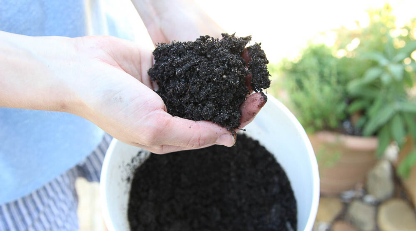
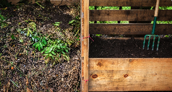
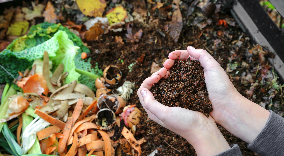
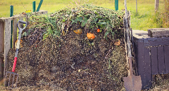
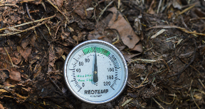
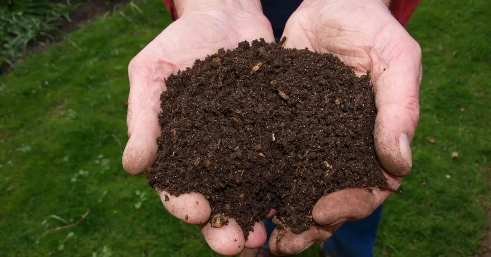

<head>
    <meta charSet="utf-8" />
    <meta name="twitter:card" content="summary_large_image" />
    <meta data-rh="true" property="og:image" content="https://www.geme.bio/assets/images/1-e9a4d07b7def7cd5b62ebd2a06b68f36.png" />
    <meta data-rh="true" name="twitter:image" content="https://www.geme.bio/assets/images/1-e9a4d07b7def7cd5b62ebd2a06b68f36.png"/>
    <meta data-rh="true" property="og:url" content="https://www.geme.bio/assets/images/1-e9a4d07b7def7cd5b62ebd2a06b68f36.png"/>
    <meta data-rh="true" property="og:locale" content="en"/>
</head>

import Columns from '@site/src/components/Columns'
import Column from '@site/src/components/Column'
import ReactPlayer from 'react-player'

Knowing when your compost is ready is a bit like knowing when a cake is baked. There are some telltale signs to look for.

"Proper composting requires the right balance of materials and conditions," explains Dr. Sarah Chen, a composting expert. "When done correctly, beneficial microorganisms break down organic matter into rich, usable compost that's great for your garden."

<!-- truncate -->

## Key Signs of Ready Compost

Your compost is likely ready when it shows these characteristics:

### Dark and Crumbly

Finished compost resembles rich, dark brown soil. It should be loose and crumbly in texture.

### Earthy Smell

It should have a pleasant, earthy aroma, like the forest floor. No foul odors!

### Reduced Volume

The volume of your compost pile should have significantly reduced, about half its original size.

### Cool Temperature

The compost pile should no longer feel warm, indicating that most of the decomposition is complete.

## Testing Your Compost's Readiness

Here are reliable ways to check if your compost is ready:

1. Temperature Test: The pile should be close to ambient temperature
2. Visual Test: Original materials should be unrecognizable
3. Smell Test: Should have an earthy, soil-like odor
4. Texture Test: Should be dark and crumbly

## Using Your Finished Compost

- As a soil amendment
- As mulch around plants
- In potting mixes
- As a lawn top dressing

:::info
If you're still unsure, you can do a simple germination test. Plant a few seeds in a pot with your compost and observe if they sprout. If they grow well, your compost is likely ready to use!
:::

Remember that even when your compost appears ready, it's good practice to let it cure for a few extra weeks to ensure it's fully matured. This extra time allows beneficial microorganisms to complete their work and creates an even better product for your garden.

With these guidelines, you can confidently determine when your compost is ready to use and make the most of your composting efforts!
