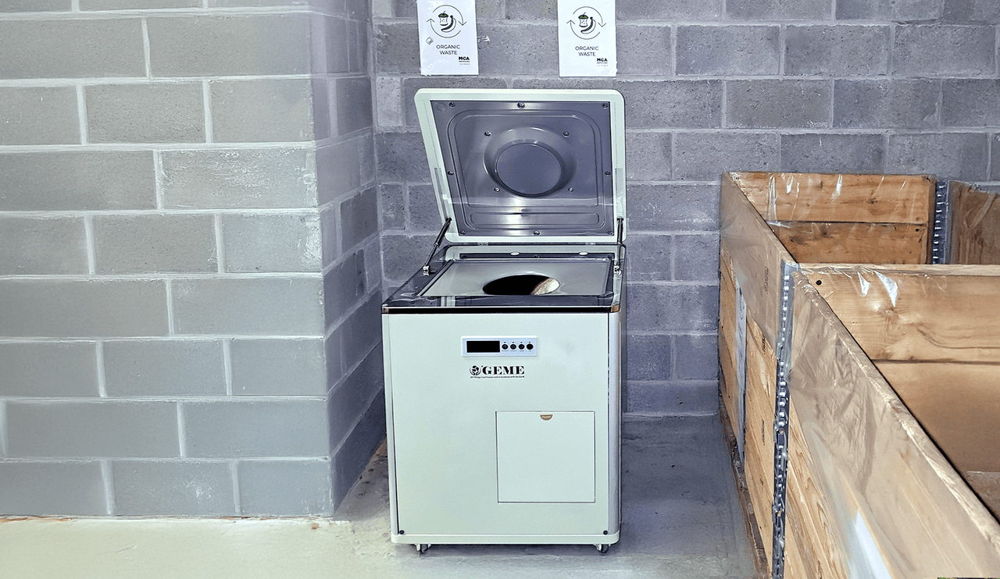
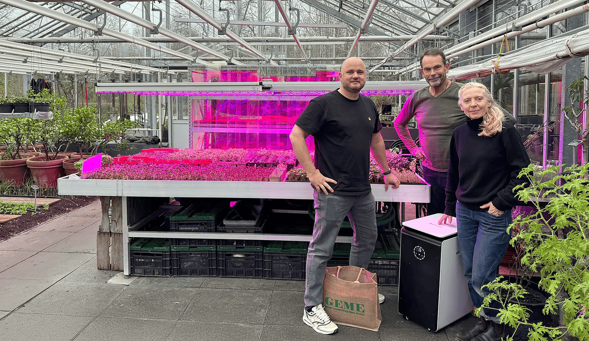

<head>
    <meta charSet="utf-8" />
    <meta name="twitter:card" content="summary_large_image" />
    <meta data-rh="true" property="og:image" content="https://www.geme.bio/assets/images/1-6276763e3c70801ebf45f764f5daaf9b.png" />
    <meta data-rh="true" name="twitter:image" content="https://www.geme.bio/assets/images/1-6276763e3c70801ebf45f764f5daaf9b.png"/>
    <meta data-rh="true" property="og:url" content="https://www.geme.bio/assets/images/1-6276763e3c70801ebf45f764f5daaf9b.png"/>
    <meta data-rh="true" property="og:locale" content="nl"/>
</head>

import Columns from '@site/src/components/Columns'
import Column from '@site/src/components/Column'
import ReactPlayer from 'react-player'

De toenemende focus op beleid voor voedselafvalverwerking vormt een aanzienlijke uitdaging voor de restaurantindustrie. Enerzijds vormen de doorlopende kosten in verband met afvalverwerking een constante en onvermijdelijke operationele kostenpost. Bovendien is de opslag van voedselafval een urgent probleem. Vooral tijdens de zomermaanden kunnen stijgende temperaturen leiden tot snelle ontbinding, onaangename geuren en de verspreiding van bacteriën. Anderzijds is gezondheid een onmiskenbare trend geworden, die diep geworteld is in de mentaliteit van consumenten. Klanten zijn steeds meer bezorgd over hoe verschillende aspecten van hun leven aansluiten bij gezondheid en duurzaamheid, een verschuiving die vooral duidelijk is in de horeca.

<!-- truncate -->

## Een Organische Cyclus van Tafelresten tot Voeding voor de Aarde

Voor restaurants biedt de komst van de [GEME voedselafvalcomposteerder](https://www.geme.bio/product/geme) een zeer efficiënte oplossing voor het lastige probleem van voedselafvalverwerking. Gebruikmakend van het principe van aerobe fermentatie door micro-organismen, in combinatie met een door de machine gecreëerde optimale omgeving, simuleert GEME het natuurlijke composteerproces, waardoor het volume van voedselafval binnen 6-8 uur met 95% wordt verminderd. Het verwerkte voedselafval ondergaat verdere rijping in de machine en wordt uiteindelijk omgezet in organische compost. Zo wordt werkelijk een organische cyclus bereikt van tafelresten terug naar voeding voor de aarde, wat perfect aansluit bij de huidige nadruk op duurzaamheid.

## Perfecte Oplossing voor Geurproblemen

Bovendien biedt [GEME](https://www.geme.bio/) een perfecte oplossing voor de geurproblemen die gepaard gaan met voedselafval. Uitgerust met een industrieel ontgeuringssysteem werkt de machine zonder onaangename geuren te verspreiden, zelfs in een keukenomgeving. Dit betekent dat restaurants zich geen zorgen meer hoeven te maken over mogelijke geurproblemen door indoor compostering, waardoor een comfortabelere werkomgeving voor het personeel wordt gecreëerd.

## Aanzienlijke Vermindering van de Inspanning Vereist voor Voedselafvalbeheer

Neem bijvoorbeeld het commerciële model [RS-BIO-10](https://www.geme.bio/industrial-equipments): het maakt het eenvoudig en continu storten van voedselafval mogelijk, waardoor restaurantpersoneel het niet met dezelfde zorg en inspanning hoeft te behandelen als bij traditionele methoden. Dankzij de continue werking kan de machine efficiënt 10 kg voedselafval per dag verwerken, waardoor de omslachtige stap van het legen van de compost na elk gebruik overbodig wordt. De micro-organismen in de machine fungeren als onvermoeibare werkers, die continu afval afbreken en hun activiteit behouden, klaar om nieuw toegevoegd voedselafval te verwerken. Restaurants hoeven de opgehoopte compost pas te legen als de machine vol is, waardoor voedselafvalbeheer eenvoudiger dan ooit wordt. Deze intelligente en handige bediening verlaagt de kosten voor personeelstraining, waardoor nieuwe medewerkers snel bekwaam kunnen worden.

## Duurzame Organische Cyclus Biedt Meer Mogelijkheden voor Restaurants(De Kas)

Vanuit het perspectief van de klant zijn de eetgewoonten aanzienlijk veranderd. Gasten zijn niet langer alleen gericht op heerlijk eten; gezonde en traceerbare voedselketens genieten steeds meer de voorkeur. GEME biedt een uitstekende duurzame organische cyclusoplossing voor restaurants met een eigen groente- en fruittuin.

De eindbeoordeling op praktische inzetbaarheid en compostering waren naar grote tevredenheid en veelbelovend. Gezien de erkenning van Michelin voor restaurants die zich inzetten voor duurzame praktijken met sterren, gelooft [GEME](https://www.geme.bio/about) dat dit de toekomst van de restaurantindustrie vertegenwoordigt.

Bovendien trekken duurzaamheidslabels meer milieubewuste partners aan voor restaurants, zoals samenwerking met voedselleveranciers om organische meststoffen te leveren in ruil voor kortingen op ingrediënten. De duurzame organische cyclus biedt verhoogd potentieel vanuit zowel het perspectief van de klant als de restaurantexploitatie.
