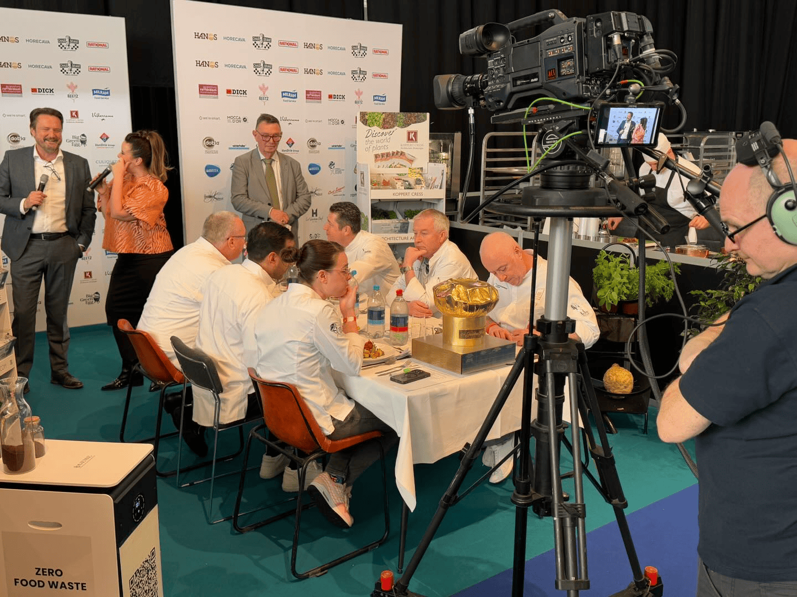
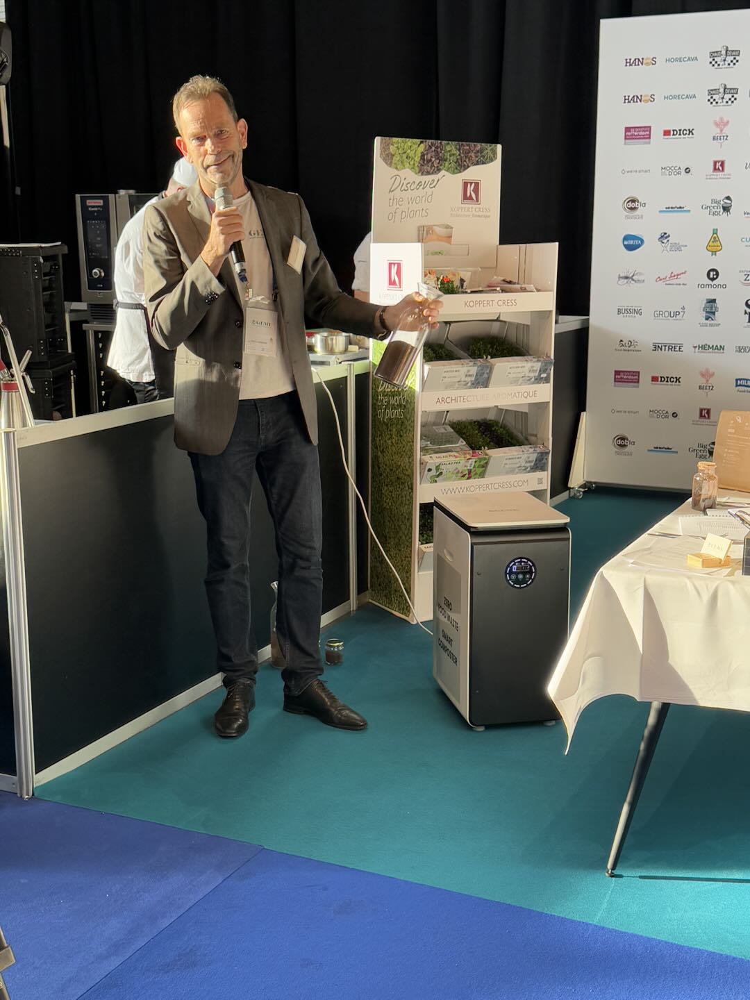
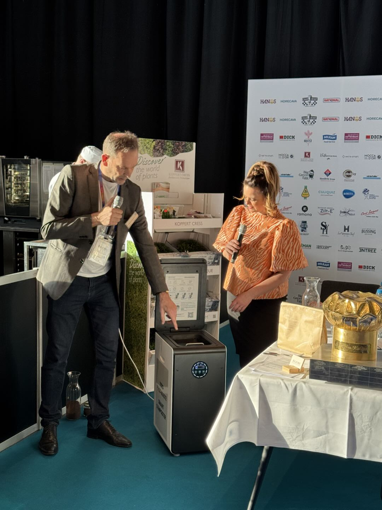
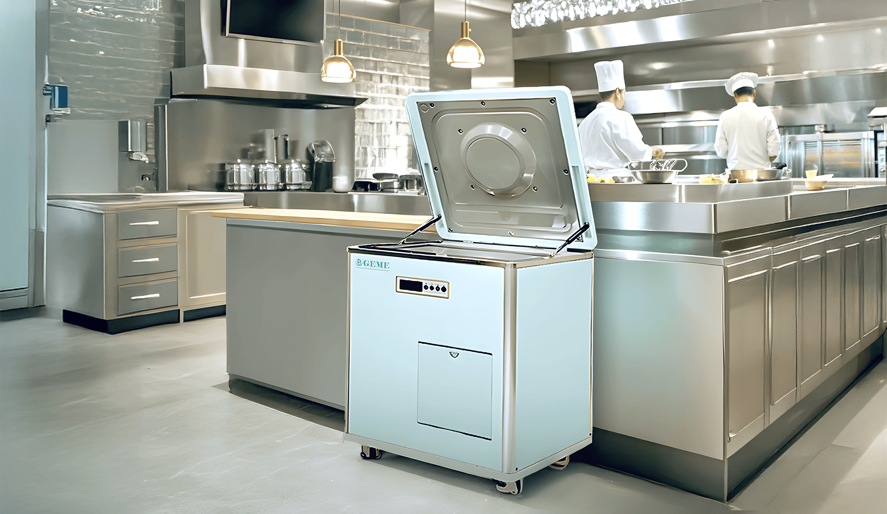

<head>
    <meta charSet="utf-8" />
    <meta name="twitter:card" content="summary_large_image" />
    <meta data-rh="true" property="og:image" content="https://www.geme.bio/assets/images/1-e9a4d07b7def7cd5b62ebd2a06b68f36.png" />
    <meta data-rh="true" name="twitter:image" content="https://www.geme.bio/assets/images/1-e9a4d07b7def7cd5b62ebd2a06b68f36.png"/>
    <meta data-rh="true" property="og:url" content="https://www.geme.bio/assets/images/1-e9a4d07b7def7cd5b62ebd2a06b68f36.png"/>
    <meta data-rh="true" property="og:locale" content="en"/>
</head>

import Columns from '@site/src/components/Columns'
import Column from '@site/src/components/Column'
import ReactPlayer from 'react-player'

The increasing focus on food waste disposal policies presents a significant challenge to the restaurant industry.

On one hand, the ongoing costs associated with waste disposal represent a steady and unavoidable operational expense. Furthermore, the storage of food waste is a pressing issue. Especially during the summer months, rising temperatures can cause rapid decomposition, unpleasant odors, and the proliferation of bacteria.

<!-- truncate -->

On the other hand, health has become an undeniable trend, deeply ingrained in consumer mindsets. Customers are increasingly concerned about how various aspects of their lives align with health and sustainability, a shift particularly evident in the dining sector.

## Achieving an Organic Cycle from Table Scraps to Nourishing the Earth

For restaurants, the advent of the [GEME composter](https://www.geme.bio/product/geme) offers a highly efficient solution to the troublesome problem of food waste disposal. Utilizing the principle of aerobic fermentation by microorganisms, combined with a machine-provided optimal environment, GEME simulates the natural composting process, reducing food waste volume by 95% within 6-8 hours. The processed food waste undergoes further maturation within the machine, ultimately transforming into organic compost, truly achieving an organic cycle from table scraps back to nourishing the earth, perfectly echoing the current emphasis on sustainability.

## Perfect Solution to Odor Issues

Moreover, GEME provides a perfect solution to the odor problems associated with food waste. Equipped with an industrial-grade deodorization system, the machine operates without emitting any unpleasant smells, even within a kitchen environment. This means restaurants no longer need to worry about potential odor issues from indoor composting, creating a more comfortable working environment for staff.

<Columns>
  <Column className='text--left'>
    
    **GEME's Specialist Viktor Speak**
  </Column>

  <Column className='text--center text--left'>
    
    **GEME Composter How to Use**
  </Column>
</Columns>

## Significantly Reduces the Effort Required for Food Waste Management

Taking the commercial [RS-BIO-10 model](https://www.geme.bio/industrial-equipments/rs-bio-10) as an example, it allows for easy and continuous disposal of food waste, eliminating the need for restaurant staff to handle it with the same level of care and effort as traditional methods. Thanks to its continuous operation capabilities, the machine can efficiently process 10kg of food waste per day, removing the cumbersome step of emptying the compost after each use. The microorganisms within the machine act as tireless workers, continuously breaking down waste and maintaining their activity, ready to process newly added food scraps. Restaurants simply need to empty the accumulated compost when the machine is full, making food waste management easier than ever. This intelligent and convenient operation reduces staff training costs, enabling new employees to quickly become proficient.

## Sustainable Organic Cycle Brings More Possibilities to Restaurants

From the customer's perspective, dining habits have undergone a significant shift. Diners are no longer solely focused on delicious food; healthy and traceable food supply chains are increasingly preferred. GEME provides an excellent [sustainable organic cycle solution](https://www.geme.bio/geme-recycle) for restaurants with their own vegetable and fruit gardens.

For example, [GEME](https://www.geme.bio) has successfully launched a pilot project with [De Kas Restaurant](https://restaurantdekas.com/)(first Michelin green start restaurant).Considering Michelin's recognition of restaurants committed to sustainable practices with star ratings, GEME believes this represents the future of the restaurant industry.

Furthermore, sustainability labels attract more environmentally conscious partners to restaurants, such as collaborating with food suppliers to provide organic fertilizers in exchange for ingredient discounts. The sustainable organic cycle offers increased potential from both the customer and restaurant operational perspectives.
