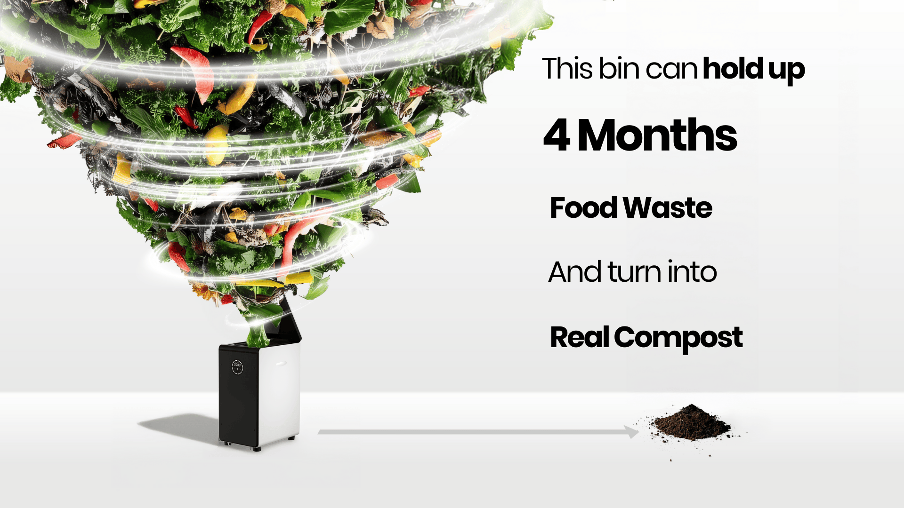
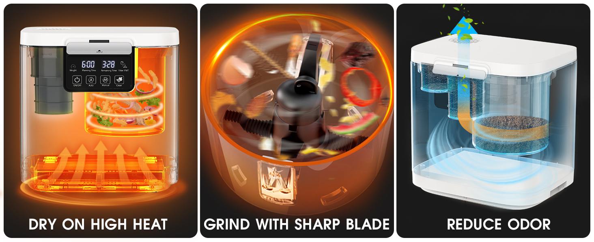
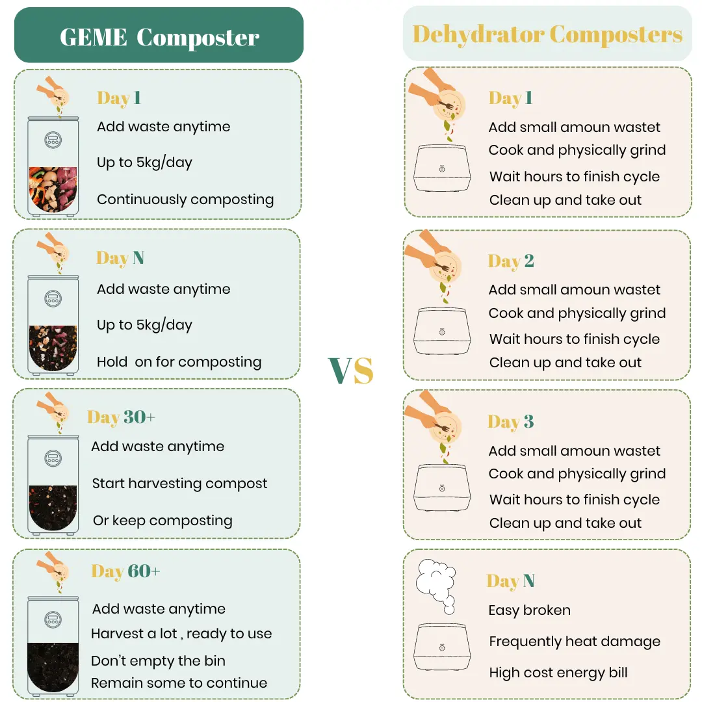
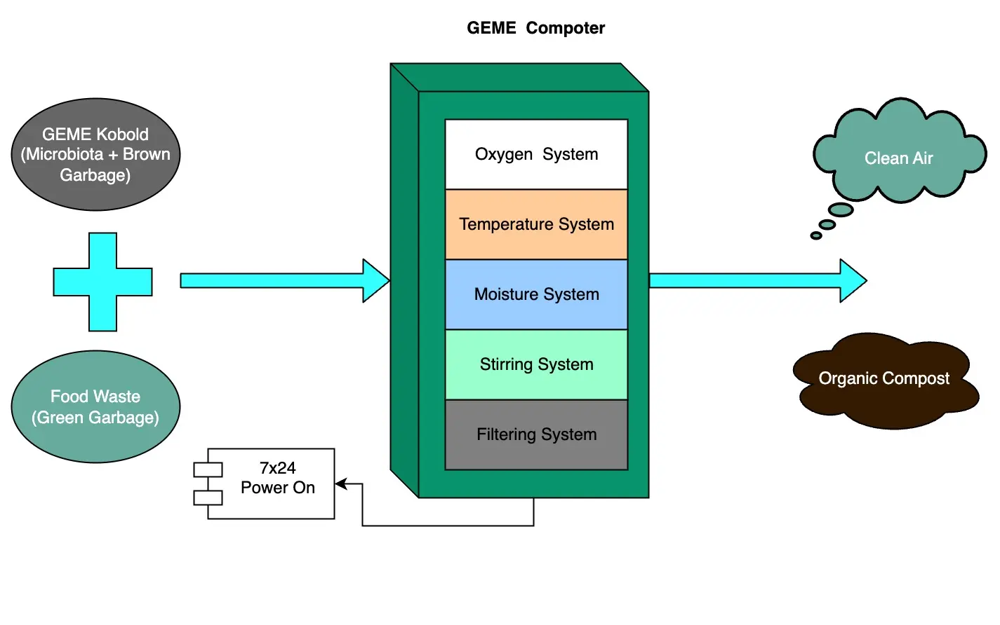
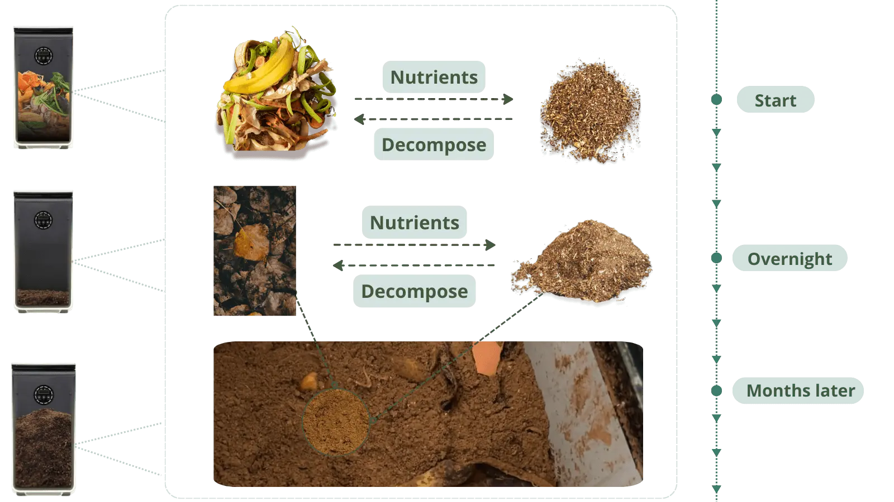
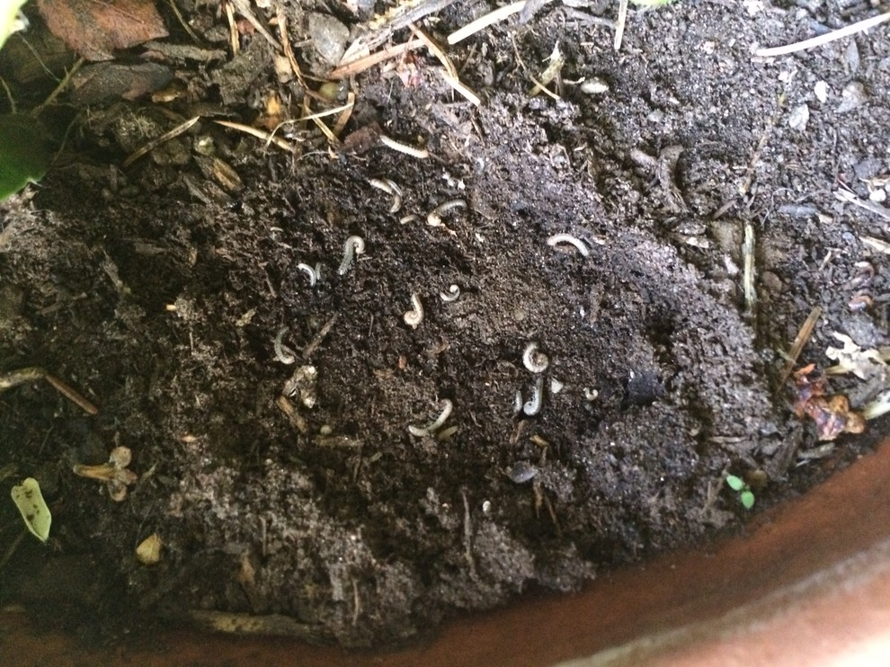

import Columns from '@site/src/components/Columns'
import Column from '@site/src/components/Column'
import ReactPlayer from 'react-player'

<head>
    <meta charSet="utf-8" />
    <meta name="twitter:card" content="summary_large_image" />
    <meta data-rh="true" property="og:image" content="https://www.geme.bio/assets/images/4-months-8f716f44542752a0018da292356bf740.png" />
    <meta data-rh="true" name="twitter:image" content="https://www.geme.bio/assets/images/4-months-8f716f44542752a0018da292356bf740.png"/>
    <meta data-rh="true" property="og:url" content="https://www.geme.bio/assets/images/4-months-8f716f44542752a0018da292356bf740.png"/>
    <meta data-rh="true" property="og:locale" content="en"/>
</head>

Electric composters are innovative kitchen appliances designed to solve the growing problem of food waste management. These smart devices efficiently transform kitchen scraps, including vegetable peels, fruit cores, coffee grounds, and even some meat scraps, into nutrient-rich compost within hours instead of months. By combining advanced technology with natural decomposition principles, electric composters like GEME offer an eco-friendly solution for urban households and restaurants lacking outdoor composting space, while reducing landfill waste and greenhouse gas emissions from traditional waste disposal methods.

<!-- truncate -->

## Understanding Different Types of Electric Composters

When exploring the electric composter market, it's crucial to distinguish between two fundamentally different technologies that are often incorrectly grouped together:

### Type 1: High-Temperature Dehydrators (e.g., Lomi, Mill)

These devices primarily use heat to dry and shrink food waste, creating a dehydrated product that resembles compost in appearance only. While marketed as "composters," these machines don't facilitate genuine microbial decomposition. They essentially produce dried, shredded food waste that hasn't undergone true biological transformation. The output still needs significant time in soil to break down completely.

### Type 2: Authentic Microbial Composters (e.g., GEME, Reencle)

These advanced systems combine controlled temperature with active microbial cultures to achieve genuine biological decomposition. Unlike dehydrators, true composters create an optimal environment for beneficial microorganisms to break down organic matter into stable humus. The resulting product contains living microbes and is immediately beneficial to soil health.

### Dehydrators vs. True Composters

The distinction is significant - while both reduce waste volume, only authentic composters like GEME produce nutrient-rich, biologically active compost that plants can immediately utilize. Unfortunately, marketing terminology often blurs these technological differences, leading consumers to believe all electric "composters" function similarly when their underlying processes and outputs differ dramatically.

For a detailed comparison of GEME with other popular composters like Lomi, check out our [GEME vs. Lomi composter guide](https://www.geme.bio/blog/lomi-vs-geme-composter).

## The Science Behind True Electric Composting

Electric composters accelerate nature's decomposition process through three key mechanisms:

1. **Smart Temperature Control**  
   Maintains ideal 40-70°C range to activate microorganisms while eliminating pathogens

2. **Automated Oxygen Optimization**  
   Built-in fans adjust airflow to balance aerobic/anaerobic decomposition phases

3. **Bio-enzyme Enhanced Breakdown**  
   GEME models use proprietary microbial communities to digest diverse waste types

4. **Simulate compost pile in a container**  
    A real electric composter creates a controlled environment that mimics natural composting conditions.
   <Columns>
   <Column>
   
   </Column>
   <Column>
   
   </Column>
   </Columns>

Want to understand the exact mechanisms? Learn more about [how a real electric composter works](https://www.geme.bio/blog/how-does-a-real-electric-composter-work) in our detailed technical breakdown.

## Why Electric Composters Outperform Traditional Composting Methods

Traditional composting methods, while environmentally friendly, come with significant challenges that electric composters effectively solve:

| Pain Point         | Traditional Composting          | Electric Composters (GEME)                 |
| ------------------ | ------------------------------- | ------------------------------------------ |
| Processing Time    | 3-6 months                      | Hours to weeks                             |
| Space Requirements | Large outdoor area needed       | Compact kitchen countertop solution        |
| Odor Issues        | Persistent smells attract pests | Sealed system with odor neutralization     |
| Weather Dependency | Slows in cold/wet conditions    | Climate-controlled, year-round operation   |
| Maintenance        | Regular turning and monitoring  | Automated process with minimal oversight   |
| Waste Versatility  | Limited to plant matter         | Processes meat, dairy and difficult scraps |

Electric composting technology addresses these traditional composting pain points while delivering superior results. The system transforms what was once a labor-intensive, space-demanding process into an efficient, convenient solution for modern households. By eliminating the barriers to composting, Electric composter makes sustainable waste management accessible to everyone, regardless of living situation or gardening experience.

For an in-depth comparison, see our article on [traditional composting vs. GEME composter](https://www.geme.bio/blog/traditional-composting-vs-geme-composter).

## 5 Key Benefits of Electric Composter Technology

1. **Complete Waste Digestion**
   Processes all food waste including meat, bones, and dairy. Uses high temperatures (up to 70°C) and enzymes to break down materials traditional composters can't handle, reducing landfill waste while producing nutrient-rich fertilizer.

2. **Silent Operation**

   Runs at < 45dB - quieter than a refrigerator. This whisper-quiet technology ensures the composter won't disturb your home environment, even when operating overnight. Unlike traditional composting methods that might require noisy turning mechanisms or outdoor equipment, electric composters work silently in the background of your daily life, making sustainable waste management truly unobtrusive.

3. **Work in any weather**

   Electric composters maintain optimal temperatures year-round, unlike traditional methods that slow in cold or rain. Their automatic sterilization prevents mold and ensures consistent operation regardless of external conditions, making them suitable for all climates and living situations.

4. **Convenient**

   Maintenance-free design allows you to simply use it like a regular trash bin. No complex setup or daily monitoring required - just add food waste and let the machine do the work. The intuitive interface makes operation simple for all household members, and the compact design fits seamlessly into modern kitchens without requiring additional space planning.

5. **No odor, bugs and gnats**  
   Advanced filtration system and sealed design prevent unpleasant smells and keep pests away, making it ideal for indoor use without attracting insects commonly associated with traditional composting

Discover [5 reasons why GEME composter is your solution for transforming food waste](https://www.geme.bio/blog/transforming-food-waste-5-reasons-why-geme-composter-is-your-solution) in our comprehensive guide.

## The Future of Home Composting

With 87% faster decomposition than traditional methods and 100% odor-free operation, GEME's electric composters represent the next evolution in sustainable living. By converting 5kg of daily waste into ready-to-use fertilizer, households can reduce landfill contributions by 1.3 tons annually while creating valuable nutrients for gardens.

Want to understand what makes GEME different from other kitchen composters? Read our article on [the difference between GEME composter and other electric kitchen composters](https://www.geme.bio/blog/what-is-the-difference-between-geme-composter-and-other-electric-kitchen-composters).

Ready to transform your food waste? [Explore GEME's award-winning composter](https://www.geme.bio) - the only USDA-certified bio-fertilizer producer in home composting systems.
