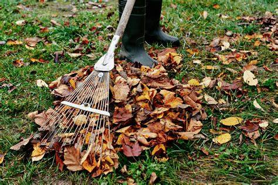

import Columns from '@site/src/components/Columns'
import Column from '@site/src/components/Column'
import ReactPlayer from 'react-player'

<head>
    <meta charSet="utf-8" />
    <meta name="twitter:card" content="summary_large_image" />
    <meta data-rh="true" property="og:image" content="https://www.geme.bio/assets/images/4-months-8f716f44542752a0018da292356bf740.png" />
    <meta data-rh="true" name="twitter:image" content="https://www.geme.bio/assets/images/4-months-8f716f44542752a0018da292356bf740.png"/>
    <meta data-rh="true" property="og:url" content="https://www.geme.bio/assets/images/4-months-8f716f44542752a0018da292356bf740.png"/>
    <meta data-rh="true" property="og:locale" content="en"/>
</head>

Winter may be fading, but your garden is likely buried under layers of debris. Fallen leaves, broken branches, and leftover plant trimmings can make your outdoor space look messy and uninviting. But don't worry. This guide will show you how to efficiently clean up your winter garden and transform your yard into an organic one. Whether you’re a seasoned gardener or a beginner, these three simple steps will help you restore your garden’s beauty and prepare it for spring.

<!-- truncate -->

## Step 1: Choose the Right Tools for the Job

The first step to a clean garden is selecting the right tools. Here’s a breakdown of your options:

### Option 1: Leaf Blower

Leaf blowers are perfect for large yards or areas with heavy leaf coverage. They save time and effort, especially if you have a lot of ground to cover.

**Tips**:

- Use on dry days to prevent clogging.
- Wear ear protection, most models exceed 65 dB.
- Start from the perimeter and work inward to avoid re-cleaning.

### Option 2: Rake

Rakes are ideal for smaller yards or delicate areas like flower beds. They’re also a great eco-friendly option since they don’t require electricity or fuel.

**Tips**:

- Rake in rows for systematic cleanup.
- Use a tarp to collect debris for easy transport.
- Alternate sides to avoid muscle strain.

**Hybrid Approach**:

For the best of both worlds, use a leaf blower for open areas and a rake for tight corners. Pair these tools with a wheelbarrow or yard waste bags to make debris collect a breeze.

## Step 2: Sort and Process Debris Like a Pro

Once you’ve gathered your debris, it’s time to sort and process it. Not all debris is created equal, so here’s how to handle it like a pro:

### 1. Recyclables (Branches, Twigs, etc.)

- What to Do:
  - Cut branches into 4-foot lengths (check local regulations).
  - Bundle with biodegradable twine for pickup.
- **Pro Tip**: Rent a wood chipper for large volumes—turn branches into mulch for garden beds.

### 2. Landfill (Plastics, Non-Organics, etc.)

- What to Do:
  - Separate non-recyclable materials (e.g., plastic plant tags, synthetic netting).
  - Dispose of in designated trash bins to avoid contaminating compost.
- Pro Tip: Replace plastic garden ties with biodegradable options like jute twine.

### 3. Special Cases (Pine Needles, Diseased Plants, etc.)

- Pine Needles: Use as mulch for acid-loving plants (e.g., blueberries).
- Diseased Plants: Bag and dispose of separately to prevent spreading pathogens.

## Step 3: Turn Kitchen Scraps into Organic Gold for Your Spring Garden

Now that your garden is clean and ready for spring, it’s time to think about how to nourish your plants naturally. With GEME, you can transform everyday kitchen scraps into nutrient-rich organic compost, ensuring your garden thrives and produces healthy, organic fruits and vegetables. Here’s how to make the most of your [GEME composter](https://www.geme.bio)"

### Why Organic Compost Matters

Organic compost isn’t just good for your plants—it’s good for you. Unlike synthetic composts, organic compost:

- **Improves Soil Health**: Enhances soil structure and water retention.
- **Boosts Nutrient Content**: Provides essential nutrients like nitrogen, phosphorus, and potassium.
- **Promotes Biodiversity**: Encourages beneficial microbes and earthworms.
- **Supports Organic Gardening**: Helps you grow chemical-free, nutrient-dense produce.

### How GEME Makes Composting Effortless

GEME is designed to fit seamlessly into your daily routine, making composting as easy as throwing away trash. Here’s [how it works](https://www.geme.bio/how-it-works):

#### 1. Daily Use: Turn Scraps into Compost

- **What to Add**: Fruit peels, vegetable scraps, coffee grounds, eggshells, and more.
- **Pro Tip**: Chop larger scraps into smaller pieces for faster decomposition.

#### 2. Ready for Spring

There are 3 options:

- (1)Blend with Soil

  Mix by-products with soil in a 1:8 ratio and use it. Cover with 2-3 cm of soil, water enough.
  Notice the compost effect in about 2 weeks (summer) or 1 month (winter).

- (2)Direct Application

  Use by-products directly, keep 15cm away from the roots.

- (3)Save it for later

  Store organic compost in a cool place for 2 weeks, then spread it in your garden or on the grass.

### The Benefits of Growing Your Own Organic Food

Using GEME’s compost to grow your own fruits and vegetables isn’t just rewarding—it’s a game-changer for your health and the environment. Here’s why:

- **Healthier Produce**: Organic fruits and vegetables are free from synthetic pesticides and composts.
- **Cost Savings**: Reduce grocery bills by growing your own food.
- **Environmental Impact**: Lower your carbon footprint by reducing food waste and avoiding chemical composts.

With [GEME](https://www.geme.bio), composting is no longer a chore—it’s a simple, rewarding way to nourish your garden and grow your own organic food. Ready to turn your kitchen scraps into springtime abundance? Explore GEME today and start your journey toward a healthier, more sustainable lifestyle.

    <ReactPlayer 
        className="video__player" 
        controls height="100%" 
        url="https://youtu.be/gUIKCwJeiPo" width="100%" 
    />

