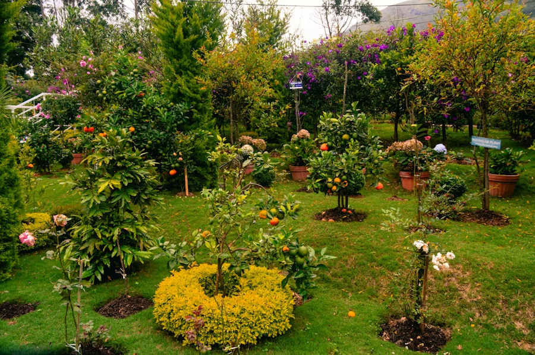
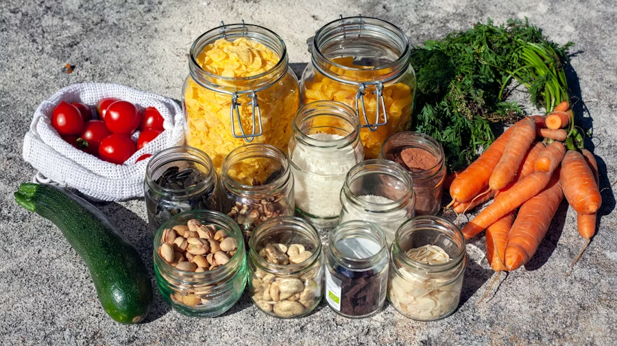
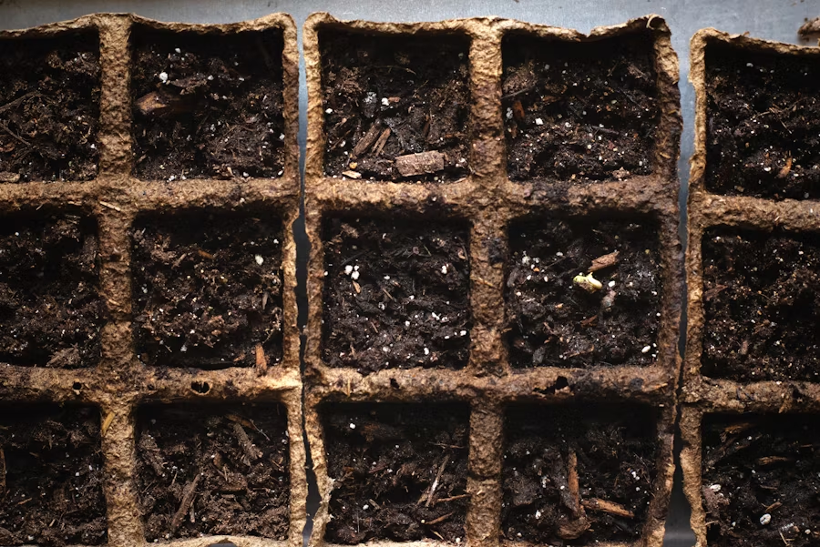
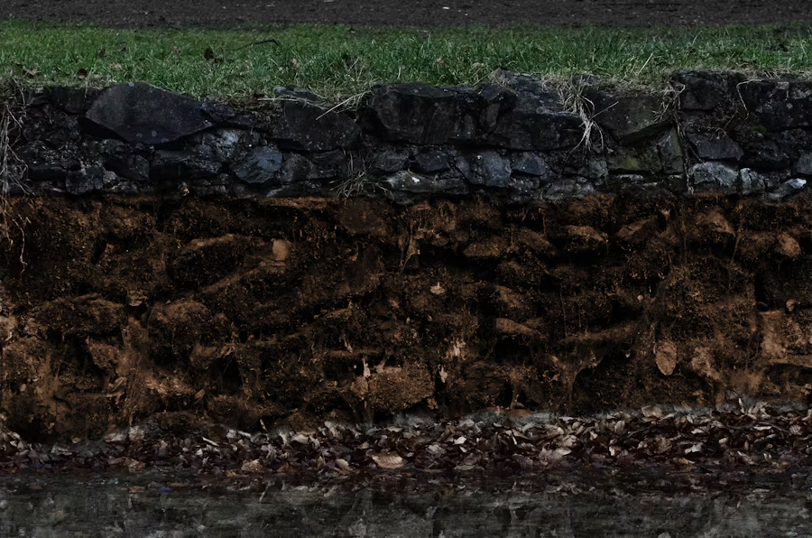
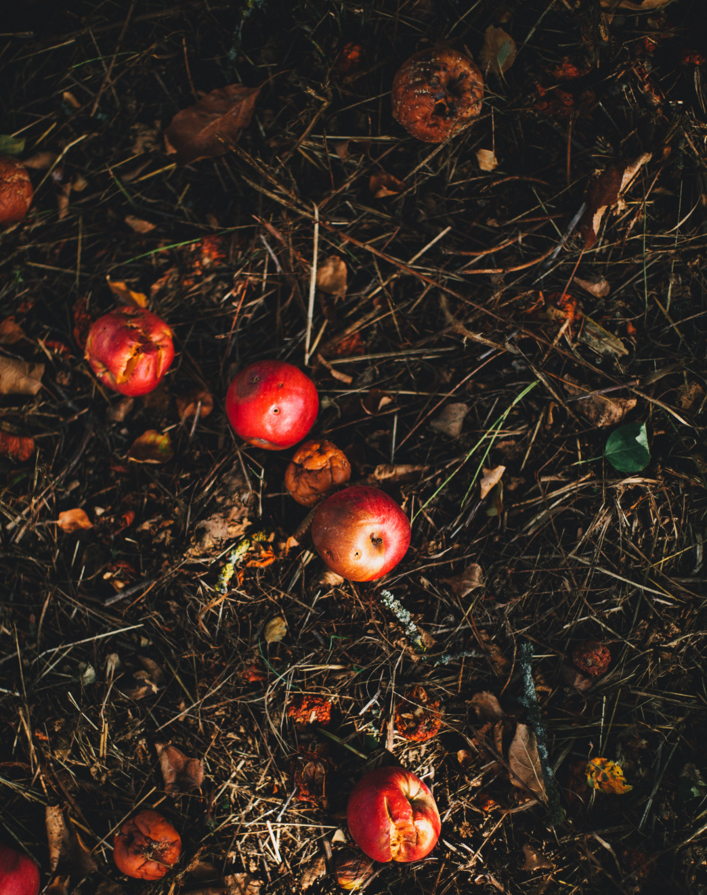

import Columns from '@site/src/components/Columns'
import Column from '@site/src/components/Column'
import ReactPlayer from 'react-player'

<!-- GEME-TODO: [Collaboration Suggestion: Cover image recommendation - captivating photo of lush plants/garden, subtly featuring the GEME logo.] -->

## Introduction: Unlock the Secret to a Thriving Garden

Imagine stepping into your home filled with vibrant, lush greenery, or harvesting crisp vegetables straight from a thriving garden patch. The secret to this kind of natural abundance often lies hidden right beneath the surface – in the richness of the soil. And the key to rich soil? Often, it's "Black Gold".

<!-- truncate -->

### The Power of Organic Compost

We're talking about high-quality organic compost. It's more than just 'dirt'; it's nature's ultimate recycler, a powerhouse of nutrients, and the cornerstone of a healthy, vibrant garden. Quality compost breathes life into your soil, improving its structure, helping it retain moisture, providing a balanced diet for your plants, and fostering a thriving ecosystem of beneficial microbes.

But let's be honest, achieving that perfect compost isn't always easy. Traditional composting methods can be slow, require significant space and effort, and sometimes come with unwelcome odors or pests. Buying bagged compost can be costly, and the quality can vary greatly.

### Transform Your Garden with Smart Composting

This guide is here to change that. We'll cut through the confusion and provide you with simple, proven techniques to effectively use nutrient-rich compost – the kind of 'black gold' that can transform your plants and garden beds. Whether you're:

- Nurturing delicate houseplants
- Cultivating an abundant vegetable patch
- Dreaming of a greener lawn

You'll learn how to harness the power of compost for visible, beautiful results.

Having consistent access to high-quality compost makes all the difference. This guide focuses on maximizing the benefits of such compost, whether you create it through patient traditional methods or leverage modern innovations, like the [GEME composter](https://www.geme.bio/products/geme), which deliver this nutrient-rich goodness effortlessly right from your kitchen scraps.

Ready to unlock the full potential of your compost and watch your plants flourish like never before? Let's dive in!

## Chapter 1: Understanding Your "Black Gold" – The Magic Within

So, you have this dark, crumbly material – what exactly makes high-quality compost, like the kind produced by GEME, so special for your plants? It's far more than just decomposed leftovers; it's a living amendment packed with goodness.

### It's Alive! The Power of Microbes

Unlike sterile dirt, great compost is teeming with billions of beneficial microorganisms – bacteria, fungi, and other tiny helpers. This vibrant microbial life is crucial:

- It continues to break down organic matter in the soil, slowly releasing nutrients plants can absorb.
- It helps suppress soil-borne diseases.
- It partners with plant roots to improve nutrient uptake.

(This living quality is a key benefit of true composting processes, like GEME's microbial degradation, ensuring you're adding life back to your soil.)

<!-- GEME-TODO: [Collaboration Suggestion: Image recommendation here - Close-up photo of the rich, dark, crumbly texture of finished GEME compost.] -->

### Why Your Plants Will Love It: Key Benefits

#### 1. Nutrient Powerhouse (Slow & Steady)

Compost provides a broad spectrum of essential nutrients that plants need:

- **Macronutrients:** Nitrogen (N), Phosphorus (P), Potassium (K)
- **Secondary Nutrients:** Calcium (Ca), Magnesium (Mg)
- **Micronutrients:** Various trace elements

These nutrients are released slowly and gently as microbes break down the organic matter, feeding your plants consistently over time without the risk of root burn that can occur with harsh chemical fertilizers.

#### 2. Soil Structure Superhero

Compost works wonders on almost any soil type:

##### Improving Clay Soil

It helps loosen dense particles, improving drainage and aeration so roots can breathe and penetrate easily.

##### Enhancing Sandy Soil

It adds organic matter that acts like a sponge, significantly improving water and nutrient retention, reducing runoff and waste.

#### 3. pH Buffer

Compost helps buffer soil pH, moderating extreme acidity or alkalinity. This creates a more stable environment where plants can access the widest range of available nutrients.

### What to Expect from Your GEME Compost

The beauty of using an efficient composter like GEME is the consistency and quality of the end product. You can typically expect:

- **Texture:** A relatively fine, crumbly texture, dark in color.
- **Smell:** A pleasant, earthy aroma – a sign of healthy decomposition.
- **Moisture:** Generally moist but not soaking wet – like a wrung-out sponge.
- **Readiness:** Stable, mature, and safe to use without lengthy curing.

<!-- GEME-TODO: [Collaboration Suggestion: Image recommendation here - Simple diagram illustrating how compost improves drainage in clay soil and water retention in sandy soil.] -->

<Columns>
  <Column>
    
  </Column>
  <Column>
    
  </Column>
</Columns>

## Ready to Start Your Composting Journey?

Now that you appreciate the power packed into this 'black gold', you're ready to put it to work in your garden. In our next guide, we'll explore practical applications and techniques for using your compost effectively.

### Related Articles

- [How Does a Real Electric Composter Work?](/blog/how-does-a-real-electric-composter-work)
- [3 Principles for Successful Composting](/blog/3-principles-for-successful-composting)
- [Complete Composting Material List](/blog/complete-composting-material-list)

---

_Want to learn more about sustainable gardening and composting? Subscribe to our [newsletter](http://geme.bio/signup) for weekly tips and updates._
