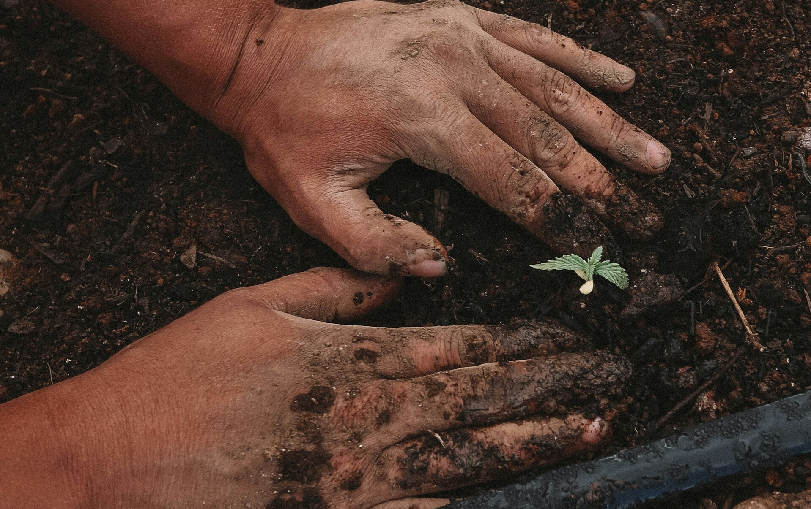
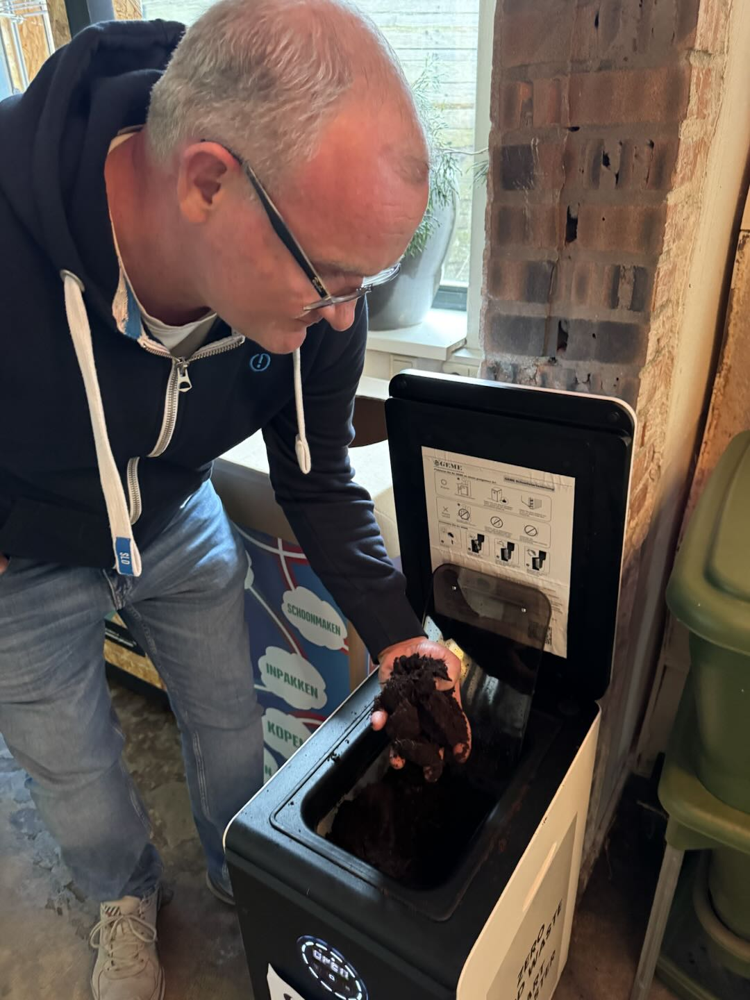
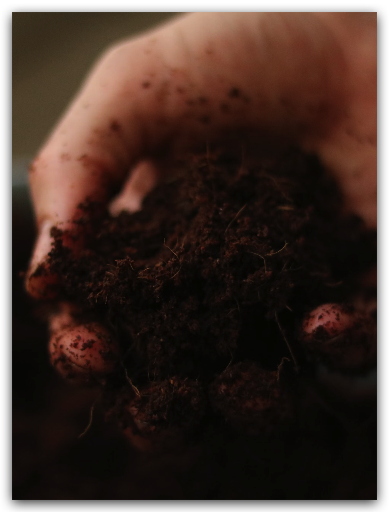
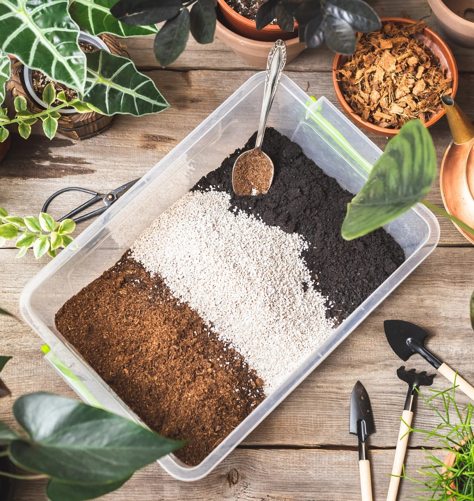
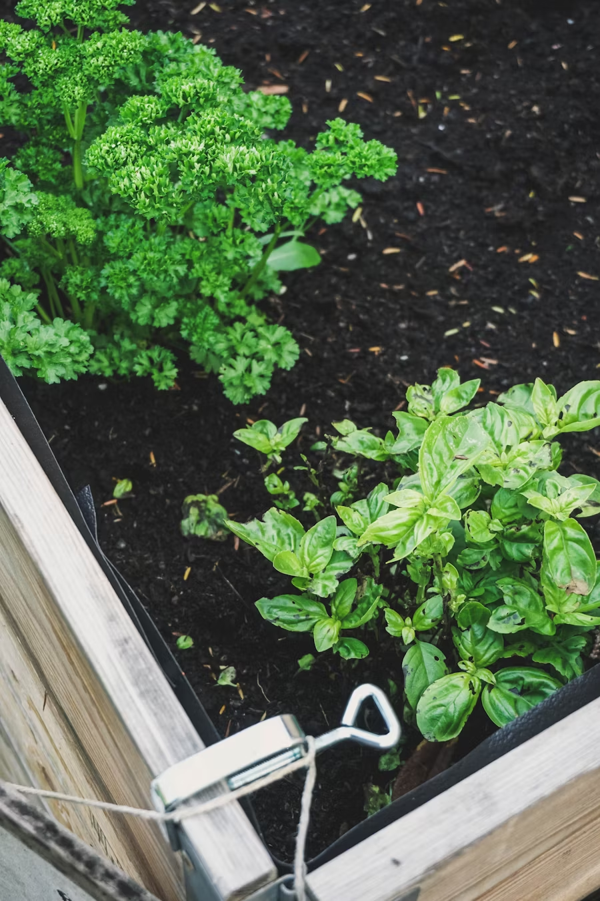
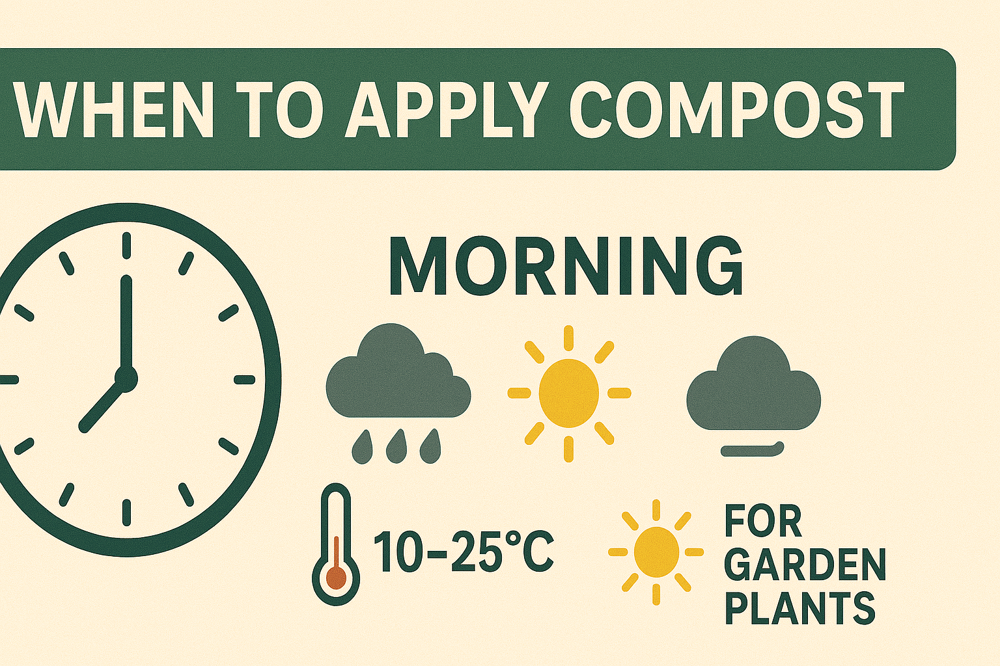

import Columns from '@site/src/components/Columns'
import Column from '@site/src/components/Column'
import ReactPlayer from 'react-player'

<!-- 配图提示-1：封面图要求

- 主题：展示一个人正在准备或使用堆肥的情景
- 构图：手部特写，显示堆肥质地，同时展示一些植物
- 色调：明亮、自然，突出堆肥的深褐色
- 分辨率：建议至少 1200x630px
  替换位置：

1.  上方 front matter 中的 image 路径
2.  下方的封面图片路径
-->

## The Art of Preparing Your Compost

When you first receive your compost from your GEME composter, you're holding a concentrated source of plant nutrition and soil life. But like any powerful tool, knowing how to prepare and apply it makes all the difference in achieving the best results.

<!-- truncate -->

<!-- 配图提示-2：新鲜的 GEME 堆肥特写照片

- 展示：刚从机器中取出的新鲜堆肥
- 重点：突出湿润但不潮湿的质地
- 建议：可以用手捏一把展示质地
-->

<Columns>
    <Column>
        
    </Column>
    <Column>
       
    </Column>
</Columns>

### Quick Preparation Guide

Before using your GEME compost, here's a simple checklist to ensure it's ready for your plants:

1. **Temperature Check**

   - Allow fresh compost to cool to room temperature
   - Typically takes 1-2 hours after the cycle completes
   - Spread it out to speed up cooling if needed

2. **Moisture Assessment**
   - Squeeze a handful - it should feel like a wrung-out sponge
   - Should hold shape when squeezed but not drip water
   - If too wet: spread out briefly to air dry
   - If too dry: mist lightly with water

<!-- 配图提示-3：水分含量对比图

- 需要：制作一个并排对比图
- 左边：展示正确的水分含量（捏成团但不滴水）
- 右边：展示错误的状态（太湿或太干）
- 建议：使用实际的 GEME 堆肥拍摄
-->

<Columns>

    <Column>
        

            <ReactPlayer
                className="video__player"
                controls height="100%"
                url="https://youtu.be/UUuD11na4Bs" width="100%"
            />
        

        **Too Dry**
    </Column>

    <Column>
         

            <ReactPlayer
                className="video__player"
                controls height="100%"
                url="https://youtu.be/_7R85w71OcU" width="100%"
            />
        

        **Perfect Status**
    </Column>

</Columns>

## Three Essential Ways to Use Your Compost

### 1. Creating the Perfect Potting Mix

The key to healthy container plants lies in the right soil mix. Here's how to create the perfect growing medium using your GEME compost:

#### Basic Potting Mix Recipe

<Columns>
<Column>

**For Most Plants:**

- 70-75% Base potting soil
- 20-25% GEME compost
- 5-10% Perlite or pumice (optional)

</Column>
<Column>

**For Heavy Feeders:**

- 60% Base potting soil
- 30-35% GEME compost
- 5-10% Perlite or pumice

</Column>
</Columns>

<!-- 配图提示-4：

- 需要：制作配料比例示意图
- 要求：

- 使用饼状图或层叠柱状图展示不同配比
- 颜色区分：深色表示堆肥，浅色表示基质土
- 建议：添加实物照片展示混合过程
-->

#### Mixing Tips:

1. Start with slightly moist materials
2. Mix thoroughly but gently
3. Let the mixture rest for 24 hours before use
4. Store unused portion in a covered container

### 2. Top Dressing for Established Plants

Top dressing is a gentle way to feed your plants without disturbing their roots. It's perfect for:

- Indoor plants
- Perennial garden beds
- Container gardens
- Small trees and shrubs

<!-- 配图提示-5：

- 需要：展示追肥操作步骤
- 要求：

- 拍摄一组连续动作照片
- 展示： 1. 清理表土 2. 撒施堆肥 3. 轻轻混入表层 4. 浇水
-->

<Columns>
    <Column>
        
    </Column>
    <Column>
        
    </Column>
</Columns>

#### Application Guide:

1. **For Houseplants:**

   - Apply a 1/2 inch (1.3 cm) layer around the plant
   - Keep compost away from stems
   - Gently work into the top layer of soil
   - Water thoroughly

2. **For Garden Beds:**
   - Apply 1-2 inch (2.5-5 cm) layer between plants
   - Avoid piling against plant stems or trunks
   - Water well after application
   - Repeat every 2-3 months during growing season

<!-- 配图提示-6：

- 需要：制作一个示意图
- 要求：

- 横截面图展示正确的堆肥层厚度
- 标注不同植物类型的适用厚度
- 突出展示"远离植物茎干"的要求
-->

<Columns>
    <Column>
        
    </Column>
    <Column>
        
    </Column>
</Columns>

### Pro Tips for Best Results

1. **Timing Matters**

   - Apply in early morning or late afternoon
   - Avoid application during peak sun hours
   - Best done before expected rain or planned watering

2. **Moisture Management**

   - Always water thoroughly after application
   - Maintain consistent moisture for best nutrient release
   - Monitor soil moisture more frequently after application

3. **Observation is Key**
   - Watch for signs of nutrient release (new growth, deeper green color)
   - Monitor plant response
   - Adjust application rates based on plant performance

<!-- 配图提示-7：

- 需要：制作一个信息图
- 要求：

- 展示最佳施用时间
- 使用图标表示天气条件
- 添加简单的温度和光照提示
-->

## Common Questions

**Q: Can I use fresh GEME compost immediately?**
A: Yes! Unlike traditional compost, GEME compost is ready to use after cooling to room temperature. The microbial process is complete, making it safe for immediate application.

**Q: How often should I apply compost?**
A: For most plants:

- Potted plants: Every 2-3 months during growing season
- Garden beds: 2-3 times per year
- Heavy feeders: Monthly during peak growth

**Q: Can I use too much compost?**
A: While GEME compost is gentle, it's best to follow recommended ratios. Over-application won't harm plants but may be wasteful.

## Related Articles

- [How to Use Compost](/blog/how-to-use-compost)
- [4 Different Types of Compost and Which One Should I Use](/blog/4-differnt-types-of-compost-and-which-one-should-i-use)
- [Prerequisites for Successful Composting](/blog/prerequisites-for-successful-composting)

---

_Ready to transform your gardening game? Subscribe to our [newsletter](http://geme.bio/signup) for expert composting tips and sustainable gardening advice._
