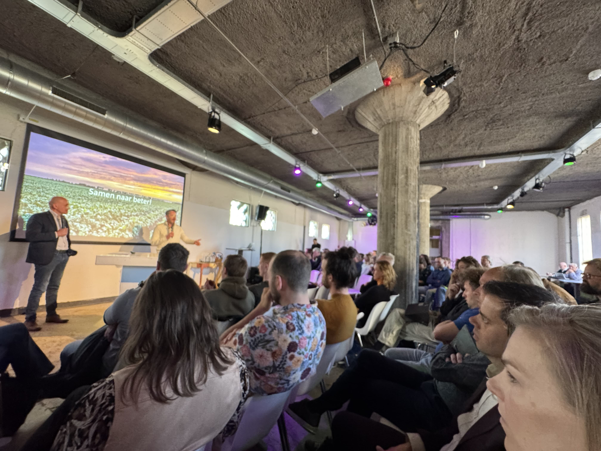
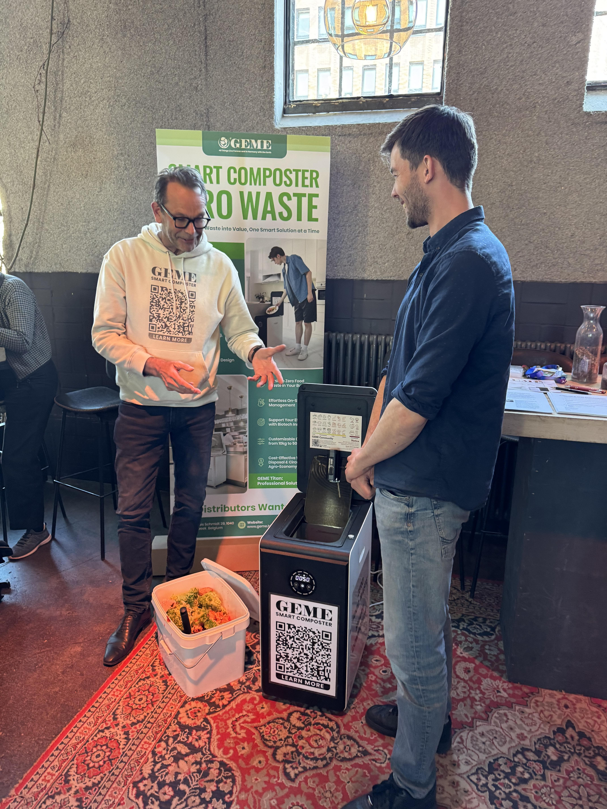
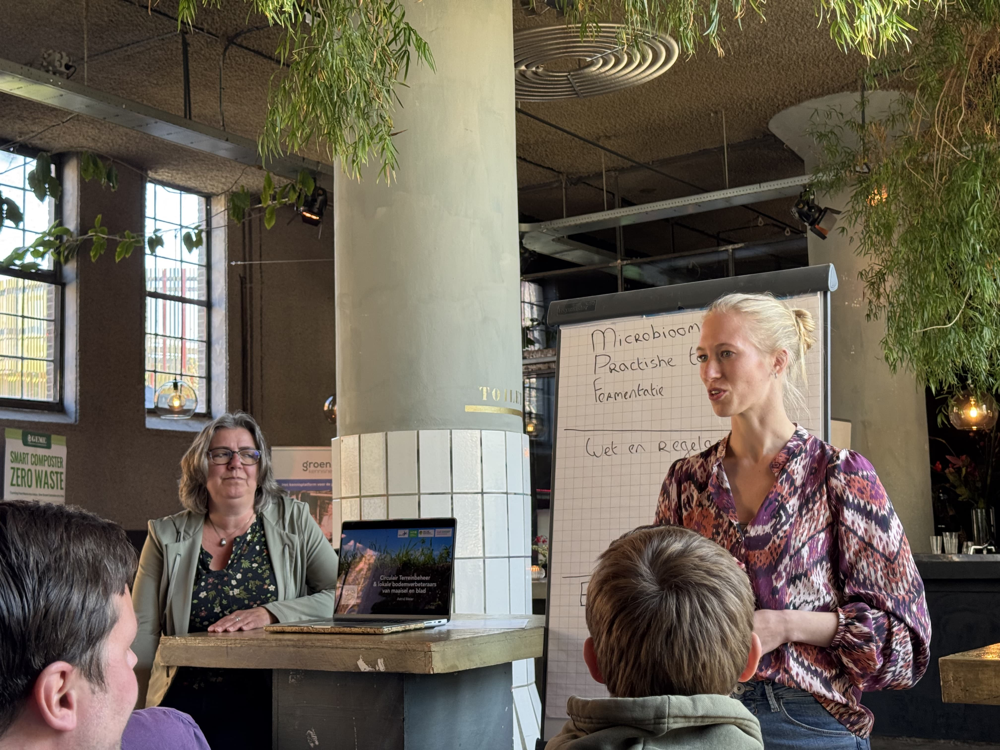
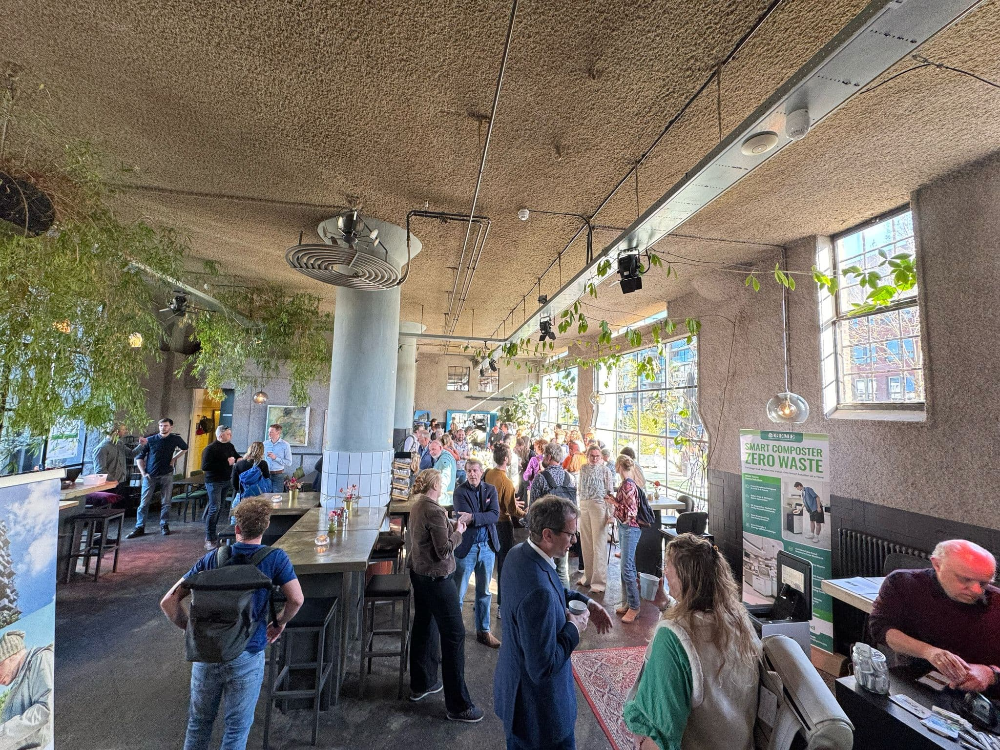

import Columns from '@site/src/components/Columns'
import Column from '@site/src/components/Column'

GEME recently participated in the "Soil, Water and Climate in Balance" symposium, organized by CoE Groen – the Centre of Expertise for the green domain in the Netherlands. The event brought together experts from research, education, policy-making, and entrepreneurship to discuss the complex challenges facing agriculture, water systems, and climate change, emphasizing solutions through knowledge-sharing, practice-based innovation, and collaborative action.

<!-- truncate -->

CoE Groen is a unique collaboration of four Dutch universities of applied sciences, forming a leading research and education coalition for the green sector. Their focus areas include sustainable food systems, biodiversity, climate adaptation, circular agriculture, and ecosystem restoration. What makes CoE Groen special is its strong connection between research, education, and practice, supporting projects that not only generate academic knowledge but also provide direct, practical impact for farmers, local governments, entrepreneurs, and communities.

<Columns>
    <Column>
        GEME, a company focused on transforming food waste into nutrient-rich compost using smart biotech, was invited to participate in the symposium. GEME's mission is to help businesses, households, and institutions reduce waste and rebuild soil health. By joining the event, GEME aimed to contribute its perspective on the crucial link between organic waste management and soil regeneration, especially given the increasing urgency around food system transformation and climate resilience.
    </Column>
    <Column>
       
    </Column>
</Columns>

During the symposium, GEME engaged in insightful discussions with various experts, gaining key takeaways:

<Columns>
    <Column>
       
    </Column>
    <Column>
       1. **Compost Is More Than a Byproduct — It's a Soil Solution**:  
        In a compelling exchange with Prof. Emiel Elferink, Applied Research Professor in Healthy Soils at Van Hall Larenstein, the importance of compost quality and the direct relationship between microbial biodiversity, soil structure, and plant vitality were discussed. This reinforced GEME's commitment to ensuring the biological maturity and richness of every compost batch produced. GEME's indoor electric composters utilize a unique microbial agent and machine technology to efficiently transform kitchen waste into organic fertilizer within hours, without odor, providing users with a convenient way to obtain high-quality compost.
    </Column>
</Columns>

2. **The Healthcare Sector Needs Greener Waste Solutions**:  
   An eye-opening conversation with Dr. David Bergemann, a healthcare professional at Brussels HUB Hospital, highlighted the often-overlooked challenges of organic waste in hospital kitchens. It became clear there is a significant opportunity to support the healthcare sector in adopting clean, low-impact solutions like GEME’s composters. GEME's product characteristics, such as its odorless and indoor-friendly operation, make it highly suitable for use in institutions like healthcare facilities to address their food waste challenges.

3. **Innovation Depends on Funding, Education, and Ecosystems**:  
   A valuable conversation with Marie Elisabeth Colin from hub.brussels provided insights into how EU and regional funding mechanisms are evolving to better support startups working on sustainable and deep-tech solutions. These discussions are vital for early-stage innovation companies like GEME, helping to align strategy with emerging opportunities.

The symposium served as a reminder that solving global challenges requires local action, robust science, and strong partnerships. At GEME, the focus extends beyond building machines; it's about building a vision of circularity that begins with everyday habits, local ecosystems, and meaningful collaboration across sectors.

GEME is proud to align with the values of CoE Groen and the broader movement to regenerate our soils and rethink the role of waste – not as a burden, but as a resource for renewal. As GEME continues to grow and scale across Europe, the lessons and insights shared during this inspiring event will remain deeply embedded in the company's mindset. Because in the words shared throughout the day: **“Samen naar beter” — Together, toward better.** 🌍

---

_Explore GEME’s composting innovation or [subscribe to our newsletter](https://www.geme.bio/signup) for more updates from our journey._

🌿 Visit [www.geme.bio](https://www.geme.bio) to learn more.
