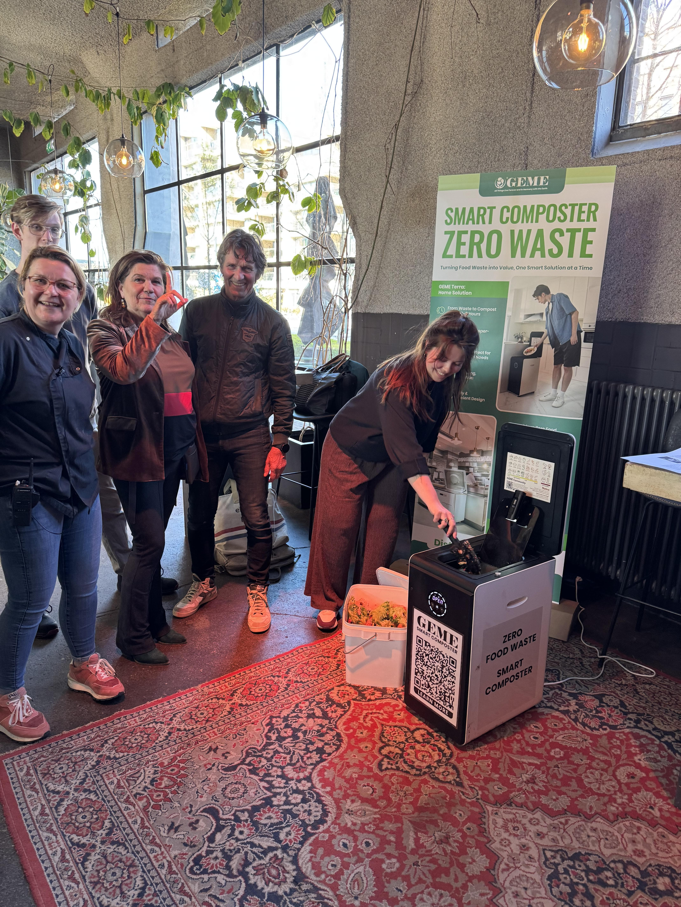

import Columns from '@site/src/components/Columns'
import Column from '@site/src/components/Column'

## Circular Solutions for Regenerative Soils

In April 2025, **GEME** was honored to participate in the [“Soil, Water and Climate in Balance”](https://www.has.nl/meer-has/evenementen/bodem-water-en-klimaat-in-balans) symposium, organized by [CoE Groen](https://coegroen.nl/) — a collaboration of four Dutch universities of applied sciences that focus on climate-resilient agriculture, circular food systems, and ecosystem restoration.

This event united scientists, educators, entrepreneurs, and policymakers to address the challenges of water systems, agriculture, and climate adaptation. For GEME, it was a powerful platform to contribute real-world composting innovations and collaborate on local-to-global sustainability goals.

<!-- truncate -->

<Columns>
  <Column>
    
  </Column>
  <Column>
    
  </Column>
</Columns>

## Key Insights from the Symposium

### 1. Compost Is More Than a Byproduct — It's a Soil Solution

In a conversation with Prof. Emiel Elferink, Applied Research Professor in Healthy Soils at Van Hall Larenstein, we explored the link between microbial biodiversity and compost quality. It reinforced GEME's mission: to produce biologically mature, nutrient-dense compost batches using smart microbial agents—right from the kitchen.

<Columns>
  <Column>
    
  </Column>
  <Column>
    
  </Column>
</Columns>

### 2. The Healthcare Sector Needs Greener Waste Solutions

A dialogue with Dr. David Bergemann from Brussels HUB Hospital shed light on how institutions like hospitals face overlooked food waste challenges. Thanks to GEME’s **odorless**, **compact**, and **indoor-friendly** systems, we’re now exploring tailored solutions for healthcare kitchens.

### 3. Innovation Depends on Funding, Education, and Ecosystems

Marie Elisabeth Colin from hub.brussels emphasized how EU and regional grants are evolving to support startups focused on sustainability. These connections are essential for scaling GEME’s mission and building aligned partnerships in Europe.

## More Than Machines: A Mission of Circularity

At **GEME**, composting isn’t just a product—it’s a mindset. Our work aligns with CoE Groen’s belief that real transformation starts with local habits, everyday actions, and practical innovation. We're proud to turn food waste from a burden into a resource—and to scale this solution with Europe’s greenest minds.

> **"Samen naar beter" — Together, toward better.**

---

_Explore GEME’s composting innovation or [subscribe to our newsletter](https://www.geme.bio/signup) for more updates from our journey._

🌿 Visit [www.geme.bio](https://www.geme.bio) to learn more.
