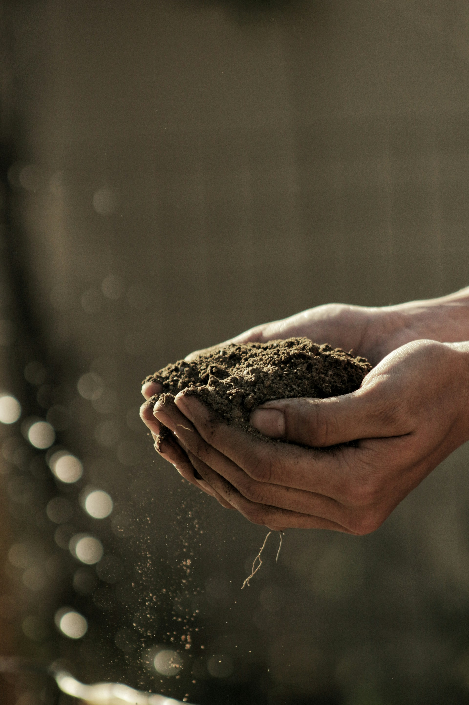

<head >
    <!--meta charSet="utf-8" />
    <meta name="twitter:card" content="summary_large_image" />
    <meta data-rh="true" property="og:image" content="https://www.geme.bio/assets/images/1-e9a4d07b7def7cd5b62ebd2a06b68f36.png" />
    <meta data-rh="true" name="twitter:image" content="https://www.geme.bio/assets/images/1-e9a4d07b7def7cd5b62ebd2a06b68f36.png" />
    <meta data-rh="true" property="og:url" content="https://www.geme.bio/assets/images/1-e9a4d07b7def7cd5b62ebd2a06b68f36.png" />
    <meta data-rh="true" property="og:locale" content="en"/-->
</head> 

Often, gardeners find themselves pondering the age-old question: garden soil vs compost? Choosing the right medium for your plants is crucial for a flourishing garden. While both play vital roles, they possess distinct characteristics, benefits, and drawbacks. 

This comprehensive guide will delve into the intricacies of each, equipping you with the knowledge to make informed decisions for your specific gardening needs. We'll explore their composition, advantages, disadvantages, ideal applications, and how to use them effectively to cultivate a thriving and vibrant garden.

 

<!-- truncate -->

## What is Garden Soil?

Garden soil, at its most basic, is the native soil found in your garden. However, when we talk about "garden soil" in the context of buying it, we usually refer to a soil mix specifically formulated for planting.

 

### Composition of Garden Soil

The composition of garden soil is a complex interplay of mineral particles, organic matter, water, and air. The mineral component typically consists of sand, silt, and clay in varying proportions.

- **Sand**: Provides aeration and drainage.
- **Silt**: Contributes to water retention and nutrient availability.
- **Clay**: Holds water and nutrients but can become compacted.
- **Organic matter**: Decomposed plant and animal material that improves soil structure, fertility, and water-holding capacity.
- **Water**: Essential for plant growth, dissolving nutrients and transporting them to the roots.
- **Air**: Necessary for root respiration and the activity of beneficial soil organisms.

 

## Pros of Garden Soil

1. **Readily Available**: Garden soil is easily accessible at most garden centers and nurseries.
2. **Cheap**: Generally less expensive than pure compost, especially when bought in bulk.
3. **Provides Structure**: The mineral content provides a stable base for plants to anchor their roots.
4. **Versatility**: Suitable for a wide range of plants, depending on the specific mix.

 

## Cons of Garden Soil

1. **Variable Quality**: The quality of garden soil can vary significantly depending on the source. Some mixes may be poorly balanced, contain contaminants, or lack sufficient organic matter.
2. **Compaction**: Garden soil can become compacted over time, reducing aeration and drainage.
3. **Poor Drainage**: Some garden soils, especially those high in clay, can have poor drainage, leading to root rot.
4. **Nutrient Deficiencies**: Garden soil may lack essential nutrients, requiring supplementation with fertilizers.
5. **May Contain Pests/Diseases**: Garden soil can harbor weed seeds, pests, and diseases.

 

### Ideal Applications for Garden Soil

- Filling Raised Beds: Garden soil provides a good base for raised beds, especially when amended with compost.
- In-Ground Planting: Suitable for planting directly in the ground, but amending with compost is highly recommended.
- Lawns: Used as a base for establishing new lawns or repairing damaged areas.
- General Landscaping: Useful for filling holes, leveling ground, and other landscaping purposes.

 

## What is Compost?

Compost is **decomposed organic matter**. It's nature's way of recycling, transforming kitchen scraps, yard waste, and other organic materials into a nutrient-rich soil amendment. 

 

            <ReactPlayer
                className="video__player"
                controls height="100%"
                url="https://www.youtube.com/embed/PRgYEdy3ewo?autoplay=1&controls=0&modestbranding=1&loop=1&autohide=1&mute=0&playsinline=1&rel=0&showinfo=0&playlist=PRgYEdy3ewo&enablejsapi=1&origin=https%3A%2F%2Fwww.geme.bio&widgetid=16&forigin=https%3A%2F%2Fwww.geme.bio%2Fproduct%2Fgeme&aoriginsup=1&vf=3" width="100%"
            />

**A composter making garden compost**

### Composition of Compost

Compost is primarily composed of decomposed organic materials, including:

- **Brown Materials**: Carbon-rich materials like dried leaves, shredded paper, and wood chips.
- **Green Materials**: Nitrogen-rich materials like grass clippings, vegetable scraps, and coffee grounds.
- **Water**: Essential for the decomposition process.
- **Air**: Necessary for the activity of beneficial microorganisms.

The ideal compost mix has a balance of "browns" and "greens" to provide the right carbon-to-nitrogen ratio for efficient decomposition.

 

## Pros of Compost

Here are reliable ways to check if your compost is ready:

1. **Nutrient-Rich**: Compost is packed with essential nutrients that plants need to thrive.
2. **Improves Soil Structure**: Compost improves soil structure, making it more porous and well-drained.
3. **Enhances Water Retention**: Compost increases the soil's ability to hold water, reducing the need for frequent watering.
4. **Suppresses Diseases**: Compost contains beneficial microorganisms that can suppress plant diseases.
5. **Environmentally Friendly**: Composting reduces waste and promotes sustainable gardening practices.
6. **Increases Microbial Activity**: Compost introduces beneficial microbes to the soil, which helps in breaking down organic matter and making nutrients available to plants.

 

## Cons of Compost

1. Can Be Expensive: Buying pre-made compost can be more expensive than buying garden soil. 
2. May Contain Weed Seeds **When Homemade**: If not properly composted by yourself, compost can contain weed seeds. However，buying a composter could resolve this issue.
3. Not a Standalone Growing Medium: Compost alone doesn't provide enough structure for most plants.

 
*Homemade garden soil or compost may contain weed seeds.*

### Ideal Applications for Compost

1. Soil Amendment: Mix compost into garden soil to improve its fertility, structure, and water-holding capacity.
2. Top Dressing: Apply a layer of compost around plants to provide a slow-release source of nutrients.
3. Potting Mix Ingredient: Add compost to potting mixes to improve drainage and fertility.
4. Compost Tea: Brew compost tea to create a liquid fertilizer that can be sprayed on plants.

## Garden Soil vs Compost: Key Differences

| Feature | Garden Soil | Compost |
|-----|-----|-----|
| **Composition** | Mineral particles, organic matter, water, air | Decomposed organic matter (browns and greens) |
| **Nutrient Content** | Varies, often needs supplementation | Rich in essential nutrients |
| **Structure** | Provides a stable base | Improves soil structure, aeration, and drainage | 
| **Water Retention** | Varies, can be poor in sandy soils | Enhances water retention |
| **Cost** | Generally less expensive | Can be more expensive |
| **Availability** | Readily available | Readily available, can also be homemade |
| **Ideal Use** | Base for planting, filling raised beds | Soil amendment, top dressing, compost tea |

 

## How to Use Garden Soil and Compost Effectively

The best approach is often to use garden soil and compost together. Here's how:

1. **Amend Garden Soil with Compost**: Mix compost into garden soil to improve its fertility, structure, and water-holding capacity. A general guideline is to mix 1 part compost with 2-3 parts garden soil.
2. **Top Dressing with Compost**: Apply a layer of compost around plants as a top dressing. This will provide a slow-release source of nutrients and help to suppress weeds.
3. **Use Compost in Planting Holes**: When planting new plants, add a scoop of compost to the planting hole to give the roots a boost.
4. **Create a Custom Potting Mix**: Combine garden soil, compost, and other ingredients like perlite or vermiculite to create a custom potting mix that meets the specific needs of your plants.

 

## Specific Ratios and Application Tips

- **Vegetable Gardens**: Amend garden soil with a generous amount of compost (up to 50% by volume) to provide the nutrients needed for healthy vegetable growth.
- **Flower Bed**s**: Amend garden soil with compost to improve drainage and fertility. A ratio of 1 part compost to 3 parts garden soil is generally sufficient.
- **Lawns**: Top dress lawns with a thin layer of compost in the spring or fall to improve soil health and promote lush growth.
- **Potted Plants**: Use a potting mix that contains a blend of garden soil, compost, and other ingredients like perlite or vermiculite.

 

## Choosing the Right Option for Your Needs

The best choice between garden soil vs compost depends on your specific needs and goals.

- **If you need a base for planting and want a cost-effective option, garden soil is a good choice.** However, be sure to amend it with compost to improve its fertility and structure.
- **If you want to improve the quality of your existing soil and provide your plants with a nutrient boost, compost is the way to go.** It's also a great choice for environmentally conscious gardeners.
- **For most situations, the best approach is to use both garden soil and compost together.** This will provide your plants with the best of both worlds: a stable base and a rich source of nutrients.

### Factors to Consider

- **Plant Type**: Different plants have different soil requirements. Research the specific needs of your plants before choosing a soil or amendment.
- **Soil Type**: Consider the type of soil you already have in your garden. If you have heavy clay soil, you'll need to amend it with compost and other materials to improve drainage. If you have sandy soil, you'll need to amend it with compost to improve water retention.
- **Budget**: Garden soil is generally less expensive than compost, but the long-term benefits of using compost may outweigh the initial cost.
- **Availability**: Consider the availability of garden soil and compost in your area. You may be able to get compost for free from your local municipality or community garden.

:::tip

Regardless of whether you choose garden soil or compost, here are some additional tips for improving your garden soil.

:::

- **Test Your Soil**: A soil test can tell you the pH level and nutrient content of your soil. This information can help you choose the right amendments and fertilizers.
- **Add Organic Matter**: Organic matter is essential for healthy soil. In addition to compost, you can add other organic materials like shredded leaves, grass clippings, and aged manure.
- **Avoid Compaction**: Avoid walking on your garden soil, especially when it's wet. This can compact the soil and reduce aeration.
- **Rotate Crops**: Rotating crops can help to prevent nutrient depletion and pest problems.
- **Use Cover Crops**: Cover crops can help to improve soil structure, suppress weeds, and add nutrients to the soil.

## Conclusion: The Symbiotic Relationship of Garden Soil VS Compost

In the debate of **garden soil vs compost**, the most effective strategy often lies in recognizing their complementary roles. Garden soil provides the foundational structure, while compost injects the vital nutrients and beneficial properties that fuel plant growth. By understanding the pros and cons of each and utilizing them in conjunction, gardeners can create a thriving ecosystem that supports healthy, vibrant plants. Whether you're a seasoned gardener or just a beginner, mastering the art of soil amendment with compost is a key step towards cultivating a flourishing garden.

 

## Related Articles

- [How to Use Compost](/blog/how-to-use-compost)
<!-- truncate -->
- [4 Different Types of Compost and Which One Should I Use](/blog/4-differnt-types-of-compost-and-which-one-should-i-use)
<!-- truncate -->
- [Prerequisites for Successful Composting](/blog/prerequisites-for-successful-composting)
<!-- truncate -->

---

_Ready to transform your gardening game? Subscribe to our [newsletter](http://geme.bio/signup) for expert composting tips and sustainable gardening advice._
