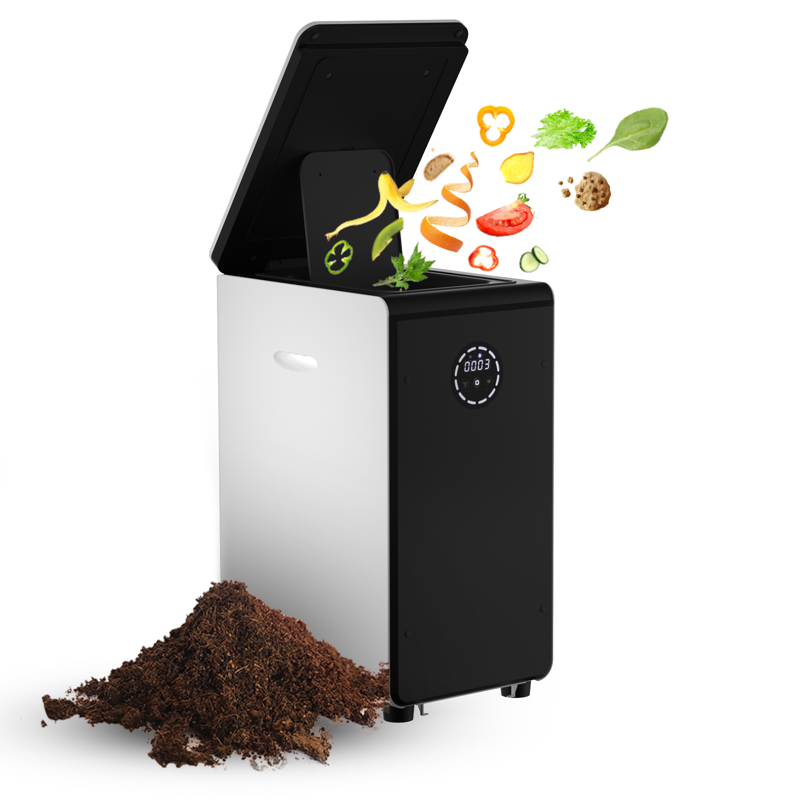

<head >
    <!--meta charSet="utf-8" />
    <meta name="twitter:card" content="summary_large_image" />
    <meta data-rh="true" property="og:image" content="https://www.geme.bio/assets/images/1-e9a4d07b7def7cd5b62ebd2a06b68f36.png" />
    <meta data-rh="true" name="twitter:image" content="https://www.geme.bio/assets/images/1-e9a4d07b7def7cd5b62ebd2a06b68f36.png" />
    <meta data-rh="true" property="og:url" content="https://www.geme.bio/assets/images/1-e9a4d07b7def7cd5b62ebd2a06b68f36.png" />
    <meta data-rh="true" property="og:locale" content="en"/-->
</head>

_Image Credit: [FDA|Outbreak Investigation of Salmonella: Cucumbers(May 2025)](https://www.fda.gov/food/outbreaks-foodborne-illness/outbreak-investigation-salmonella-cucumbers-may-2025)_

A multistate outbreak of Salmonella Montevideo infections is under investigation by the FDA and CDC. The source is traced to cucumbers from Bedner Growers, Inc., in Boynton Beach, Florida, distributed by Fresh Start Produce Sales, Inc.

In the last few days, an outbreak of Food Safety Corcern has been spreading across the United States, affecting hundreds of millions of residents and agricultural industries, over 200 infection cases reported in 15 states.

_Image Credit: [FDA|Outbreak Investigation of Salmonella: Cucumbers(May 2025)](https://www.fda.gov/food/outbreaks-foodborne-illness/outbreak-investigation-salmonella-cucumbers-may-2025)_

As a gardening enthusiast, I’m really concerned about how salmonella intrudes into our vegetable garden and how we can get rid of it, whether from soil, compost, water, fertiliser, plants, or grown fruits and vegetables. And I do hope that those who have been infected by salmonella in the US get the best treatment and recover soon. No more infection cases increased!

<!-- truncate -->

**JUMP TO**

[1. How to protect our vegetable gardens from Salmonella](#how-to-protect-our-vegetable-gardens-from-salmonella)

[2. What is Salmonella?](#what-is-salmonella)

[3. Is it safe to eat salad now? ](#is-it-safe-to-eat-salad-now)

[4. How to deal with your fruits and vegetables, unsure if contaminated with Salmonella](#how-to-deal-with-your-fruits-and-vegetables-unsure-if-contaminated-with-salmonella)

[5. Best Machine to Kill Salmonella Contaminated in Your Food Waste](#best-machine-on-the-market-to-kill-salmonella-contaminated-in-your-food-waste)

## How to protect our vegetable gardens from Salmonella

[Protecting our vegetable gardens from Salmonella is crucial for ensuring a safe and healthy harvest. Here are several steps you can take to minimize the risk of contamination:](https://www.cdc.gov/salmonella/outbreaks/whole-cucumbers-05-25/index.html)

1. **Soil Testing**: Regularly test your garden soil to check for the presence of harmful bacteria. Soil testing kits are available at most garden centers.

2. **Composting Practices**:
We recommend utilizing Composter with high-temperature phased aerobic fermentation technology like GEME home electric compoter, which achieves efficient pathogen elimination through the following mechanisms:

- **Intelligent Oxygen Control System**:
  Automatic turning ensures uniform oxygen penetration throughout the compost pile, eliminating anaerobic dead zones and continuously activating thermophilic microbial activity.
- **High-Temperature Pathogen Inactivation**:
  Microbial metabolic bioheat elevates internal pile temperatures to over 70°C, with sustained high temperatures maintained for 72+ hours, effectively destroying Salmonella cell structures.
- **Photocatalytic Synergistic Enhancement**:
  The built-in UV-C photocatalyst system (253.7 nm wavelength) triggers catalytic reactions to degrade bacterial DNA and organic toxins, forming a dual sterilization barrier (thermal + photocatalytic).

3. **Hot Composting (Thermophilic Composting)**: This method involves maintaining high temperatures to kill pathogens. Use a compost thermometer to monitor the temperature.

4. **Water Source**: Use clean, potable water for irrigation. Avoid using water from ponds or streams that may be contaminated with animal waste. If you use well water, have it tested regularly for bacteria.

5. **Animal Control**: Keep animals out of your garden. Animal feces can be a significant source of Salmonella and other pathogens. Use fencing or netting to protect your plants.

### Hygiene Practices

1. **Wash Hands**: Always wash your hands thoroughly with soap and water before and after working in the garden.

2. **Clean Tools**: Regularly clean and disinfect your gardening tools with a bleach solution (1 part bleach to 9 parts water).

3. **Footwear**: Wear dedicated gardening shoes or boots and avoid tracking soil into your home.

4. **Fertilizers**: Use only well-composted manure or commercially available fertilizers that have been treated to kill pathogens. Avoid using fresh manure, as it can contain harmful bacteria.

5. **Crop Rotation**: Practice crop rotation to prevent the buildup of pathogens in the soil. Rotate your crops each year, planting different types of vegetables in each area.

6. **Raised Beds**: Consider using raised beds to improve drainage and reduce the risk of soil contamination.

7. **Sunlight**: Ensure your garden receives plenty of sunlight. Sunlight can help kill bacteria on the surface of plants and soil.

8. **Mulching**: Use organic mulches, such as straw or wood chips, to suppress weeds and prevent soil from splashing onto plants during watering.

9. **Planting Density**: Avoid overcrowding plants, as this can create a humid environment that promotes the growth of bacteria and fungi.

10. **Regular Inspection**: Regularly inspect your plants for signs of disease or contamination. Remove and dispose of any affected plants immediately.

## What is Salmonella?

Salmonella is a group of bacteria that can cause food poisoning ([salmonellosis](https://www.cdc.gov/salmonella/signs-symptoms/index.html)). It is a common cause of diarrheal illness in the United States.

### Key points

- [Salmonella](https://www.cdc.gov/salmonella/about/index.html) are bacteria (germs) that can make people sick.
- People can get infected with Salmonella after swallowing the bacteria.
- CDC estimates Salmonella cause about 1.35 million infections in the United States every year.
- Contaminated food is the source for most of these illnesses.

### Why does it contaminate fruits and vegetables?

Salmonella can contaminate fruits and vegetables through various routes:

1. **Contaminated Water**: Irrigation water contaminated with animal or human waste can introduce Salmonella to crops.

2. **Contaminated Soil**: Soil can become contaminated through the use of improperly composted manure or contact with animal feces.

3. **Animal Contact**: Animals, such as birds and rodents, can carry Salmonella and contaminate crops directly.

4. **Poor Hygiene**: Improper handling and washing of produce can spread Salmonella.

5. **Cross-Contamination**: Salmonella can spread from contaminated surfaces, such as cutting boards and utensils, to fruits and vegetables.

### How to kill Salmonella?

[Salmonella can be killed through various methods:](https://www.cdc.gov/salmonella/prevention/index.html)

1. **Cooking**: Cooking food to a safe internal temperature will kill Salmonella. The recommended internal temperature for poultry is 165°F (75°C).

2. **Pasteurization**: Heating liquids, such as milk and juice, to a temperature of above 90 °C (194 °F) for more than 30 mins will kill Salmonella.

3. **Disinfection**: Using disinfectants, such as bleach, can kill Salmonella on surfaces. A solution of 1 tablespoon of bleach per gallon of water is effective for disinfecting surfaces.

4. **Heat Composting**: Maintaining a compost pile at a temperature of 160-180°F (71-82°C) for at least three days will kill Salmonella, while using [GEME composter with kobold](https://www.geme.bio/blog/garden-soil-vs-compost-pros-and-cons) will also kill Salmonella due to its UV light and kobold heating system. When you’re at home, you could compost your food watse or diposable cucumbers in a GEME home composter even if your food materials might be contaminated with Salmonella, but remember to slice it smaller and wash your hands and knives with warm water and soap properly.

5. **UV Light**: Ultraviolet (UV) light can kill Salmonella on surfaces and in water.

6. **Washing**: Thoroughly washing fruits and vegetables under running water can remove some Salmonella, but it may not eliminate all bacteria.

## Is it safe to eat salad now?

[Cucumber salad or other salads are not safe now!](./img/cucumber-salad.jpg)

### Is cucumber the only contaminated vegetable?

Cucumbers are commonly used for salad or raw eating. But now, is it just cucumber from Bedner Growers, Inc. unsafe to eat? We highly doubt that. We strongly recommend you stop eating salad or raw fruits and vegetables till the FDA investigation eventually finishes.

:::warning
[Salmonella can be spread through cross-contamination (e.g., cutting boards, knives), and even if the recall is limited to cucumbers, other vegetables could still be contaminated from shared tools.](https://www.cdc.gov/salmonella/outbreaks/index.html)
:::

If you’re also concerned about Salmonella contamination, take the following precautions:

1. **Wash Thoroughly**: Wash all salad ingredients thoroughly with warm water before consumption. (Despite of this, we still recommend you not eat salad recently.)

2. **Check for Recalls**: Stay informed about any recalls of produce items.

3. **Consider Cooking**: If you are particularly concerned, consider cooking your vegetables instead of eating them raw, as cooking will kill Salmonella.

While the current recall focuses on cucumbers, Salmonella can contaminate other fruits and vegetables as well. Common culprits include:

1. **Leafy Greens**: Lettuce, spinach, and other leafy greens are frequently associated with Salmonella outbreaks.

2. **Tomatoes**: Tomatoes can become contaminated through contact with contaminated soil or water.

3. **Sprouts**: Sprouts are grown in warm, humid conditions that are ideal for bacterial growth.

4. **Melons**: Melons can become contaminated if the rind is punctured or damaged.

5. **Peppers**: Like tomatoes, peppers can be contaminated through soil or water.

It's essential to practice good food safety habits with all produce, not just cucumbers, to minimize the risk of Salmonella infection.

## How to deal with your fruits and vegetables, unsure if contaminated with Salmonella 

If you are unsure whether your fruits and vegetables are contaminated with Salmonella, take the following steps:

In addition to the prevention steps mentionoed in the first two sections, there are other options you could choose:

1. **Discard Suspect Produce**: If you suspect that your produce is contaminated with Salmonella, it is best to discard it. Wrap the produce in a plastic bag and dispose of it in a sealed trash can.

:::info
However, if you think this is totally a waste of food, you could consider using a GEME electric composter with heating system to inactivate the Salmonella and turn these fruits and vegetables into great compost for your vegetable garden soil.
:::

2. **Clean and Disinfect**: Clean and disinfect any surfaces that may have come into contact with the suspect produce, including cutting boards, knives, and countertops. Use a bleach solution (1 tablespoon of bleach per gallon of water) to disinfect surfaces.

3. **Monitor for Symptoms**: Monitor yourself and your family for [symptoms of Salmonella infection](https://www.cdc.gov/salmonella/signs-symptoms/index.html), such as diarrhea, fever, and abdominal cramps. If you experience these symptoms, seek medical attention immediately.

## Best Machine on the Market to Kill Salmonella Contaminated in Your Food Waste

When dealing with food waste that may be contaminated with Salmonella, it's crucial to handle it safely to prevent further spread of the bacteria. While several options exist, the GEME Composter stands out from the composter market as the best choice due to its advanced purification system and heating system that meets the conditions of killing Salmonella.

The GEME electric composter utilizes a photocatalytic and metal ion catalytic oxidation purification system. Salmonella, being a Gram-negative bacterium with a thin cell wall, is particularly sensitive to UV-C light.

:::Tip
When the device is in normal operation!
:::

### Key Differentiators:

- **No Frequent Catalyst Replacement**: Unlike many composting machines on the market, the GEME’s purification system does not require frequent replacement of catalysts, saving you time and money in the long run.

- **Superior Pathogen Inactivation**: The composter is designed to maximize the inactivation of harmful pathogens and bacteria, including Salmonella. Over 90% of Salmonella bacteria can be inactivated with appropriate UV-C dosage.

- **Kobold Heating Facts**: GEME completely simulates the whole process of natural composting but improves and speeds up the composting process by providing the most suitable conditions for Kobold to grow and degrade. Kobold is a pure natural high-temperature resistant composite microorganism. The fermentation heat can reach up to over 70°C during the fermentation process. **[As recommended by FDA and CDC, it meets the conditions to kill Salmonella](https://www.foodsafety.gov/food-safety-charts/safe-minimum-internal-temperatures)**.

### Benefits:

- **Effective Salmonella Inactivation**: By breaking down potentially contaminated fruits and vegetables into smaller pieces and processing them in small batches within the composter, you can ensure the Salmonella is effectively neutralized, making the resulting compost safe to use.
- **Safe Composting**: The combination of photocatalysis and metal ion catalytic oxidation provides a robust method for eliminating pathogens.
- **Sustainable and Cost-Effective**: The lack of frequent catalyst replacement makes GEME Home Composter a more sustainable and cost-effective solution compared to other composting machines.

### Considerations:

- **Pre-Processing Required**: For optimal results, food waste should be broken down into smaller pieces before being added to the composter.
- **Batch Processing**: Processing in smaller batches ensures thorough exposure to the UV-C light and purification system.

By taking these precautions and choosing the right machine for your needs, particularly the composter with advanced, sustainable, and low-maintenance purification system and heating process, you can effectively manage Salmonella-contaminated food waste and protect your health and the environment.

## Related Articles

- [How to Use Compost](/blog/how-to-use-compost)
<!-- truncate -->
- [4 Different Types of Compost and Which One Should I Use](/blog/4-differnt-types-of-compost-and-which-one-should-i-use)
<!-- truncate -->
- [Prerequisites for Successful Composting](/blog/prerequisites-for-successful-composting)
<!-- truncate -->

## See Also

CDC: [About Salmonella Infection](https://www.cdc.gov/salmonella/outbreaks/whole-cucumbers-05-25/index.html#:~:text=CDC%3A-,About%20Salmonella%20Infection,-FDA%3A%20Outbreak)

FDA: [Outbreak Investigation of Salmonella: Cucumbers (May 2025)](https://www.fda.gov/food/outbreaks-foodborne-illness/outbreak-investigation-salmonella-cucumbers-may-2025)

FDA: [Bednar Growers, Inc. Recalls Cucumbers Because of Possible Health Risk](https://www.fda.gov/safety/recalls-market-withdrawals-safety-alerts/bedner-growers-inc-recalls-cucumbers-because-possible-health-risk)

---

_Ready to transform your gardening game? Subscribe to our [newsletter](http://geme.bio/signup) for expert composting tips and sustainable gardening advice._
