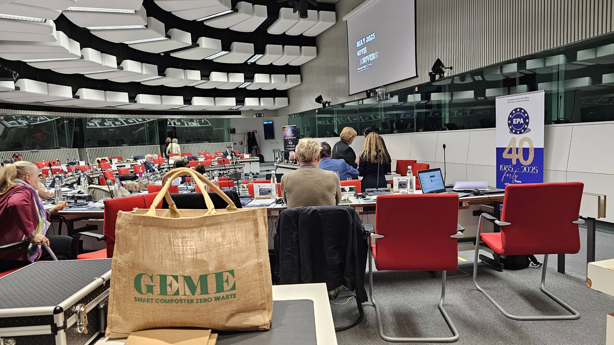
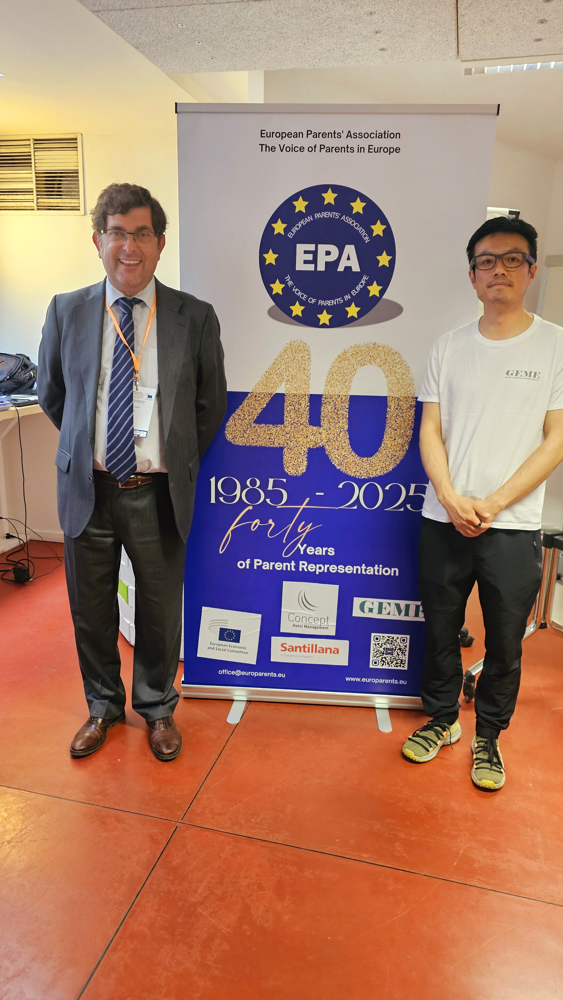
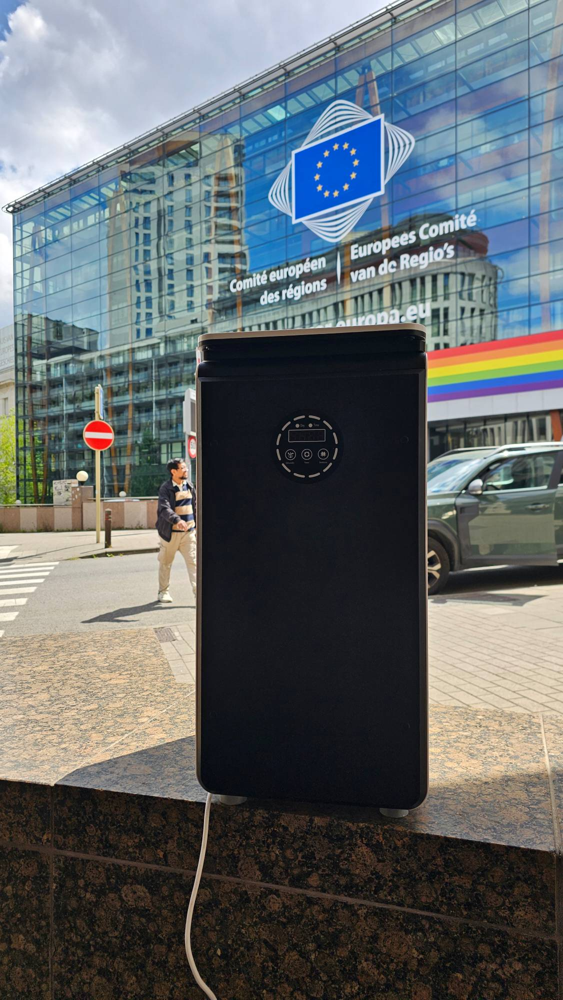
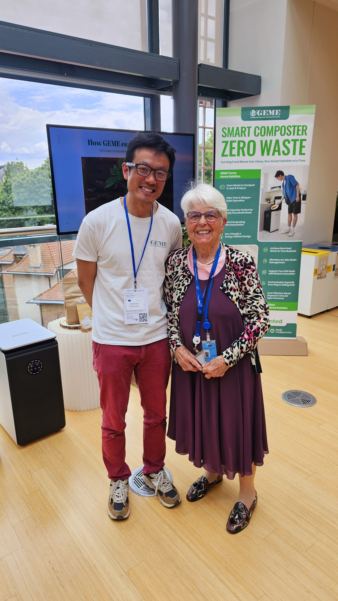

On May 23rd, 2025, GEME had the pleasure of participating in the **40th Anniversary International Conference of the European Parents’ Association (EPA)** — a milestone event held at the **European Economic and Social Committee (EESC)** in Brussels.

<!-- truncate -->

This important gathering brought together educators, EU officials, parents, and innovators to reflect on 40 years of parental involvement in education and societal development. From discussions on AI and mental health to inclusive education and digital literacy, the conference emphasised the need for cross-sector collaboration in shaping a better future.

As a sponsor, GEME joined the celebration not only to support the mission of EPA but also to demonstrate how circular economy principles can be integrated into **everyday family life**. We showcased our **smart composting technology**, which enables households to transform food waste into nutrient-rich compost within 6–24 hours, right from their kitchen.

Alex Yun, head of the division of GEME in Brussels, Belgium, represented our corperation at the EPA 40th anniversary conference. 

In our workshop exchange with parents and EPA members across all European countries, the feedback was clear: **families want actionable solutions to help raise sustainability-conscious children**. The GEME composter is designed to support exactly that — offering a practical, educational, and empowering tool for every home.

 

We believe that **the journey toward a greener, more resilient planet starts with everyday actions in the home**. Composting is no longer just a municipal task — it’s a family value, a teaching moment, and a daily impact.

We thank EPA, its visionary speakers, and the participating families for their support and for reminding us that change begins with community.
Let’s continue turning food waste into future soil — starting right where we live.

Learn more at: www.europarents.eu 

---

_Explore GEME’s composting innovation or [subscribe to our newsletter](https://www.geme.bio/signup) for more updates from our journey._

Visit [www.geme.bio](https://www.geme.bio) to learn more.
