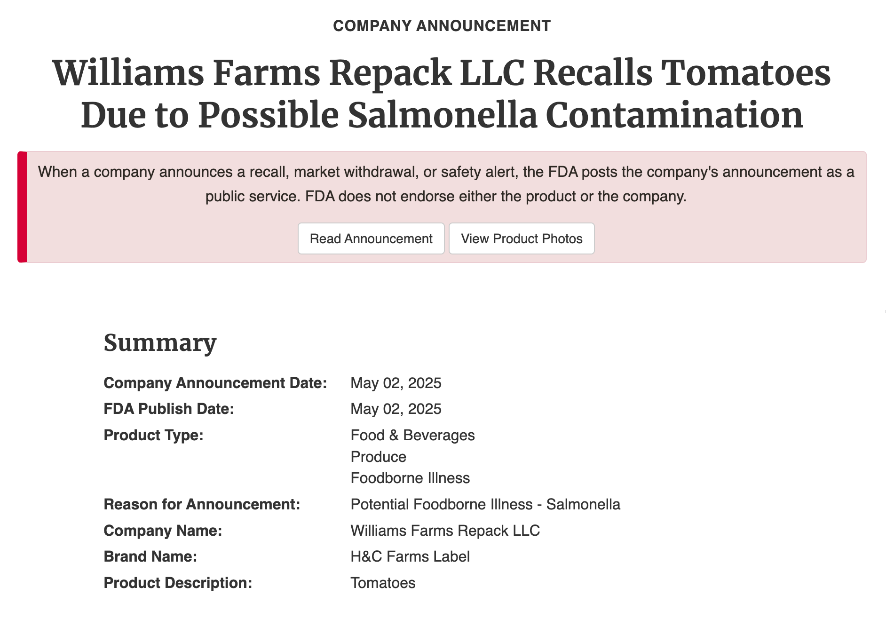
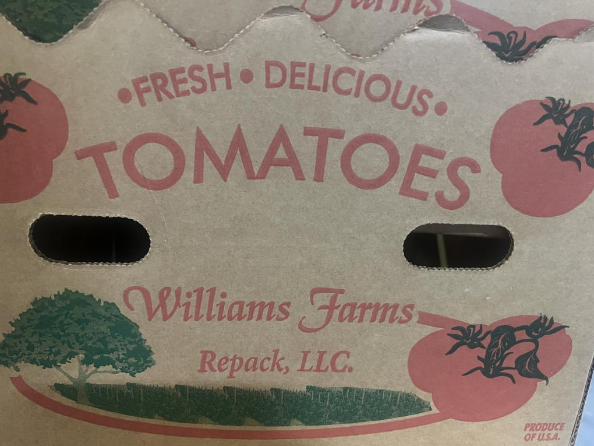
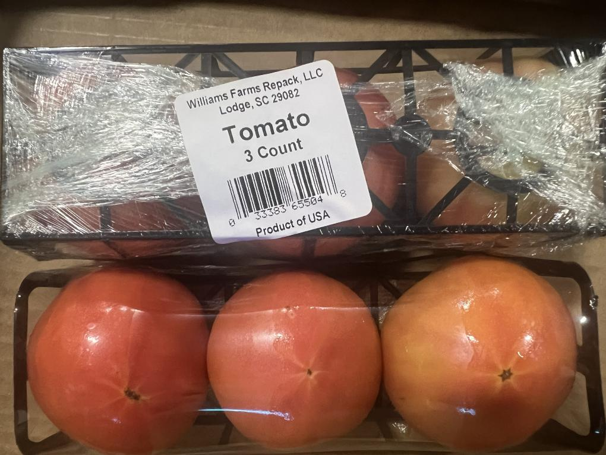

<head >
    <!--meta charSet="utf-8" />
    <meta name="twitter:card" content="summary_large_image" />
    <meta data-rh="true" property="og:image" content="https://www.geme.bio/assets/images/1-e9a4d07b7def7cd5b62ebd2a06b68f36.png" />
    <meta data-rh="true" name="twitter:image" content="https://www.geme.bio/assets/images/1-e9a4d07b7def7cd5b62ebd2a06b68f36.png" />
    <meta data-rh="true" property="og:url" content="https://www.geme.bio/assets/images/1-e9a4d07b7def7cd5b62ebd2a06b68f36.png" />
    <meta data-rh="true" property="og:locale" content="en"/-->
</head>

While composting is generally a good practice for reducing **waste** and enriching soil, it's important to be cautious when dealing with potentially contaminated materials. The **FDA Tomato Recall Salmonella** outbreak highlights the need to take extra precautions to protect your health and prevent the spread of **salmonella**.

### JUMP TO

[**1.FDA Tomato Recall Warning**](#1-urgent-fda-tomato-recall-warning)

[**2.What Tomatoes Are Being Recalled?**](##2-what-tomatoes-are-being-recalled)

[**3.Why Does Salmonella Infect Our Vegetables Again?**](#3-why-does-salmonella-infect-our-vegetables-again)

[**4.What Is Salmonella, and How Does It Infect Our Vegetable Garden?**](#4-what-is-salmonella-and-how-does-it-infect-our-vegetable-garden)

[**5.How to Kill Salmonella?**](#5-how-to-kill-salmonella)

[**6.Is It Safe to Eat Tomatoes Now?**](#6-is-it-safe-to-eat-tomatoes-now)

[**7.What Kind of Food Is Easily Contaminated with Salmonella?**](#7-what-kind-of-food-is-easily-contaminated-with-salmonella)

[**8.How Should I Deal with the Recalled Tomatoes?**](#8-how-should-i-deal-with-the-recalled-tomatoes)

[**9.Is It Safe to Compost My Tomatoes Now?**](#9-is-it-safe-to-compost-my-tomatoes-now)

## 1. Urgent! FDA Tomato Recall Warning
In May 2025, the U.S. Food and Drug Administration (FDA) issued a Class I recall—the highest risk level—for certain tomatoes due to potential Salmonella contamination. 

This recall affects products distributed by Williams Farms Repack LLC and Ray & Mascari Inc. The recall was initiated after concerns that the affected tomatoes, sold under the Williams Farms Repack and H&C Farms brands in various packaging sizes, may be contaminated with Salmonella. 

The recall spans multiple states, including Georgia, North Carolina, South Carolina, Illinois, Indiana, Kentucky, Michigan, Missouri, Mississippi, New York, Ohio, Pennsylvania, Tennessee, and Wisconsin. 

A Class I designation indicates a reasonable probability that consuming the product could lead to serious health consequences or death. Salmonella infection can cause watery diarrhea, stomach cramps, and vomiting, especially posing severe risks to young children, the elderly, and those with weakened immune systems. 

## 2. What Tomatoes Are Being Recalled?
The recalled tomatoes include various sizes and packaging types distributed between April 23 and April 28, 2025. Affected products were sold under the Williams Farms Repack and H&C Farms labels in Georgia, North Carolina, and South Carolina. Specific lot codes include R4467 and R4470. 
Ray & Mascari Inc. also recalled 4-count vine ripe tomatoes packaged in clamshell containers with lot numbers RM250424 15250B or RM250427 15250B. These were distributed in Illinois, Indiana, Kentucky, Michigan, Missouri, Mississippi, New York, Ohio, Pennsylvania, Tennessee, and Wisconsin.

<h2 className="people-also-ask">People Also Ask</h2>

## 3. Why Does Salmonella Infect Our Vegetables Again?
Salmonella can contaminate vegetables through several pathways:

**Contaminated Water**: Using water that contains Salmonella for irrigation can introduce the bacteria to crops.

**Animal Contact**: Wildlife and livestock can carry Salmonella and spread it through feces in fields.

**Soil Contamination**: Soil can harbor Salmonella from previous contamination events or from the use of contaminated compost or manure.

**Improper Handling**: During harvesting, processing, or packaging, poor hygiene practices can lead to contamination.
These factors contribute to recurring outbreaks of Salmonella in vegetables.

## 4. What Is Salmonella, and How Does It Infect Our Vegetable Garden?
Salmonella is a type of bacteria that can cause foodborne illness. It infects vegetables when they come into contact with contaminated water, soil, or surfaces. The bacteria can enter plants through roots or damaged areas, making it difficult to remove through washing alone. 

In gardens, using contaminated compost or allowing animals to access planting areas can introduce Salmonella.

## 5. How to Kill Salmonella?
To eliminate Salmonella from food:

- **Cook Thoroughly**: Heat foods to an internal temperature of at least 165°F (74°C) to kill the bacteria.
- **Avoid Cross-Contamination**: Use separate cutting boards and utensils for raw and cooked foods.
- **Wash Hands and Surfaces**: Regularly clean hands, kitchen surfaces, and equipment with soap and hot water.

### In gardens:
- **Use Clean Water**: Irrigate with potable water to prevent introducing contaminants.
- **Compost Properly**: Ensure compost reaches temperatures that kill pathogens before applying to gardens. Please check this guide to see how to compost suspected tomatoes or other vegetable contaminated with Salmonella: [FDA Cucumber Recall 2025 - Heat Composting](https://www.geme.bio/blog/cucumber-recall-2025-how-to-protect-vegetable-garden-from-salmonella#how-to-kill-salmonella)
- **Control Animal Access**: Prevent animals from entering garden areas to reduce contamination risks.

## 6. Is It Safe to Eat Tomatoes Now?
Yes, it is safe to eat tomatoes that are not part of the recall. Consumers should check the origin and lot numbers of tomatoes to ensure they are not affected. Proper handling and cooking further reduce any risk of Salmonella infection.

## 7. What Kind of Food Is Easily Contaminated with Salmonella?
Foods commonly associated with Salmonella contamination include:

- **Raw Meat and Poultry**: Undercooked or improperly handled meats.
- **Eggs**: Raw or undercooked eggs and products containing them.
- **Dairy Products**: Unpasteurized milk and cheeses.(U.S. Food and Drug Administration)
- **Fruits and Vegetables**: Especially those consumed raw, like leafy greens and tomatoes.
- **Processed Foods**: Items like peanut butter or frozen meals if contaminated during production.

Proper food handling and cooking practices can minimize the risk of infection.

## 8. How Should I Deal with the Recalled Tomatoes?
If you have purchased tomatoes included in the recall:

**Do Not Consume**: Avoid eating the affected products.

**Dispose Safely**: Throw them away in a sealed bag to prevent contamination.
Return to Store: Some retailers may offer refunds for recalled items.

**Clean Surfaces**: Sanitize any surfaces or containers that came into contact with the recalled tomatoes.

For questions, contact the distributor or the FDA for guidance.

## 9. Is It Safe to Compost My Tomatoes Now?
Composting recalled tomatoes is not recommended. However, A home electric composter with heating system can completely simulate the whole process of natural composting but improve and speed up the composting process by providing the most suitable conditions for Kobold to grow and degrade. Kobold is a pure natural high-temperature resistant composite microorganism. The fermentation heat can reach up to over 70°C during the fermentation process. **[As recommended by FDA and CDC, it meets the conditions to kill Salmonella](https://www.foodsafety.gov/food-safety-charts/safe-minimum-internal-temperatures)**.

Other home composting systems may not reach temperatures sufficient to kill Salmonella bacteria. Using contaminated compost in your garden can introduce the bacteria to your soil and plants. It's safer to dispose of the recalled tomatoes in the trash, or use a composter with Kobold.

Note: Always stay informed about food recalls and practice safe food handling to protect your health and your garden.

## Summary
The recent FDA Tomato Recall due to Salmonella contamination has raised significant concerns among consumers and gardeners. 

he recall affects specific tomato products distributed across multiple states, emphasizing the importance of staying informed about food safety alerts.

Salmonella, a harmful bacterium, can contaminate vegetables through various means, including contaminated water, soil, and improper handling. To mitigate risks:

- **Ensure Proper Cooking**: Cooking food to the appropriate temperature can kill Salmonella.

- **Practice Good Hygiene**: Regularly wash hands, utensils, and surfaces.

- **Use Clean Water**: Irrigate gardens with potable water to prevent contamination.

- **Avoid Using composter without heating system to compost Recalled Produce**: Home composting may not eliminate pathogens effectively, only by kobold could it reach the high temperature to inactivate Salmonella.

By understanding the causes and prevention methods of Salmonella contamination, individuals can take proactive steps to protect their health and maintain safe gardening practices.

## Related Articles

- [FDA Cucumber Recall 2025 Due To Salmonella Outbreak](/blog/2025-05-23-cucumber-recall-2025-how-to-protect-our-vegetable-garden-from-salmonella/)
<!-- truncate -->
- [4 Different Types of Compost and Which One Should I Use](/blog/4-differnt-types-of-compost-and-which-one-should-i-use)
<!-- truncate -->
- [Prerequisites for Successful Composting](/blog/prerequisites-for-successful-composting)
<!-- truncate -->

## See Also

FDA: <a href="https://www.fda.gov/safety/recalls-market-withdrawals-safety-alerts/williams-farms-repack-llc-recalls-tomatoes-due-possible-salmonella-contamination" rel="nofollow">Williams Farms Repack LLC Recalls Tomatoes Due to Possible Salmonella Contamination</a>

CDC: <a href="https://www.cdc.gov/salmonella/outbreaks/whole-cucumbers-05-25/index.html#:~:text=CDC%3A-,About%20Salmonella%20Infection,-FDA%3A%20Outbreak" rel="nofollow">About Salmonella Infection</a>

---

_Ready to transform your gardening game? Subscribe to our [newsletter](http://geme.bio/signup) for expert composting tips and sustainable gardening advice._
