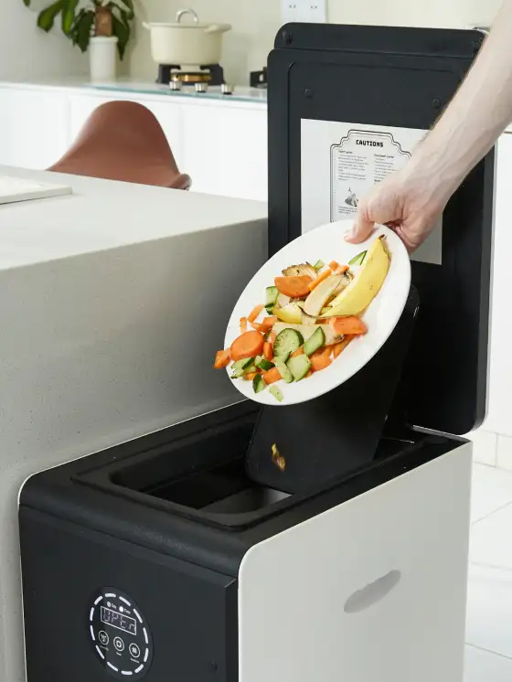

<head >
    <!--meta charSet="utf-8" />
    <meta name="twitter:card" content="summary_large_image" />
    <meta data-rh="true" property="og:image" content="https://www.geme.bio/assets/images/1-e9a4d07b7def7cd5b62ebd2a06b68f36.png" />
    <meta data-rh="true" name="twitter:image" content="https://www.geme.bio/assets/images/1-e9a4d07b7def7cd5b62ebd2a06b68f36.png" />
    <meta data-rh="true" property="og:url" content="https://www.geme.bio/assets/images/1-e9a4d07b7def7cd5b62ebd2a06b68f36.png" />
    <meta data-rh="true" property="og:locale" content="en"/-->
</head>

import GemeComposterCTA from '@site/src/components/GemeComposterCTA'

In 2025, the United States has experienced several food recalls due to **Salmonella** contamination. Now, it’s egg recall due to Salmonella. This recall raises concerns among consumers about food safety. This article aims to provide clear, actionable information about egg recalls, Salmonella, and how to protect yourself and your family.

<!-- truncate -->

<h2 className="jump-to">Jump To</h2>

[**1. Eggs Recall Map**](#1-eggs-recall-map-check-if-you-purchased-eggs-contaminated-with-salmonella)

[**2. Learn More About Salmonella From CDC**](#2-why-salmonella-again-learn-more-about-salmonella-from-cdc)

[**3. WThe Best Way To Deal With Eggs Recalled**](#3-the-best-way-to-deal-with-eggs-contaminated-with-salmonella)

[**4. How to Know If Your Eggs Have Salmonella**](#4-how-to-know-if-your-eggs-have-salmonella)

[**5. The Best Composter to Kill Salmonella**](#5-the-best-composter-to-kill-salmonella-on-your-eggs-or-other-food-waste)

## 1. Eggs Recall Map: Check If You Purchased Eggs Contaminated With Salmonella

When an **egg recall** is announced, one of the first things consumers want to know is whether they have purchased the affected eggs. The <a href="https://www.cdc.gov/salmonella/outbreaks/eggs-06-25/index.html" rel="nofollow">**CDC**</a> and <a href="https://www.fda.gov/food/outbreaks-foodborne-illness/outbreak-investigation-salmonella-eggs-june-2025" rel="nofollow">**FDA**</a> typically provide detailed information, including brand names, production dates, and distribution areas. However, visualizing this information can be challenging. That's where an **Eggs Recall Map** becomes incredibly useful. Now we get the **2025 Eggs Recall Map** for you to quickly determine if your eggs are part of this recall. 

By checking the states listed, you can quickly assess your risk. 

## 2. Why Salmonella Again? Learn More About Salmonella From CDC

**Salmonella** is a type of bacteria that can cause food poisoning. It's a common culprit in **egg recalls**. Understanding why Salmonella is a recurring issue can help you take better precautions.

### What is Salmonella?

Salmonella is a group of bacteria that can cause gastrointestinal illness in humans.

It is commonly found in the intestines of animals, including poultry.

Humans usually become infected by eating foods contaminated with the bacteria.

#### How Eggs Get Contaminated:

- **Vertical Transmission**: Hens can be infected with **Salmonella**, and the bacteria can be present inside the egg before the shell is even formed.

- **Shell Contamination**: Eggs can also become contaminated from the outside if the shells come into contact with Salmonella-contaminated feces or environments.

#### Why Salmonella is a Recurring Issue:

- **Widespread in Poultry**: Salmonella is common in poultry farms, making it difficult to eliminate entirely.

- **Resilience**: Salmonella bacteria can survive for extended periods in dry environments.

- **Complex Supply Chains**: Eggs pass through many hands from the farm to your table, increasing the risk of contamination at various points.

#### CDC's Role in Monitoring Salmonella:

The [**CDC**](https://www.cdc.gov/salmonella/outbreaks/eggs-06-25/index.html) plays a crucial role in monitoring and preventing Salmonella outbreaks. Their activities include:

- **Surveillance**: Tracking cases of *Salmonella* infection across the country.

- **Outbreak Investigation**: Investigating outbreaks to identify the source of contamination.

- **Prevention Recommendations**: Providing guidelines for safe food handling and preparation.

Key Facts About **Salmonella** from the CDC:

- Salmonella causes about 1.35 million infections, 26,500 hospitalizations, and 420 deaths in the United States every year.

- Food is the source for most of these illnesses.

- Symptoms of Salmonella infection include diarrhea, fever, and stomach cramps.

- Most people recover within 4 to 7 days without medical treatment.

## 3. The Best Way To Deal With Eggs Contaminated With Salmonella

Discovering that you have purchased **eggs recalled** due to *Salmonella* contamination can be alarming. However, knowing the proper steps to take can help protect your health and prevent the spread of the bacteria.

### Step-by-Step Guide:

#### 1. Confirm the Recall:

- Check the **Eggs Recall Map** and official recall announcements from the CDC or FDA to confirm that your eggs are indeed part of the **egg recall**.

- Match the brand name, production date, and any identifying codes on your egg carton with the information provided in the recall notice.

#### 2. Do Not Eat the Eggs:

- The most important step is to avoid consuming the **eggs recalled**. Even if the eggs look and smell normal, they could still be contaminated with *Salmonella*.

- Eating contaminated eggs can lead to **Salmonella** infection, causing symptoms such as diarrhea, fever, and abdominal cramps.

#### 3. Proper Disposal:

Safely dispose of the **eggs recalled** to prevent others from accidentally consuming them. The CDC recommends the following disposal methods:

- **Sealing**: Place the eggs in a sealed bag or container to prevent leakage.

- **Disposal**: Dispose of the sealed bag in a garbage can with a secure lid.

#### 4. Clean and Sanitize:

Salmonella can easily spread to other surfaces, so it's crucial to clean and sanitize any areas that may have come into contact with the **eggs recalled**.

Follow these steps:

- **Wash Hands**: Wash your hands thoroughly with soap and water for at least 20 seconds.

- **Clean Surfaces**: Use hot, soapy water to clean countertops, refrigerators, and any other surfaces that may have touched the eggs.

- **Sanitize**: After cleaning, sanitize the surfaces with a solution of bleach and water (1 tablespoon of bleach per gallon of water). Let the solution sit for 10 minutes before wiping it off.

- **Wash Utensils**: Wash any utensils or dishes that may have come into contact with the eggs in hot, soapy water or in a dishwasher.

#### 5. Monitor for Symptoms:

If you have consumed **eggs recalled** or suspect you may have been exposed to **Salmonella**, monitor yourself and your family for symptoms of [**Salmonella Infection**](https://www.cdc.gov/salmonella/about/index.html).

 

Symptoms typically appear within 6 to 48 hours after eating contaminated food and can include:

- **Diarrhea**

- **Fever**

- **Abdominal cramps**

- **Nausea**

- **Vomiting**

If you experience these symptoms, contact your healthcare provider.

#### 6. Report the Illness:

Consider reporting your illness to your local health department. This can help health officials track outbreaks and prevent further cases.

Reporting is especially important if you are part of a vulnerable group, such as young children, older adults, or individuals with weakened immune systems. 

## 4. How To Know If Your Eggs Have Salmonella?

One of the most challenging aspects of **Salmonella** contamination is that you cannot see, smell, or taste it. Salmonella-contaminated eggs look and smell just like any other egg. This makes it crucial to rely on recall information and safe handling practices rather than trying to detect the bacteria yourself.

### Why You Can't Detect Salmonella:

1. **No Visible Signs**: **Salmonella** bacteria do not change the appearance, smell, or taste of eggs.

2. **Microscopic Contamination**: The bacteria are microscopic and cannot be seen with the naked eye.

3. **Internal Contamination**: In some cases, the Salmonella bacteria may be present inside the egg, making it impossible to detect without laboratory testing.

### Rely on Recall Information:

1. The most reliable way to know if your eggs might have **Salmonella** is to stay informed about [**egg recall**](https://www.fda.gov/food/outbreaks-foodborne-illness/outbreak-investigation-salmonella-eggs-june-2025).
2. Check the CDC or FDA website and other reputable sources for recall announcements.
3. If your eggs match the description of the **eggs recalled**, follow the steps outlined above for proper disposal and cleaning.

#### Safe Handling Practices:

Even if there is no active **egg recall** in your state, it's essential to follow safe handling practices to minimize the risk of Salmonella contamination:

1. **Buy Refrigerated Eggs**: Purchase eggs from refrigerated cases to ensure they have been stored at the proper temperature.

2. **Check the Expiration Date**: Make sure the expiration date on the egg carton has not passed.

3. **Inspect the Eggs**: Check for cracked or dirty eggs. Avoid buying eggs with damaged shells.

4. **Refrigerate Promptly**: Refrigerate eggs as soon as possible after purchase.

5. **Cook Thoroughly**: Cook eggs thoroughly to kill any Salmonella bacteria that may be present. **The CDC recommends cooking eggs until both the yolk and white are firm**.

6. **Avoid Raw or Undercooked Eggs**: Avoid eating raw or undercooked eggs, such as in homemade mayonnaise, Caesar salad dressing, or runny eggs.

7. **Wash Hands and Surfaces**: Wash your hands and any surfaces that have come into contact with raw eggs with soap and water.

## 5. The Best Composter To Kill Salmonella On Your Eggs Or Other Food Waste

While proper disposal and cleaning are essential steps in dealing with **eggs recalled**, composting offers an environmentally friendly way to handle food waste. However, not all composters are created equal when it comes to killing Salmonella. We recommend home electric composter with Kobold for **effectively eliminating Salmonella** and other harmful bacteria from your food waste.

<GemeComposterCTA className="custom-styles" />

### Why Composting?

1. **Reduces Landfill Waste**: Composting diverts food waste from landfills, reducing methane emissions and conserving valuable landfill space.

2. **Creates Nutrient-Rich Soil**: Compost enriches soil with essential nutrients, improving soil structure and fertility.

3. **Environmentally Friendly**: Composting is a sustainable way to manage food waste and reduce your environmental impact.

### The Challenge of Killing Salmonella in Compost:

1. Salmonella bacteria can survive in compost if the composting process does not reach high enough temperatures.

2. Traditional composting methods may not consistently achieve the temperatures needed to kill Salmonella and other pathogens.

### How Does Electric Composter Kill Salmonella :

1. **Hot Composting**: Our home Electric composters are designed to reach and maintain high temperatures (typically between 130°F and 160°F) that effectively kill Salmonella and other harmful bacteria. 

2. **Kobold Heating Process**: It provides the most suitable conditions for Kobold to grow and degrade. Kobold is a pure natural high-temperature resistant composite microorganism. The fermentation heat can reach up to 75°C during the fermentation process. Hence, it can kill Salmonella. However, only one composter has this feature. 

 

3. **UV-C Light**: It utilizes a photocatalytic and metal ion catalytic oxidation purification system. Salmonella, being a Gram-negative bacterium with a thin cell wall, is particularly sensitive to UV-C light.

4. **Insulated Design**: This electric composters feature insulated designs that help retain heat and maintain consistent temperatures throughout the composting process.

5. **Efficient Aeration**: Proper aeration is essential for maintaining high temperatures in compost. The home electric composters are designed to provide efficient aeration, ensuring that the compost pile remains oxygenated and active.

6. **Closed-Loop System**: Our home composters are often designed as closed-loop systems, which prevent the escape of odors and pathogens, making them safe for use in residential areas.

 

### Benefits of Composting Eggs Recalled

1. **Effective Salmonella Elimination**: Our composter reliably kills Salmonella and other harmful bacteria, ensuring that the resulting compost is safe to use in your garden.

2. **Environmentally Responsible Disposal**: Composting **eggs that are recalled** reduces landfill waste and creates valuable compost for your plants.

3. **Convenient and Odorless**: Composters here are designed to be convenient and odor-free, making them suitable for indoor or outdoor use.

4. **Reduces the Risk of Spreading Salmonella**: By **effectively killing Salmonella** in the compost, we reduces the risk of spreading the bacteria to your garden or other areas.

### How to Compost the Recalled Eggs:

1. **Prepare the Composter**r: Follow the manufacturer's instructions for setting up and preparing your home electric **composter and Kobold**.

2. **Add the Eggs**: **Carefully** add the **recalled eggs** to the composter, ensuring they are mixed **with other compostable materials** such as yard waste, vegetable scraps, and paper.

3. **Maintain Proper Conditions**: Monitor the temperature and moisture levels in the composter, and adjust as needed to maintain optimal composting conditions.

4. **Use the Compost**: Once the composting process is complete, you can use the resulting compost to enrich your garden soil, grow healthy plants, and **reduce your reliance on chemical fertilizers**.

By using our high-temperature composter, you can safely and effectively dispose of eggs recalled and other food waste while creating valuable compost for your garden.

## Conclusion

In conclusion, dealing with eggs recalled due to Salmonella requires vigilance, proper disposal methods, and a commitment to safe food handling practices. By staying informed, following recall instructions, and using tools like ***Eggs Recall Map** and our composters, you can protect yourself and your community from the risks associated with **Salmonella** contamination. 

Remember to always prioritize food safety and take proactive steps to prevent the spread of harmful bacteria. The **Egg Recall 2025** and beyond can be better managed with these strategies in place.

## Related Articles

- [FDA Tomato Recall 2025 Due To Salmonella Outbreak](/blog/fda-tomato-recall-salmonella-outbreak-raises-concerns-about-vegetable)

- [Cucumber Recall 2025 Salmonella Outbreak](/blog/cucumber-recall-2025-how-to-protect-vegetable-garden-from-salmonella)

- [Garden Soil VS Compost Pros & Cons](/blog/garden-soil-vs-compost-pros-and-cons)

## See Also

- FDA Egg Recall 2025: <a href="https://www.fda.gov/food/outbreaks-foodborne-illness/outbreak-investigation-salmonella-eggs-june-2025" rel="nofollow">Outbreak Investigation of Salmonella: Eggs (June 2025)</a>

- CDC: <a href="https://www.cdc.gov/salmonella/outbreaks/eggs-06-25/index.html" rel="nofollow">Salmonella Outbreak Linked to Eggs</a>

---

_Ready to transform your gardening game? Subscribe to our [newsletter](http://geme.bio/signup) for expert composting tips and sustainable gardening advice._
