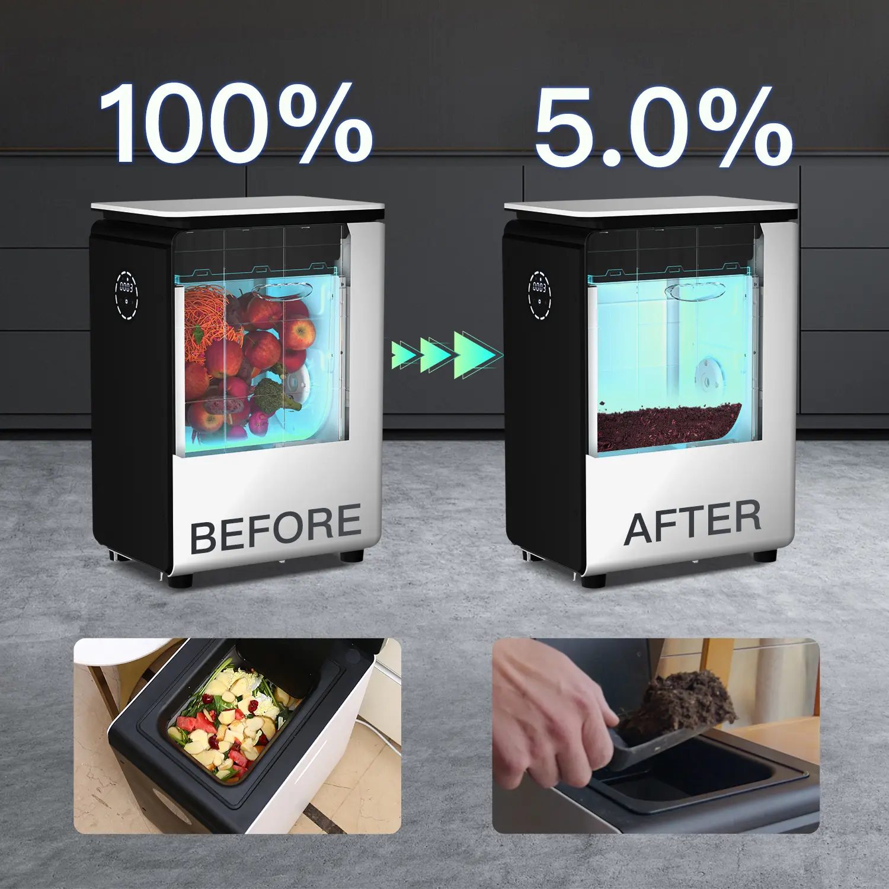
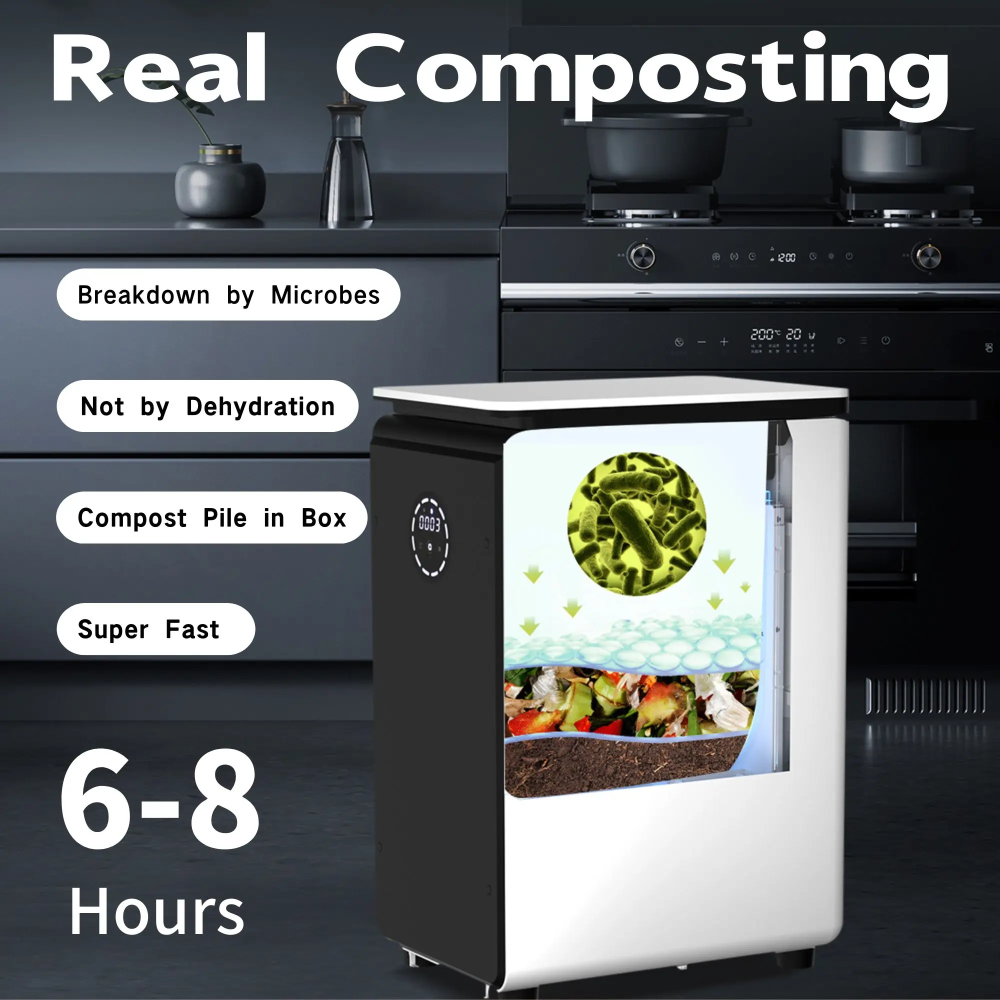
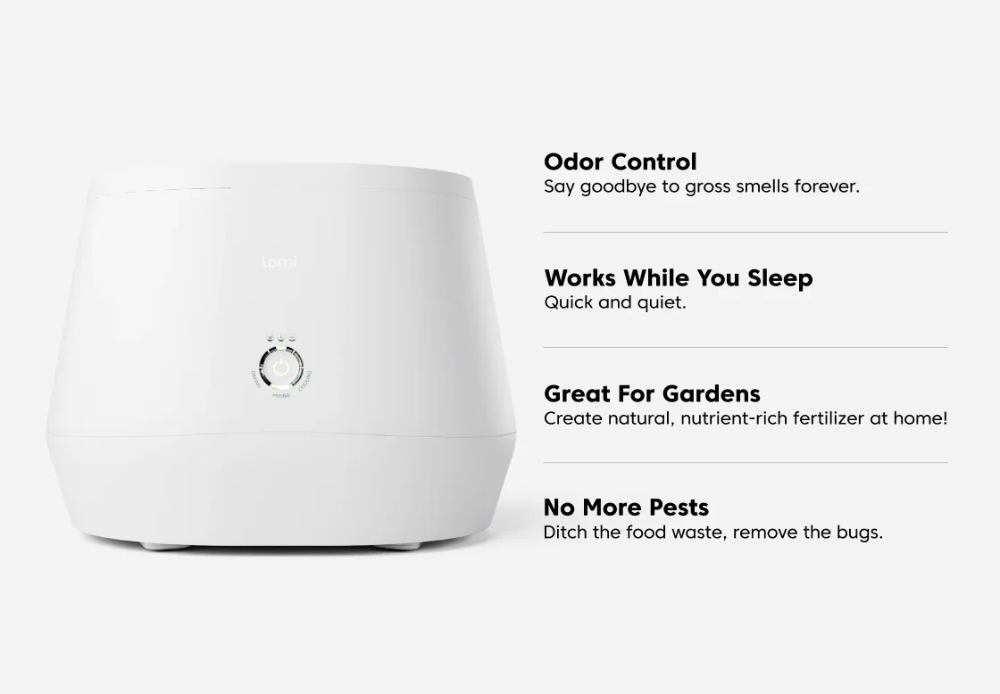
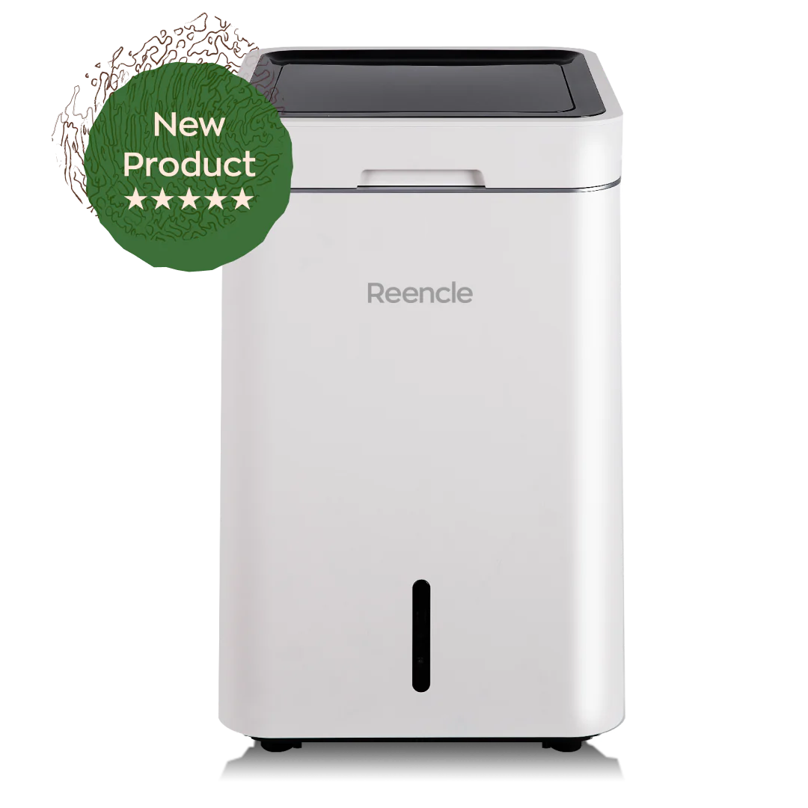
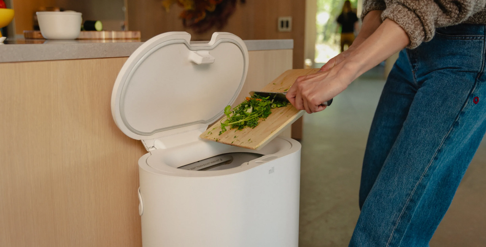
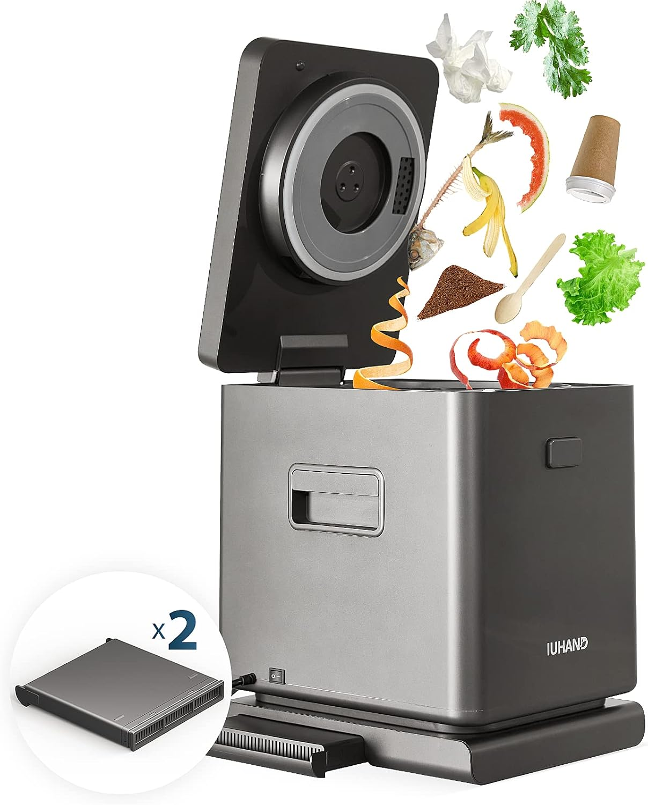

<head >
    <!--meta charSet="utf-8" />
    <meta name="twitter:card" content="summary_large_image" />
    <meta data-rh="true" property="og:image" content="https://www.geme.bio/assets/images/1-e9a4d07b7def7cd5b62ebd2a06b68f36.png" />
    <meta data-rh="true" name="twitter:image" content="https://www.geme.bio/assets/images/1-e9a4d07b7def7cd5b62ebd2a06b68f36.png" />
    <meta data-rh="true" property="og:url" content="https://www.geme.bio/assets/images/1-e9a4d07b7def7cd5b62ebd2a06b68f36.png" />
    <meta data-rh="true" property="og:locale" content="en"/-->
</head>

import GemeComposterCTA from '@site/src/components/GemeComposterCTA'
import GemeTerra2CTA from '@site/src/components/GemeTerra2CTA' 

Food waste is a big problem. It hurts our wallets and the environment. But there's a simple solution: **kitchen composters**. These handy devices turn your food waste into nutrient-rich compost, reducing landfills and creating valuable fertilizer for your plants.

In this article, we'll explore the **top 5 kitchen composters** on the market. We'll look at their introductions, features, and benefits to help you choose the perfect one for your needs. Let's dive in and discover **which one is your favourite**!

<!-- truncate -->

<h2 className="jump-to">Jump To</h2>

[**1. GEME Kitchen Composter**](#1-geme-kitchen-composter)

[**2. Lomi Kitchen Composter**](#2-lomi-kitchen-composter)

[**3. Reencle Composter**](#3-reencle-composter)

[**4. Mill Composter**](#4-mill-composter)

[**5. iUHAND Composter**](#5-iuhand-kitchen-composter)

[**6. Benifits of Using A Kitchen Composter**](#6-benefits-of-using-a-kitchen-composter)

[**7. How to Choose the Right Kitchen Composter**](#7-how-to-choose-the-right-kitchen-composter)

## Overview of the 5 Kitchen Composters

| **Model**                       | **GEME Composter**                                                                                     | **Lomi Composter**                                                                                          | **Reencle Composter**                                                                                       | **Mill Composter**                                                                                     | **iUHAND Composter**                                                                                 |
|--------------------------------|:-----------------------------------------------------------------------------------------------|:---------------------------------------------------------------------------------------------------|:---------------------------------------------------------------------------------------------------|:---------------------------------------------------------------------------------------------|:--------------------------------------------------------------------------------------------|
| **Capacity**            |19 L                                             | 3 L                                       | 3 L                                                          | 6.5 L                                   | 3 L                                              |
| **Features**  | Bio-fermentation (Kobold microbes) in 6–8 h + UV-C + deodorization Air system + aerobic mixing |heat + aeration + rotation wand      | Continuous composting + triple-rod mixing   | Dehydrates + grinds overnight                 | 5 h compost cycle + touchscreen + voice prompts                         |
| **Food Waste Reduction**         | 95%                 | 80%          | 90%                                  | 80%                     | 90% weekly                                           |
| **Odor-free/Pest-free**             | Yes, automatically, no need for filters                               | Yes, should use filters                                       | Yes, should use filters                                               | Yes, should use filters                                  | Yes, should use filters                           |
| **Bacteria Killing (e.g. Salmonella)** | Yes, up to 75°C as [**FDA/CDC**](https://www.foodsafety.gov/food-safety-charts/safe-minimum-internal-temperatures) recommended to kill harmful bacteria                                                                                    | No data                                   | No data                                                                                          | No data                                                                                     | No data                                                                                     |
| **Cooling System**             | Yes                                                                                       | No data                                                                                               | No data                                                                                          | No data                                                                                     | No data                                                                                     |

<GemeTerra2CTA 
 imgSrc="/img/geme-terra-2-composter.jpg"
 productTitle="GEME Terra II Composter"
 features={[
    "✅ Best Way Of Composting in Winter",
    "✅ Quiet, Odour-Free, Real Compost",
    "✅ Rich Compost Output For Garden Soil & Plants",
    "✅ Reduce Landfill Waste & Greenhouse Gases"
 ]}
buttonText="Get Your GEME Terra II"
  href="https://www.geme.bio/product/terra2?utm_medium=blog&utm_source=geme_website&utm_campaign=general_seo_content&utm_content=hthe-best-composter-to-reduce-food-waste"
/>

*Last Update Time: June 11th, 2025.*

    *Data collected from each brand's official website.*

## 1. GEME Kitchen Composter

The GEME Composter is an innovative kitchen appliance using microorganisms fermentation to efficiently and safely process food waste. 

For those seeking an efficient and odorless solution for managing food waste, its ability to significantly reduce waste volume and its user-friendly design make it a valuable addition to any kitchen. 

The benefits of reduced food waste and safe compost output make it the best option for environmentally conscious individuals. 

In 2025, the culprit of [**FDA Food Recalls**](/blog/fda-tomato-recall-salmonella-outbreak-raises-concerns-about-vegetable) mostly related to [**Salmonella** contaminations](/blog/cucumber-recall-2025-how-to-protect-vegetable-garden-from-salmonella), which can spread across the US by contaminated food and vegetable and cause severe [infection systoms](https://www.cdc.gov/salmonella/outbreaks/eggs-06-25/index.html). 

However, GEME kitchen composter is the only one on the market that reaches the high temperature of up to 70+ to [kill Salmonella by integrated UV-C Light and Kobold heating system(fermentation)](/blog/egg-recall-salmonella-2025-best-way-to-kill-salmonella-in-eggs-recalled). This is not only for your family’s safety concerns, but also for your garden health and public health. 

<GemeComposterCTA className="custom-styles" />

It utilizes a combination of heat, drying, cooling, and grinding to transform food waste into full, dry, nutrient-rich, and bacteria-free compost that can be used to improve the health of your garden soil.

### Conclusion

GEME Composter is the best kitchen composter to efficiently and safely process your food waste. It utilizes a combination of heat, drying, cooling, and grinding to transform food waste into full, dry, nutrient-rich, and bacteria-free compost that can be used to improve the health of your garden soil.

## 2. Lomi Kitchen Composter

The Lomi composter is an electric kitchen appliance designed to accelerate the breakdown of food waste. It's known for its sleek design and ability to turn food waste into compost in just a few hours.

### Conclusion

The Lomi composter is a great option for those who want a fast, convenient, and odor-free way to compost food waste. While it's an investment, its speed and ease of use make it a worthwhile choice for many households. If you're looking for a quick and efficient way to reduce your environmental impact, the Lomi composter is worth considering.

## 3. Reencle Composter

The Reencle composter is a kitchen appliance that uses microorganisms to break down food waste. This kitchen composter is known for its quiet operation and ability to handle a wide variety of food waste.

### Conclusion

The Reencle composter is an excellent choice for those who prefer a quiet and low-maintenance composting solution. Its ability to handle a large amount of food waste and eliminate odors makes it a great addition to any eco-friendly kitchen. While it may take longer to produce compost, the benefits of natural composting and minimal upkeep make it a worthwhile investment.

## 4. Mill Composter

The Mill composter is an interesting kitchen appliance that dehydrates and grinds food waste into a dry, shelf-stable product. This "food grounds" can then be used by Mill in animal feed or other applications.

### Conclusion

The Mill composter is a great option for those who want a convenient and sustainable way to manage food waste. Its ability to reduce waste volume, and support a circular economy makes it a valuable addition to any eco-conscious home. While it requires a subscription and relies on Mill's services, the benefits of hassle-free waste disposal and environmental responsibility make it a worthwhile choice.

## 5. iUHAND Kitchen Composter

The iUHAND composter is a compact and efficient kitchen appliance designed to quickly process food waste. It uses a combination of heat, aeration, and grinding to transform food waste into compost within hours.

### Conclusion

The iUHAND composter is an good choice for those who want a fast and efficient way to compost food waste. Its ability to produce compost in just a few hours, combined with its compact design and user-friendly operation, makes it a valuable addition to any kitchen. 

## 6. Benefits of Using a Kitchen Composter

Using a **kitchen composter** offers numerous benefits:

- **Reduces landfill waste**: Diverts **food waste** from landfills, reducing methane emissions.
- **Creates nutrient-rich compost**: Provides valuable fertilizer for your plants.
- **Saves money**: Reduces the need to buy chemical fertilizers which might hurt your garden soil.
- **Environmentally friendly**: Promotes sustainable living and reduces your carbon footprint.
- **Convenient**: Makes composting accessible to those without outdoor space.

<GemeTerra2CTA 
 imgSrc="/img/geme-terra-2-composter.jpg"
 productTitle="GEME Terra II Composter"
 features={[
    "✅ Best Way Of Composting in Winter",
    "✅ Quiet, Odour-Free, Real Compost",
    "✅ Rich Compost Output For Garden Soil & Plants",
    "✅ Reduce Landfill Waste & Greenhouse Gases"
 ]}
buttonText="Get Your GEME Terra II"
  href="https://www.geme.bio/product/terra2?utm_medium=blog&utm_source=geme_website&utm_campaign=general_seo_content&utm_content=hthe-best-composter-to-reduce-food-waste"
/>

## 7. How to Choose the Right Kitchen Composter

When selecting a **kitchen composter**, consider the following factors:

- **Capacity**: Choose a size that matches your household's food waste volume.
- **Composting time**: Determine how quickly you want the composting process to be completed.
- **Odor control**: Look for models with effective odor-reducing features.
- **Ease of use**: Opt for a composter that is simple to operate and maintain.
- **Price**: Set a budget and compare prices of different models.
- **Size and design**: Ensure the composter fits comfortably in your kitchen.

## Conclusion

**Kitchen composters** are a game-changer for reducing food waste and promoting sustainable living. Whether you choose the Lomi, GEME, Reencle, Mill, or iUHAND, you'll be making a positive impact on the environment. So, **which one is your favourite?** Let us know in the comment! It's time to take action and start composting your way to a greener future!
