<head >
    <!--meta charSet="utf-8" />
    <meta name="twitter:card" content="summary_large_image" />
    <meta data-rh="true" property="og:image" content="https://www.geme.bio/assets/images/1-e9a4d07b7def7cd5b62ebd2a06b68f36.png" />
    <meta data-rh="true" name="twitter:image" content="https://www.geme.bio/assets/images/1-e9a4d07b7def7cd5b62ebd2a06b68f36.png" />
    <meta data-rh="true" property="og:url" content="https://www.geme.bio/assets/images/1-e9a4d07b7def7cd5b62ebd2a06b68f36.png" />
    <meta data-rh="true" property="og:locale" content="en"/-->
</head>

import GemeComposterCTA from '@site/src/components/GemeComposterCTA'
import GemeTerra2CTA from '@site/src/components/GemeTerra2CTA' 
import Columns from '@site/src/components/Columns'
import Column from '@site/src/components/Column'
import ReactPlayer from 'react-player'

Gardening might feel a bit overwhelming at first—there's soil to prep, plants to choose, and care routines to learn. But don't worry! With a little encouragement and the right guidance, anyone can create a flourishing garden. 

In this guide, you'll discover easy-to-follow gardening tips for beginners, learn how to plant a garden from scratch, and nurture a variety of stunning garden plants. Ready to grow? Let's dig in! 🌿

## Overview: How to Plant and Take Care of Different Types of Plants

| Plant Type    | Planting Time | Sunlight Needs | Watering          | Soil Type            | Fertilising        | Common Problems            |
| ------------- | ------------- | -------------- | ----------------- | -------------------- | ------------------ | -------------------------- |
| Tomatoes      | Spring        | 6-8 hours      | Deeply, 1-2x/week | Well-draining, rich  | Every 2-3 weeks    | Blight, pests              |
| Lettuce       | Spring/Fall   | 4-6 hours      | Regularly, daily  | Moist, well-drained  | Every 3-4 weeks    | Slugs, aphids              |
| Herbs (Basil) | Spring        | 6+ hours       | Regularly, daily  | Well-drained         | Monthly            | Pests, mildew              |
| Carrots       | Spring/Fall   | 6+ hours       | Regularly, daily  | Loose, sandy         | Not usually needed | Pests, forking             |
| Zucchini      | Spring        | 6-8 hours      | Deeply, 1-2x/week | Well-draining, rich  | Every 2-3 weeks    | Powdery mildew             |
| Strawberries  | Spring/Fall   | 6+ hours       | Regularly, daily  | Well-drained, **acidic**
 | Monthly            | Birds, rot                 |
| Sunflowers    | Spring        | 6-8 hours      | Deeply, 1x/week   | Well-draining        | Not usually needed | Pests, diseases            |
| Lavender      | Spring        | 6+ hours       | Sparingly         | Well-drained, sandy  | Not usually needed | Root rot                   |
| Roses         | Spring        | 6+ hours       | Deeply, 1x/week   | Well-draining, rich  | Every 4-6 weeks    | Black spot, aphids         |
| Blueberries   | Spring        | 6+ hours       | Regularly, daily  | Well-drained, **acidic** | Every 4-6 weeks    | Birds, nutrient deficiency |

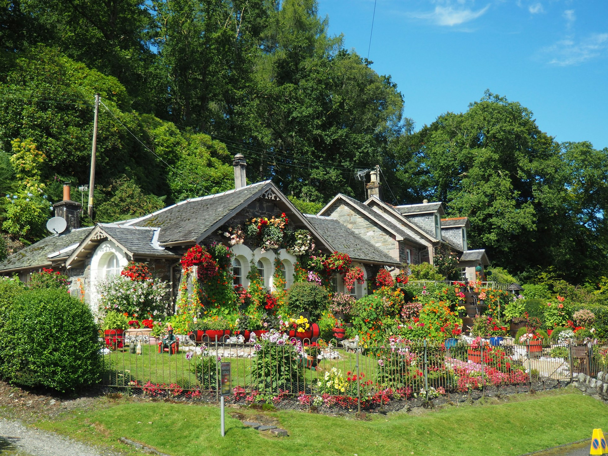

<!-- truncate -->

<h2 className="jump-to">Jump To</h2>

1. **[Find the Perfect Spot to Plant Your Garden Plants](#1-find-the-perfect-spot-to-plant-your-garden-plants-)**
2. **[Prepare the soil – The Key to Successful Gardening](#2-prep-the-soil--the-key-to-successful-gardening)**
3. **[Pick the Best Garden Plants for Your Space](#3-pick-the-best-garden-plants-for-your-space)**
4. **[Start small and Focused](#4-start-small-and-focused)**
5. **[Water Smart to Support Strong Roots](#5-water-smart-to-support-strong-roots)**
6. **[Weed Regularly to Keep Plants Healthy](#6-weed-regularly-to-keep-plants-healthy)**
7. **[Fertilise Right for Healthy Growth](#7-fertilise-right-for-healthy-growth)**
8. **[Extra Gardening Tips for Beginners](#extra-gardening-tips-for-beginners)**

## 7 Essential Gardening Tips for Beginners

      <ReactPlayer className="video__player" controls height="100%" url="https://www.youtube.com/shorts/V1MO1uAHUrQ" width="100%"/>

### 1. Find the Perfect Spot to Plant Your Garden Plants 🌱

When you're learning how to plant a garden, location is everything. Most garden plants thrive in full sun—aim for at least **6 hours of direct sunlight** daily. Walk through your yard to spot the sunniest area. Also, check that the soil drains well and you have easy access to water.

- **Track sunlight daily** – Observe 4–7 a.m., midday, and dusk; note areas with at least six hours of direct sun.
- **Perform a drainage test** – Dig a 12″ deep, 12″ wide hole and fill it with water. It should drain within 30–60 minutes for ideal moisture.
- **Test soil pH** – Use a simple test kit to ensure pH is between 6.0–7.0; amend accordingly if outside that range.
- **Plan water access** – Layout beds or rows within 25 ft of a hose or spigot and ensure no slope traps water.

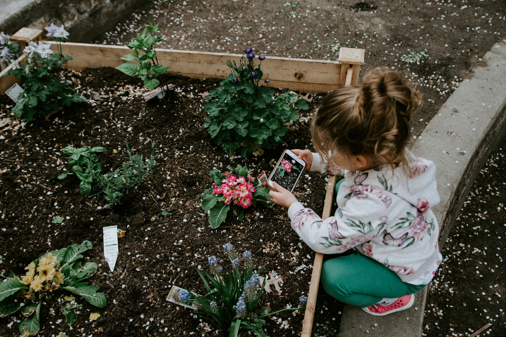

### 2. Prep the Soil – The Key to Successful Gardening

Healthy soil means healthy plants. Clear your patch of weeds, rocks, or debris. Loosen the earth with a shovel or tiller, then enrich it with **[organic compost](https://www.gemebio.com/blogs/journal/garden-soil-vs-compost)**. This boosts nutrients and improves drainage—essential gardening tips for beginners.

- **Clear and loosen soil** – Remove all grass, roots, and rocks; dig down 8–12″ with a shovel or tiller.
- **Double-dig or stump-loosen** – In heavy soil, dig two layers: loosen the bottom with a fork and incorporate compost at each stage.
- **Add organic compost**– Spread 2–3″ of compost or organic matter over the surface, then mix thoroughly to an 8″ depth.
- **Moisten & rest** – Lightly water the bed and let it settle for a week to allow organisms to integrate the amendments.

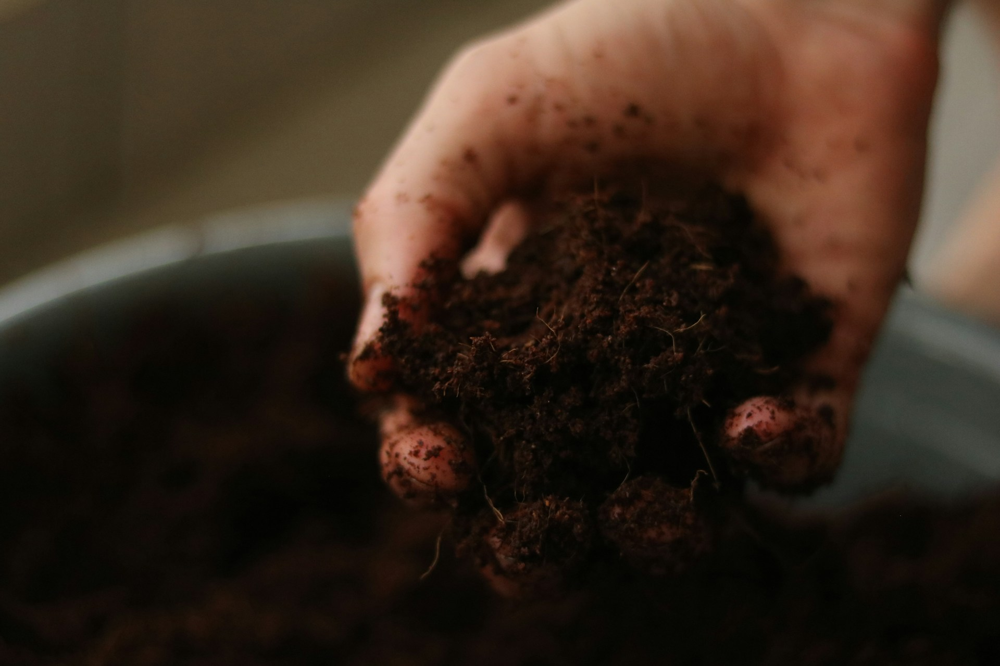

<GemeTerra2CTA 
 imgSrc="/img/geme-terra-2-composter.jpg"
 productTitle="GEME Terra II Composter"
 features={[
    "✅ Best Way Of Composting At Home",
    "✅ Quiet, Odour-Free, Real Compost",
    "✅ Rich Compost Output For Garden Soil & Plants",
    "✅ Reduce Landfill Waste & Greenhouse Gases"
 ]}
buttonText="Get Your GEME Terra II"
  href="https://www.gemebio.com/products/terra2?utm_medium=blog&utm_source=geme_website&utm_campaign=general_seo_content&utm_content=how-to-plant-a-garden-best-gardening-guide-for-beginners"
/>

### 3. Pick the Best Garden Plants for Your Space

Choose garden plants that suit your **climate**, **soil type**, and **light levels**. For those just starting, try easy-to-grow varieties like **lettuce**, **tomatoes**, or **herbs**. These choices give fast results and help boost confidence in gardening.

- **Check your USDA zone** – Pick plant varieties labelled for your zone and the current season.
- **Match plant needs** – Group full‑sun lovers like tomatoes and peppers, and partial‑shade followers like spinach in suitable spots.
- **Start with easy types** – Choose quick-growing, low-maintenance options: lettuce, spinach, cherry tomatoes, basil.
- **Space correctly** – Leave the recommended gap between plants (e.g., 12″ for lettuces, 18–24″ for tomatoes) to prevent crowding.

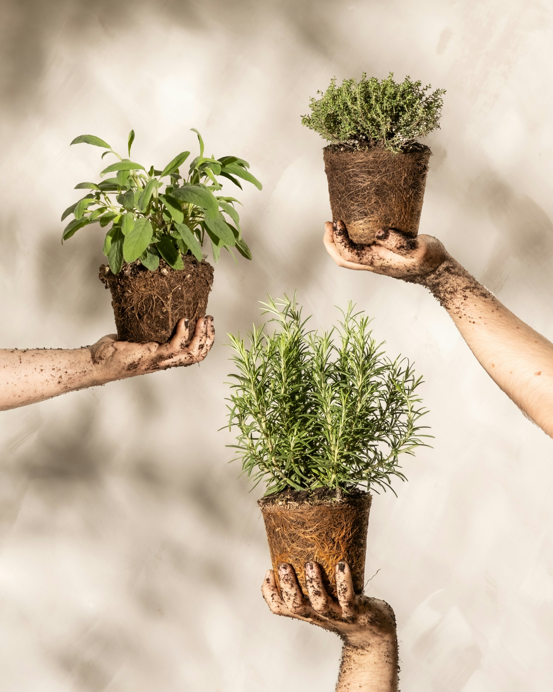

### 4. Start Small and Focused

For beginners, less is more. A compact raised bed or a few containers make managing your first garden easier. This is one of the easiest gardening tips for beginners—grow a little, succeed a lot.

- **Define a planting area** – Begin with a single raised bed (~4×4 ft) or two containers to stay manageable.
- **Sketch a planting map** – Draw each bed on paper, marking plant types and spacing.
- **Use staggered fills** – Mix tall, medium, and low plants (e.g., corn-beans-squash in the "Three Sisters" style) to maximise space.
- **Expand intentionally** – Add another bed or container only after your initial setup thrives.

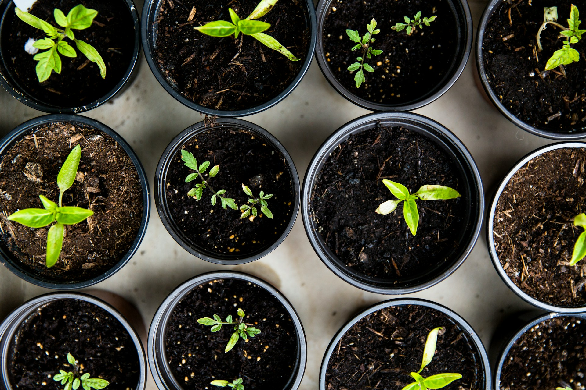

### 5. Water Smart to Support Strong Roots

Young garden plants need consistent moisture, but too much water is harmful. <a href="https://blogs.ifas.ufl.edu/osceolaco/2020/06/24/negative-effects-of-overwatering-plants/" rel="nofollow">**Overwatering**</a> can lead to root rot. 

Water deeply and infrequently—early **in the morning** is best. This encourages roots to grow deeper and makes plants more resilient.

- **Water deeply** – Soak beds until the first 6″ of soil is moist (check by hand).
- **Morning schedule** – Water early (before 9 a.m.) to reduce evaporation and disease risk.
- **Observe soil moisture** – Stick a finger into the soil; if only the top inch is dry, don't water yet.
- **Adjust for weather** – Water less after rainfall; during heatwaves, increase frequency but keep it deep.

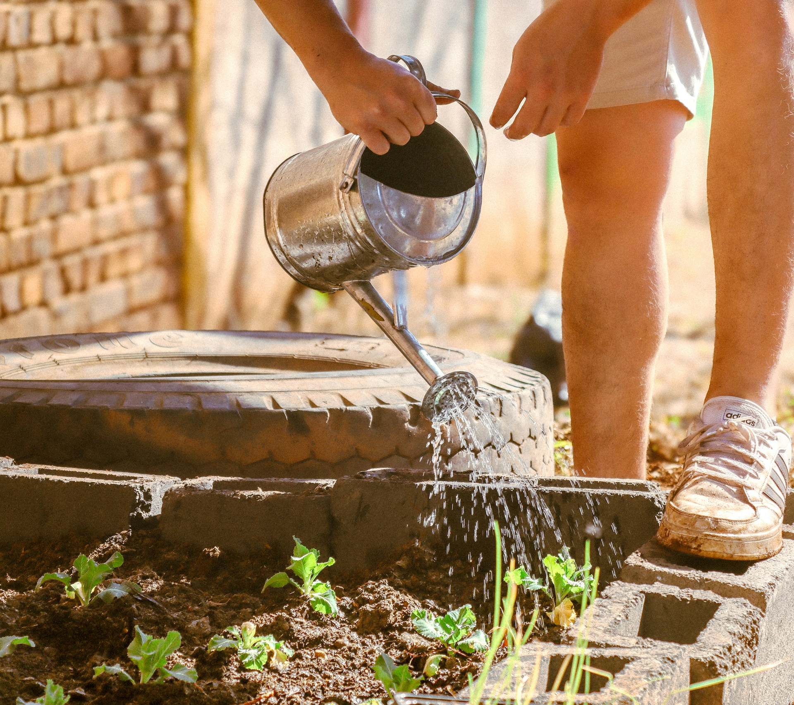

### 6. Weed Regularly to Keep Plants Healthy

Unwanted weeds steal light, nutrients, and water from your garden. Make it a habit to hand-pull or hoe weeds every few days. Applying mulch not only suppresses weeds but also retains moisture—double win!

- **Hand-weed weekly** – Pull weeds before they flower or seed to reduce spread.
- **Apply a mulch layer** – Spread 3″ of straw, leaves, or wood chips, keeping mulch away from stems to prevent rot.
- **Refresh seasonally** – Replenish mulch in spring and after summer to maintain its benefits.
- **Use cardboard barriers** – Place cardboard under new beds before mulching to suppress underlying weeds.

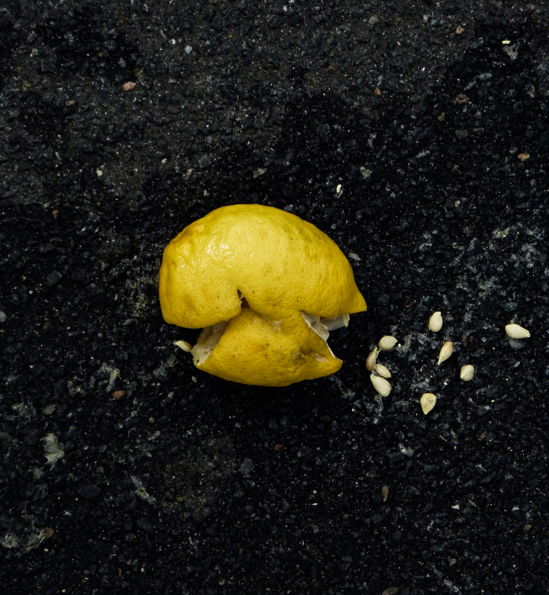

### 7. Fertilise Right for Healthy Growth

Use a balanced, slow-release fertiliser or organic compost to give your garden plants what they need. Follow label instructions to avoid **overfeeding**, which can harm young plants.

      <ReactPlayer className="video__player" controls height="100%" url="https://youtube.com/shorts/dLvHS4BXva4" width="100%"/>

- **Apply slow-release pellets** – Add a balanced granular fertiliser (e.g., 10-10-10) at planting and mid-season.
- **Side-dress vegetables** – When plants are 4″ tall, add a handful of compost or fertiliser 2″ from the base.
- **Feed with liquid nutrients** – Use diluted fish emulsion or compost tea every 4–6 weeks in active growth periods.
- **Monitor plant health** – Yellowing leaves? Cut the fertiliser in half. Excess lush green but no blooms? Add phosphate-rich feed.
- **Organic options:** **[Compost](https://www.geme.bio/blog/preparing-and-using-your-compost)** and other organic fertilisers are great choices.

<GemeComposterCTA 
 imgSrc="/img/geme-bio-composter.jpg"
 productTitle="GEME Bio Composter"
 features={[
    "✅ Best Way Of Composting At Home",
    "✅ Produce Soil-Ready Compost For Garden",
    "✅ Quiet, Odor-Free, Quick(6-8 hours)",
    "✅ Large Capacity (19 L) For Daily Waste"
  ]}
buttonText="Get Your GEME Composter For Tomato Plants"
  href="https://www.gemebio.com/products/geme?utm_medium=blog&utm_source=geme_website&utm_campaign=general_seo_content&utm_content=how-to-plant-a-garden-best-gardening-guide-for-beginners"
/>

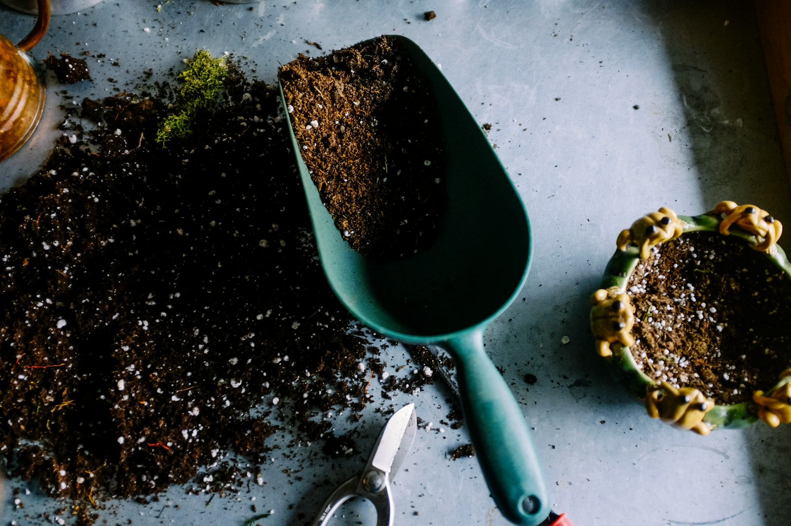

## Extra Gardening Tips for Beginners

### **1. Know Your Soil Type**

Whether it's sandy, clay-heavy, or loamy, your soil's texture affects plant growth. Add compost to sandy soil, and organic amendments to break up dense clay. Loamy soil is ideal—it drains well and holds nutrients.

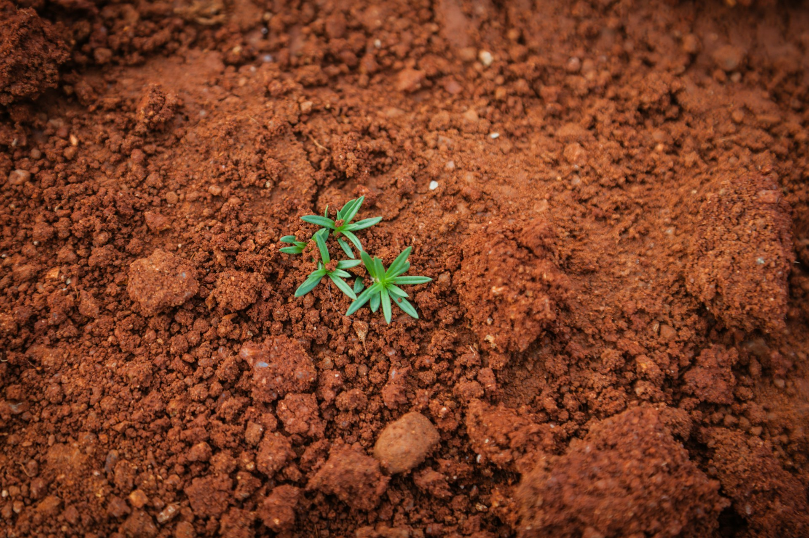

### **2. Invest in Essential Tools**

A few good tools go a long way: a hand trowel, weed fork, sturdy gloves, watering can, and pruning shears. They make day-to-day gardening effortless and enjoyable.

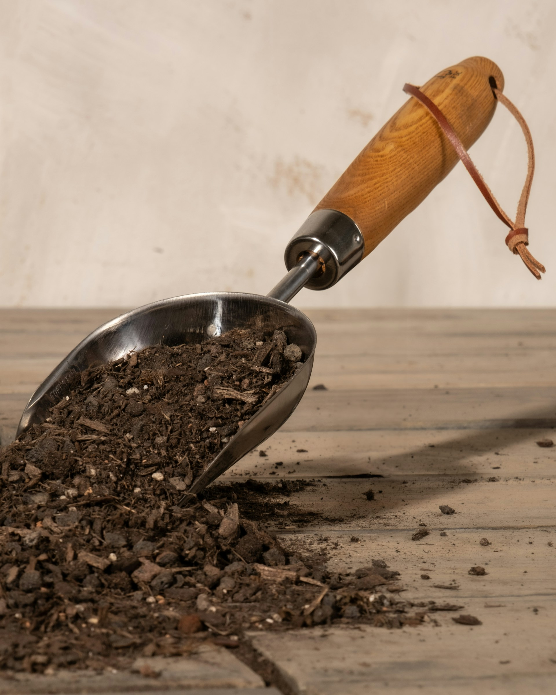

### **3. Handle Pests and Diseases Naturally**

Check leaves regularly for pests or fungal spots. Use organic options like neem oil or insecticidal soap. Improve air flow and avoid overhead watering to reduce disease.

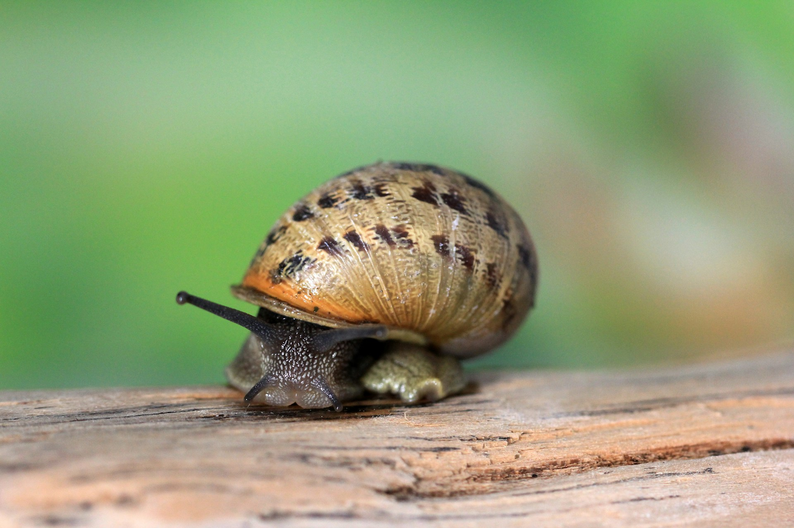

### **4. Embrace Composting**

Turn kitchen food waste and yard waste into nutrient-rich compost that boosts soil fertility. Composting is a powerful, eco-friendly gardening technique. 

[**GEME electric composter**](https://www.gemebio.com) is the best choice for producing rich compost for your garden in 6-8 hours.

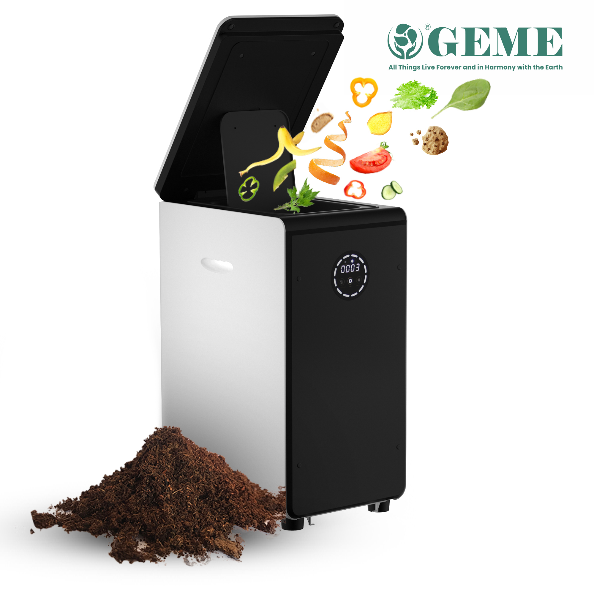

### **5. Use Companion Planting**

Pairing garden plants strategically can naturally deter pests and enhance growth. For example, plant basil alongside tomatoes or marigolds with vegetables to reap mutual benefits.

- **Group mutual friends** – Plant basil with tomatoes to improve flavour and deter pests; marigolds around veggies to repel nematodes 
- **Include nitrogen-fixers** – Position beans or peas next to heavy feeders like brassicas to enrich soil.
- **Balance roots and shade** – Combine deep-rooted (carrots) and shallow-rooted (lettuce) plants; tall beans offer support to squash.
- **Avoid bad pairings** – Don't plant beans near onions, and avoid planting potatoes where squash was last year.

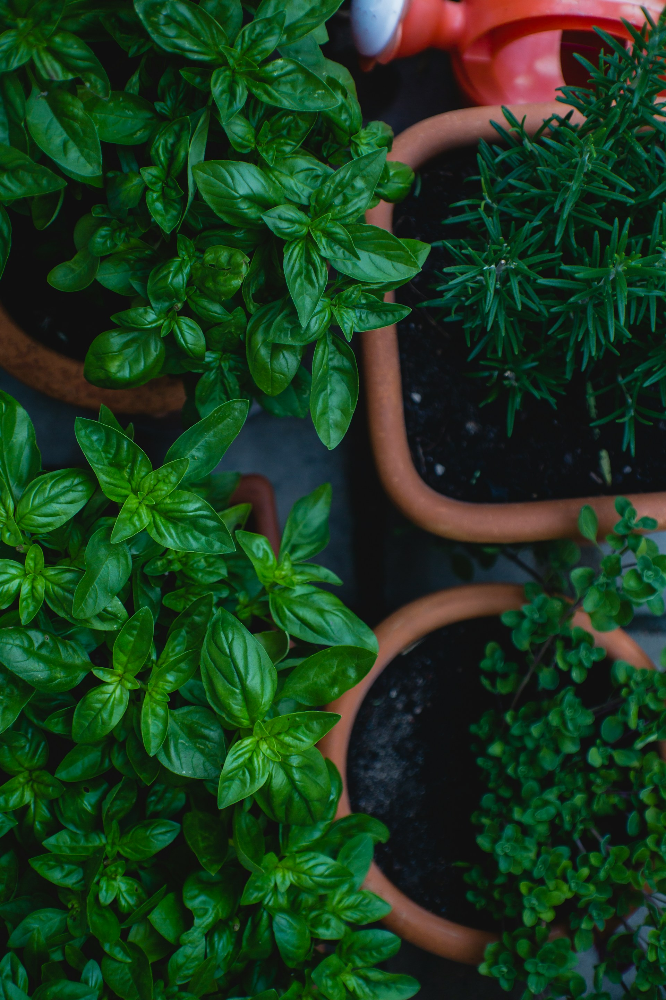

### **6. Extend Your Season**

Start seeds indoors to give your garden an early boost. Use row covers, hoop houses, or raised beds to protect plants from frost and extend growing seasons.

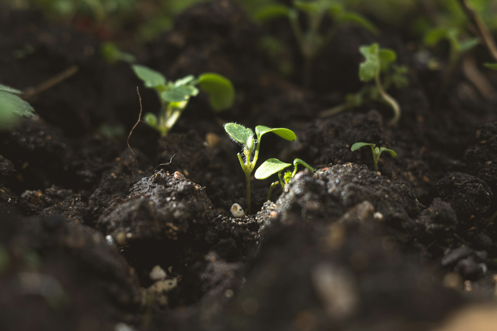

### **7. Harvest at Peak Time**

Harvest vegetables when they're ripe and herbs regularly to encourage fresh growth. Timing matters—pick at peak flavour!

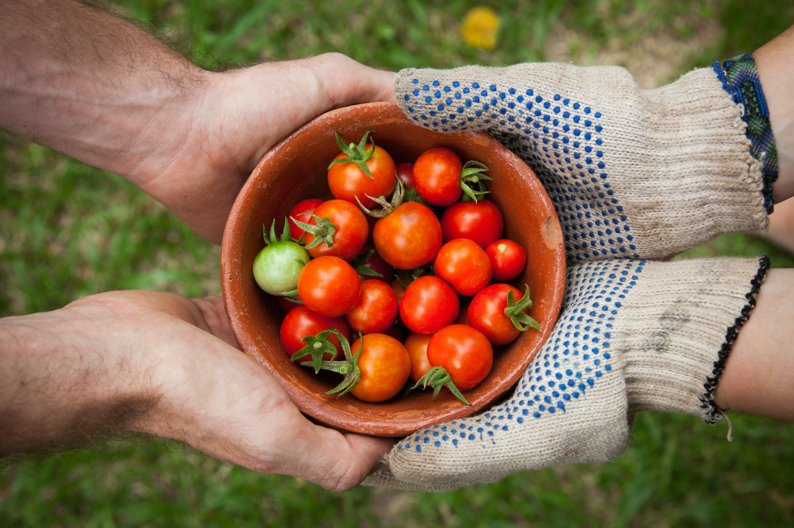

<GemeTerra2CTA 
 imgSrc="/img/geme-terra-2-composter.jpg"
 productTitle="GEME Terra II Composter"
 features={[
    "✅ Best Way Of Composting in Winter",
    "✅ Quiet, Odour-Free, Real Compost",
    "✅ Rich Compost Output For Garden Soil & Plants",
    "✅ Reduce Landfill Waste & Greenhouse Gases"
 ]}
buttonText="Get Your GEME Terra II"
  href="https://www.gemebio.com/products/terra2?utm_medium=blog&utm_source=geme_website&utm_campaign=general_seo_content&utm_content=how-to-plant-a-garden-best-gardening-guide-for-beginners"
/>

## Final Thoughts on How to Plant a Garden

Learning how to plant a garden and integrating effective gardening tips for beginners sets you up for success. 

Focus on choosing a good location, preparing top-quality soil, selecting the right garden plants, and giving them consistent care. 

Start small, stay consistent, and enjoy watching your green space flourish. Happy gardening! 🌷

## Related Articles

- [The Best Composter to turn food waste into rich compost for your garden](/blog/the-best-composter-to-reduce-food-waste)

- [Garden Soil VS Compost Pros & Cons](https://www.gemebio.com/blogs/journal/garden-soil-vs-compost)

- [When is your compost ready to use?](https://www.gemebio.com/blogs/journal/when-is-compost-ready-to-use)

---

_Ready to transform your gardening game? Subscribe to our [newsletter](http://geme.bio/signup) for expert composting tips and sustainable gardening advice._