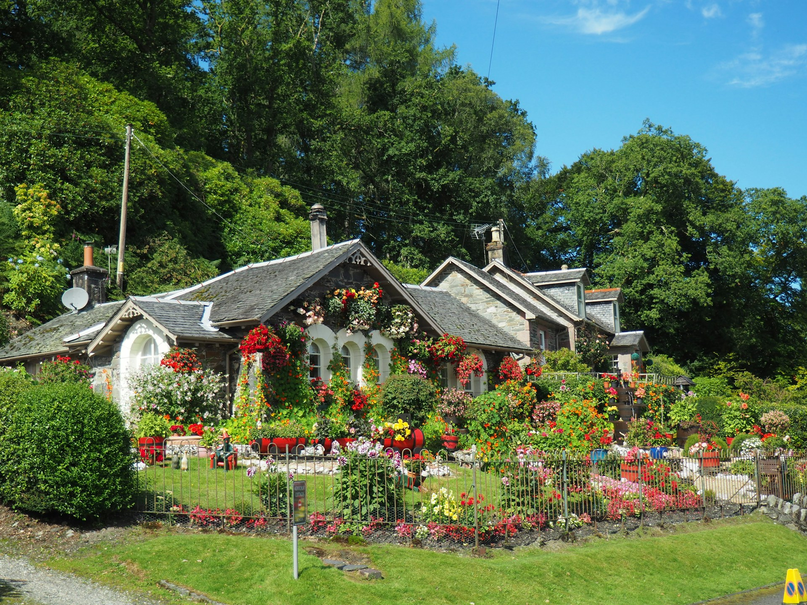

<head >
    <!--meta charSet="utf-8" />
    <meta name="twitter:card" content="summary_large_image" />
    <meta data-rh="true" property="og:image" content="https://www.geme.bio/assets/images/1-e9a4d07b7def7cd5b62ebd2a06b68f36.png" />
    <meta data-rh="true" name="twitter:image" content="https://www.geme.bio/assets/images/1-e9a4d07b7def7cd5b62ebd2a06b68f36.png" />
    <meta data-rh="true" property="og:url" content="https://www.geme.bio/assets/images/1-e9a4d07b7def7cd5b62ebd2a06b68f36.png" />
    <meta data-rh="true" property="og:locale" content="en"/-->
</head>

import Columns from '@site/src/components/Columns'
import Column from '@site/src/components/Column'
import ReactPlayer from 'react-player'

Gardening can seem daunting if you're just starting out. But don't worry! It's a rewarding hobby that anyone can enjoy. This guide provides simple gardening tips to help beginners learn how to plant a garden and grow beautiful garden plants. Let's get started!

## **Overview: How to Plant and Take Care of Different Types of Plants**

| Plant Type    | Planting Time | Sunlight Needs | Watering          | Soil Type            | Fertilising        | Common Problems            |
| ------------- | ------------- | -------------- | ----------------- | -------------------- | ------------------ | -------------------------- |
| Tomatoes      | Spring        | 6-8 hours      | Deeply, 1-2x/week | Well-draining, rich  | Every 2-3 weeks    | Blight, pests              |
| Lettuce       | Spring/Fall   | 4-6 hours      | Regularly, daily  | Moist, well-drained  | Every 3-4 weeks    | Slugs, aphids              |
| Herbs (Basil) | Spring        | 6+ hours       | Regularly, daily  | Well-drained         | Monthly            | Pests, mildew              |
| Carrots       | Spring/Fall   | 6+ hours       | Regularly, daily  | Loose, sandy         | Not usually needed | Pests, forking             |
| Zucchini      | Spring        | 6-8 hours      | Deeply, 1-2x/week | Well-draining, rich  | Every 2-3 weeks    | Powdery mildew             |
| Strawberries  | Spring/Fall   | 6+ hours       | Regularly, daily  | Well-drained, acidic | Monthly            | Birds, rot                 |
| Sunflowers    | Spring        | 6-8 hours      | Deeply, 1x/week   | Well-draining        | Not usually needed | Pests, diseases            |
| Lavender      | Spring        | 6+ hours       | Sparingly         | Well-drained, sandy  | Not usually needed | Root rot                   |
| Roses         | Spring        | 6+ hours       | Deeply, 1x/week   | Well-draining, rich  | Every 4-6 weeks    | Black spot, aphids         |
| Blueberries   | Spring        | 6+ hours       | Regularly, daily  | Well-drained, acidic | Every 4-6 weeks    | Birds, nutrient deficiency |

<!-- truncate -->

<h2 className="jump-to">Jump To</h2>

1. **[Choose the right location](#1-choose-the-right-location)**
2. **[Prepare the soil](#2-prepare-the-soil)**
3. **[Select the right garden plants](#3-select-the-right-garden-plants)**
4. **[Start small](#4-start-small)**
5. **[Water Properly](#5-water-properly)**
6. **[Control weeds](#6-control-weeds)**
7. **[Fertilise regularly](#7-fertilise-regularly)**
8. **[7 More detailed gardening tips](#more-detailed-gardening-tips)**

## 7 Essential Gardening Tips for Beginners

      <ReactPlayer className="video__player" controls height="100%" url="https://www.youtube.com/shorts/V1MO1uAHUrQ" width="100%"/>

### 1. Choose the Right Location

The first step of how to plant a garden is selecting the perfect spot. Most garden plants need at least **6 hours of sunlight** per day. Observe your yard throughout the day to see where the sun shines the most. Also, consider **soil quality** and **drainage**. Avoid areas where water pools are after rain.

- **Sunlight:** Essential for plant growth.
- **Soil:** Should be well-draining and fertile.
- **Water access:** Easy access to a water source is crucial.

### 2. Prepare the Soil

Good soil is the foundation of a healthy garden. Before planting, prepare the soil by removing any rocks, weeds, and debris. You can improve soil quality by **[adding compost](https://www.geme.bio/blog/garden-soil-vs-compost-pros-and-cons#how-to-use-garden-soil-and-compost-effectively)** (DoFollow) or other organic matter. This will provide essential nutrients for your garden plants.

- **Remove debris:** Clear the area of rocks, weeds, and trash.
- **Add** **compost****:** Improves soil fertility and drainage.
- **Till the soil:** **Loosen the soil** to allow roots to grow easily.

### 3. Select the Right Garden Plants

Choosing the right garden plants is crucial for success. Consider your **local climate**, soil type, and the amount of sunlight your garden receives. Start with easy-to-grow plants like **herbs**, **lettuce**, and **tomatoes**. These are great for beginners and provide quick results.

- **Climate:** Choose plants that thrive in your region.
- **Soil type:** Match plants to your soil's pH and composition.
- **Sunlight:** Select plants that match the amount of sunlight available.

### 4. Start Small

When learning how to plant a garden, it's best to start small. A small garden is easier to manage and less overwhelming. You can always expand later as you gain experience. Starting with a few raised beds or containers is a great way to begin your gardening journey.

- **Manageable size:** Easier to maintain and less overwhelming.
- **Raised beds:** Provide good **drainage** and **soil control**.
- **Containers:** Allow you to garden in small spaces.

### 5. Water Properly

Proper watering is essential for healthy garden plants. Water deeply and less frequently, rather than shallowly and often. This encourages roots to grow deeper and makes plants more drought-tolerant. **Water in the morning** to reduce evaporation and prevent fungal diseases.

- **Deep watering:** Encourages deep root growth.
- **Morning watering:** Reduces evaporation and disease.
- **Avoid overwatering****:** [Overwatering](https://blogs.ifas.ufl.edu/osceolaco/2020/06/24/negative-effects-of-overwatering-plants/) (NoFollow) can lead to root rot.

### 6. Control Weeds

Weeds compete with your garden plants for water, nutrients, and sunlight. Regularly remove weeds by hand or use mulch to suppress their growth. Mulch also helps retain moisture in the soil.

- **Hand weeding:** Effective for small gardens.
- **Mulch:** Suppresses weeds and retains moisture.
- **Regular maintenance:** Prevents weeds from taking over.

### 7. Fertilise Regularly

Garden plants need nutrients to grow and thrive. Fertilise your plants regularly with a balanced fertiliser. Follow the instructions on the fertiliser package and **avoid over-fertilising**, which can damage your plants.

      <ReactPlayer className="video__player" controls height="100%" url="https://youtube.com/shorts/dLvHS4BXva4" width="100%"/>

- **Balanced** fertiliser**:** Provides essential nutrients.
- **Follow instructions:** Avoid over-fertilising.
- **Organic options:** **[Compost](https://www.geme.bio/blog/preparing-and-using-your-compost)** (DoFollow) and other organic fertilisers are great choices.

## **More Detailed Gardening Tips**

### 1. Understanding Soil Types

Different garden plants thrive in different soil types. Common soil types include sandy, silty, clay, and loamy. Sandy soil is well-draining but doesn't retain nutrients well. Clay soil retains water but can be poorly draining. Loamy soil is a balanced mix of sand, silt, and clay, making it ideal for most garden plants.

- **Sandy soil:** Well-draining, low in nutrients
- **Clay soil:** Retains water, can be poorly draining.
- **[Loamy soil](https://en.wikipedia.org/wiki/Loam)** (NoFollow)**:** Balanced mix, ideal for most plants.

### 2. Choosing the Right Tools

Having the right tools can make gardening much easier. Essential tools include a trowel, hand fork, gardening gloves, watering can, and pruning shears. Invest in quality tools that will last for years.

- **Trowel:** For digging small holes.
- **Hand fork:** For loosening soil and removing weeds.
- **Gardening gloves:** Protect your hands.
- **Watering can:** For watering plants gently.
- **Pruning** **shears:** For trimming and pruning plants.

### 3. Dealing with Pests and Diseases

Pests and diseases can damage your garden plants. Regularly inspect your plants for signs of trouble. Use organic pest control methods like [insecticidal soap](https://en.wikipedia.org/wiki/Insecticidal_soap) (NoFollow) or [neem oil](https://en.wikipedia.org/wiki/Neem_oil) (NoFollow) to control pests. Prevent diseases by providing **good air circulation** and **avoiding overwatering**.

- **Insecticidal soap:** Controls many common pests.
- **Neem oil:** A natural insecticide and fungicide.
- **Good air circulation:** Prevents fungal diseases.

### 4. Composting for Beginners

**Composting** is a great way to recycle kitchen and yard waste into nutrient-rich soil for your garden plants. Start a compost bin or **[electric composter](http://www.geme.bio)** and add materials like vegetable scraps, coffee grounds, and leaves. 

- **Compost** **bin****:** A simple way to compost yard waste, but it can take a longer time (a month or two). 
- **Electric composter:** For the fastest (**6-8 hours**) and the best compost output to improve the health of the soil.

### 5. Companion Planting

Companion planting involves growing different garden plants together that benefit each other. For example, planting basil near tomatoes can help repel pests. Marigolds can also deter nematodes in the soil.

- **Basil and tomatoes:** Basil repels pests that attack tomatoes.
- **Marigolds:** Deter nematodes in the soil.
- **Consult a guide:** Learn which plants make good companions.

### 6. Extending the Growing Season

You can extend your gardening season by using techniques like **starting seeds indoors**, using row covers, and planting in raised beds. Starting seeds indoors allows you to get a head start on the growing season. Row covers protect plants from frost and pests.

- **Start seeds indoors:** Get a head start on the growing season.
- **Row covers:** Protect plants from frost and pests.
- **Raised beds:** Warm up faster in the spring.

### 7. Harvesting Your Garden Plants

Harvesting your garden plants at the right time is crucial for getting the best flavour and yield. Harvest vegetables when they are ripe and at their peak. Regularly harvest herbs to encourage new growth.

- **Harvest at peak ripeness:** For best flavour and yield.
- **Regularly harvest herbs:** Encourages new growth.
- **Consult a guide:** Learn when to harvest specific plants.

## **Conclusion**

Learning how to plant a garden is a rewarding experience. By following these gardening tips, even beginners can create a thriving garden. Remember to choose the right location, prepare the soil, select appropriate garden plants, and provide **regular care**. Happy gardening!