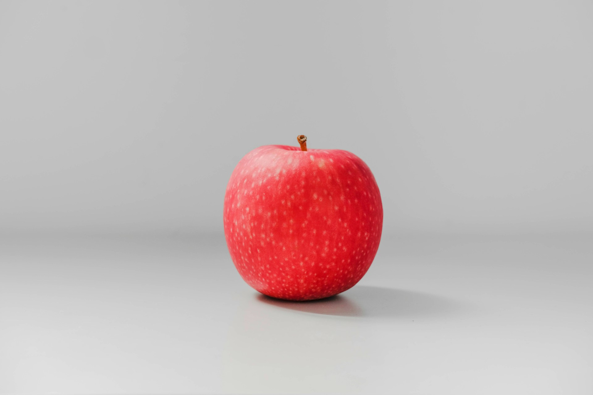
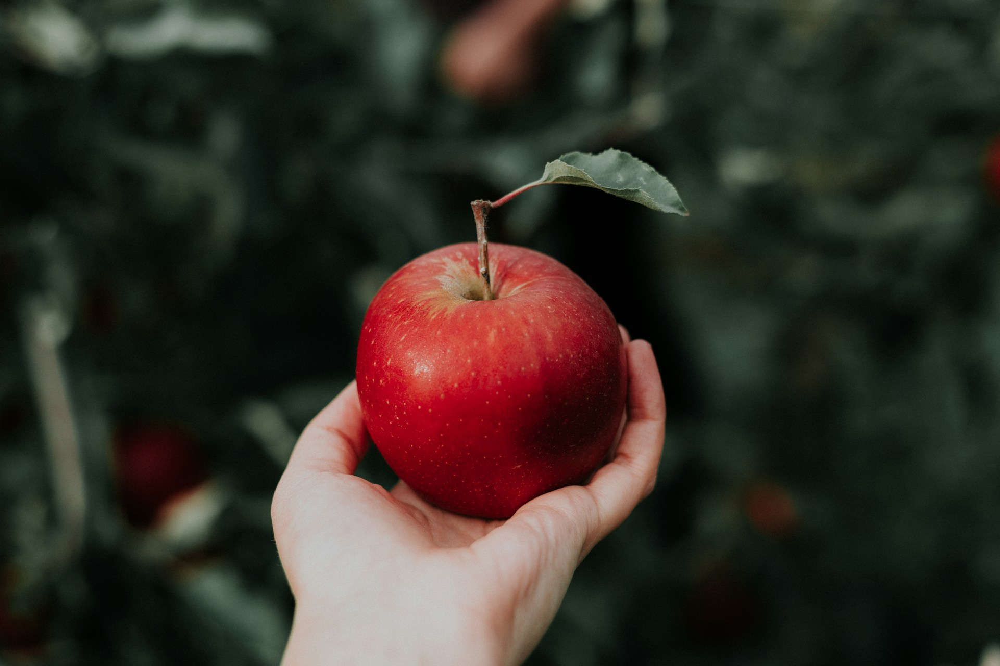

import GemeComposterCTA from '@site/src/components/GemeComposterCTA'
import GemeTerra2CTA from '@site/src/components/GemeTerra2CTA' 

A fresh, whole apple is safe to store at room temperature for about one week, but once you cut it, it must be refrigerated, unless it is cooked into a pie. Then you can store it at room temperature for up to two days.

These varying storage conditions for fresh produce are dependent on several things, including:

- **Pathogens**. Some produce is more likely to harbour pathogens, so it is recommended that it be refrigerated to limit their growth. Apple, for example, should be stored in the refrigerator because it is more likely to allow pathogens to grow than many other types of produce.

- **Humidity**. Some types of apples lose water quickly and need a low-humidity level to help them retain their water, such as in the produce drawer of the refrigerator.
- **Ethylene content**. Ethylene causes apples to ripen fast, and cold storage decreases the release of ethylene. Storing apples in the refrigerator, therefore, will just extend their shelf life.
- **Cool temperatures**. This can prevent some apples from achieving a good flavour or texture. For example, apples can lose their flavour when refrigerated or bananas turn black and do not ripen properly.

<!-- truncate -->

## 🧊 How Long Do Apples Last in the Fridge?

1. Whole apples stored in a refrigerator's crisper drawer (**around 30–35°F**) generally stay crisp and tasty for **6 to 8 weeks**, and some hardier varieties may last even longer.

2. Specific varieties like Granny Smith, Fuji, McIntosh, and Cosmic Crisp often hold up well for **2 to 3 months** when conditions are ideal.
3. On the countertop, apples typically remain fresh for about **1–2 weeks** before becoming soft or mealy.
4. Cut apples should go into an airtight container, be lightly coated with lemon juice to prevent browning, and be consumed within **3–5 days** with optimal freshness.

<GemeTerra2CTA 
 imgSrc="/img/geme-terra-2-composter.jpg"
 productTitle="GEME Terra II Composter"
 features={[
    "✅ Best Way Of Composting in Winter",
    "✅ Quiet, Odour-Free, Real Compost",
    "✅ Rich Compost Output For Garden Soil & Plants",
    "✅ Reduce Landfill Waste & Greenhouse Gases"
 ]}
buttonText="Get Your GEME Terra II"
  href="https://www.geme.bio/product/terra2?utm_medium=blog&utm_source=geme_website&utm_campaign=general_seo_content&utm_content=how-long-do-apples-last-in-the-fridge"
/>

## 🍏 Overview Table: Storage Life by Apple Type & Situation

| Apple Type / Condition                                         | Countertop | Fridge Crisper Drawer | Long-Term Storage (Cool, Dark) | Cut Apples (Fridge) |
| -------------------------------------------------------------- | ---------- | --------------------- | ------------------------------ | ------------------- |
| Standard varieties (Gala, Fuji)                                | 5–7 days   | 6–8 weeks             | 3–6 months                     | 3–5 days            |
| Crisp/thick-skinned (Granny Smith, Honeycrisp, Braeburn, Rome) | 5–7 days   | 8–12 weeks            | 6–9 months                     | 3–5 days            |
| Thin-skinned (Golden Delicious)                                | 3–5 days   | 4–6 weeks             | 2–4 months                     | 2–4 days            |
| Bruised or damaged apples                                      | 2–3 days   | 1–2 weeks             | ❌                             | ❌                  |

## Check the Overview of Apple Storage Recommendations

| Type of Apple                                               | Storage Recommendation                                                          | Reason                                                                                                                                                                                                                                                                                                                                                                                                     |
| ----------------------------------------------------------- | ------------------------------------------------------------------------------- | ---------------------------------------------------------------------------------------------------------------------------------------------------------------------------------------------------------------------------------------------------------------------------------------------------------------------------------------------------------------------------------------------------------- |
| Fresh, whole apples                                         | Room temperature is safe, but can also store in the refrigerator to last longer | Apples are safe at room temperature, but their higher ethylene content contributes to faster ripening. Apples stored in the refrigerator can last for several weeks.                                                                                                                                                                                                                                       |
| Cut apples or apples in a modified form, such as applesauce | Refrigerator                                                                    | Cut produce is more susceptible to pathogens, so storing in the refrigerator can limit pathogen growth.                                                                                                                                                                                                                                                                                                    |
| Baked apple pie                                             | Room temperature for up to two days; Refrigerator for up to four days           | Fruit pies are made with sugar and the combination of sugar and acid in the fruit is sufficient to retard bacterial growth at room temperature. You can extend this shelf life a little by storing in the refrigerator. Keep in mind though, any pies made with custard, cream, eggs or sugar substitutes, or contain fresh fruit (like a strawberry pie that was not baked) always require refrigeration. |

<h2 className="jump-to">Jump To</h2>

1. **[How long do apples last in the fridge?](#-how-long-do-apples-last-in-the-fridge)**
2. **[How to store apples for maximum freshness](#how-to-store-apples-for-maximum-freshness)**
3. **[How to know when apples have gone bad?](#how-to-know-when-apples-have-gone-bad)**
4. **[How to store apples for the long term?](#how-to-store-apples-for-the-long-term-even-without-a-fridge)**
5. **[How to keep apples fresh for months](#how-to-keep-apples-fresh-for-months)**
6. **[Can I compost bad apples?](#can-i-compost-bad-apples)**
7. **[Bonus Tips and Q&A](#bonus-tips--qa)**
8. **[Summary of key tips](#summary-of-key-tips)**

## How Long Do Apples Last in the Fridge?

### 1. Whole Apples: Typical Fridge Lifespan

When stored in the fridge's crisper drawer at around 30–35°F, most apples stay fresh for 6–8 weeks, and in some cases up to 3 months.

### 2. Impact of Apple Variety

- **Thick-skinned, tart types (Granny Smith, Honeycrisp)**: Stay crisp for 8–12 weeks, and sometimes 6–9 months in optimal conditions.

- **Thin-skinned, sweet varieties (Golden Delicious)**: Typically last 4–6 weeks before softening noticeably.

### 3. Countertop vs. Fridge

Apples left on the countertop typically last 5–7 days (max 1–2 weeks under cool indoor conditions). Once refrigerated, their storage life increases by a factor of 6–10 times.

## How to Store Apples for Maximum Freshness

### Optimal Fridge Conditions

- **Temperature**: 30–35 °F (−1 to 2 °C) in the crisper drawer.
- **Humidity**: Aim for 90% RH to prevent shrinking—use your drawer's humidifier or add a damp paper towel.
- **Airflow**: Use ventilated plastic bags or store apples in a single layer to reduce moisture buildup.

### Avoiding Ethylene Damage

Apples emit ethylene, which accelerates ripening. Store them in a separate drawer or bag to prevent premature spoilage of other fruits and veggies.
Handle with Care

- Don't wash apples before storage; preserve the natural waxy coating.
- Check weekly, removing any bruised or soft apples to prevent rapid spoilage.

## How to Know When Apples Have Gone Bad

Top signs include:

1. **Soft spots or shrivelling**: Fruit becomes mealy, still edible, but lacks freshness.
2. **Visible mould or large brown patches**: Throw out immediately—these are definite signs of spoilage.
3. **Sour or fermented smell**: A strong vinegar or alcoholic scent indicates the apple has spoiled.
4. **Texture changes**: Mushy flesh or leaking juices are red flags.

#### 👉 Is it safe to eat a bad apple?

If it's only slightly soft, you can cut away the bad part and cook or bake it. If it's mouldy, sour-smelling, or slimy, don't risk foodborne illness; add it in the GEME food waste composter to produce rich compost for your garden soil's health.

## How to Store Apples for the Long Term, Even Without a Fridge

**Cold Storage (Root Cellar, Garage, Basement)**

- **Temperature**: 30–40°F, with high humidity.
- **Individual wrapping**: Wrap each apple in newsprint or newspaper, and layer with sawdust or sand to prevent ethylene buildup, following a traditional method shown to preserve well for 5+ months.

**Newspaper + Sand/Basket Method**

An 18th-century layering method uses a ventilated basket with sawdust or dry sand, plus wrapped apples, keeping freshness for 4–6 months.

<GemeTerra2CTA 
 imgSrc="/img/geme-terra-2-composter.jpg"
 productTitle="GEME Terra II Composter"
 features={[
    "✅ Best Way Of Composting in Winter",
    "✅ Quiet, Odour-Free, Real Compost",
    "✅ Rich Compost Output For Garden Soil & Plants",
    "✅ Reduce Landfill Waste & Greenhouse Gases"
 ]}
buttonText="Get Your GEME Terra II"
  href="https://www.geme.bio/product/terra2?utm_medium=blog&utm_source=geme_website&utm_campaign=general_seo_content&utm_content=how-long-do-apples-last-in-the-fridge"
/>

## How to Keep Apples Fresh for Months

**To extend shelf life**:

- Choose **thick-skinned, crisp varieties**. They handle storage better.

- **Wrap and separate**: Prevent bruising and ethylene buildup by wrapping and spacing fruit.
- **Dark & cool storage**: Cool cellar, garage, or food fridge — keep airflow steady.

## What About Cut Apples?

- Use airtight containers or resealable bags immediately after cutting.

- To prevent browning, brush with lemon juice before sealing.
- Store in the fridge and use it within 3–5 days.

## Can I Compost Bad Apples?

Yes! Composting spoiled apples is eco-friendly and safe with the GEME home composter.

### 🛒 Get Your GEME Composter Now

<GemeComposterCTA 
 imgSrc="/img/geme-bio-composter.jpg"
 productTitle="GEME Bio Composter"
 features={[
    "✅ Best Way Of Composting At Home",
    "✅ Produce Soil-Ready Compost For Garden",
    "✅ Quiet, Odor-Free, Quick(6-8 hours)",
    "✅ Large Capacity (19 L) For Daily Waste"
  ]}
buttonText="Get Your GEME Composter For Tomato Plants"
  href="https://www.geme.bio/product/geme?utm_medium=blog&utm_source=geme_website&utm_campaign=general_seo_content&utm_content=how-long-do-apples-last-in-the-fridge"

You might be wondering if the spoiled or mouldy apples would interfere with the Kobold microbes? Bacteria are so tiny that the GEME composter capacity is large enough (19L) for them to coexist. It's like putting two groups of ants in a forest full of food. They don't even have a chance to meet.

- Add the bad apples and other food waste in the composter (remember to add the provided Kobold), then turn the machine on and wait for 6-8 hours.
- Once done, wait for several hours for the compost to be further matured and then start adding to your garden soil. This will improve the health of your garden soil and plants.

## Bonus Tips & Q&A

### 1. Can I Eat a Slightly Soft Apple?

Yes, as long as there's no mould or off smell, soft apples are okay for smoothies, baking, or sauces.

### 2. Is It Safe to Eat a Bad Apple?

No, mouldy or sour apples can carry harmful moulds or bacteria. Drop them in the GEME Electric Composter to make nutrient-rich compost for your plants.

### 3. Composting vs. Feeding Bad Apples to Animals

Composting is best. GEME is the world's first biowaste composter, integrated with UV-C light and processing with Kobold Heating Fermentation, which kills most harmful bacteria, including Salmonella.

### 4. Apple Use-By Timetable

- Entire apple: Up to 8–12 weeks in fridge (varies by type)
- Cut apple: 3–5 days refrigerated
- Soft apple: Fine after trimming
- Mouldy, sour apple: Compost

### 5. Is Apple Bad For Dogs to Eat?

#### Can Dogs Eat Apples? **Yes — With Caution⚠️**

Apples can be a safe, nutritious snack for dogs if prepared correctly. Remove seeds and cores, slice safely, serve in moderation, and watch for adverse reactions.

When handled properly, apple slices can even support dental health and hydration.

<GemeTerra2CTA 
 imgSrc="/img/geme-terra-2-composter.jpg"
 productTitle="GEME Terra II Composter"
 features={[
    "✅ Best Way Of Composting in Winter",
    "✅ Quiet, Odour-Free, Real Compost",
    "✅ Rich Compost Output For Garden Soil & Plants",
    "✅ Reduce Landfill Waste & Greenhouse Gases"
 ]}
buttonText="Get Your GEME Terra II"
  href="https://www.geme.bio/product/terra2?utm_medium=blog&utm_source=geme_website&utm_campaign=general_seo_content&utm_content=how-long-do-apples-last-in-the-fridge"
/>

#### Benefits of apples for dogs:

- Packed with vitamins A & C, fibre, antioxidants, and hydration from high water content—plus a crunchy texture that helps clean teeth.
- Great as occasional healthy treats, especially in place of high-calorie snacks.

While apples are generally safe and even healthy for dogs, there are important precautions to keep in mind:

#### 🚫 Risks: Seeds, Cores, and Overfeeding

**Apple Seeds & Cores**

- Seeds contain trace cyanide, toxic in sufficient quantities, but a few seeds won't harm most dogs.
- Cores are choking hazards and can cause digestive blockages.

**Moderation Is Key**

- Apples are high in natural sugars and fibre; too much can cause diarrhoea or stomach upset.
- Treats (including apples) should be no more than 10% of a dog's daily calories.

#### ✅ Safe Feeding Guidelines

- Wash thoroughly to remove pesticides.
- Remove the core, seeds, and stem before serving.
- Cut into bite-sized pieces—about ¼–½″ chunks depending on your dog's size.
- Start small and monitor for upset stomach—gradually increase servings if well tolerated.

#### ⚠️ What to Do If Your Dog Eats Seeds or Core

- A small amount of seeds or core is unlikely to cause serious harm.
- Avoid giving whole apples or large amounts of seeds regularly.
- If your dog shows symptoms like choking, vomiting, diarrhoea, or difficulty breathing, contact a veterinarian promptly.

#### 🍽️ Portion Size Guide (Per Dog Size)

- Extra-small (2–10 lbs): 1–2 small apple pieces
- Small (11–20 lbs): 2–4 pieces
- Medium (21–50 lbs): 4–10 pieces
- Large (51–90 lbs): 10–18 pieces
- Extra-large (91+ lbs): a small handful — up to around ¼ cup

#### ❓ Additional FAQs

- **Can dogs eat apple skin?** Yes, clean skin contains fibre and antioxidants, but peeling helps if your dog has a sensitive stomach.
- **What about dried apples or applesauce?** Avoid store-bought versions high in sugar; plain homemade applesauce or dehydrated slices are okay in small amounts.
- **Choking concerns?** Always cut into pieces; remove core and seeds to prevent choking and GI issues.

#### 🚀 Quick Summary Checklist

- ✅ Wash, then core and seed the apple
- ✅ Slice into small, bite-sized pieces
- ✅ Feed in moderation—no more than 10% of daily calories
- ⚠️ Avoid skin only for overly sensitive dogs
- 🚨 Seek vet care if symptoms follow ingestion of seeds or other parts

## 6. Apples Can Be Recalled By The FDA Sometimes

In 2025, there were 3 Food Recalls issued by the FDA, which were cucumber, tomato, and egg. These products were contaminated with Salmonella, harmful bacteria that cause infections and severe symptoms.

While apples are not commonly recalled due to Salmonella contamination, there was one last year due to misbranding and undeclared wheat allergen. Hence, washing your apples thoroughly before you eat by [**USDA standards**](https://ask.usda.gov/s/article/How-should-fresh-produce-be-washed-before-eating) (in a sanitising solution) is also another important matter, even if your apples are still fresh.

## Expert Recommendations for Keeping Apples Fresh

1. Refrigerate whole apples in a crisper drawer at **30–35°F**, **90% humidity**
2. Prevent spoilage by **removing damaged fruit regularly**.
3. **Wrap and layer apples in a cold cellar** to extend their life up to half a year.
4. **Only eat apples that are firm and unspoiled** to avoid any that are mouldy, sour, or mushy.

## Summary of Key Tips

- **How to store apples**: Keep whole fruit unwashed, in the fridge's crisper, below 35°F.
- **How to know when apples have gone bad**: Look for soft spots, shrivelled skin, or browning—discard if suspicious.
- **How to keep apples fresh for months**: Store crisp varieties in cool, humid, and separate spots in the refrigerator.
- **Is it safe to eat a bad apple?** Slightly soft apples can be used in cooking, but avoid mouldy or foul-smelling ones.
- **Can I compost bad apples?** Yes, you don't have to cut out anything part of the bad apples when composting with GEME Composter.
- **Is apple bad for dogs to eat?** Not really, but with caution as mentioned above.

## Final Thoughts

Properly stored—especially in your fridge or a cool cellar—apples can remain crisp and tasty for months.

With the right conditions, you can enjoy fresh fruit, minimise waste, and confidently deal with apples that have gone bad. Composting spoiled fruit can even enrich your garden sustainably.

---

## Sources

1. [Produce storage confusion: Why refrigerate this and not that?](https://www.canr.msu.edu/news/produce-storage-confusion-why-refrigerate-this-and-not-that/)
2. [How to Store Apples](https://www.gardenersworld.com/how-to/grow-plants/how-to-store-apples/)
3. [This 18th-century food storage hack could keep produce fresh for months](https://nypost.com/2025/04/26/lifestyle/this-18th-century-food-storage-hack-could-keep-produce-fresh-for-months/)
4. [How Long Do Apples Last?](https://www.healthline.com/nutrition/how-long-do-apples-last/)
5. [Should Apples Be Refrigerated?](https://www.southernliving.com/should-apples-be-refrigerated-7511343)
6. [Can Dogs Eat Apples?](https://www.akc.org/expert-advice/nutrition/can-dogs-eat-apples/)
7. [Apple Recall Due to Misbranding and Undeclared Allergen](https://www.fsis.usda.gov/recalls-alerts/taylor-farms-pacific-recalls-kroger-brand-ready-eat-apple-walnut-chicken-salad-bowl)

## Related Articles

- [The Best Composter to turn food waste into rich compost for your garden](/blog/the-best-composter-to-reduce-food-waste)

- [FDA Tomato Recall Salmonella](/blog/fda-tomato-recall-salmonella-outbreak-raises-concerns-about-vegetable)

- [Is It Ok To Put Mouldy Apples in GEME Composter](https://www.geme.bio/help-center/docs/faq/supported-foods/can-i-put-mold-food)

---

_Ready to transform your gardening game? Subscribe to our [newsletter](http://geme.bio/signup) for expert composting tips and sustainable gardening advice._
