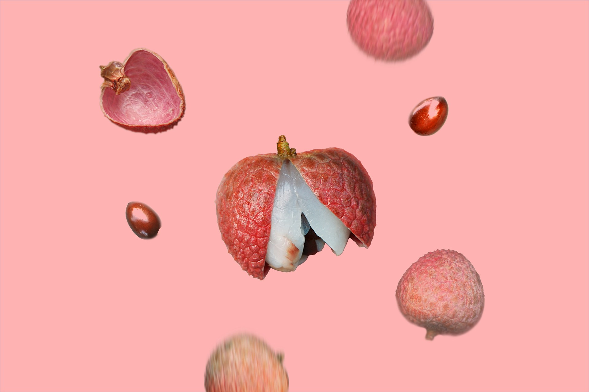
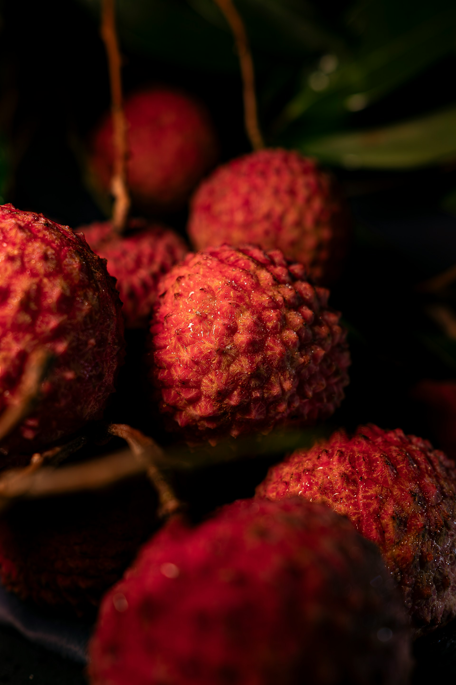
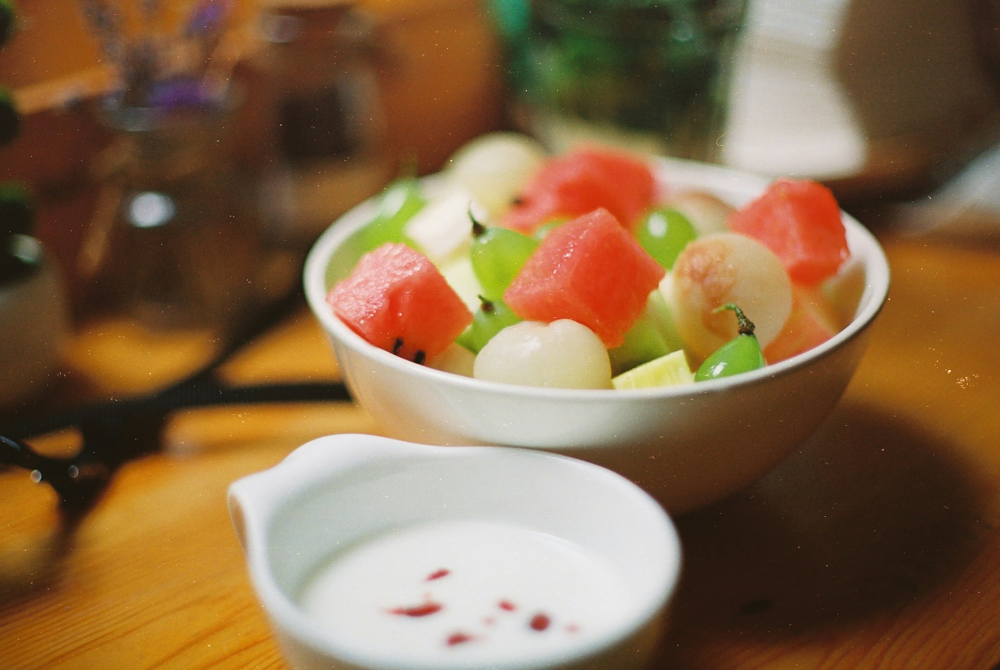
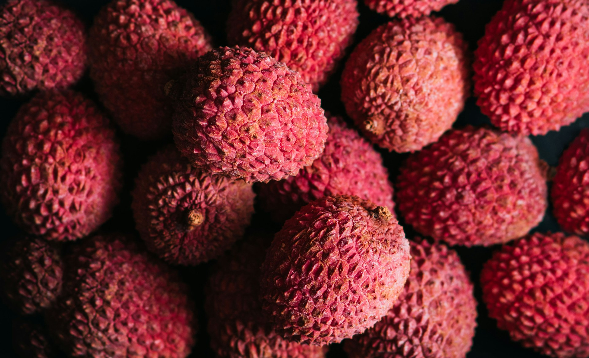
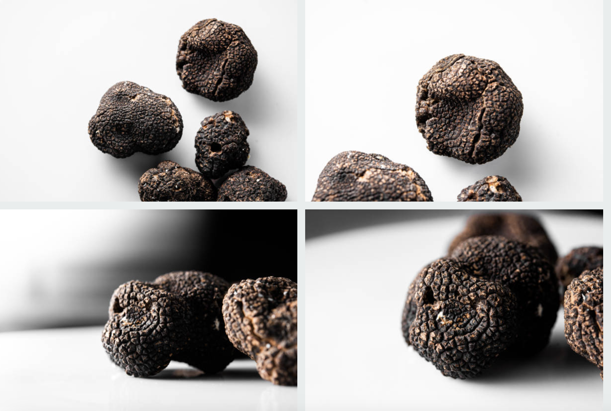
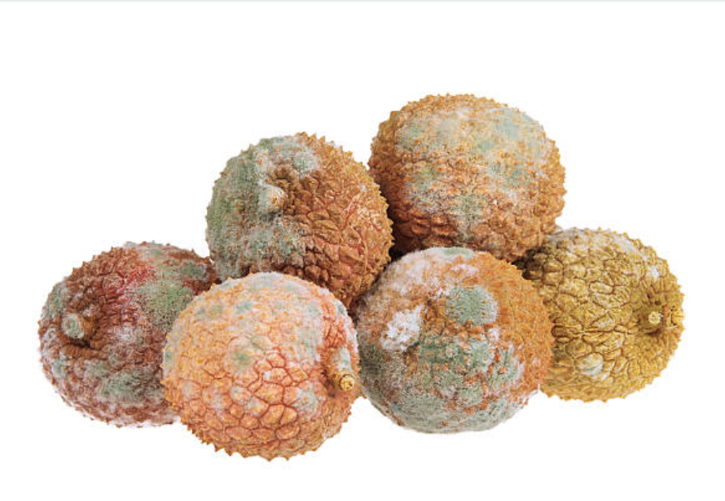

import GemeComposterCTA from '@site/src/components/GemeComposterCTA'

Imagine a captivating blend of floral sweetness and tropical tang, like a cross between a grape and a rose, with hints of strawberry and watermelon. Mouthwaterin! And this is what lychee tastes like. Today, we're going to learn about -- Lychee! 

<!-- truncate -->

<h2 className="jump-to">Jump To</h2>

1. **[What does lychee taste like?](#what-does-lychee-taste-like)**
2. **[How to Select Perfectly Ripe Lychees](#how-to-select-perfectly-ripe-lychees)**
3. **[How to know when lychee is bad?](#how-to-tell-when-lychee-has-gone-bad)**
4. **[How to Eat Lychee? A Step-by-Step Guide](#how-to-eat-lychee-a-step-by-step-guide)**
5. **[How to Store Lychee? Expert Preservation Tips](#how-to-store-lychee-expert-preservation-tips)**
6. **[How to Tell When Lychees are Bad?](#how-to-tell-when-lychee-has-gone-bad)**
7. **[Can I Compost Mouldy Lychee?](#can-i-compost-mouldy-lychee-yes-heres-the-eco-way)**
8. **[Creative Lychee Recipes to Elevate Your Meals](#creative-lychee-recipes-to-elevate-your-meals)**
0. **[Why Does Lychee Taste Vary? Science and Tips](#why-does-lychee-taste-vary-science-and-tips)**
10. **[FAQs About Lychee Taste and Consumption](#faqs-about-lychee-taste-and-consumption)**

## What does lychee taste like? 

The **lychee taste** is often described as **fragrantly sweet with a refreshing acidity**, making it a summer favourite worldwide. Its texture starts with a juicy burst followed by a delicate, slightly crisp flesh similar to peeled grapes.

The fruit's high sugar content (15–20%) and soluble solids create its signature sweetness, while compounds like geraniol and linalool deliver its floral aroma.  

## How to Select Perfectly Ripe Lychees

How to eat lychee begins with choosing the best fruit. Look for:  
- **Colour**: Vibrant red or pink skin (some varieties like Yu Jin Qiu show golden streaks).  

- **Texture**: Slightly bumpy rind that yields gently to pressure. Avoid hard or mushy spots.  

- **Scent**: A distinct floral fragrance at the stem end.  

- **Weight**: Heavy for its size, indicating juiciness.

---

### Table: Lychee Varieties and Their Flavour Profiles  

| Variety | Origin | Taste Notes | Best Use |
| --- | --- | --- | --- |
| Giant Beauty | China | Honey-like, low acid | Fresh eating |
| Yu Jin Qiu | China | Floral, tender flesh | Jams, desserts |
| Sweetheart (No Mai Chee) | Thailand | Balanced sweet-tart, small seed | Salads, beverages |

Unripe lychees taste bland and acidic, while overripe ones develop a fermented "off" flavour. For **peak sweetness**, buy in season (**May–September in the Northern Hemisphere**).  

## How to Eat Lychee? A Step-by-Step Guide

### How do you eat lychee fresh? It's simple:  

1. **Wash**: Rinse under cool water to remove dirt.  

2. **Peel**: Use your nails to nick the rough skin near the stem, then peel it away like an orange.  
3. **De-seed**: Slice the fruit in half to reveal the glossy brown seed. Remove it with a knife or your fingers.  
4. **Eat**: Enjoy the raw flesh! 

*Pro tip: Soak peeled lychees in saltwater for 10 minutes to reduce "heatiness" (a traditional Chinese practice).* 

### Creative ways to enjoy lychee:  
- Skewer peeled lychees with grilled shrimp or scallops. 

- Freeze them for a refreshing snack.  
- Add to salads (e.g., with mint, cucumber, and feta).  

## How to Store Lychee? Expert Preservation Tips

How to store lychee correctly ensures you enjoy its signature taste longer. **Unpeeled lychees last 3–5 days in the fridge's crisper drawer when kept in a ventilated container lined with paper towels (absorbs excess moisture). For long-term storage:**  
- **Freezing**: Peel/de-seed lychees, arrange them on a tray until solid, then transfer to airtight bags (**keeps 6 months**).  *Tip: Freeze in syrup to retain plump texture.*

- **Canning**: Simmer peeled lychees in sugar syrup (1:1 water-sugar ratio) and sterilise jars.  
- **Drying**: Use a dehydrator at 50°C (122°F) for 12 hours for chewy lychee "**raisins**."  

---

Always avoid room temperature storage – **lychees ferment within 48 hours**, ruining their delicate lychee taste. 

### Table: Lychee Storage Methods Compared  
| Method | Duration | Taste Quality | Best For |
| --- | --- | --- | --- |
| Refrigeration | 3–5 days | Near-fresh | Immediate use |
| Freezing | 6 months | Slightly softer | Smoothies, desserts |
| Jam | 1 year | Intense, sweet | Spreads, sauces |

**Never store lychees at room temperature** — they ferment quickly.  

## How to Tell When Lychee Has Gone Bad?

Spotting spoiled lychees prevents unpleasant experiences. How do you eat lychee safely? Discard or compost it if you notice:  

- **Colour**: Dull brown or black patches (fresh lychees are pink-red).  

- **Smell**: Sour, alcoholic, or vinegar-like odour (fresh lychees smell floral).  

- **Texture**: Mushy flesh or leaking juice.  

- **Taste**: Bitter or fermented flavour – a far cry from the sweet. What does lychee taste like when fresh?  

:::note
*Greyish mould on stems/skin means immediate disposal. Never taste questionable fruit! Drop it in the composter when you notice.*
:::

## Can I Compost Mouldy Lychee? (Yes, Here's the Eco-Way!)

Absolutely! Mouldy lychees belong in the composter, not landfills. Their high nitrogen content enriches the soil. 

### For optimal results:  

1. Remove non-biodegradable tags/stickers.  

2. Crush fruits to accelerate decomposition.  

3. **Use GEME electric biowaste composter** – GEME is the world's first biowaste home composter, rapidly breaking down mouldy produce (including lychee skins/seeds) at **60°C+ (140°F)**, killing pathogens and producing full compost in **6-8 hours**. 

### 🛒 Get Your GEME Composter Now

<GemeComposterCTA className="custom-styles" />

It's the most **efficient, odour-free and eco-friendly** method for urban homes. The compost output is also fully matured and nutrient-rich to **improve your garden plants' health** 🌱. 

*Traditional composting works too, but it's **too slow**: Bury mouldy lychees deep in your pile, covered with "brown" materials (dry leaves, cardboard). Harvest compost in **2–3 months**.*

## Creative Lychee Recipes to Elevate Your Meals

How do you eat lychee beyond snacking? Try these crowd-pleasers:  

### 1. Lychee Jasmine Iced Tea
- Ingredients: 10 peeled lychees, 1 cup jasmine tea, ice, and mint.  
- Method: Muddle lychees in a glass. Add ice and tea. Garnish with mint.  
- Why it works: The lychee taste balances the tea's bitterness with floral sweetness.  

### 2. Lychee Gelato (Low-Fat)
- Ingredients: 2 cups lychee pulp, 1 cup whole milk, ¼ cup honey.  
- Method: Blend ingredients, freeze in an ice cream maker.  
- Flavour note: Creaminess tempers the lychee's acidity, creating a lush dessert.  

### 3. Lychee-Aloe Refresher
- Ingredients: Lychee puree, aloe vera gel, soda water.  
- Taste: A hydrating duo with juicy-sweet lychee and crisp aloe bits.  

### 4. Savoury Pairings
- With cheese: Pair lychees with goat cheese or burrata.  
- In stir-fries: Add to sweet-sour pork or shrimp dishes.  

## Why Does Lychee Taste Vary? Science and Tips

What does lychee taste like when it's poorly handled? Medicinal or *bitter*. This happens when:

- The fruit is underripe (high acidity masks sweetness).  

- It's stored incorrectly, causing fermentation.  

- Varietal differences—some types (like "March Red") are naturally tart.  

**Maximise flavour**:  
- Serve lychees chilled to enhance their refreshing quality. 

- Pair with citrus (lime, lemon) or herbs (basil, rosemary) to amplify their floral notes.  

---
## FAQs About Lychee Taste and Consumption

### Q: Can you eat lychee skin or seeds?
A: No! The skin is inedible and bitter, and the seeds contain toxins. Only consume the white flesh.  

### Q: Why does lychee cause a "burning" sensation for some?
A: Traditional Chinese medicine considers lychee "heaty." Balance it by drinking chrysanthemum tea or eating salt-soaked lychees.  

### Q: Is canned lychee as tasty as fresh?
A: Canned lychees lose some floral notes but retain sweetness—ideal for desserts like panna cotta.  

## Conclusion: Embrace the Lychee Adventure

How to eat lychee is a journey from tree to table. Start with fresh, fragrant fruits; experiment with snacks, drinks, and mains; and preserve extras to enjoy their summery lychee taste all year round. 

Whether you're savouring them straight from the rind or sipping a lychee cocktail, this ancient fruit promises a uniquely sweet escape.  

*Pro tip: Grow your own! Dwarf varieties like "Emperor's Treasure" thrive in pots, delivering homegrown sweetness.*

## Sources

1. [**How to eat a lychee**](https://www.wikihow.com/Eat-a-Lychee)

2. [**How to Store Fresh Lychees: 8 Steps**](https://www.wikihow.com/Store-Fresh-Lychees)
3. [**Lychees 101: Nutrition Facts and Health Benefits**](https://www.healthline.com/nutrition/foods/lychees)
4. [**Is There a Limit to How Many Lychee Fruit We Should Eat?**](https://nutritionfacts.org/blog/is-there-a-limit-to-how-many-lychee-fruit-we-should-eat/)
5. [**Lychee Introduction**](https://ucanr.edu/county-office/cooperative-extension-ventura-county/lychee)

## Related Articles

- [**How Long Do Apples Last In The Fridge?**](/blog/how-long-do-apples-last-in-the-fridge)

- [**The Best Composter to turn food waste into rich compost for your garden**](/blog/the-best-composter-to-reduce-food-waste)

- [**Is It Ok To Put Mouldy Apples in GEME Composter**](https://www.geme.bio/help-center/docs/faq/supported-foods/can-i-put-mold-food)

_Ready to transform your gardening game? Subscribe to our [newsletter](http://geme.bio/signup) for expert composting tips and sustainable gardening advice._
