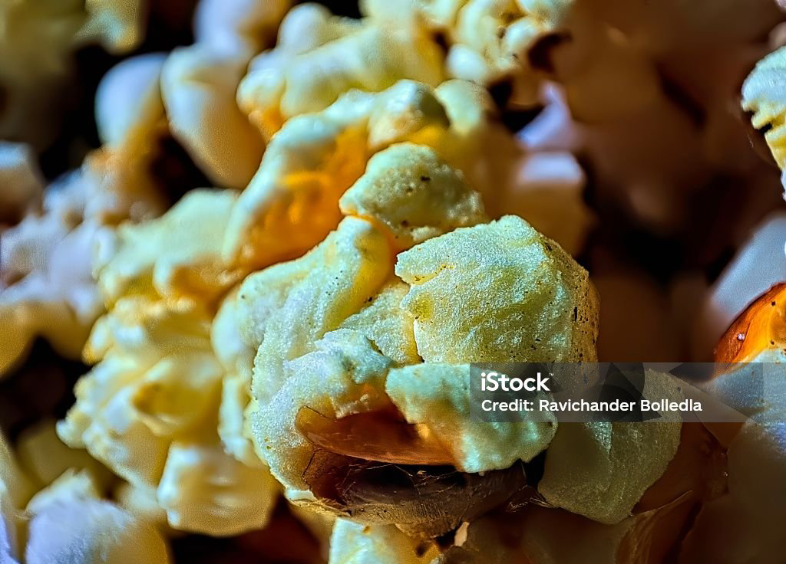
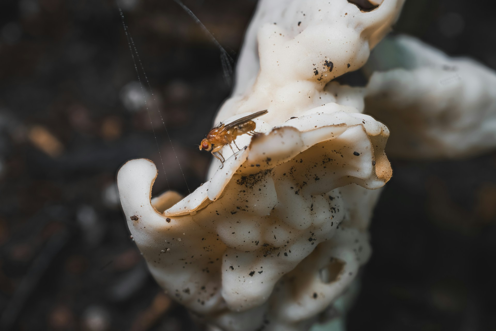

import GemeComposterCTA from '@site/src/components/GemeComposterCTA'

Popcorn is one of the world’s favourite snacks, but it raises a common question: Can Popcorn expire? Does popcorn expire? Does popcorn go bad? While it might not spoil like milk or bread, popcorn does have a shelf life. Whether you’re dealing with unpopped kernels, microwave bags, or a bowl of buttery popped goodness, how you store your popcorn plays a big role in how long the popcorn lasts.

Let’s break down the science and storage solutions behind popcorn’s longevity.

<!-- truncate -->

<h2 className="jump-to">Jump To</h2>

1. **[How long does popcorn last?](#factors-affecting-popcorns-shelf-stability)**
2. **[How long does unopened popcorn last?](#how-long-does-unpopped-popcorn-last)**
3. **[Can Popcorn expire? Does popcorn go bad?](#does-popped-popcorn-expire)**
4. **[How to know if popcorn goes bad?](#how-to-know-if-popcorn-goes-bad)**
5. **[How to store popcorn](#how-to-properly-store-popcorn)**
6. **[Can I compost popcorn?](#can-i-compost-mouldy-lychee-yes-heres-the-eco-way)**
7. **[Can I eat expired popcorn?](#can-you-eat-expired-popcorn)**
8. **[FAQ about popcorn](#faqs-about-popcorn-expiration)**
9. **[More tips for making popcorn last longer](#more-tips-for-extending-popcorn-shelf-life)**
10. **[Conclusion on tips for popcorn](#conclusion-keeping-your-popcorn-fresh-and-safe-to-eat)**

## Understanding Popcorn Shelf Life
What is popcorn made of, and why does that matter
Popcorn kernels are whole grains containing moisture trapped within a hard shell. 

That tiny bit of moisture (about 14%) is essential — it's what makes the kernel explode into fluffy popcorn. Over time, however, moisture can escape, and without it, popcorn won’t pop properly.

### Factors affecting popcorn’s shelf stability

Several elements impact how long your popcorn lasts:
- Moisture exposure (causes mold or drying)

- Air exposure (leads to staleness)
- Heat and sunlight (break down natural oils and flavourings)
- Type of popcorn (popped, unpopped, microwave)

## How Long Does Unpopped Popcorn Last?
### Shelf life of standard kernels vs. microwave popcorn
- Unpopped popcorn: Up to 1–2 years if sealed and stored in a dry place.

- Microwave popcorn: Typically has a “best by” date 6–12 months after manufacture. It can be safe to use a couple of months beyond that, but quality may decline.

### Signs your unpopped kernels have gone bad
- They no longer pop

- Kernels smell rancid
- Visible mold or discolouration
- Dry and cracked surfaces

## Does Popped Popcorn Expire?
 Storage methods and timeframes

### Freshly popped popcorn:
- Open air: 1–2 days before it gets stale

- Airtight container: 1–2 weeks
- Vacuum-sealed: up to 2 months

### What makes popped popcorn stale or unsafe?
- Exposure to air = loss of crispness

- Butter and flavourings = spoilage
- Humidity = mold risk

## Does Microwave Popcorn Go Bad?
 Ingredients that expire first.
### Microwave popcorn contains:
- Butter/oil-based flavourings (can turn rancid)

- Preservatives (eventually lose effectiveness)
- Salt and seasonings (can degrade in taste)
 How to assess quality after the expiration date
### If it:
- Smells off or like chemicals—compost it

- Has mold spots—compost it

- Feels greasy or unusually soft—don’t eat it

## How to Properly Store Popcorn
 Best containers and environments
- Use airtight containers or mason jars

- Store in a cool, dry, dark pantry
- For microwave popcorn, keep sealed bags in original packaging

---

 Common mistakes to avoid
- Freezing popcorn can ruin the moisture balance

- Storing in warm, humid environments
- Leaving bags open

## Can I Compost Expired Popcorn? 

Absolutely! The best way to deal with expired popcorn is to compost it rather to risk your health. Popcorn maintains rich nutrition, including nitrogen and carbon, which enriches your garden soil and help your plants grow better. 

**For optimal results:** 

**Use GEME electric biowaste composter** – GEME is the world's first biowaste home composter, rapidly breaking down organic waste (including popcorn) at **60°C+ (140°F+)**, killing pathogens and producing full compost in **6-8 hours**. 

### 🛒 Get Your GEME Composter Now

<GemeComposterCTA className="custom-styles" />

It's the most **efficient, odour-free and eco-friendly** method for urban homes. The compost output is also fully matured and nutrient-rich to **improve your garden plants' health** 🌱. 

## Can You Eat Expired Popcorn?
### Safety vs. quality: knowing the difference
- Expired but sealed: Usually safe to eat if not too old

- Opened and expired: Higher risk of staleness or spoilage
### What happens if you eat bad popcorn?
- Usually just a stale or unpleasant taste

- In rare cases, digestive discomfort from rancid oils or mold

## How to Know If Popcorn Goes Bad
 Smell, texture, taste, and appearance

Check for:
- Off or rancid smell

- Discoloration
- Stale or soggy texture
- Unusual flavours or chemical tastes

## FAQs About Popcorn Expiration

### 1. Does sealed popcorn last longer?
Yes. Vacuum-sealed or factory-sealed popcorn lasts longer due to a lack of air exposure.
### 2. Can expired popcorn make you sick?
Rarely, unless mold or rancid ingredients are present.
### 3. Is it safe to microwave old popcorn bags?
Only if they smell and look normal, avoid using bags past 6–12 months.
### 4. Does flavoured or buttered popcorn go bad faster?
Yes, because oils and dairy-based flavourings degrade over time.
### 5. Can mold grow on popcorn kernels?

Yes, if stored in humid or moist conditions.
### 6. How long does homemade popcorn last?
Usually 1–2 days, or up to a week if sealed and dry.

## More Tips for Extending Popcorn Shelf Life
Proper popcorn storage isn’t just about preventing spoilage—it’s about maintaining the best taste and popping performance over time. Here are some additional strategies to make your popcorn last longer:
### Use Oxygen Absorbers
For long-term storage of kernels, adding oxygen absorbers to your airtight container can drastically reduce oxidation, helping to preserve freshness.
### Store in Small Batches
Instead of opening a large container every time, divide your kernels into smaller airtight bags or jars. This prevents constant air exposure and keeps the majority of your popcorn fresh.
### Avoid Refrigeration
Refrigerating unpopped kernels can cause moisture imbalance, leading to poor popping results. Room temperature is best—cool, dry, and dark locations are ideal.

## Fun Fact: The $64,000 Question of Popcorn
Did you know that popcorn was once the star of quiz shows! The phrase "$64,000 Question" became iconic in the 1950s TV quiz program, where answering complex questions earned big prizes. And while popcorn's longevity may not earn you a fortune, knowing how to keep it fresh could save you money (and snack disappointment).

## Conclusion: Keeping Your Popcorn Fresh and Safe to Eat
So, does popcorn expire? Absolutely—but with smart storage and a bit of attention, you can enjoy your kernels long after purchase. 

Smart storage is key—keep it dry, cool, and sealed. When in doubt, trust your nose and eyes. If it looks or smells odd, it’s time to compost it using GEME composter.

Stay popped, not stale. 🍿 

## Sources
1. [Can I eat expired microwave popcorn?](https://www.quora.com/Can-I-eat-expired-popcorn "nofollow")
2. [Are "expired" popcorn kernels still OK to use?](https://www.reddit.com/r/popcorn/comments/1elxzs8/are_expired_popcorn_kernels_still_ok_to_use/ "nofollow")
3. [Can I eat expired microwave popcorn?](https://www.quora.com/Can-I-eat-expired-microwave-popcorn "nofollow")
4. [Thematic poster session (TPS) - 2023 - Allergy](https://onlinelibrary.wiley.com/doi/10.1111/all.15925 "nofollow")
5. [dummies.com - Recipes Articles](https://www.dummies.com/category/articles/recipes-33859/ "nofollow")

6. [Wikipedia-Popcorn](https://en.wikipedia.org/wiki/Popcorn)
7. [archives.gov - Constitution questions and answers](https://www.archives.gov/founding-docs/constitution-q-and-a)

## Related Articles
- [**How to Eat Lychee For the Best Taste? The First-Timer's Guide**](/blog/how-to-eat-lychee-for-best-lychee-taste)

- [**How Long Do Apples Last In The Fridge?**](/blog/how-long-do-apples-last-in-the-fridge)

- [**The Best Composter to turn food waste into rich compost for your garden**](/blog/the-best-composter-to-reduce-food-waste)

- [**Is It Ok To Put Mouldy Apples in GEME Composter**](https://www.geme.bio/help-center/docs/faq/supported-foods/can-i-put-mold-food)

_Ready to transform your gardening game? Subscribe to our [newsletter](http://geme.bio/signup) for expert composting tips and sustainable gardening advice._
