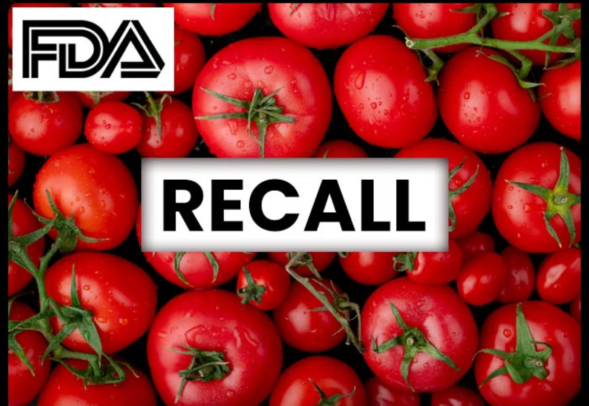
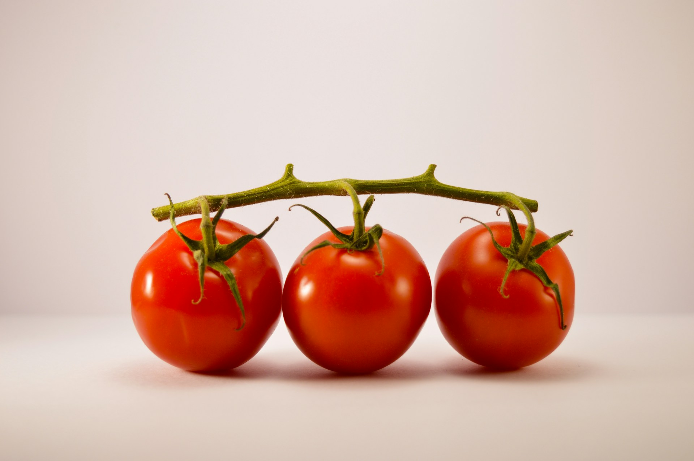
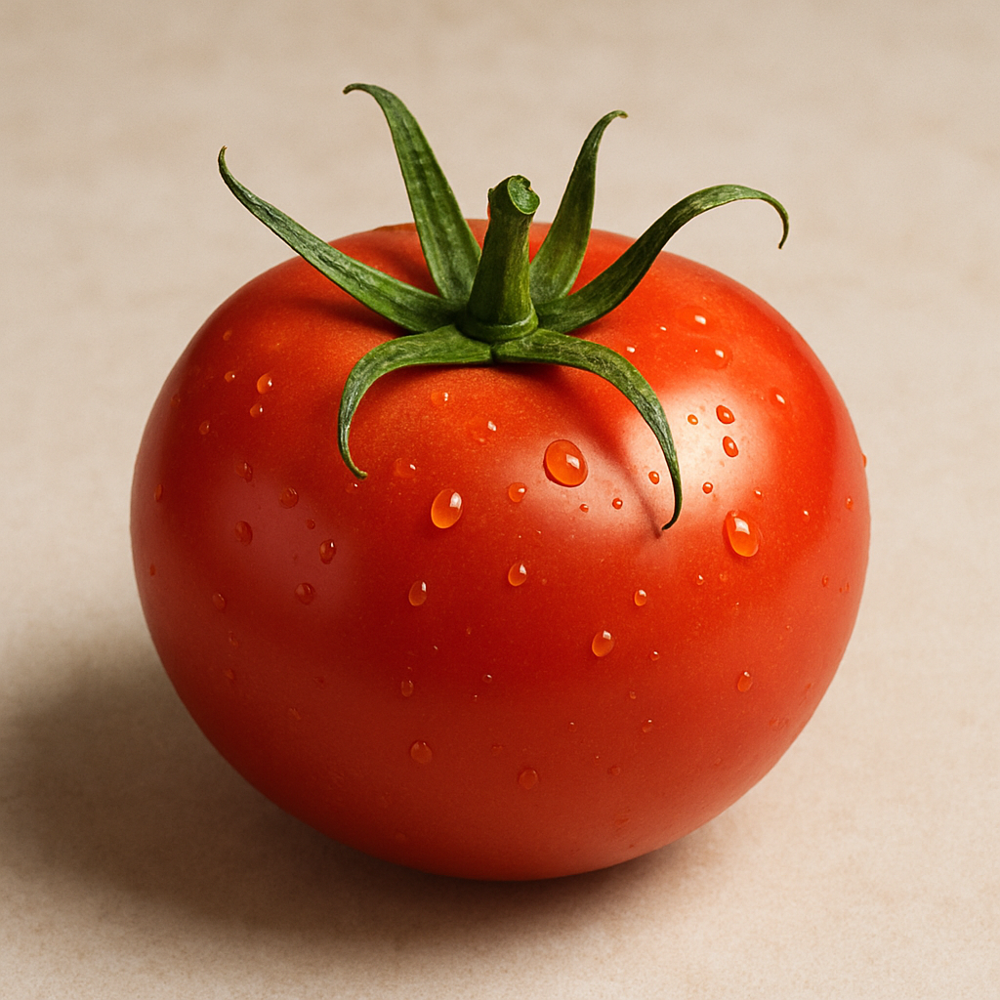
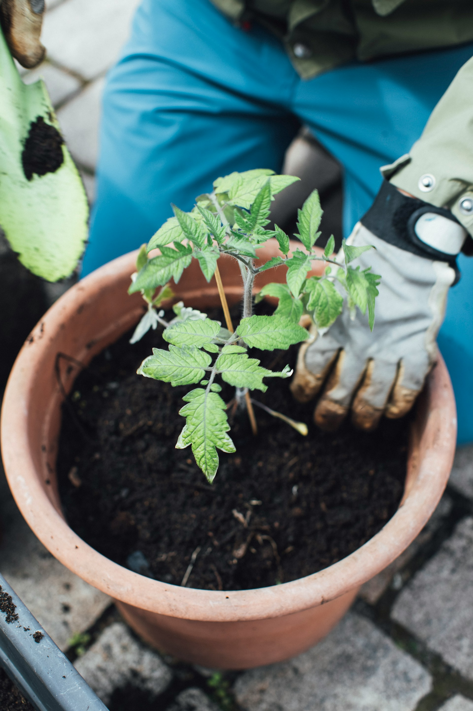
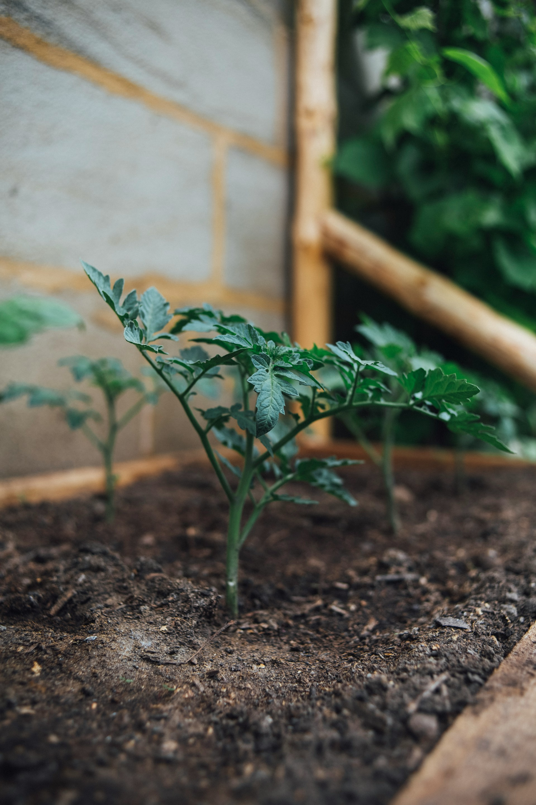
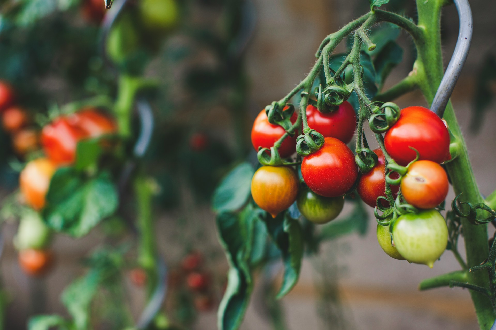
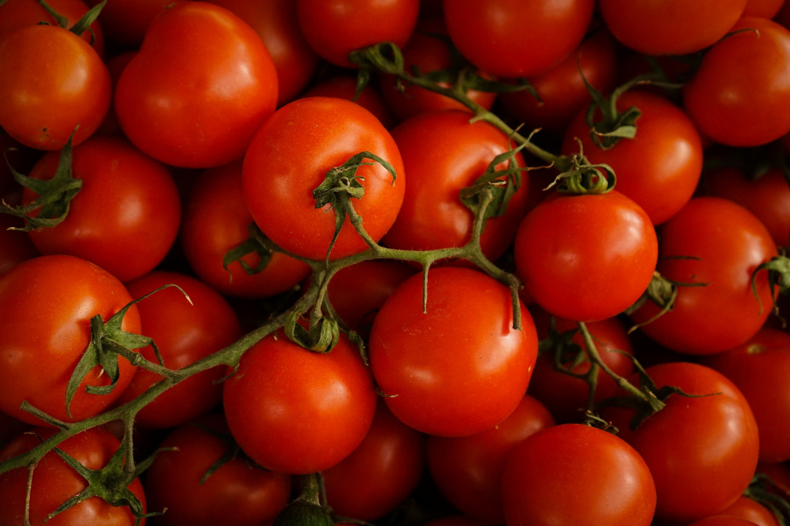
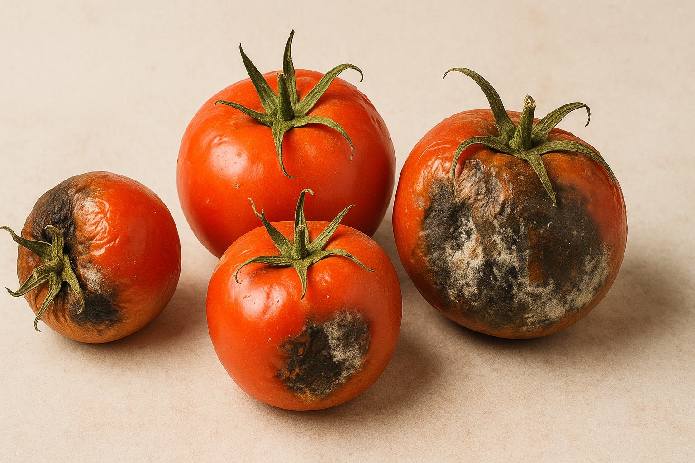

import GemeComposterCTA from '@site/src/components/GemeComposterCTA'
import GemeTerra2CTA from '@site/src/components/GemeTerra2CTA'

## Are Tomatoes Safe to Eat Now? A Look at Food Safety Concerns

In recent years, more people are asking, “Are tomatoes safe to eat now?” And that concern is valid. Supermarket tomatoes often travel thousands of miles before reaching your plate, making them susceptible to contamination along the way. From harmful pesticides to bacteria like Salmonella, it's become clear that not every tomato is grown under safe conditions.

Recalls and foodborne illness outbreaks related to tomatoes have occurred multiple times in the last decade. In 2025, there are three FDA Recalls including [**Tomato Recall due to Salmonella**](/blog/fda-tomato-recall-salmonella-outbreak-raises-concerns-about-vegetable). Contaminated water, poor hygiene during harvesting, or unsafe handling during transport can all introduce risks to your health. While washing produce helps, it doesn’t always remove invisible chemical residues.

In fact, tomatoes consistently rank high on the Environmental Working Group’s “Dirty Dozen” list—foods most likely to contain pesticide residues. So if you're concerned about what’s in your food, growing your own tomato plant could be the safest—and tastiest—solution.

<!-- truncate -->

<h2 className="jump-to">Jump To</h2>

1. **[Are tomatoes safe to eat now?](#are-tomatoes-safe-to-eat-now-a-look-at-food-safety-concerns)**
2. **[Benefits of growing your own tomatoes](#benefits-of-growing-your-own-tomato-plant-at-home)**
3. **[How to grow tomato plants at home?](#how-to-grow-tomatoes-step-by-step-gardening-guide)**
4. **[Can I compost spoiled or rotten tomatoes?](#can-i-compost-spoiled-or-rotten-tomatoes)**
5. **[FAQs about tomatoes and gardening tips](#faqs-tomatoes-and-gardening-safety-tips)**

## Benefits of Growing Your Own Tomato Plant at Home

Creating your own little tomato haven right in your backyard or balcony has enormous advantages. First and foremost, you have full control over what goes into your soil and onto your plants. No more guessing about chemicals or unsafe irrigation.

Homegrown tomatoes are usually juicier, sweeter, and fresher than any supermarket variety. And if you grow them using compost and organic methods, you're not just eating healthier—you're helping the planet too. Garden-fresh tomatoes reduce your carbon footprint and eliminate packaging waste.

Besides, there's something deeply satisfying about nurturing a seed into a flourishing plant and finally plucking off that perfectly ripe tomato with your own hands. It’s gardening therapy—and dinner prep—in one!

 
<GemeTerra2CTA 
 imgSrc="/img/geme-terra-2-composter.jpg"
 productTitle="GEME Terra II Composter"
 features={[
    "✅ Best Way Of Composting in Winter",
    "✅ Quiet, Odour-Free, Real Compost",
    "✅ Rich Compost Output For Garden Soil & Plants",
    "✅ Reduce Landfill Waste & Greenhouse Gases"
 ]}
buttonText="Get Your GEME Terra II"
  href="https://www.geme.bio/product/terra2?utm_medium=blog&utm_source=geme_website&utm_campaign=general_seo_content&utm_content=are-tomatoes-safe-to-eat-now"
/>

## How to Grow Tomatoes: Step-by-Step Gardening Guide

Ready to roll up your sleeves? Here’s your complete step-by-step guide on how to grow tomatoes like a pro—even if you're a total beginner.

### Choosing the Right Tomato Variety

Start by picking the right type of tomato. If you want a rich, old-fashioned taste, go for heirloom varieties like Brandywine or Cherokee Purple. Looking for disease resistance and a higher yield? Then hybrid types like Celebrity or Roma might be better suited for you.

For container gardening, cherry or grape tomatoes are compact and incredibly productive.

### Preparing the Soil with Compost

**Healthy soil = happy tomatoes**.

**Adding compost** is one of the best ways to enrich your soil. Compost adds nutrients, improves drainage, and encourages beneficial microbes. If you don’t already have a compost pile, start one today! Use kitchen scraps, garden clippings, eggshells, and coffee grounds to create a nutrient-rich foundation for your plants.

### Best Compost Ingredients for Tomato Growth
| **Greens** (Nitrogen-rich) | **Browns** (Carbon-rich) |
|------------------------|---------------------|
| Vegetable peels | Dry leaves |
| Coffee grounds | Shredded newspaper |
| Grass clippings | Cardboard (uncoated) |
| Manure (from herbivores) | Straw |

Avoid composting meat, dairy, or anything oily. **For the best quality of compost for daily use, you can choose a home electric composter like GEME, which turns your kitchen/yard waste into rich compost within 6-8 hours**.

<GemeComposterCTA 
 imgSrc="/img/geme-bio-composter.jpg"
 productTitle="GEME Bio Composter"
 features={[
    "✅ Best Way Of Composting At Home",
    "✅ Produce Soil-Ready Compost For Garden",
    "✅ Quiet, Odor-Free, Quick(6-8 hours)",
    "✅ Large Capacity (19 L) For Daily Waste"
  ]}
buttonText="Get Your GEME Composter For Tomato Plants"
  href="https://www.geme.bio/product/geme?utm_medium=blog&utm_source=geme_website&utm_campaign=general_seo_content&utm_content=are-tomatoes-safe-to-eat-now"
/>

### Planting Tomato Seeds or Seedlings

You can either start your tomatoes from seeds indoors 6-8 weeks before the last frost or buy young seedlings from a nursery. Plant them deep—almost two-thirds of the stem should go underground. This encourages strong root growth.

Space them about 18–24 inches apart, and give them enough breathing room for good air circulation.

### Watering and Sunlight Requirements

Tomatoes love the sun—at least **6–8 hours of direct sunlight per day**. Water deeply once or twice a week rather than shallow watering daily. This trains the roots to grow deep and strong.

Mulch around your plants to retain moisture and keep weeds at bay.

### Pruning and Supporting Tomato Plants

As your tomato plant grows, remove “suckers”—those little shoots between the main stem and branches. This directs energy to fruit production. Use stakes, cages, or trellises to keep plants upright and off the ground, preventing disease.

### Protecting Your Tomatoes from Pests Naturally

Combat aphids, hornworms, and whiteflies by planting basil, marigolds, or nasturtiums nearby. Neem oil and insecticidal soaps also work well and are garden-safe.

### When and How to Harvest Tomatoes

Tomatoes are ready when they turn their full color—whether red, yellow, or orange, depending on the variety. They should be firm but yield slightly to pressure. Harvest gently to avoid bruising.

### Common Mistakes When Growing Tomatoes

Even experienced gardeners can make errors. Here are the most common tomato-growing mistakes to avoid:

- Overwatering or inconsistent watering

- Using nutrient-poor or compacted soil

- Planting in too much shade

- Neglecting to prune

- Skipping pest control

## From Garden to Table: Using Your Homegrown Tomatoes

Once harvested, your tomatoes can be the star in countless dishes. Try these ideas:

- Fresh tomato salsa with cilantro and lime

- Roasted tomato soup with basil

- Caprese salad with mozzarella and balsamic glaze

- Homemade marinara sauce

Want to save them for later? Can them, dry them, or freeze them in airtight bags.

## Can I compost spoiled or rotten tomatoes?

Absolutely! The best way to deal with bad tomatoes is to compost it. Use the compost output to further enrich your garden soil and help your tomato plants grow better. 

**For optimal results:** 

**Use GEME electric biowaste composter** – GEME is the world's first biowaste home composter, rapidly breaking down organic waste (including fruits and veggies) at **60°C+ (140°F+)**, killing pathogens like Salmonella and producing full compost in **6-8 hours**. 

### 🛒 Get Your GEME Composter Now

<GemeComposterCTA 
 imgSrc="/img/geme-bio-composter.jpg"
 productTitle="GEME Bio Composter"
 features={[
    "✅ Best Way Of Composting At Home",
    "✅ Produce Soil-Ready Compost For Garden",
    "✅ Quiet, Odor-Free, Quick(6-8 hours)",
    "✅ Large Capacity (19 L) For Daily Waste"
  ]}
buttonText="Get Your GEME Composter For Tomato Plants"
  href="https://www.geme.bio/product/geme?utm_medium=blog&utm_source=geme_website&utm_campaign=general_seo_content&utm_content=are-tomatoes-safe-to-eat-now"
/>

It's the most **efficient, odour-free and eco-friendly** method for urban homes. The compost output is also fully matured and nutrient-rich to **improve your garden plants' health** 🌱. 

## FAQs: Tomatoes and Gardening Safety Tips
1. **Are tomatoes safe to eat raw?**
Yes, if they are clean and fresh. Homegrown tomatoes are especially safe when grown organically.

2. **What compost is best for tomatoes?**
A mix of green and brown organic materials—like vegetable scraps and dried leaves—makes ideal compost.

3. **How long does it take to grow tomatoes?**
From seed to harvest, it typically takes 60 to 85 days depending on the variety.

4. **Can I grow tomatoes in pots?**
Absolutely! Choose compact varieties and use large containers with drainage holes.

5. **What pests should I watch out for?**
Tomato hornworms, aphids, and whiteflies are common. Use neem oil or plant companions like basil to deter them.

6. **Do I need to rotate crops if growing tomatoes every year?**
Yes, rotating crops helps prevent soil depletion and diseases.

## Conclusion: Growing Your Own Tomato Plant is the Safest Bet
So, are tomatoes safe to eat now? Maybe. But if you want absolute certainty, growing your own is the best answer. With compost, the right care, and a little patience, you can enjoy fresh, safe, and delicious tomatoes straight from your garden. It’s more than just a hobby—it’s your path to healthier, worry-free meals.

## Related Articles
- [**FDA Tomato Recall 2025 Raises Concerns About Veggies Safty**](/blog/fda-tomato-recall-salmonella-outbreak-raises-concerns-about-vegetable)

- [**FDA Cucumber Recall**](/blog/cucumber-recall-2025-how-to-protect-vegetable-garden-from-salmonella)

- [**The Best Composter to turn food waste into rich compost for your garden**](/blog/the-best-composter-to-reduce-food-waste)

- [**How to ues garden soil and compost?**](/blog/garden-soil-vs-compost-pros-and-cons)

## Sources
1. FoodSafty Guidence by CDC https://www.foodsafety.gov/food-safety-charts/safe-minimum-internal-temperatures
2. FDA Tomato Recall Due To Salmonella https://www.fda.gov/safety/recalls-market-withdrawals-safety-alerts/williams-farms-repack-llc-recalls-tomatoes-due-possible-salmonella-contamination
3. CDC: About Salmonella Infection https://www.cdc.gov/salmonella/about/index.html

_Ready to transform your gardening game? Subscribe to our [newsletter](http://geme.bio/signup) for expert composting tips and sustainable gardening advice._
