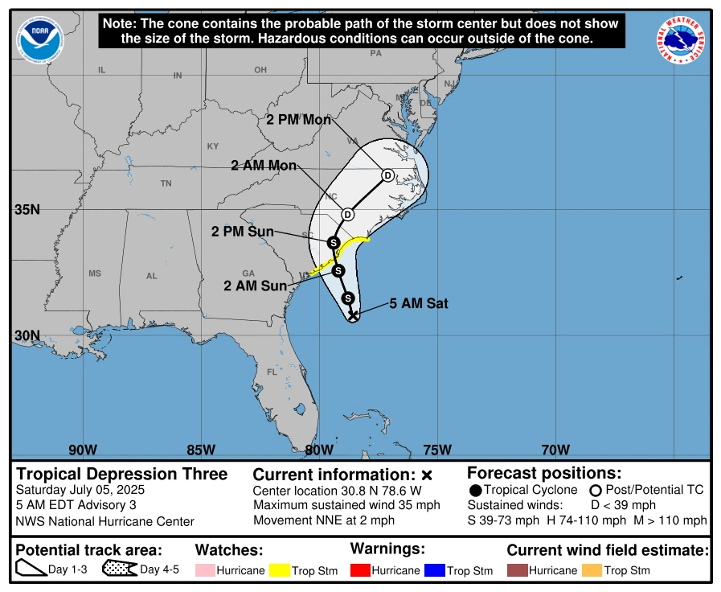
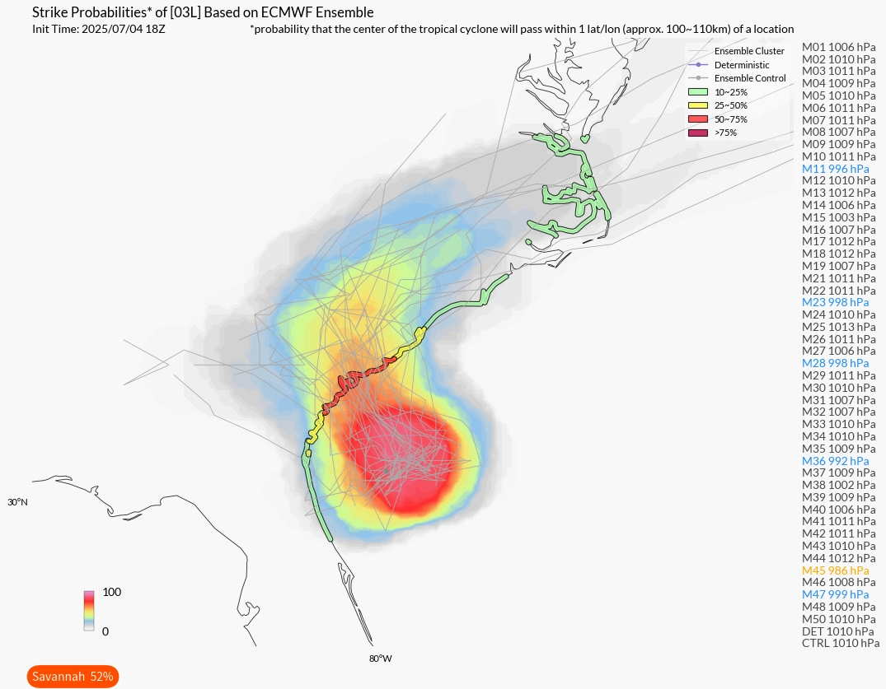
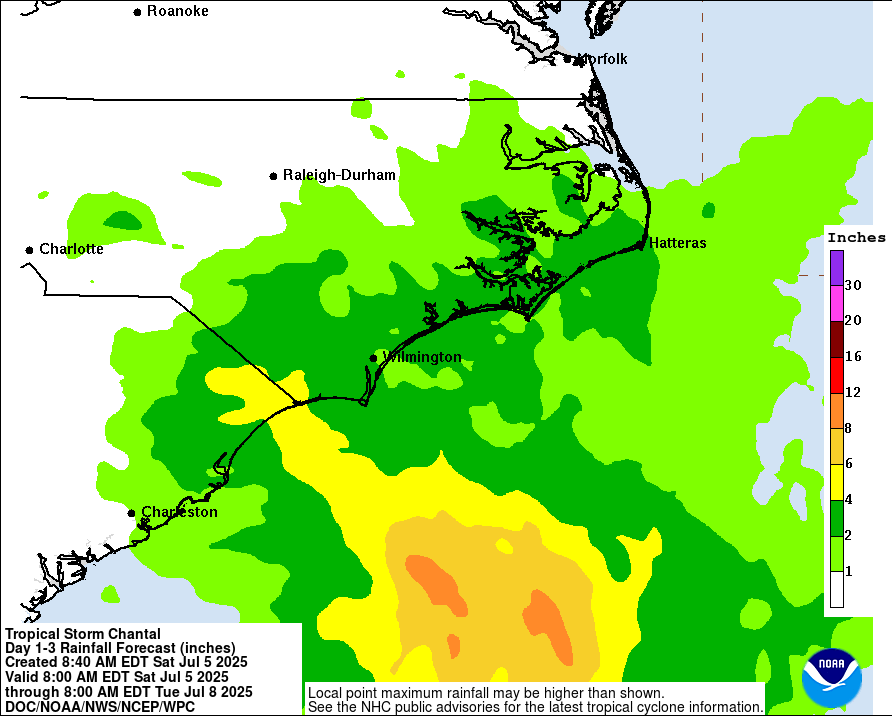
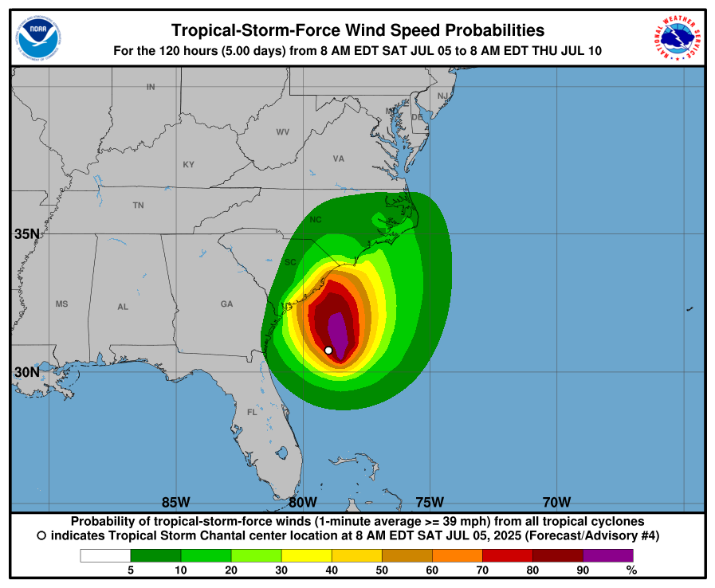
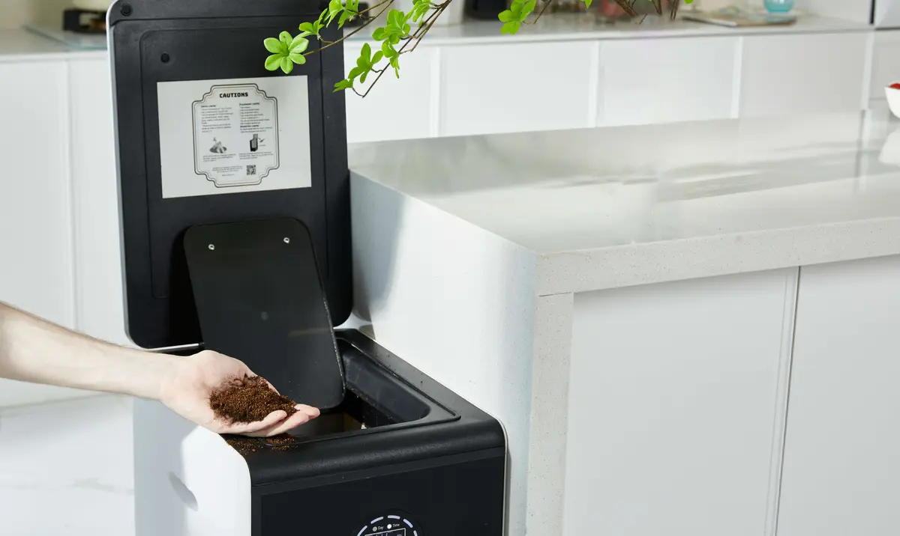
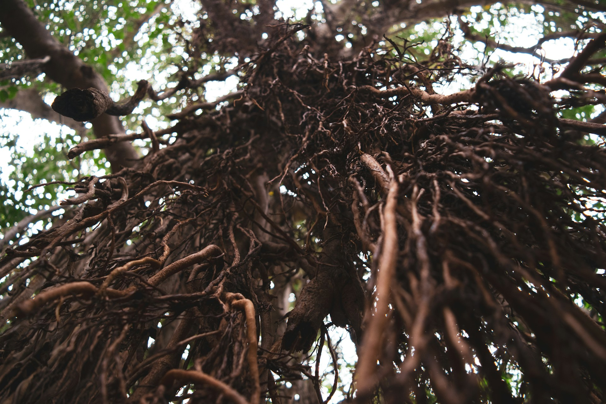
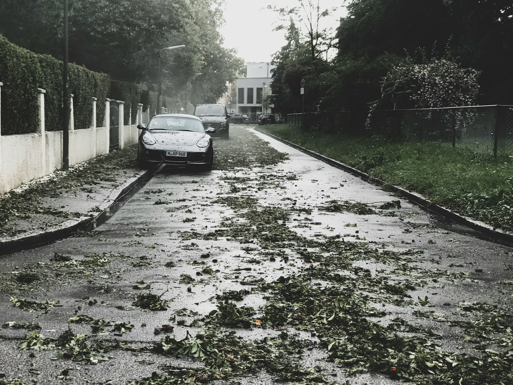

import GemeComposterCTA from '@site/src/components/GemeComposterCTA'

## Tropical Storm Chantal and Its Potential Impact

### What Is a Tropical Storm Warning?

A tropical storm warning is issued when sustained winds of 39 to 73 mph are expected within 36 hours. It serves as an urgent call to action for residents and gardeners alike to secure their homes, yards, and most importantly, their plants. When you hear a warning from the [**National Hurricane Center (NHC)**](https://www.nhc.noaa.gov/), it's time to act fast.

### Overview of Tropical Storm Chantal

Tropical Storm Chantal is currently tracking over the Atlantic and is projected to move toward the southeastern U.S. coast, bringing high winds, heavy rains, and coastal flooding. While it may not escalate to a hurricane, its impact on low-lying gardens can be devastating.

### Latest Updates from the National Hurricane Center

The NHC has placed South Carolina, including Myrtle Beach, under observation. Current models from the hurricane tracker suggest the storm may make landfall with intense rain bands. Gardeners need to stay informed through trusted sources like [**NOAA**](https://www.noaa.gov/news-release/noaa-predicts-above-normal-2025-atlantic-hurricane-season), which updates every few hours.

### Myrtle Beach Weather Alerts and Storm Projections

Myrtle Beach is expected to experience high tides and gusts that can uproot shallow-rooted plants. Flash flood warnings may also affect the coastal soil structure. If you garden near Myrtle Beach, prepare now before the weather takes a turn.

<!-- truncate -->

<h2 className="jump-to">Jump To</h2>

1. **[The Garden Risks During Tropical Storms and Hurricanes](#the-garden-risks-during-tropical-storms-and-hurricanes)**
2. **[How to Prepare Your Garden Before a Storm Hits](#how-to-prepare-your-garden-before-a-storm-hits)**
3. **[How to Use Compost to Protect Your Garden from Tropical Storm Damage](#how-to-use-compost-to-protect-your-garden-from-tropical-storm-damage)**
4. **[Use Compost for Plant Roots to Grow Deeper and Withstand Storms](#use-compost-for-plant-roots-to-grow-deeper-and-withstand-storms)**
5. **[Emergency Garden Protection Measures Before Tropical Storm Chantal](#emergency-garden-protection-measures-before-tropical-storm-chantal)**
6. **[Post-Storm Garden Recovery Checklist](#post-storm-garden-recovery-checklist)**
7. **[How the Hurricane Tracker Can Help You Protect Your Garden](#how-the-hurricane-tracker-can-help-you-protect-your-garden)**
8. **[Case Study: Gardeners in South Carolina Facing Tropical Storms](#case-study-gardeners-in-south-carolina-facing-tropical-storms)**
9. **[Best Tools and Supplies for Storm-Proof Gardening](#best-tools-and-supplies-for-storm-proof-gardening)**
10. **[FAQs About Tropical Storms and Garden Safety](#faqs-about-tropical-storms-and-garden-safety)**

## The Garden Risks During Tropical Storms and Hurricanes

### Flooding and Soil Saturation

One of the biggest threats during a tropical storm is flooding. Excess water can suffocate plant roots, wash away soil nutrients, and foster root rot. Clay-heavy soils, in particular, can become compacted and waterlogged.

### High Winds and Plant Damage

Winds over 40 mph can break stems, tear leaves, and even topple trellises. Vining plants and those in vertical gardens are especially vulnerable. Without proper support, even mature shrubs can suffer significant damage.

### Contaminated Water and Disease Spread

Tropical storms often carry bacteria-laden floodwater that contaminates gardens. This poses a danger not only to plants but also to the safety of your homegrown vegetables.

## How to Prepare Your Garden Before a Storm Hits

### Creating a Storm-Resilient Garden Layout

Designing your garden with storm protection in mind pays off in the long run. Keep taller plants shielded by hardier, wind-tolerant shrubs. Install raised beds on mounds or elevated platforms to reduce flood risk.

### Pruning and Securing Plants

Cut back excess growth, especially from fruiting plants. This reduces wind drag and the chances of breakage. Use garden twine or velcro straps to anchor stems to stakes or cages.

### Reinforcing Raised Beds and Trellises

Check all structures for loose screws or weak joints. Use sandbags or concrete blocks to secure raised beds. If possible, lay trellises down horizontally and anchor them to the ground.

## How to Use Compost to Protect Your Garden from Tropical Storm Damage

### Compost as a Moisture Barrier

A thick layer of compost around your plants acts like a sponge. It retains moisture, reduces runoff, and prevents the soil from compacting under heavy rain. Compost also promotes drainage, keeping roots from drowning.

### Strengthening Plant Roots with Compost

Compost-rich soil encourages roots to grow deep and strong. This helps plants anchor themselves better against strong winds and water currents. Healthier roots = more storm-resistant plants.

### Composting Tips for Hurricane Season
- Use well-aged compost that’s fully broken down.
- Mix compost with mulch for added water control.
- Apply 2-3 inches around plant bases, especially vegetables and flowers.

## Use Compost for Plant Roots to Grow Deeper and Withstand Storms

### Benefits of Deep Root Systems

Deep-rooted plants are more stable and can access moisture from lower soil levels during dry spells post-storm. They also have a better chance of surviving temporary flooding.

### Compost-Rich Soil and Root Health

Compost adds vital microbes, nutrients, and organic matter that loosen the soil, making it easier for roots to grow down. Plants like tomatoes, peppers, and beans benefit greatly.

### Application Techniques Before a Storm

- Apply compost before expected rain to allow absorption.
- Water it lightly to keep it from blowing away.
- Focus on root zones rather than leaves or stems.

## Emergency Garden Protection Measures Before Tropical Storm Chantal

### Temporary Covers and Windbreaks

One of the quickest ways to shield your plants from harsh winds and rainfall is by using temporary garden covers. Materials like burlap, tarps, old sheets, or frost blankets can be anchored over plants using stakes or bricks. For more structured areas, use portable windbreaks—wooden panels, plastic mesh, or even a row of sturdy potted plants to reduce wind exposure.

### Drainage Channels and Barriers

Flood prevention starts with smart drainage planning. Use shallow trenches to divert excess rainwater away from beds. Sandbags or straw bales placed strategically can create water breaks. For high-risk zones, install perforated pipes or soakaway systems to control pooling.

### Moving Potted Plants Indoors

Potted and container plants are the easiest to protect—just move them indoors or into a garage, shed, or porch. For large containers that can’t be moved, group them together in a sheltered area and tie them down with ropes or garden twine.

## Post-Storm Garden Recovery Checklist

### Assessing Plant Damage

Once it’s safe to step outside, start by inspecting your plants for broken stems, uprooted shrubs, or signs of disease and mold. Remove any damaged leaves to prevent fungal spread, and gently replant those that have been displaced.

### Removing Debris Safely

Clear away all fallen branches, leaves, and debris carefully to avoid harming hidden plants or compacting the soil further. Use gloves and tools, especially if there's standing water or sharp twigs.

### Composting Storm Debris

Once damaged, plants need more nutritions to recover. Turn the aftermath into a benefit—compost your green waste like leaves, stems, and non-diseased plant matter. Chop large debris into smaller pieces and mix with browns (dry material) to restart your composting after the storm.

### Soil Rejuvenation Techniques

Heavy rain can leach nutrients out of your soil. Replenish it with compost tea, worm castings, or a fresh layer of compost. Test the pH if you suspect contamination and amend accordingly.

## How the Hurricane Tracker Can Help You Protect Your Garden

### Using NOAA and NHC Forecast Tools

Tools like the [Zoom Earth](https://zoom.earth/storms/chantal-2025/), National Hurricane Center Tracker provide real-time storm paths, wind maps, and rainfall predictions. Bookmark this site and check it regularly to plan your garden protection strategies accordingly.

### Customizing Alerts for Your Region

Sign up for local weather alerts through FEMA, NOAA, or your regional news network. Many gardening apps also offer storm notifications tied to your garden’s ZIP code, which gives you an edge in reacting quickly.

## Case Study: Gardeners in South Carolina Facing Tropical Storms

### Success Stories from Myrtle Beach

Home gardeners in Myrtle Beach have developed unique methods to deal with storm surges. Raised planter boxes filled with compost-enriched soil and built-in drainage systems have helped many keep their vegetables thriving, even during previous storms like Elsa and Idalia.

### Challenges Unique to Coastal Gardens

Coastal soil tends to be sandy, drains too quickly, and lacks nutrients. Coupled with saltwater intrusion and high winds, it's a tough place for plants. Compost, deep-rooting techniques, and storm-aware planning are absolute necessities for success in these regions.

## Best Tools and Supplies for Storm-Proof Gardening

### Electric Composter, Covers, and Anchors

Invest in a home electric composter to protect organic matter from getting too wet during storms. For plants, use row covers, plant cages, and ground anchors to stabilize growing structures. Plastic mulch sheets also help redirect rainwater.

<GemeComposterCTA className="custom-styles" />

### Must-Have Gardening Tools for Storm Prep

- Heavy-duty stakes and garden twine
- Tarp and clips
- Soil moisture meter
- Pruning shears
- Collapsible rain barrels
- Portable greenhouse (for container plants)

## Sustainable Gardening Tips During Hurricane Season

### Eco-Friendly Barriers and Soil Additives

Use biodegradable netting, wood chips, and coir mats for erosion control. Mix in biochar or perlite with compost to improve soil structure and retain nutrients better during heavy rains.

### Rainwater Harvesting After Storms

Once the storm passes, collect storm runoff using clean barrels. Filter and reuse this water to rehydrate your garden sustainably. Ensure containers are sealed to prevent mosquito breeding.

## FAQs About Tropical Storms and Garden Safety

1. **What is the best compost to use before a storm?**

Use well-aged, fibrous compost rich in organic material. It should be dark, crumbly, and easy to spread, helping roots access nutrients and retain moisture even in extreme weather.

2. **Can compost help prevent plant flooding?**

Yes, compost enhances drainage and moisture balance, making your soil less prone to waterlogging. A compost-rich top layer also protects roots from erosion.

3. **Should I trim my plants before a tropical storm?**

Absolutely. Pruning helps reduce wind resistance and prevents heavy branches from snapping and causing further damage to nearby plants.

4. **How do I protect raised beds from high winds?**

Use sandbags or concrete blocks around the base. Add row covers or netting to keep plants inside from whipping around.

5. **What plants recover fastest after floods?**

Hardy plants like zinnias, kale, Swiss chard, and mint bounce back well. Avoid delicate flowers or root-sensitive crops during hurricane season.

6. **Is it safe to compost after a flood?**

Yes, but be cautious. Do not compost plants contaminated by sewage or industrial runoff. Stick to green waste from healthy plants and rinse thoroughly before use.

## Conclusion: Protecting Your Garden Today for a Greener Tomorrow

In the face of an incoming tropical storm warning, especially one as potentially damaging as **Tropical Storm Chantal**, proactive garden protection is critical. From enriching your soil with compost to creating smart windbreaks and using hurricane trackers for preparation, your garden can weather the storm with resilience.

Nature may bring its fury, but your preparation can ensure it doesn't wash away the hard work and love you've poured into your garden. Stay informed, stay prepared, and your garden will continue to thrive—even after the storm passes.

## Related Articles
- [**How to plant a garden**](/blog/how-to-plant-a-garden-best-gardening-guide-for-beginners)

- [**Garden soil VS Compost**](/blog/garden-soil-vs-compost-pros-and-cons)

- [**The Best Composter to turn food waste into rich compost for your garden**](/blog/the-best-composter-to-reduce-food-waste)

- [**How to know when compost is ready to use?**](/blog/when-compost-is-ready-to-use)

## Sources
1. NHC: Tropical Storm Chantal Warning https://www.nhc.noaa.gov/gtwo.php
2. NOAA: Atlantic Hurricane Season 2025 https://www.noaa.gov/news-release/noaa-predicts-above-normal-2025-atlantic-hurricane-season
3. Zoom Earth: Tropical Storm Chantal https://zoom.earth/storms/chantal-2025/
4. Wikipedia: 2025 Atlantic Hurricane Season https://en.wikipedia.org/wiki/2025_Atlantic_hurricane_season

_Ready to transform your gardening game? Subscribe to our [newsletter](http://geme.bio/signup) for expert composting tips and sustainable gardening advice._
