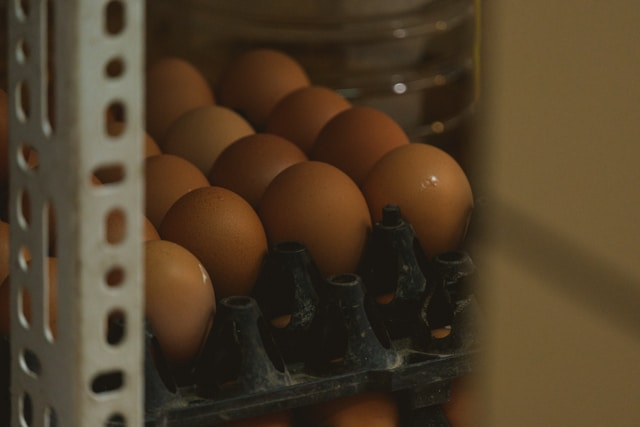
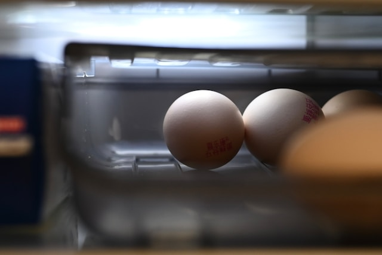
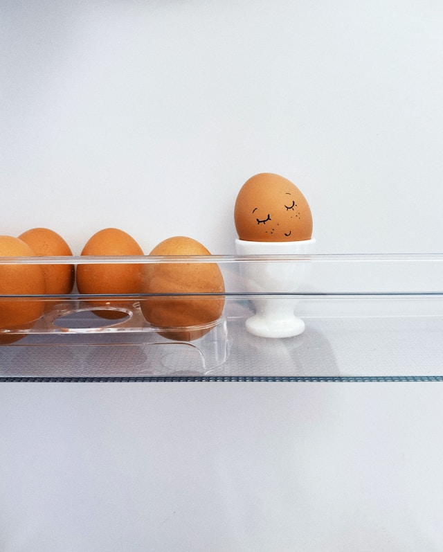
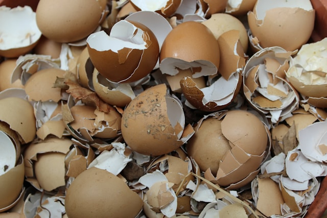
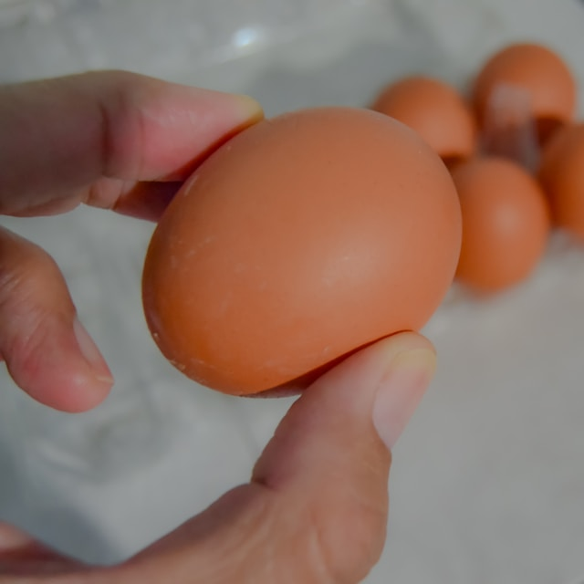

import GemeComposterCTA from '@site/src/components/GemeComposterCTA'

Eggs are one of the most versatile and affordable kitchen staples, but have you ever wondered: *do eggs expire?* *how long do eggs last in the fridge?* Whether you're preparing a weekend breakfast or baking a cake, using fresh eggs is essential — not just for flavor, but for food safety, too.

Let's explore egg shelf life, expiration myths, *how to tell if an egg is bad*, and what to do with spoiled eggs, including **how to compost eggs safely using a composter**.

<!-- truncate -->

<h2 className="jump-to">Jump To</h2>

1. **[Overview of Eggs Longevity](#1-understanding-egg-shelf-life)**

2. **[Do Eggs Expire?](#2-do-eggs-expire-myths-vs-facts)**

3. **[How to Tell If Eggs Are Bad](#3-how-to-tell-when-eggs-go-bad)**

4. **[How Long Do Eggs Last in the Fridge?](#4-how-long-do-eggs-last-in-the-fridge-a-detailed-breakdown)**

5. **[How to Compost Bad Eggs](#5-composting-bad-eggs-eco-friendly-solutions)**

6. **[How to Store Eggs Safely](#6-food-safety-tips-for-egg-storage)**

7. **[FAQs About Egg Storage and Composting](#7-faqs-about-egg-storage-and-composting)**

8. **[Keep Your Eggs Fresh And Waste-free](#8-conclusion-keep-your-eggs-fresh-and-waste-free)**

## 1. Understanding Egg Shelf Life

### Factors That Affect Egg Longevity

Several factors influence how long eggs remain fresh:

- Storage Temperature: Eggs kept in a cold, stable fridge last significantly longer.
- Packaging Date: Eggs closer to their packing date last longer than those closer to expiration.
- Handling Practices: Frequent handling or temperature changes reduce freshness.
- Type of Egg: Farm-fresh and commercial eggs differ in coating and treatment, impacting shelf life.

### Difference Between Store-Bought and Farm Eggs

- Store-Bought Eggs: Washed and sanitized, removing the protective cuticle. This makes refrigeration critical.
- Farm-Fresh Eggs: Often unwashed and can be stored at room temperature for a short time due to the intact cuticle.

### Refrigerated vs. Room Temperature Storage

In the U.S., refrigeration is a must due to washing and sanitization practices. At room temperature, eggs spoil much quicker — often in just 1–2 weeks. In contrast, refrigerated eggs can last 4–5 weeks or longer past the pack date.

## 2. Do Eggs Expire? Myths vs. Facts

### Expiration Date vs. Sell-By vs. Best-By Labels

Understanding the labels can be confusing:

- Sell-By Date: Meant for retailers, not consumers.
- Expiration Date: A general guide, not an exact spoilage point.
- Best-By Date: Suggests peak freshness, not safety.

In many cases, eggs are perfectly usable 2–3 weeks past their labeled expiration date — if stored properly.

### What Happens When Eggs Expire?

Expired eggs don't necessarily turn toxic overnight. Over time, moisture and gases escape through the shell, making them:
- Runny and watery
- More alkaline (less acidic)
- [**Prone to bacterial contamination**](/blog/egg-recall-salmonella-2025-best-way-to-kill-salmonella-in-eggs-recalled)

⚠️ **That's why regular checks are important.** 

## 3. How to Tell When Eggs Go Bad

### The Float Test Explained

**A classic method to check egg freshness**:

1. Fill a bowl with water.
2. Gently place the egg inside.

- Fresh eggs: Sink and lay flat.
- Older eggs: Stand upright.
- Bad eggs: Float to the top due to increased air cell size.

### Sight, Smell, and Sound Clues

- Sight: Look for cloudy whites, pinkish or greenish hues—signs of bacterial growth.
- Smell: A rotten egg smell is unmistakable. If it smells off, toss it.
- Sound: A sloshing sound inside the shell might indicate a breakdown in structure.

### Cracked Shells and Odd Colors

**Avoid using eggs with**:

- Cracks or oozing
- Mold or powdery residue
- Unusual yolk colors (e.g., green, grey)
 
  ---

## 4. How Long Do Eggs Last in the Fridge? A Detailed Breakdown

### Raw Eggs in Shell

- Fridge life: Up to 5 weeks after purchase
- Pro Tip: Store them in the original carton to retain moisture and prevent odor absorption.

### Hard-Boiled Eggs

- Shelf life: 1 week max in the fridge (peeled or unpeeled)
- Shells offer protection, but boiling removes the cuticle.

### Beaten Eggs or Egg Whites/Yolks

- Refrigerated shelf life:
  - Egg whites: 4 days
  - Yolks: 2 days
  - Mixed eggs: 2 days

---

### Egg Storage Chart

| Type of Egg Product | Refrigerator (≤40°F / 4°C) |
|---|---|
| Raw eggs in shell | 3–5 weeks |
| Hard-boiled (in shell) | 1 week |
| Beaten eggs (mixed) | 2 days |
| Egg whites (separated) | 4 days |
| Egg yolks (separated) | 2 days |

## 5. Composting Bad Eggs: Eco-Friendly Solutions

### Why You Shouldn't Toss Eggs in the Trash

Rotten eggs in landfills emit methane, a potent greenhouse gas. Composting is a smarter, eco-conscious option.

---

### How to Compost Eggs Safely

- Crush the shell to help it break down faster.
- Mix bad eggs into nitrogen-rich compost.
- Bury deeper in compost to minimize odors and pests.

### Using the GEME Composter for Bad Eggs

The GEME composter is ideal for food waste like bad eggs. It:

- Processes organic waste quickly.
- Reduces odors with bio-filters.
- Converts spoiled eggs into nutrient-rich compost in a safe, enclosed system.

Using the GEME composter ensures your waste turns into something beneficial for your garden or plants.

<GemeComposterCTA className="custom-styles" />

## 6. Food Safety Tips for Egg Storage

### Proper Handling Practices

- Wash your hands before and after handling raw eggs.
- Don't mix old and new eggs in storage.
- Use clean containers for cracked or separated eggs.
---

### Do's and Don'ts of Fridge Storage

**Do:**

- Keep eggs in the coldest part of the fridge.
- Store eggs in the original carton.
- Label containers with the date when eggs are cracked or boiled.

**Don't:** 

- Store eggs on the fridge door.
- Wash eggs before storing.
- Leave eggs out at room temperature for long periods.

## 7. FAQs About Egg Storage and Composting

1. **How long do eggs last past the expiration date?**

   Eggs can remain fresh for 2–3 weeks past their expiration date if stored properly in the fridge.

2. **Can you eat eggs that float in water?**

   Floating eggs are likely spoiled. It's best to discard them.

3. **What happens if you eat a bad egg?**

   You risk food poisoning with symptoms like nausea, vomiting, and diarrhea.

4. **Can you compost raw eggs?**

   Yes! Just make sure they're composted properly to avoid odors and pests.

5. **Is it safe to compost eggshells?**

 
   Absolutely. Eggshells are calcium-rich and beneficial for compost.

6. **What makes the GEME composter better for eggs?**

 
   It processes eggs quickly, contains odor, and produces nutrient-rich compost safely and efficiently.

---

## 8. Conclusion: Keep Your Eggs Fresh and Waste-Free

Knowing how long eggs last in the fridge helps reduce waste, prevent illness, and protect the environment. Always check freshness using the float test or your senses. And if you do end up with bad eggs, don't just toss them—compost them with smart tools like the [**GEME home electric composter**](https://www.geme.bio/product/geme) for food waste.

Sustainable living starts with small choices, like better food storage and composting habits.

## Related Articles

- [**Egg Recall Due To Salmonella**](/blog/egg-recall-salmonella-2025-best-way-to-kill-salmonella-in-eggs-recalled)

- [**Are Tomatoes Safe to Eat Now?**](/blog/are-tomatoes-safe-to-eat-now)

- [**Can Popcorn Expire?**](/blog/can-popcorn-expire)

- [**The Best Composter to turn food waste into rich compost for your garden**](/blog/the-best-composter-to-reduce-food-waste)

- [**How Long Do Apples Last in The Fridge?**](/blog/how-long-do-apples-last-in-the-fridge)

## Sources
1. USDA: How long can you store eggs in the refrigerator? https://ask.usda.gov/s/article/How-long-can-you-store-eggs-in-the-refrigerator 

2. USDA: Is it safe to store eggs in the door of a refrigerator? https://ask.usda.gov/s/article/Is-it-safe-to-store-eggs-in-the-door-of-a-refrigerator

3. <a href="https://www.healthline.com/nutrition/expired-eggs" rel="nofollow">Healthline: Can You Eat Expired Eggs?</a>

4. Wikipedia: Eggs Storage https://en.wikipedia.org/wiki/Eggs_as_food#Storage

_Ready to transform your gardening game? Subscribe to our [newsletter](http://geme.bio/signup) for expert composting tips and sustainable gardening advice._
