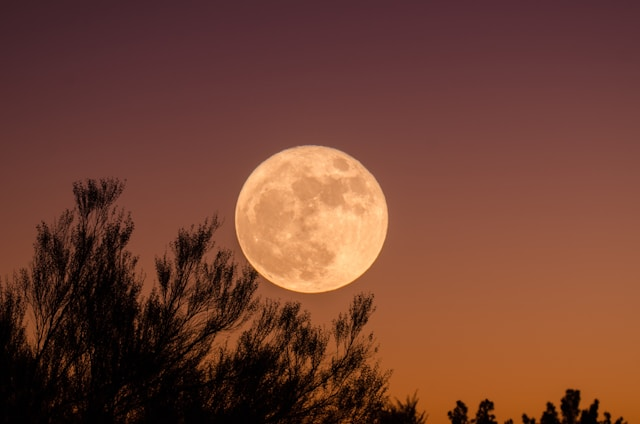
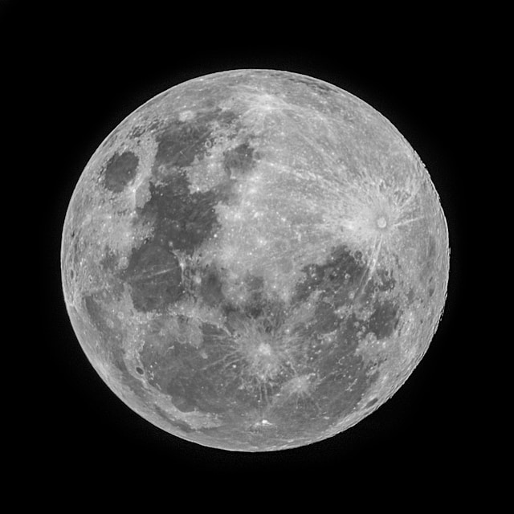
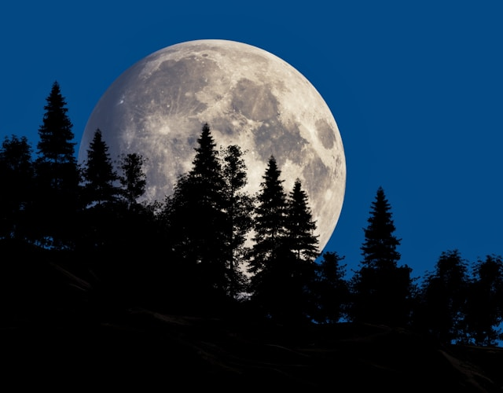
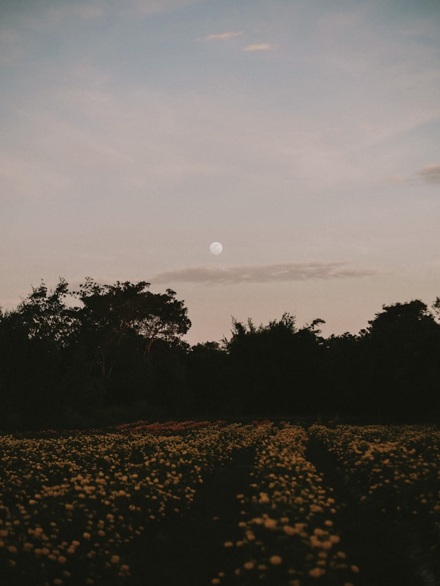
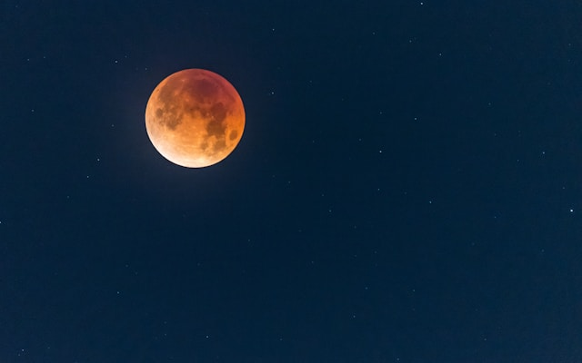
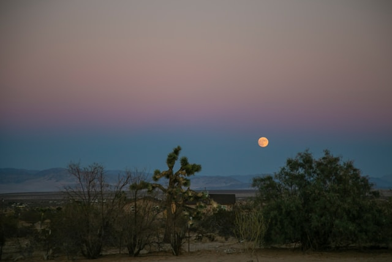

import GemeComposterCTA from '@site/src/components/GemeComposterCTA'

## Introduction to Full Moon July 2025

The **full moon in July 2025**, often called the Buck Moon, appears on July 21, 2025. This celestial event not only dazzles the night sky but also offers a unique opportunity for gardeners: plants rooted just before the full moon may thrive more robustly and yield stronger harvests.

<!-- truncate -->

<h2 className="jump-to">Jump To</h2>

1. **[Science between moon phase and plant growth](#1-scientific-evidence-moon-phase-and-plant-growth)**

2. **[Why plant before full moon July 2025?](#2-why-plant-before-the-full-moon-the-science-explained)**

3. **[Why composting before full moon July?](#3-biodynamics--composting-before-full-moon)**

4. **[Critical Views](#4-skeptical-view-what-critics-say)**

5. **[FAQs about Full Moon July 2026 and Plant Growth](#5-faqs-about-full-moon-july-and-plant-growth)**

6. **[Harnessing July 2025 Full Moon for plant growth](#6-conclusion-harnessing-july-2025s-full-moon-for-growth)**

7. **[Ancient Lunar Gardening Guide](#7-final-thoughts-lunar-gardening-is-an-ancient-wisdom-reborn-in-modern-science)**

## 1. Scientific Evidence: Moon Phase and Plant Growth

According to a preview in The Moon Through The Trees, a paper to be featured in Nature, tree biologist Ernst Zürcher of ETH Zurich conducted trials indicating better plant growth if planted just before a full moon. His tropical nursery experiments with Maesopsis eminii showed faster germination, improved seedling growth, and increased root development when planting occurred 2 days before full moon, compared to other lunar phases.

Earlier European research on cereals like oats, wheat, barley, and vegetables revealed similar trends. For instance, corn sown before the full moon had stronger initial growth and higher yields than those planted before the new moon.

Moreover, studies of root elongation in Arabidopsis thaliana suggest that lunisolar tidal forces influence root growth cycles—even under constant light—demonstrating a potential physical mechanism behind lunar growth effects.

## 2. Why Plant Before the Full Moon? The Science Explained

- Lunar gravity & water uptake: Just as tides respond to the moon, minor fluctuations in soil moisture could affect seed hydration and root expansion.

- Hormonal activity: Hormones like cytokinin, which regulate growth, peak near the full moon. Some algae and early-plant studies show these rhythms align with lunar cycles.

- Sap flow cycles: Tree anatomists like Zürcher note rapid sap ascent during the moon’s waxing phase—leading up to full moon—improving nutrient transport.

## 3. Biodynamics & Composting Before Full Moon

Biodynamic gardeners have long advised using finished compost just before a full moon, believing plants absorb nutrients more efficiently during this period. While some characterisations deem [**biodynamics pseudoscientific**](https://en.wikipedia.org/wiki/Biodynamic_agriculture), there’s emerging experimental backing for compost uptake rhythms.

Choosing a [**GEME electric composter**](https://www.geme.bio/product/geme) helps you have nutrient-rich compost ready exactly when planting time approaches. The GEME composter accelerates breakdown using heat and aeration control — ideal for aligning with lunar sowing plans.

<GemeComposterCTA className="custom-styles" />

### Highlight: Using GEME Electric Composter for Best Compost

- Fast processing: Converts food waste into rich compost in 6–8 hours, perfect for last-minute prep before planting.

- Consistent result: Controlled biodegradation yields uniform texture and nutrient levels.

- Moon-aligned usage: Prepare compost on the new moon or slightly before the waxing phase, to apply at peak before the full moon.

### Practical Gardening Tips for July 2025 Gardeners

- Ideal planting window: July 19–20, 2025, two days ahead of the full moon, marks the optimal time to plant seeds or seedlings in July.

- Best crops: Early-season vegetables (corn, carrots), herbs, and cereals were shown to benefit the most.

- Garden scheduling: Use a lunar calendar or smartphone app to plan composting, seeding, and transplanting around moon phases.

## 4. Skeptical View: What Critics Say

Critics argue that biodynamic methods rely on superstition and lack reproducible evidence. Agricultural astrology is widely considered a pseudoscience.

And while some large-scale reviews find no convincing link between lunar phase and plant performance, targeted research by Zürcher and others demonstrates phase-related effects, especially when experimented with precise timing and controlled conditions.

## 5. FAQs about Full Moon July and Plant Growth

1. Does the full moon really affect plant growth?

   Yes, controlled studies show better germination and early growth when sowed just before a full moon.

2. What if I miss the planting window?

   Planting slightly outside the ideal 2‑day range may yield still-strong growth, though benefits might be reduced.

3. Can indoor plants benefit too?

   Possibly. Effects like hormone rhythms and water uptake are likely to still apply, independent of light exposure.

4. How do I track lunar dates and compost timing?

   Use lunar-phase apps or online calendars, and prepare compost ahead so it’s ready the day before planting.

5. Which plants benefit most?

   Experiments highlight cereals, root vegetables, and early-season crops showing strong responses.

6. Can moon-planting increase yield or flavor?

   Some studies say yes—especially in root and leafy crops—but outcomes may vary by species and soil conditions.

## 6. Conclusion: Harnessing July 2025’s Full Moon for Growth

The Full Moon on July 21, 2025 provides a unique chance to time your planting for stronger germination, early growth, and better nutrient absorption. By preparing compost with a GEME electric composter and planting during the 2-day pre‑full‑moon window, you align gardening with natural rhythms validated by modern research. Whether you're a biodynamic believer or pragmatically efficient, trying moon-aligned planting this July may offer unexpectedly fruitful results.

### 🌕 Summary Table: Moon Gardening Quick Guide

| Phase | Activity | Crop Type | Best Tools |
|-------|----------|-----------|------------|
| New Moon | Start composting | N/A | GEME Electric Composter |
| Waxing Moon | Sow leafy greens, herbs | Above-ground crops | Moist soil, seed trays |
| Full Moon (±2 days) | Transplant, apply compost | All crops | Rich compost, mulch |
| Waning Moon | Sow root vegetables | Underground crops | Raised beds |
| Void of Course | Avoid planting | Any | Observation only |

### ✅ What You Can Do Next:

- Track the next lunar cycles using a moon gardening calendar.

- Try moon-aligned planting with your favorite summer crops.

- Prepare your compost using a GEME Electric Composter and time it before the full moon.

- Share your gardening results and experiments—help grow the community!

## 7. Final Thoughts: Lunar Gardening Is an Ancient Wisdom Reborn in Modern Science

What was once passed down as folklore or biodynamic wisdom is now receiving support from scientists like Ernst Zürcher, who show that moonlight and gravity do more than just light the sky—they shape how seeds grow, roots expand, and sap flows. The Full Moon of July 2025 is your chance to experience this phenomenon firsthand.

Whether you're a skeptic or a seasoned moon gardener, planting in sync with the lunar cycle and using tools like the GEME Electric Composter helps you harness nature’s calendar for better plant health, harvest quality, and ecological harmony.

## Related Articles

- [**How to Grow Tomato Plants**](/blog/are-tomatoes-safe-to-eat-now#benefits-of-growing-your-own-tomato-plant-at-home)

- [**How to Plant a Garden**](/blog/how-to-plant-a-garden-best-gardening-guide-for-beginners)

- [**The Best Kitchen Composter For Reducing Food Waste**](/blog/the-best-composter-to-reduce-food-waste)

- [**Garden Soil VS Compost**](/blog/garden-soil-vs-compost-pros-and-cons)

## Sources
1. Science | AAAS 
https://www.science.org/content/article/moon-through-trees

2. Wikipedia: Biodynamic agriculture
https://en.wikipedia.org/wiki/Biodynamic_agriculture 

3. Permacultureprinciples: <a href="https://permacultureprinciples.com/post/moonlight-affect-plant-growth/?srsltid=AfmBOooa3d_F0dSvNi6qamGZh_CvdIqk9NWfnk05GY_GNuIt7GRM9-x7" rel="nofollow">Can moonlight affect plant growth?</a>

4. CCSENET: Lunar Rhythmicities in the Biology of Trees
https://ccsenet.org/journal/index.php/jps/article/download/32457/19576

_Ready to transform your gardening game? Subscribe to our [newsletter](http://geme.bio/signup) for expert composting tips and sustainable gardening advice._
