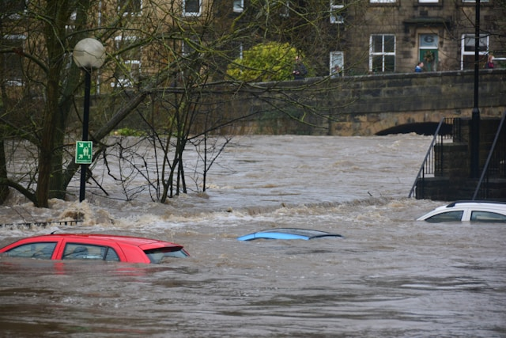
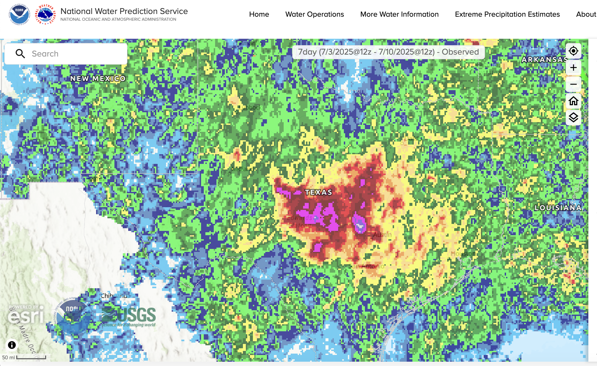
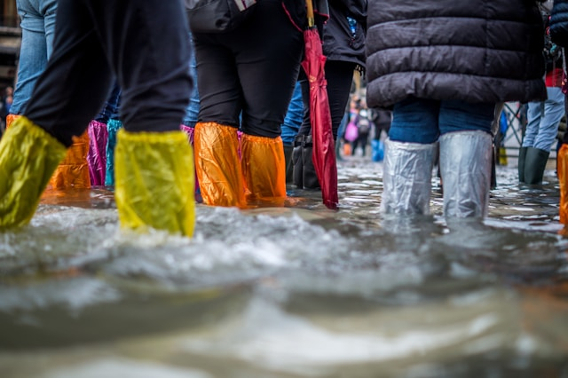
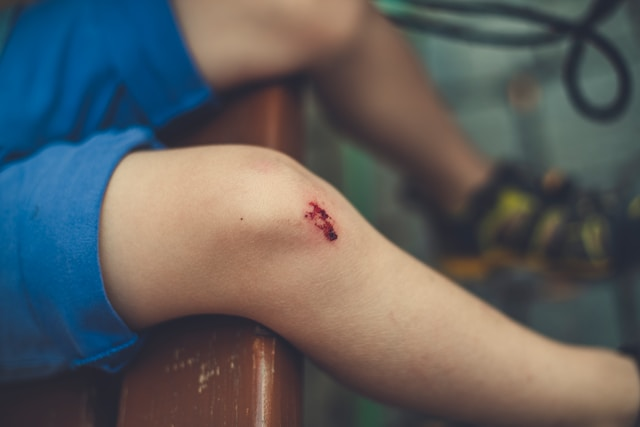
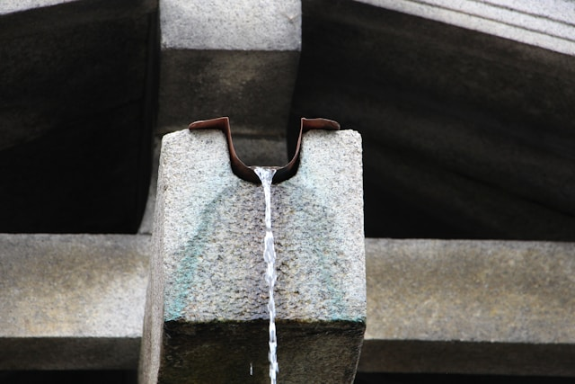
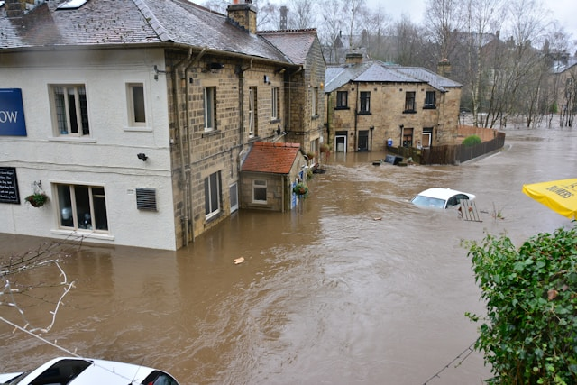
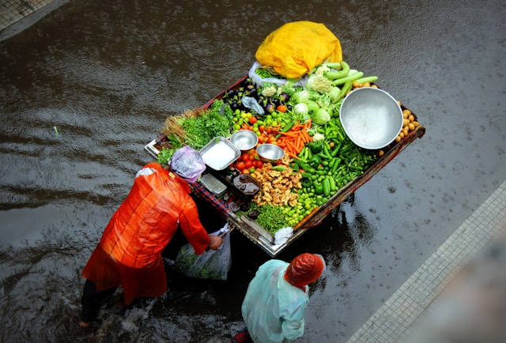
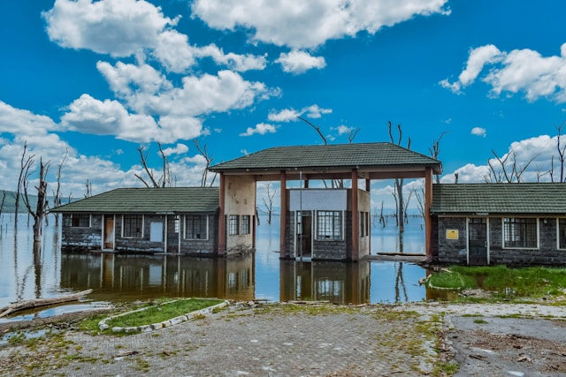

import ReactPlayer from 'react-player'
import GemeComposterCTA from '@site/src/components/GemeComposterCTA'

## 7 Urgent Emergency Tips for Safe & Smart Home Recovery After Floods

Floods can strike without warning, leaving behind chaos and damage. **Proper recovery after the floods** isn't just about cleaning up—it's about doing it safely and strategically. From avoiding polluted water after floods to knowing how to compost properly, here are seven emergency tips to help guide you through recovery.

  <ReactPlayer 
    className="video__player" 
    controls height="100%" 
    url="https://www.youtube.com/watch?v=lA8rRgNP72o" width="100%" 
  />

<!-- truncate -->

<h2 className="jump-to">Jump To</h2>

1. **[Stay Alert For Potential Follow-up Rainfall](#1-stay-alert-for-potential-follow-up-rainfall)**

2. **[Avoid Outdoor Activities in Flooded Areas](#2-avoid-unnecessary-outdoor-activities-especially-in-flooded-areas)**

3. **[Prevent Wound Infection](#3-treat-flood-related-injuries-promptly-to-prevent-infections)**

4. **[Do Not Drink Tap Water Without Boiling After Floods](#4-do-not-drink-tap-water-after-the-flood-without-boiling)**

5. **[Clear Debris After Floods](#5-clear-debris-from-yards-immediately-after-floods)**

6. **[Do Not Eat Fresh Food Exposed to Floodwaters](#6-do-not-eat-fruits-or-vegetables-exposed-to-floodwaters)**

7. **[Recover Your Garden By Composting Flood Damaged Plants](#7-recover-soil-and-plants-by-composting-flood-damaged-vegetation)**

## 1. Stay Alert for Potential Follow-up Rainfall

Even after the initial flood in New Jersey has subsided, the danger may not be over.

### Monitor Weather Reports

Always check local weather updates and flood alerts via reliable channels like meteorological apps, radios, or community services. Flood-prone areas are at risk for secondary flooding due to saturated soil or blocked drainage.

### Understand Your Area’s Risk

Know if your home sits on a floodplain or near rivers. These areas are more vulnerable to repeated flooding.

### Importance of Flood Warning Systems

Sign up for community alert systems. Early warnings can provide you with precious time to secure your property and evacuate if necessary.

## 2. Avoid Unnecessary Outdoor Activities, Especially in Flooded Areas

Stepping into floodwaters is extremely dangerous, even if they appear calm.

### Stagnant Water = Hidden Danger

Floodwaters often conceal sharp objects, debris, open manholes, or live electrical wires. Children and elderly individuals should especially be kept indoors.

### Electrical and Structural Hazards
If water has entered your home, do not use any electrical appliances until the power supply is professionally checked. Water damage can weaken structures, making some areas of your home unsafe.

### Safe Movement Guidelines

Wear rubber boots and gloves, and always carry a long stick to gauge water depth before stepping into unknown waters.

## 3. Treat Flood-Related Injuries Promptly to Prevent Infections

Floodwaters are filled with bacteria and pollutants, making injuries extremely prone to infection.

### First Aid Basics

Clean all cuts or abrasions immediately with clean water and an antiseptic. Cover wounds with waterproof dressings.
Seek Medical Help When Needed

If a wound becomes red, swollen, or starts oozing, seek medical attention quickly to avoid severe infections like tetanus or cellulitis.

### Why Floodwaters Are Risky

Floodwaters can contain raw sewage, chemicals, and dead animals, all of which carry pathogens. Avoid exposure to open wounds entirely.

## 4. Do Not Drink Tap Water After the Flood Without Boiling

Tap water can look clean but still be contaminated by pollutants and bacteria after floods.

### Polluted Water After Floods

Floods can cause cross-contamination between sewage and clean water supplies, making even treated water unsafe.

### Safe Drinking Options

Until authorities declare the water safe:
- Drink only boiled water.

- Use bottled water if available.

- Consider portable water filters or purification tablets.

### Boiling Guidelines

Bring water to a rolling boil for at least 1 minute to kill harmful organisms.

## 5. Clear Debris from Yards Immediately After Floods

Debris can clog drainage systems, creating recurrent flooding problems.

### Why Timely Cleanup Matters

Leaves, branches, and trash block water outlets and cause stagnant water accumulation, leading to mosquito breeding and waterborne diseases.

### Safety Measures

Use gloves and boots, and wear a mask to avoid inhaling mold spores or pathogens during cleanup.
Drainage Maintenance

Clear guttering, street drains, and garden water exits to ensure free flow of water in case of additional rain.

## 6. Do Not Eat Fruits or Vegetables Exposed to Floodwaters
Fresh produce may appear unharmed, but it could carry serious health risks.

### Bacteria and Pathogens

Floodwaters can contain E. coli, Salmonella, and other harmful microorganisms. These pathogens can stick to the skins and leaves of fruits and vegetables.

### To Discard or Not?

If produce came into direct contact with floodwater:

- Do NOT consume it.

- Washing is not enough to ensure safety.

- Composting is the best solution.

<GemeComposterCTA 
 imgSrc="/img/geme-bio-composter.jpg"
 productTitle="GEME Bio Composter"
 features={[
    "✅ Best Way Of Composting At Home",
    "✅ Produce Soil-Ready Compost For Garden",
    "✅ Quiet, Odor-Free, Quick(6-8 hours)",
    "✅ Large Capacity (19 L) For Daily Waste"
  ]}
buttonText="Get Your GEME Composter For Tomato Plants"
  href="https://www.geme.bio/product/geme?utm_medium=blog&utm_source=geme_website&utm_campaign=general_seo_content&utm_content=recovery-guide-after-floods"
/>

### Safe Gardening After Floods

Wait until the garden dries out completely before replanting or consuming anything newly grown. Use protective gloves when handling soil.

## 7. Recover Soil and Plants by Composting Flood-Damaged Vegetation

Floods often strip soil of its nutrients and leave plants weak or dead.

### Why Compost After Floods Matters

Instead of throwing away damaged plants, you can reuse them to nourish your garden. Composting turns waste into nutrient-rich soil.
Steps to Composting Flood-Damaged Plants

1. Let the plants dry thoroughly.

2. Remove any severely diseased portions.

3. Shred and layer with brown (dry leaves) and green (wet waste) compostables.

4. Turn the electric composter to speed up decomposition.

### Soil Rejuvenation

Consider adding fresh compost to restore lost minerals. Test soil pH if possible for precise amendments.

## Frequently Asked Questions (FAQs)

1. **What are the first things to do after flood?**
   
   Shut off electricity, evacuate if unsafe, and avoid contact with floodwaters. Begin cleaning and drying your home as soon as possible.

2. **Is it safe to enter my house right after flooding?**

   Only if you’ve ensured there's no structural damage or electrical hazard. Always check with professionals if unsure.

3. **Can I use tap water to wash my hands after floods?**

   Use bottled or boiled water until local authorities confirm the water is safe.

4. **What should I do with food that was in contact with floodwater?**

   Don't eat it — this includes canned goods if the labels were soaked or cans were damaged. The best way is to compost it with an electric composter.

5. **How long should I wait to plant vegetables again after flooding?**

   Wait until the soil dries and is tested. Remove topsoil if contaminated and avoid planting edible crops for 30–60 days.

6. **How can I tell if my soil is still healthy after flood?**

   Signs include foul odor, excess moisture, and visible mold. Use compost and organic matter to improve recovery.

## Conclusion

Recovering your home after floods requires careful planning and attention to health and safety. From understanding the risks of polluted water after floods to learning how to compost after floods using damaged vegetation, these emergency tips ensure you don’t just survive, but thrive in recovery. Stay informed, stay safe, and help your environment bounce back stronger than ever.

## Related Articles

- [**How to Protect Your Home and Garden From Hurricane and Floods**](/blog/tropical-storm-warning-protect-your-garden-from-chantal-now)

- [**FDA Tomato Recall Due to Salmonella Contamination**](/blog/fda-tomato-recall-salmonella-outbreak-raises-concerns-about-vegetable)

- [**The Best Kitchen Composter For Reducing Food Waste**](/blog/the-best-composter-to-reduce-food-waste)

- [**Cucumber Recall Due to Salmonella**](/blog/cucumber-recall-2025-how-to-protect-vegetable-garden-from-salmonella)

## Sources
1. NOAA: Flood Mapping Service
https://www.weather.gov/owp/operations

2. Wikipedia: July 2025 Central Texas Floods
https://en.wikipedia.org/wiki/July_2025_Central_Texas_floods

3. CNN: <a href="https://www.cnn.com/weather/live-news/texas-flooding-camp-mystic-07-10-25" rel="nofollow">News on the deadly Texas floods</a>

4. Youtube: Catastrophic Texas Floods | July 11, 2025
https://www.youtube.com/watch?v=lA8rRgNP72o

_Ready to transform your gardening game? Subscribe to our [newsletter](http://geme.bio/signup) for expert composting tips and sustainable gardening advice._
