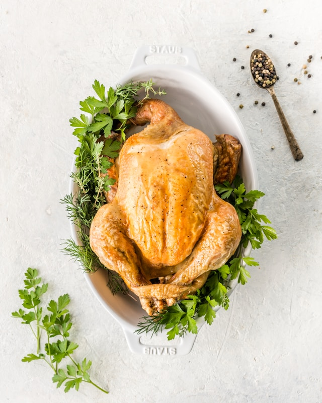
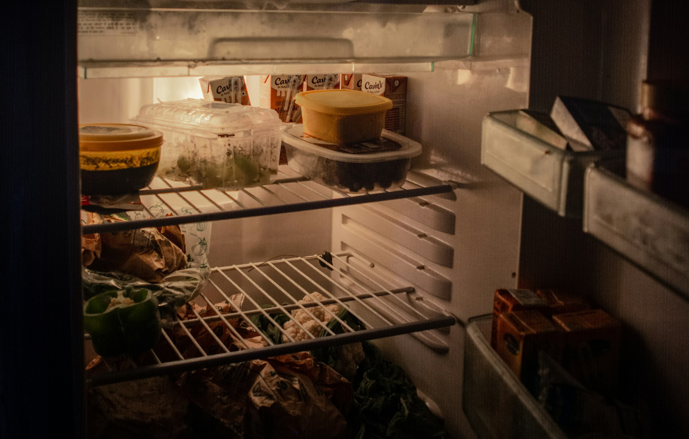
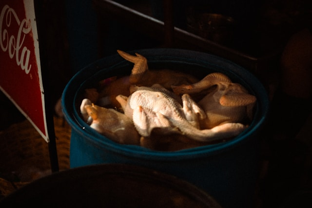

import GemeComposterCTA from '@site/src/components/GemeComposterCTA'
import GemeTerra2CTA from '@site/src/components/GemeTerra2CTA' 

## How Long Can Cooked Chicken Stay in the Fridge?

Cooked chicken is a staple in many kitchens thanks to its versatility and nutrition. But once you’ve roasted, grilled, or rotisserie that bird, the clock starts ticking. How long does cooked chicken last in the fridge? This question matters more than you think—because mishandling leftovers can lead to foodborne illnesses. In this guide, you’ll learn how to store cooked chicken safely, how long it remains edible, and whether or not it’s okay to compost your leftovers.

<!-- truncate -->

<h2 className="jump-to">Jump To</h2>

1. **[Understanding Cooked Chicken Storage Guidelines](#1-understanding-cooked-chicken-storage-guidelines)**

2. **[The Ideal Temperature for Storing Cooked Chicken](#2-the-ideal-temperature-for-storing-cooked-chicken)**

3. **[How Long Can Cooked Chicken Stay in the Fridge Safely?](#3-how-long-can-cooked-chicken-stay-in-the-fridge-safely)**

4. **[How Long Does Chicken Last in the Fridge vs Freezer?](#4-how-long-does-chicken-last-in-the-fridge-vs-freezer)**

5. **[Best Practices for Storing Cooked Chicken](#5-best-practices-for-storing-cooked-chicken)**

6. **[How Long Is Cooked Chicken Good for in the Fridge When Meal Prepped?](#6-how-long-is-cooked-chicken-good-for-in-the-fridge-when-meal-prepped)**

7. **[How Long Does Different Types of Cooked Chicken Last?](#7-how-long-does-different-types-of-cooked-chicken-last)**

8. **[Signs of Your Cooked Chicken Has Gone Bad](#8-signs-your-cooked-chicken-has-gone-bad)**

9. **[Can I Compost Cooked Chicken?](#9-can-i-compost-cooked-chicken)**

## 1. Understanding Cooked Chicken Storage Guidelines

### Why Refrigeration is Important

Cooked chicken, like any meat, is a perishable food. When left at room temperature for too long, it can quickly become a breeding ground for bacteria like Salmonella and Listeria. That’s why proper refrigeration is crucial. Keeping chicken cool slows down bacterial growth, making it safe to eat for a few more days.

### USDA Recommendations for Cooked Poultry

According to the U.S. Department of Agriculture (USDA), cooked poultry should be stored in the refrigerator within 2 hours of cooking. Once refrigerated at the right temperature (we’ll get to that soon), it can stay safe for up to 4 days. After this period, the risk of spoilage and foodborne illness increases significantly.

<GemeTerra2CTA 
 imgSrc="/img/geme-terra-2-composter.jpg"
 productTitle="GEME Terra II Composter"
 features={[
    "✅ Best Way Of Composting At Home",
    "✅ Quiet, Odour-Free, Real Compost",
    "✅ Rich Compost Output For Garden Soil & Plants",
    "✅ Reduce Landfill Waste & Greenhouse Gases"
 ]}
buttonText="Get Your GEME Terra II"
  href="https://www.geme.bio/product/terra2?utm_medium=blog&utm_source=geme_website&utm_campaign=general_seo_content&utm_content=how-long-can-cooked-chicken-last-in-the-fridge"

## 2. The Ideal Temperature for Storing Cooked Chicken

### Recommended Fridge Temperature

Your refrigerator should be set at 40°F (4°C) or lower. This is the threshold at which bacterial growth slows to a crawl. Anything above 40°F puts your cooked chicken at risk.

### How to Use a Refrigerator Thermometer

If you're unsure about your fridge's internal temperature, consider using a refrigerator thermometer. These inexpensive tools can help you maintain food safety by ensuring your chicken and other leftovers stay within the safe temperature zone.

## 3. How Long Can Cooked Chicken Stay in the Fridge Safely?

### General Timeframes (2–4 Days)

The general rule is straightforward: Cooked chicken can last in the fridge for 3 to 4 days. This applies to all types—roasted, grilled, fried, or baked. Beyond that, the quality degrades and it may become unsafe to eat.

### Factors That Affect Shelf Life

Several variables can shorten or extend how long your chicken stays good:

- Storage method (airtight container vs. open plate)

- How quickly it was cooled

- Humidity in your fridge

- Whether it was marinated or sauced

## 4. How Long Does Chicken Last in the Fridge vs Freezer?

### Comparing Shelf Life

| Storage Method | Shelf Life |
| ------------- | ---------- |
| In the Fridge | 3–4 days |
| In the Freezer | 2–6 months (best quality) |

Freezing cooked chicken can extend its life up to six months, but for best taste and texture, use it within two to three months.

### Reheating and Refreezing Considerations

Avoid refreezing chicken once it’s been thawed and reheated. The constant temperature changes can increase bacterial risk.

<GemeTerra2CTA 
 imgSrc="/img/geme-terra-2-composter.jpg"
 productTitle="GEME Terra II Composter"
 features={[
    "✅ Best Way Of Composting At Home",
    "✅ Quiet, Odour-Free, Real Compost",
    "✅ Rich Compost Output For Garden Soil & Plants",
    "✅ Reduce Landfill Waste & Greenhouse Gases"
 ]}
buttonText="Get Your GEME Terra II"
  href="https://www.geme.bio/product/terra2?utm_medium=blog&utm_source=geme_website&utm_campaign=general_seo_content&utm_content=how-long-can-cooked-chicken-last-in-the-fridge"

## 5. Best Practices for Storing Cooked Chicken

### Cooling Before Storing

Let your chicken cool to room temperature—but not for more than 2 hours—before refrigerating.

### Airtight Containers vs Foil/Plastic Wrap

Use airtight containers to keep bacteria out and prevent your chicken from drying. Foil and plastic wrap are okay in a pinch but not as effective for long-term storage.

## 6. How Long Is Cooked Chicken Good for in the Fridge When Meal Prepped?

### Prepping for the Week

Meal prepping with chicken is smart and convenient. To keep things safe:

- Store in individual containers

- Separate sauces from proteins

- Eat within 3–4 days

### Labeling and Rotation Tips

Label containers with the date cooked and use the FIFO method (First In, First Out) to ensure older meals are eaten first.

## 7. How Long Does Different Types of Cooked Chicken Last?

Grilled, Roasted, Fried, and Sauced Chicken Shelf Life

| Type of Chicken | Shelf Life (Fridge) |
| -------------- | ------------------ |
| Grilled | 3–4 days |
| Roasted | 3–4 days |
| Fried | 3–4 days |
| In Sauce/Marinade | 3 days (shorter due to moisture) |

Moisture from sauces or marinades can speed up spoilage, so aim to consume these meals sooner.

### Common Mistakes to Avoid When Storing Cooked Chicken

- ❌ Leaving chicken out longer than 2 hours

- ❌ Storing in loosely sealed containers

- ❌ Not labeling your leftovers

- ❌ Reheating multiple times

Always prioritize food safety to avoid getting sick.

## 8. Signs Your Cooked Chicken Has Gone Bad

### Visual Changes

Discoloration is a tell-tale sign. If your chicken has turned gray, green, or any off-color, it’s time to toss it or compost it.

### Smell and Texture Differences

A strong, sour odor is a major red flag. So it is a slimy texture. Even if it looks okay, don’t risk it if it smells or feels “off.”

### Mold and Color Discoloration

Mold is a surefire indicator that your chicken is well past its prime. Never cut around mold—just discard the entire portion.

## 9. Can I Compost Cooked Chicken?

In the traditional composting way, you shouldn’t compost cooked chicken at home. It attracts pests like rats and raccoons, and the high-fat content disrupts the composting process.

However, technology makes revolution, even in composting. So, **yes, you can compost your cooked chicken using a home electric composter**. 

Take **GEME** for example, you can slice the cooked chicken that has gone bad into smaller pieces, then just put them in the GEME electric composter. Within 8 hours, that spoiled chicken will be fully composted. 

<GemeComposterCTA 
 imgSrc="/img/geme-bio-composter.jpg"
 productTitle="GEME Bio Composter"
 features={[
    "✅ Best Way Of Composting At Home",
    "✅ Produce Soil-Ready Compost For Garden",
    "✅ Quiet, Odor-Free, Quick(6-8 hours)",
    "✅ Large Capacity (19 L) For Daily Waste"
  ]}
buttonText="Get Your GEME Composter For Tomato Plants"
  href="https://www.geme.bio/product/geme?utm_medium=blog&utm_source=geme_website&utm_campaign=general_seo_content&utm_content=how-long-can-cooked-chicken-last-in-the-fridge"

## FAQs: Cooked Chicken Storage and Safety

**Q1: How to tell if chicken is still safe to eat?**

 A: If it smells fresh, feels firm, and looks normal, it’s probably okay—if it's within 4 days of refrigeration.

**Q2: Can I eat chicken after 5 days in the fridge?**

 A: No. It’s recommended to eat cooked chicken within 3–4 days to avoid the risk of illness.

**Q3: Is slimy chicken still safe?**

 A: Sliminess is a strong sign of spoilage. Don’t take the risk—throw it out.

**Q4: What happens if I eat spoiled chicken?**
 A: You may experience food poisoning symptoms like vomiting, diarrhea, fever, or cramps.

**Q5: Can I freeze leftover chicken?**
 A: Absolutely. Store in freezer-safe containers for up to 6 months.

**Q6: Does seasoning affect shelf life?**
 A: Mildly. Salt may help preserve it slightly, but heavy sauces can shorten fridge life.

## Conclusion: Storing Cooked Chicken the Right Way

Cooked chicken is delicious and easy to prep ahead—but it’s also perishable. Knowing how long cooked chicken lasts in the fridge is key to staying healthy and reducing waste. 

Stick to the 3–4 day rule, store it right, and when in doubt—throw it out. And remember, no composting that leftover in the traditional way! Take new technology into your life -- the GEME electric composter.

## Related Articles

- [**How Long Do Eggs Last in the Fridge?**](/blog/do-eggs-expire)

- [**FDA Egg Recall Due to Salmonella Contamination**](/blog/egg-recall-salmonella-2025-best-way-to-kill-salmonella-in-eggs-recalled)

- [**The Best Kitchen Composter For Reducing Food Waste**](/blog/the-best-composter-to-reduce-food-waste)

- [**How Long Do Apples Last in The Fridge?**](/blog/how-long-do-apples-last-in-the-fridge)

## Sources
1. USDA Food Safety Guidelines: Chicken from Farm to Table
https://www.fsis.usda.gov/food-safety/safe-food-handling-and-preparation/poultry/chicken-farm-table

2. USDA: How long can you keep cooked chicken?
https://ask.usda.gov/s/article/How-long-can-you-keep-cooked-chicken 

3. Healthline: <a href="https://www.healthline.com/nutrition/how-long-does-chicken-last-in-the-fridge" rel="nofollow">How Long Does Chicken Last in the Fridge?</a>

_Ready to transform your gardening game? Subscribe to our [newsletter](http://geme.bio/signup) for expert composting tips and sustainable gardening advice._
