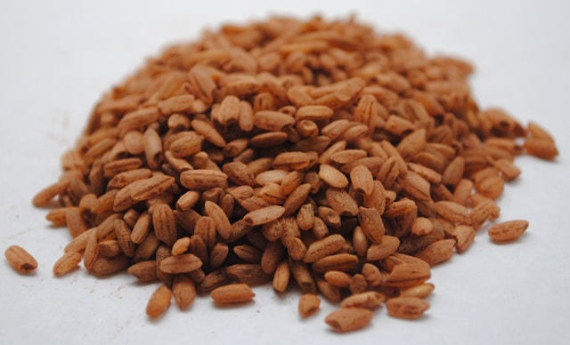
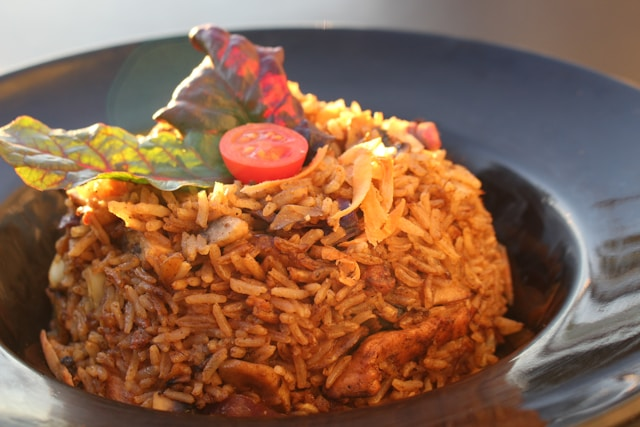
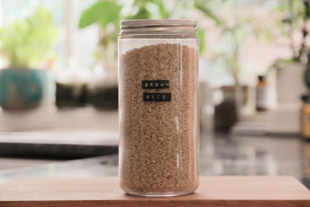
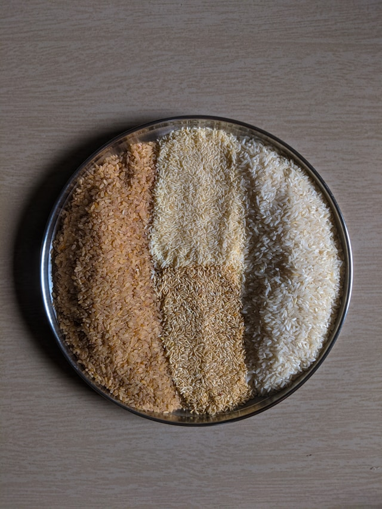
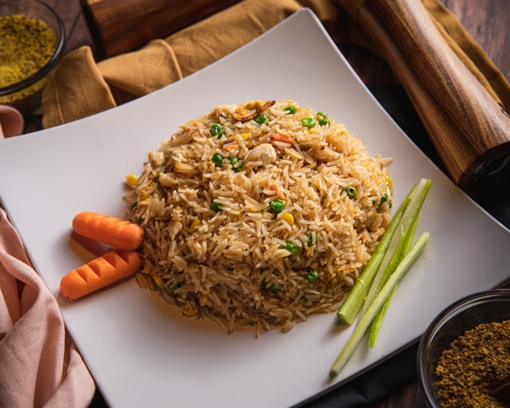

import GemeComposterCTA from '@site/src/components/GemeComposterCTA'
import GemeTerra2CTA from '@site/src/components/GemeTerra2CTA' 

## Introduction to Brown Rice

### What is Brown Rice?

[**Brown rice**](https://en.wikipedia.org/wiki/Brown_rice) is a whole grain rice with only the outermost hull removed. Unlike white rice, it retains the bran layer and germ, which are rich in fiber, vitamins, and essential nutrients. This simple difference gives brown rice a powerful nutritional edge and makes it a top choice for health-conscious eaters.

### How it Differs from White Rice

The refining process of white rice strips away its most nutritious parts, leaving behind mainly carbohydrates. Brown rice, on the other hand, is minimally processed, preserving its natural goodness. This distinction not only affects its nutritional value but also its texture, flavor, and cooking method.

### Brown Rice Nutrition: What's Inside?

**Nutrient Profile**

Brown rice is a nutritional powerhouse. Here’s what a 1-cup (cooked) serving offers:

- Calories: 216

- Protein: 5g

- Carbohydrates: 45g

- Fiber: 3.5g

- Magnesium: 21% of [RDI](https://en.wikipedia.org/wiki/Reference_Daily_Intake)

- Phosphorus: 15% of RDI

- Selenium: 27% of RDI

This whole grain also contains [antioxidants](https://en.wikipedia.org/wiki/Antioxidant), [phytonutrients](https://en.wikipedia.org/wiki/Phytochemical), and a variety of B vitamins, including niacin and thiamine.

<!-- truncate -->

### Health-Boosting Compounds

Brown rice is rich in lignans and phenolic acids, which are linked to reduced inflammation and lower cholesterol. These compounds help combat oxidative stress, supporting overall health and longevity.

### Differences Between Brown Rice And White Rice Nutrients

| Nutrient | Brown Rice (1 cup) | White Rice (1 cup) |
| -------- | ----------------- | ----------------- |
| Calories | 216 | 205 |
| Fiber | 3.5g | 0.6g |
| Magnesium | High | Low |
| Antioxidants | Yes | Minimal |

The takeaway? Brown rice is nutritionally superior by a long shot.

<h2 className="jump-to">Jump To</h2>

1. **[Is Brown Rice Good For You?](#1-is-brown-rice-good-for-you)**

2. **[Brown Rice And Weight Loss](#2-brown-rice-and-weight-loss)**

3. **[Brown Rice And Heart Health](#3-brown-rice-and-heart-health)**

4. **[Is Brown Rice Safe For Diabetics?](#4-is-brown-rice-safe-for-diabetics)**

5. **[Nutrition Battle: Brown Rice VS White Rice](#5-brown-rice-vs-white-rice-a-nutritional-battle)**

6. **[How to Cook Brown Rice Perfectly?](#6-how-to-cook-brown-rice-perfectly)**

7. **[Can I Compost Brown Rice?](#7-can-i-compost-brown-rice)**

8. **[Is Brown Rice Suitable For Everyone?](#8-is-brown-rice-suitable-for-everyone)**

<GemeTerra2CTA 
 imgSrc="/img/geme-terra-2-composter.jpg"
 productTitle="GEME Terra II Composter"
 features={[
    "✅ Best Way Of Composting At Home",
    "✅ Quiet, Odour-Free, Real Compost",
    "✅ Rich Compost Output For Garden Soil & Plants",
    "✅ Reduce Landfill Waste & Greenhouse Gases"
 ]}
buttonText="Get Your GEME Terra II"
  href="https://www.geme.bio/product/terra2?utm_medium=blog&utm_source=geme_website&utm_campaign=general_seo_content&utm_content=how-to-use-compost-correctly"

## 1. Is Brown Rice Good For You?

### Health Benefits Backed by Science

Yes, brown rice is good for you—very much so. Its high fiber content improves digestion, keeps you full, and supports a healthy gut microbiome. Research links regular brown rice consumption with:

- Lower cholesterol

- Improved blood sugar levels

- Reduced heart disease risk

- Better weight management

### Who Should Eat Brown Rice

Almost everyone! It's especially beneficial for:

- People managing weight

- Individuals with prediabetes or diabetes

- Those with high cholesterol

- Vegetarians and vegans looking for more fiber and minerals

### Risks & Downsides

Despite its benefits, brown rice contains phytic acid, which can block the absorption of minerals like zinc and iron. It also tends to have higher levels of arsenic than white rice, especially if grown in contaminated soil. However, rinsing it well and cooking with excess water helps mitigate this issue.

## 2. Brown Rice and Weight Loss

### Role of Fiber

Fiber is key in weight management, and brown rice is loaded with it. It slows digestion, reduces hunger, and prevents overeating, leading to sustainable weight control.

### Satiety & Blood Sugar Regulation

Thanks to its low glycemic index (GI), brown rice provides a steady release of energy without causing blood sugar spikes. This helps regulate appetite and reduces cravings, especially for people with insulin resistance or diabetes.

## 3. Brown Rice and Heart Health

### How It Affects Cholesterol

Brown rice contains soluble fiber, which binds to [cholesterol](https://en.wikipedia.org/wiki/Cholesterol) in the digestive system and helps remove it from the body. Regular intake can lead to lower LDL (bad) cholesterol levels.

### Antioxidants & Cardiovascular Benefits

Rich in antioxidants like flavonoids and selenium, brown rice supports heart health by reducing oxidative damage and improving [vascular function](https://en.wikipedia.org/wiki/Circulatory_system).

## 4. Is Brown Rice Safe for Diabetics?

### Glycemic Index

Brown rice has a moderate GI (around 50), compared to white rice’s higher GI (about 72). This means it raises blood sugar more slowly, which is crucial for managing diabetes.

### Blood Sugar Impacts

Replacing white rice with brown rice in the diet can improve insulin sensitivity and blood sugar control. The fiber content slows glucose absorption, reducing spikes after meals.

### Best Practices for Diabetics

- Pair brown rice with lean protein and healthy fats

- Keep portions moderate

- Avoid sweetened or flavored rice varieties

## 5. Brown Rice vs White Rice: A Nutritional Battle

### Key Differences

| Category | Brown Rice | White Rice |
| -------- | ---------- | ---------- |
| Fiber | High | Low |
| Vitamins & Minerals | Rich | Stripped |
| Glycemic Index | Moderate | High |
| Processing | Minimal | Heavily refined |

### Which is Better for Your Goals?

If your goal is to boost your health, regulate blood sugar, or lose weight, brown rice is the clear winner. White rice may be preferred for athletes needing quick carbs, but it lacks the depth of nutrition that brown rice offers.

## 6. How to Cook Brown Rice Perfectly

### Best Cooking Methods

There are several ways to cook brown rice:

1. Stovetop Method – Most traditional. Use a 2:1 water-to-rice ratio. Simmer for 45 minutes.

2. Rice Cooker – Convenient and mess-free. Some models have a brown rice setting.

3. Instant Pot/Pressure Cooker – Great for quick results. Cook for 20-22 minutes with a 1.25:1 ratio.

### Tips for Fluffiness

- Rinse thoroughly to remove excess starch

- Soak rice for 30 minutes before cooking to soften the grains

- Let it sit covered after cooking for 10 minutes

### Common Mistakes When Cooking Brown Rice

**Avoiding Mushiness** 

- Don’t overcook. Stick to the timing instructions.

- Measure your water carefully.

**Water Ratios**

Use 2 cups of water per 1 cup of brown rice for stovetop. Adjust slightly for other appliances.

**Cooking Time Tips**

Brown rice takes longer than white—plan for 40–50 minutes, depending on method.

### Creative Ways to Enjoy Brown Rice

**Salad Bowls**

Pair with chickpeas, spinach, avocado, and a lemon-tahini dressing.

**Stir-Fries**

Add sautéed vegetables, tofu or chicken, and soy sauce or sesame oil.

**Brown Rice Pudding**

Use almond milk, honey, cinnamon, and raisins for a delicious dessert.

## 7. Can I Compost Brown Rice?

### Composting Cooked vs Uncooked Brown Rice

- Uncooked rice: Safe to compost.

- Cooked rice: Can attract pests and mold. **Best composted in a home electric composter**. 

<GemeComposterCTA 
 imgSrc="/img/geme-bio-composter.jpg"
 productTitle="GEME Bio Composter"
 features={[
    "✅ Best Way Of Composting At Home",
    "✅ Produce Soil-Ready Compost For Garden",
    "✅ Quiet, Odor-Free, Quick(6-8 hours)",
    "✅ Large Capacity (19 L) For Daily Waste"
  ]}
buttonText="Get Your GEME Composter For Tomato Plants"
  href="https://www.geme.bio/product/geme?utm_medium=blog&utm_source=geme_website&utm_campaign=general_seo_content&utm_content=is-brown-rice-healthy"
/>

### Dos and Don’ts

| Do Compost | Don't Compost |
|------------|---------------|
| Plain, uncooked rice, cooked rice with little oil or seasonings | [Cooked rice with too much oil or seasonings](https://www.geme.bio/help-center/docs/faq/supported-foods/what-kinds-of-food-waste-can-i-put-into-what-can-not) |
| In electric composters | In cold or passive compost bins |

### Storing and Reheating Brown Rice

**Safe Storage Methods**

- Refrigerate within 1 hour after cooking

- Store in airtight containers for up to 4 days

**Avoiding Spoilage**

Spoiled rice can harbor Bacillus cereus, a dangerous bacterium. **Compost it if it smells sour or sticky**.

## 8. Is Brown Rice Suitable for Everyone?

### Allergies

Rice allergies are rare, but possible. Brown rice contains more protein than white rice, which may cause issues for some.

### Digestive Issues

Due to its high fiber content, brown rice may cause bloating or gas for people with sensitive stomachs.

### Who Should Limit Intake

- Individuals with kidney disease (due to [phosphorus](https://en.wikipedia.org/wiki/Phosphorus) and [potassium](https://en.wikipedia.org/wiki/Potassium) content)

- People needing a low-fiber diet

### Brown Rice in Special Diets

**Vegan, Gluten-Free, and Plant-Based Diets**

Brown rice is naturally gluten-free, vegan, and rich in plant-based nutrients—perfect for these lifestyles.

**Paleo and Keto Considerations**

Brown rice is not Paleo or Keto-friendly due to its carb content. Those on low-carb diets should avoid it or consume it in moderation.
 imgSrc="/img/geme-terra-2-composter.jpg"
 productTitle="GEME Terra II Composter"
 features={[
    "✅ Best Way Of Composting At Home",
    "✅ Quiet, Odour-Free, Real Compost",
    "✅ Rich Compost Output For Garden Soil & Plants",
    "✅ Reduce Landfill Waste & Greenhouse Gases"
 ]}
buttonText="Get Your GEME Terra II"
  href="https://www.geme.bio/product/terra2?utm_medium=blog&utm_source=geme_website&utm_campaign=general_seo_content&utm_content=is-brown-rice-healthy"
/>

## People Also Ask about Brown Rice

**1. Is it OK to eat brown rice every day?**

Yes, in moderation. Balance it with other grains and rinse thoroughly to reduce arsenic exposure.

**2. Does brown rice contain arsenic?**

Yes, but in small amounts. Rinsing and cooking with excess water reduces it significantly.

**3. Can brown rice help with weight loss?**

Absolutely. Its fiber content keeps you full and stabilizes blood sugar.

**4. Is brown rice better than quinoa?**

Quinoa has more protein and all nine amino acids, but both are nutritious. Rotate between the two for variety.

**5. How much brown rice should I eat per serving?**

1/2 to 1 cup of cooked brown rice is considered a healthy portion.

**6. Is sprouted brown rice healthier?**

Yes! It contains more antioxidants and is easier to digest.

## Conclusion: The Final Verdict on Brown Rice

Brown rice is a nutrient-dense, whole-grain food that offers countless health benefits, from heart health to diabetes control to sustainable weight loss. It may take a little longer to cook, but the payoff is well worth it. Just be mindful of portions, prep it properly, and enjoy it as part of a balanced diet.

## Related Articles

- [**Do Eggs Expire?**](/blog/do-eggs-expire)

- [**The Best Kitchen Composter For Reducing Food Waste**](/blog/the-best-composter-to-reduce-food-waste)

- [**How Long Can Cooked Chicken Last in The Fridge?**](/blog/how-long-can-cooked-chicken-last-in-the-fridge)

## Sources

1. Wikipedia: Brown Rice
https://en.wikipedia.org/wiki/Brown_rice

2. Harvard Medical School: Brown rice versus white rice: A head-to-head comparison
https://www.health.harvard.edu/nutrition/brown-rice-versus-white-rice-a-head-to-head-comparison

3. WebMD: <a href="https://www.webmd.com/diet/health-benefits-brown-rice" rel="nofollow">Brown Rice: Health Benefits, Nutrition Facts, and How to Prepare It</a>

4. Novan Health: [Brown rice vs. White rice: is brown rice better for you than white rice?](https://www.novanthealth.org/healthy-headlines/is-brown-rice-really-better-for-you-than-white)

_Ready to transform your gardening game? Subscribe to our [newsletter](http://geme.bio/signup) for expert composting tips and sustainable gardening advice._
