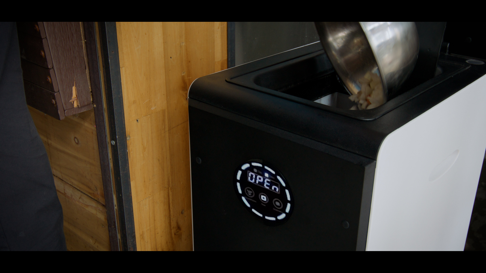
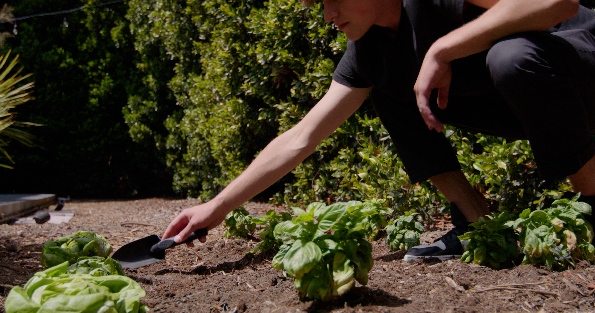
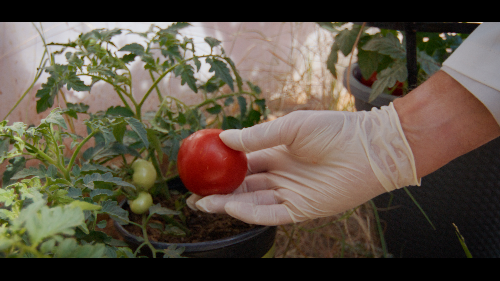
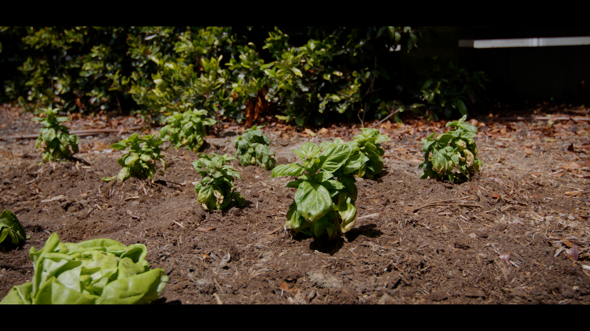

import GemeComposterCTA from '@site/src/components/GemeComposterCTA'

## Introduction to Compost

### What is Compost?

Compost is decomposed organic matter from kitchen scraps, garden clippings, leaves, and other biodegradable materials. It's often called “black gold” because it can enrich soil, promote plant growth, and reduce the need for chemical fertilizers.

Through natural decomposition processes involving microbes, heat, and moisture, compost turns waste into nutrient-rich humus that's ready to nurture plants.

### Benefits of Using Compost

Using compost can significantly improve your garden in multiple ways:

- Improves soil structure – making it looser and better for root development.

- Enhances moisture retention – reducing the need for frequent watering.

- Boosts soil nutrients – releasing them slowly to support steady plant growth.

- Reduces waste – keeping organic materials out of landfills.

- Supports beneficial microbes – which help break down nutrients and fight diseases.

<!-- truncate -->

<h2 className="jump-to">Jump To</h2>

1. **[Can Compost Expire?](#1-understanding-the-lifespan-of-compost)**

2. **[How to Use Compost in Your Garden](#2-how-to-use-compost-in-your-garden)**

3. **[Add Compost to Soil](#3-how-to-add-compost-to-soil-the-right-way)**

4. **[Use Compost In Raised Beds](#4-using-compost-in-raised-beds)**

5. **[How to Use Compost for Potting Soil And Plants](#5-compost-for-potting-soil-and-plants)**

6. **[Adding Compost to Lawn](#6-adding-compost-to-lawns)**

7. **[Common Mistakes When Using Compost](#7-common-compost-using-mistakes-to-avoid)**

8. **[Best Tools For Using and Applying Compost](#8-best-tools-and-techniques-for-applying-compost)**

9. **[Science Behind Compost And Soil Health](#9-compost-and-soil-health-the-science-behind-it)**

10. **[Seansonal Guide to Use Compost](#10-seasonal-guide-to-compost-application)**

## 1. Understanding the Lifespan of Compost

### Does Compost Expire or Go Bad?

While compost doesn’t “expire” like food, its effectiveness can decline if stored improperly. Well-maintained, finished compost can last for up to a year or longer. However, if left exposed to rain, sun, or poor air circulation, it may become anaerobic, smelly, or even moldy.

### How to Store Compost Properly

To keep compost usable:

- Store it in a dry, shaded place.

- Use a breathable container like a [home electric composter](www.geme.bio/product/geme/).

- Avoid soaking it; too much water can kill beneficial microbes.

- Cover outdoor compost piles with a tarp to prevent nutrient leaching.

## 2. How to Use Compost in Your Garden

### Preparing Your Garden for Compost

Before applying compost, clear the area of weeds and debris. Loosen the topsoil with a garden fork or hoe to help compost mix in easily.

### [How to Use Compost in Garden Beds](/blog/how-to-use-compost)

Compost can be used in two main ways:

#### Best Time to Add Compost

- Spring: To prep soil before planting.

- Fall: To enrich beds and protect them over winter.

#### Surface Application vs. Tilling In

- Surface Dressing: Spread 1–2 inches of compost over your beds and let rain or irrigation carry nutrients down.

- Tilling In: Mix compost into the top 6–8 inches of soil for quicker integration.

<GemeComposterCTA className="custom-styles" />

## 3. How to Add Compost to Soil the Right Way

### Methods to Mix Compost with Soil

- Top dressing: Spread compost on top and leave it undisturbed.

- Soil-blending: Mix compost with garden soil in a 1:2 or 1:3 ratio.

- Trench composting: Dig narrow trenches and fill with compost for deep soil feeding.

### How Often Should You Add Compost?

- Gardens: Once or twice a year.

- Flower beds: Once each spring.

- Heavy feeders (like tomatoes): Add compost every 6–8 weeks.

## 4. Using Compost in Raised Beds

### How Much Compost for Raised Bed Gardening

Use about 25–30% compost in your raised bed mix. For example, if your bed is 10 inches deep, add 2–3 inches of compost on top or mix it throughout the bed.

### Mixing Compost with Other Amendments

Compost works well when combined with:

- Coconut coir or peat moss (for moisture retention)

- Vermiculite or perlite (for drainage)

- Worm castings (for added nutrients)

## 5. Compost for Potting Soil and Plants

### How to Use Compost for Potting Soil

Mix compost with store-bought potting mix in a 1:3 or 1:4 ratio. Avoid using 100% compost—it’s too rich and may cause root burn.

### Compost Ratios for Container Gardening

- Vegetables: 25% compost, 50% potting mix, 25% perlite.

- Houseplants: 10–20% compost mixed with regular soil or potting blend.

## 6. Adding Compost to Lawns

### Top Dressing Your Lawn with Compost

Sprinkle a thin layer (¼ to ½ inch) of screened compost over the entire lawn. This improves soil structure, encourages microbial activity, and boosts grass health.

### Tips for Even Spreading

- Use a compost spreader or shovel and rake combo.

- Water lightly after applying to help compost settle.

## 7. Common Compost Using Mistakes to Avoid

### Overusing Compost

Too much compost can lead to:

- Nitrogen burn

- Nutrient imbalance

- Excessive salt buildup

Always follow recommended ratios, especially for potted plants and lawns.

### Using Unfinished Compost

Unfinished compost can rob your soil of nitrogen. If it smells sour or has large recognizable chunks, let it decompose longer. Also, unfinished or unmature compost can be a great place for flies, mold, and pests. 

## 8. Best Tools and Techniques for Applying Compost

### Tools for Spreading Compost

- Shovel

- Rake

- Compost spreader

- Wheelbarrow

- Tarp (for easy movement and cleanup)

### Safety Tips When Handling Compost

- Wear gloves and a mask if dusty.

- Wash hands after use.

- Avoid breathing in mold spores from old compost piles.

## 9. Compost and Soil Health: The Science Behind It

### How Compost Improves Soil Structure and Microbiology

**Compost**:

- Increases porosity

- Supports beneficial microbes and fungi

- Enhances root penetration

- Improves cation exchange capacity (CEC)

### Nutrient Release Timeline of Compost

Compost doesn’t release nutrients all at once. Instead, it:

- Begins feeding immediately

- Continues releasing nutrients for 6–12 months

- Helps retain nutrients in the root zone

## 10. Seasonal Guide to Compost Application

**Spring**

- Use to boost beds before planting.

- Add compost tea for seedlings.

**Summer** 

- Apply light compost layers around veggies.

- Replenish pots as needed.

**Fall and Winter**

- Add compost as mulch.

- Prep beds for spring crops.

## People Also Ask About Using Compost Correctly

1. **Can you use too much compost?**

Yes. Overapplication can lead to nutrient imbalances, poor plant growth, and environmental runoff.

2. **How long should compost sit before using?**

At least 2–6 months. Finished compost should be dark, crumbly, and earthy-smelling.

3. **Is compost good for all plants?**

Mostly yes, but avoid high amounts for acid-loving plants unless the compost is pH-neutral.

4. **Should compost be mixed or laid on top?** 

Both methods work. Top dressing is easy; mixing is better for fast results.

5. **Can compost replace fertilizer?** 

It can reduce the need for chemical fertilizers, but some plants still benefit from added nutrients.

6. **[What does finished compost look and smell like?](/blog/when-compost-is-ready-to-use)** 

Dark brown or black, crumbly, and smelling like fresh earth—not sour or rotten.

## Conclusion: Transform Your Garden with Compost

Using compost correctly can turn ordinary soil into a nutrient powerhouse that promotes healthier plants, fewer pests, and better harvests. From garden beds to potted plants and lawns, this “black gold” is nature’s original fertilizer—and your garden’s best friend.

## Related Articles

- [**How Do I Know When Compost Is Finished?**](/blog/when-compost-is-ready-to-use)

- [**The Best electric Composter for High Quality Compost to Use**](/blog/the-best-composter-to-reduce-food-waste)

- [**The Difference Between Garden Soil And Compost**](/blog/garden-soil-vs-compost-pros-and-cons)

## Sources

1. Earthmatter.org 
https://earthmatter.org/wp-content/uploads/2016/08/tip-sheet-how-to-use-compost-cpts-htuc-f.pdf

2. EPA.gov
https://www.epa.gov/recycle/composting-home

3. NRDC.org: <a href="https://www.nrdc.org/stories/composting-101
" rel="nofollow">How to use compost</a>

4. Oregonstate.edu: https://extension.oregonstate.edu/catalog/em-9308-how-use-compost-gardens-landscapes

_Ready to transform your gardening game? Subscribe to our [newsletter](http://geme.bio/signup) for expert composting tips and sustainable gardening advice._
