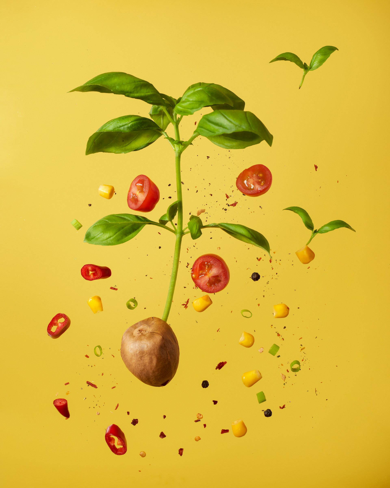
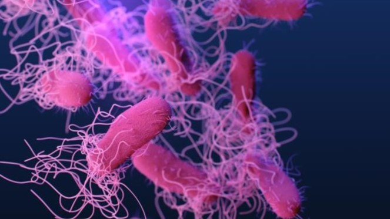
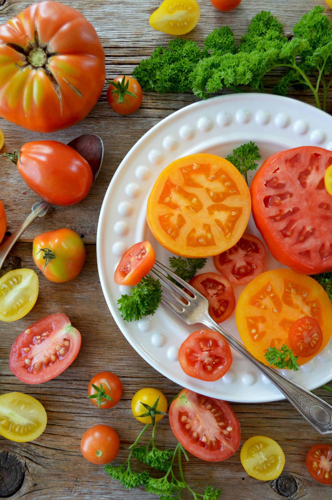
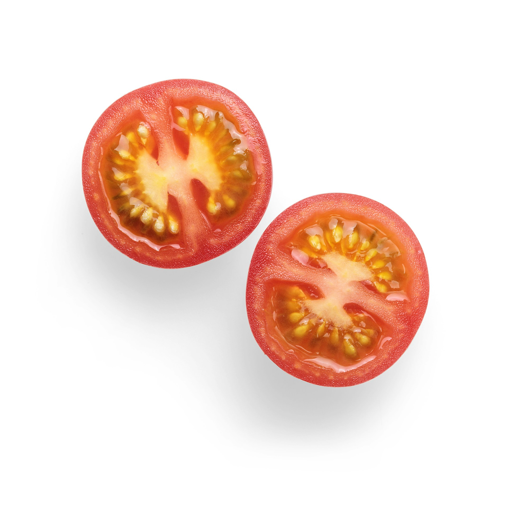
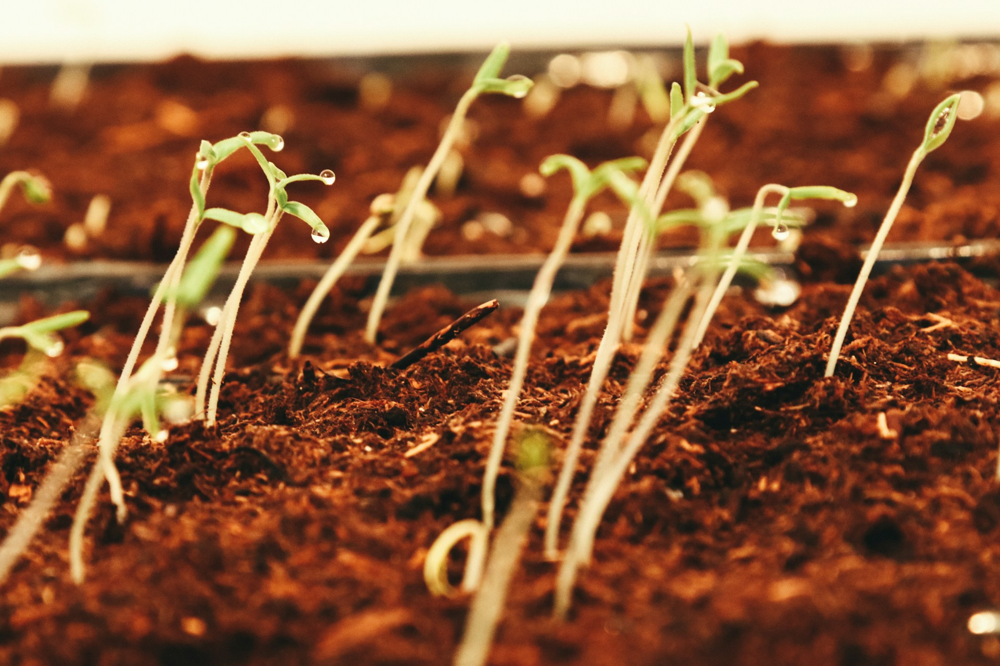
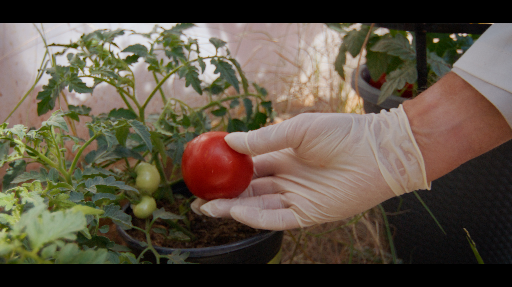
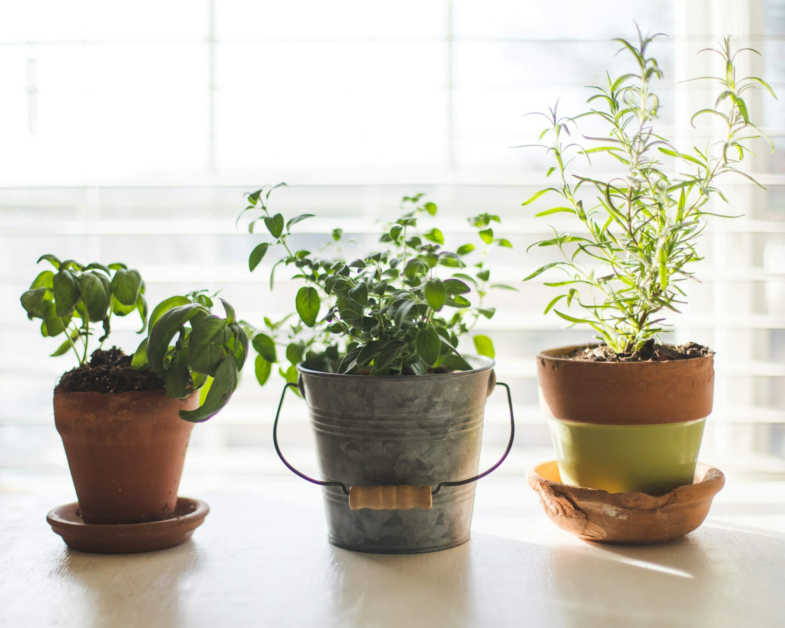

import GemeComposterCTA from '@site/src/components/GemeComposterCTA'

Growing your tomatoes can be one of the most rewarding gardening experiences. But did you know that your juicy tomatoes could carry harmful bacteria like Salmonella if not done carefully? With reports like the [**Salmonella outbreak tomatoes in the US and the UK**](https://www.geme.bio/blog/are-tomatoes-safe-to-eat-now), understanding how to grow tomatoes safely is more important than ever.

Whether you're a novice or a seasoned green thumb, this guide walks you through every step, from choosing seeds to harvesting and storing to ensure your tomatoes are delicious and safe to eat.

<!-- truncate -->

<h2 className="jump-to">Jump To</h2>

1. **[Salmonella and Tomatoes](#1-understanding-salmonella-and-tomatoes)**

2. **[How to Grow Tomatoes From Seeds](#2-how-to-grow-tomatoes-from-seeds)**

3. **[How to Grow Tomatoes](#3-how-to-grow-tomato-plants-outdoors)**

4. **[How Do You Grow Tomato Plants in Pots?](#4-how-do-you-grow-tomato-plants-in-pots)**

5. **[How Long Do Tomatoes Take to Grow?](#5-how-long-do-tomatoes-take-to-grow)**

6. **[Health Care For Tomato Plants](#6-tomato-plant-care-for-maximum-health)**

7. **[Organic Gardening Practices For Tomato Safety](#7-organic-gardening-practices-for-tomato-safety)**

8. **[Expert Advice on Tomato Safety](#8-expert-advice-and-final-thoughts-on-tomato-safety)**

## 1. Understanding Salmonella and Tomatoes

### What is Salmonella?

Salmonella is a type of bacteria that can cause food poisoning. It’s often associated with raw meat, eggs, or dairy, but fresh produce like tomatoes can also become contaminated through dirty water, soil, or handling.

### Salmonella Outbreak Tomatoes UK: What Happened?

In recent years, the UK has seen several foodborne illness outbreaks linked to contaminated tomatoes. These events highlighted the risks of poor agricultural practices, especially in large-scale or improperly managed farms.

### How Do Tomatoes Get Contaminated

Tomatoes can pick up Salmonella through:

1. Contaminated water (especially during irrigation)

2. Improper compost use

3. Animal droppings

4. Unclean tools and hands

Preventing these issues starts with clean and mindful gardening practices.

### Choosing the Right Tomato Variety

#### Disease-Resistant Varieties

Selecting resistant varieties like ‘Mountain Magic’, ‘Iron Lady’, or ‘Defiant PhR’ gives you a head start against many common plant diseases that can open the door for bacterial infections.

#### Best Tomatoes for Home Gardens

For home growers, cherry tomatoes (e.g., ‘Sun Gold’), Roma, or beefsteak types offer a good balance of taste, size, and resilience.

## 2. How to Grow Tomatoes from Seeds

Before you grow tomato plants from seeds, be cautious to choose safe tomato produce that is not part of the Salmonella Tomato Recall area. Or simply get some tomato seeds online. 

Tomato seeds are so tiny in the tomato pulp, making it difficult to pick them out, just like strawberry seeds. However, you don't have to remove all the tomato pulp to take the seeds. Unless you have a tweezer and enough patience to take them out, the only thing you should do is to take the seeds with little pulp and put them in the germinating pot. 

### How to make sure your tomato seeds germinate 

1. Keep the seeds inside the pot on germination soil.

2. Provide 12–16 hours of growing light daily.

3. Keep the germinating soil moist all the time. Don't let it dry out. 

4. Keep the temperature at 21-24°C for better results.

5. Avoid crowding to reduce disease spread.

6. Observe the tomato seeds twice a week. Remove or restart if they don't sprout or even get moldy, rare but just in case. 

7. Do not expose the sprouts to strong sunlight; they're still too fragile and can wilt or die. 

8. Transplant seedlings outdoors after the last frost when they're 6–10 inches tall and have at least two sets of true leaves.

### Starting Indoors

Start seeds indoors 5-7 weeks before your last frost date. Use seed trays filled with sterile seed-starting mix. Keep them warm (70–75°F or 21–24°C) for optimal germination.

### Seed Germination Tips

1. Keep soil moist but not soggy

2. Provide 12–16 hours of growing light daily

## 3. How to Grow Tomato Plants Outdoors

### Preparing Soil for Safety and Growth

Use well-drained, loamy soil enriched with compost. Test for pathogens and avoid using manure from unknown sources to reduce Salmonella contamination risks. 

The best compost should be transformed from your daily waste, including yard waste and kitchen food waste. Use an electric bio composter to make better compost before planting the tomato seedlings. 

**A bio composter can kill any harmful bacteria or pathogens, like Salmonella, using hot composting methods (up to 75-80°C when composting with Kobold fermentation)**. 

<GemeComposterCTA />

### Sunlight, Spacing, and Trellising

Tomatoes thrive in full sun (6–8 hours daily). Space plants 18–24 inches apart and use stakes or cages to improve air circulation and reduce soil contact. 

## 4. How Do You Grow Tomato Plants in Pots?

### Best Potting Mix for Tomatoes

Choose a high-quality, sterile potting mix with peat, perlite, and compost. Avoid using garden soil directly in pots as it may harbor harmful bacteria or pathogens like Salmonella. 

Use a bio composter with a hot composting method to kill harmful bacteria or pathogens. And your compost output will be totally safe to use.

### Container Size and Drainage

Use at least a 5-gallon container per plant. Ensure it has drainage holes to prevent waterlogging, which can encourage fungal and bacterial growth.

### Indoor vs Balcony Gardening

Tomatoes grow well on sunny balconies or patios. If growing indoors, supplement with grow lights and avoid humid, poorly ventilated areas.

## 5. How Long Do Tomatoes Take to Grow?

### Growth Stages and Timeline:

1. Seed to sprout: 5–10 days

2. Seedling to transplant: 5–7 weeks

3. Flowering to fruit set: 2–3 weeks

4. Fruit maturity: 20–30 days post-pollination

Most tomato varieties take 60–85 days from transplant to harvest.

### Signs of Maturity and Readiness to Harvest

Tomatoes are ready when they’re fully colored, slightly soft to the touch, and easily detach from the vine.

### Safe Watering and Fertilizing Practices

#### Avoiding Contaminated Water

Always water with clean, potable water. Avoid overhead watering as it can splash soil (and bacteria) onto leaves and fruit.

#### Using Organic Compost and Safe Fertilizers

Organic compost and slow-release organic fertilizers help feed your plants while keeping them safe from synthetic residues.

### Hygiene and Handling Practices in the Garden

#### Handwashing and Tool Sanitization

Wash your hands before gardening and sanitize pruning shears or knives regularly to prevent bacterial transfer.

#### Protecting Tomatoes from Animal Contamination

Install fencing to keep animals away. Cover plants with netting if birds or pets are a concern.

### Composting Tips to Prevent Contamination

#### Safe Compost Materials

Use only fully decomposed compost. Avoid adding dairy or pet waste to your home electric composter.

### How to Use Compost Without Risks

Let compost sit at least 70°C for 6-8 hours to kill pathogens. While there are quite a few composting methods and electric composters for you to choose from, the only one that meets [the CDC conditions to kill harmful pathogens](https://www.foodsafety.gov/food-safety-charts/safe-minimum-internal-temperatures) is GEME composter. 

Mix the matured compost into soil well before planting.

## 6. Tomato Plant Care for Maximum Health

### Pruning and Supporting Plants

Remove suckers to improve airflow and reduce disease. Use cages or trellises to keep plants upright and clean.

### Recognizing and Treating Diseases

Early blight, fusarium wilt, and blossom end rot can stress plants and invite secondary infections. Use neem oil or copper fungicides as needed.

### Harvesting Tomatoes Safely

#### Best Time to Harvest

Pick tomatoes in the morning when they’re cool and firm. Avoid harvesting in wet conditions to minimize bacterial transfer.

#### How to Handle Without Spreading Bacteria

Use clean gloves or washed hands, and place tomatoes in sanitized containers. Don't mix freshly harvested fruit with older or bruised ones.

### Storing Tomatoes to Avoid Salmonella

#### Washing vs Not Washing Before Storage

It's safer to wash tomatoes right before use, not before storing. Moisture promotes bacterial growth.

#### Storage Temperature and Ventilation

Store tomatoes at room temperature (55–70°F) in a single layer with good airflow. Avoid sealing in plastic bags.

## 7. Organic Gardening Practices for Tomato Safety

### Benefits of Going Organic

Organic gardening avoids harmful pesticides and emphasizes soil health, which in turn supports safer fruit production.

### Natural Pest and Disease Control

Use companion plants (like basil and marigolds), insecticidal soap, and mulch to reduce pests and disease organically.

### Common Mistakes That Can Lead to Salmonella Contamination

1. Using Unsafe Water

Always use water from clean, treated sources. Rain barrels must be covered and cleaned regularly.

2. Overcrowding and Poor Airflow

Dense planting reduces airflow and raises humidity, creating the perfect storm for bacterial growth.

### Tips for Growing Tomatoes in the UK Climate

1. Managing Rainfall and Moisture

Mix Compost with raised beds and mulch to prevent waterlogging. Cover with cloches or plastic tunnels during heavy rains.

2. Ideal Greenhouse Setup

Greenhouses allow control over moisture and temperature—great for safe tomato growing year-round in the UK.

## 8. Expert Advice and Final Thoughts on Tomato Safety

### How Experts Prevent Salmonella

Experts emphasize:

1. Clean water use

2. Tool sanitization

3. Disease-resistant varieties

4. Regular inspections for contamination signs

### Recap of Key Safety Tips

1. Use sterile seeds and soil

2. Avoid contaminated water and traditional composting methods

3. Wash hands and tools regularly

4. Store and handle tomatoes hygienically

## 9. People Also Ask About Growing Tomatoes and Salmonella

**1. Is Salmonella in tomatoes common?**

Not very, but it can happen if basic hygiene and water safety practices are ignored.

**2. How can I prevent contamination at home?**

Use clean water, sanitize tools, and avoid composting unsafe materials like raw manure without hot composting.

**3. Do I need to sterilize soil?**

Sterilizing isn't mandatory but using fresh, disease-free soil helps reduce risks significantly.

**4. Can I reuse tomato seeds safely?**

Yes, if they’re from healthy plants and properly dried and stored.

**5. How do I wash tomatoes before eating?**

Rinse under cool running water without soap. Use a clean brush for extra scrubbing.

**6. Are organic tomatoes safer?**

Yes, when grown with clean practices. Organic methods reduce chemical and bacterial contamination risk.

## Conclusion: Safe Growing Equals Healthy Eating

Growing your own tomatoes is incredibly satisfying, and with the right techniques, also very safe. By understanding the risks, using proper hygiene, and following best practices, you can avoid issues like the "Salmonella outbreak tomato" concerns and grow a bountiful, healthy harvest. 

Follow these tips and enjoy safe, delicious tomatoes from your garden to your plate.

## Related Articles

- [**Are Tomatoes Safe to Eat Now?**](/blog/are-tomatoes-safe-to-eat-now)

- [**FDA Tomato Recall 2025 Raises Concerns About Veggies Safty**](/blog/fda-tomato-recall-salmonella-outbreak-raises-concerns-about-vegetable)

- [**FDA Cucumber Recall**](/blog/cucumber-recall-2025-how-to-protect-vegetable-garden-from-salmonella)

- [**The Best electric Composter for Safe Compost to Use**](/blog/the-best-composter-to-reduce-food-waste)

- [**The Difference Between Garden Soil And Compost**](/blog/garden-soil-vs-compost-pros-and-cons)

## Sources

1. FDA: Williams Farms Repack LLC Recalls Tomatoes Due to Possible Salmonella Contamination 2025 https://www.fda.gov/safety/recalls-market-withdrawals-safety-alerts/williams-farms-repack-llc-recalls-tomatoes-due-possible-salmonella-contamination 

2. CDC: About Salmonella Infection https://www.cdc.gov/salmonella/outbreaks/whole-cucumbers-05-25/index.html#:~:text=CDC%3A-,About%20Salmonella%20Infection,-FDA%3A%20Outbreak 

3. FoodSafety: <a href="https://www.foodsafety.gov/food-safety-charts/safe-minimum-internal-temperatures" rel="nofollow">Safe Minimum Internal Temperatures</a>

4. Reddit: <a href="https://www.reddit.com/r/GEME_Gardening/comments/1l26m9j/fda_tomato_recall_salmonella_outbreak_recall_of/" rel="nofollow">FDA Tomato Recall 2025</a>

_Ready to transform your gardening game? Subscribe to our [newsletter](http://geme.bio/signup) for expert composting tips and sustainable gardening advice._
