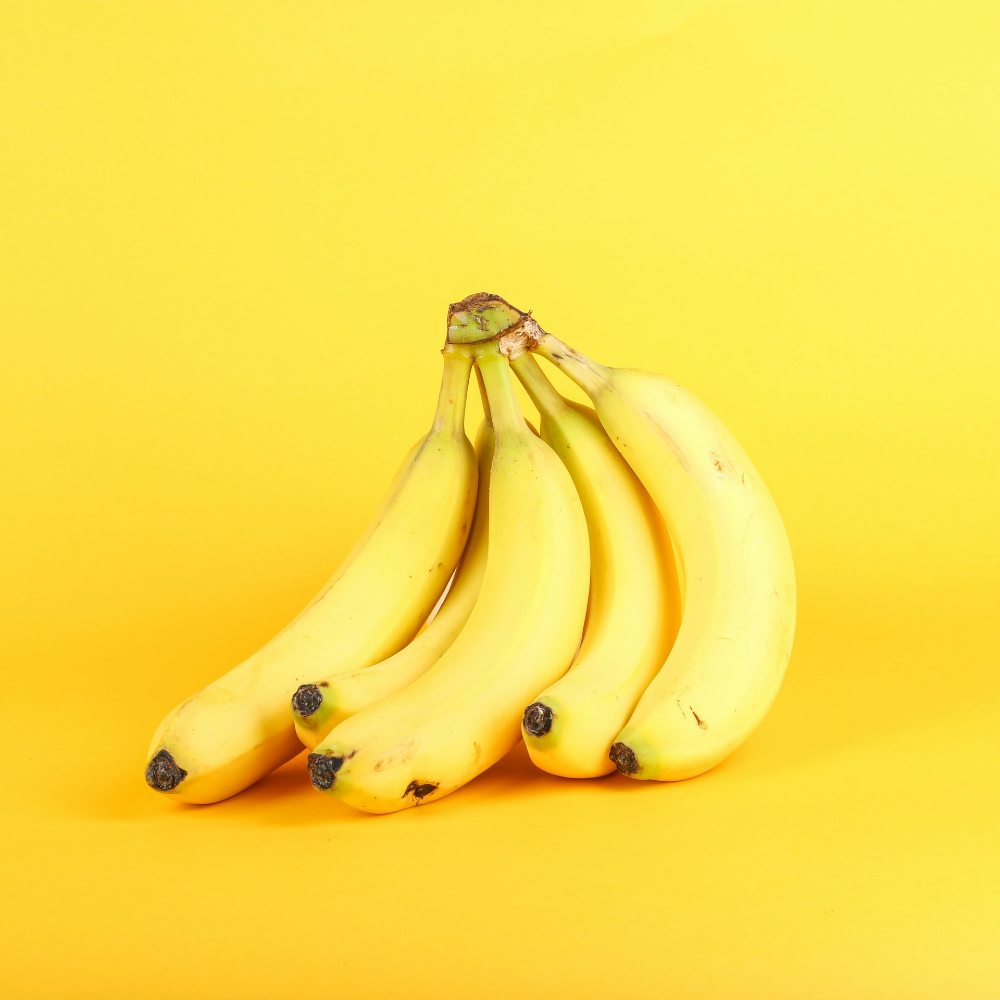
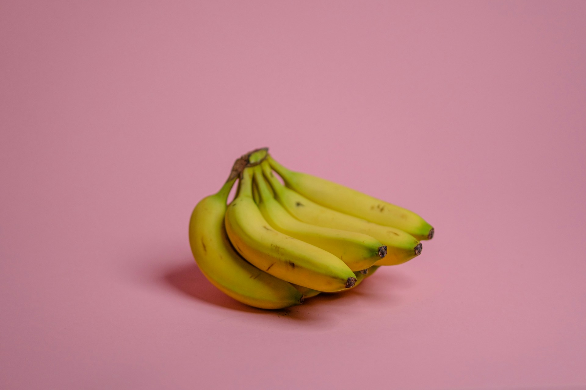

import GemeComposterCTA from '@site/src/components/GemeComposterCTA'

Bananas are a convenient, nutrient-rich fruit, but they ripen and spoil quickly at home. On average, a bunch of bananas left out on the counter will only stay fresh for a few days before turning brown and mushy. By understanding what causes bananas to ripen and using smart storage techniques, we can significantly extend their shelf life. 

This guide explores **how long bananas last**, practical tips on **how to make them last longer**, whether refrigeration helps, and **how to compost banana peels** to turn kitchen waste into garden gold.

<!-- truncate -->

<h2 className="jump-to">Jump To</h2>

1. **[How Long Do Bananas Last?](#1-how-long-do-bananas-last)**

2. **[How to Make Bananas Last Longer](#2-how-to-make-bananas-last-longer-storage-tips)**

3. **[Do Bananas Last Longer in the Fridge?](#3-do-bananas-last-longer-in-the-fridge)**

4. **[Banana Peel Compost: Can I Compost Banana Peels?](#4-banana-peel-compost-can-you-compost-banana-peels)**

5. **[How to Store Bananas For Longer Shelf Life](#5-conclusion)**

## 1. How Long Do Bananas Last?

Banana shelf life depends on ripeness, temperature, and storage method. Fresh green bananas can take several days to ripen, but once yellow, they spoil quickly. According to food experts, typical storage times are:

- **Room temperature (counter)**: About **2–6 days**, depending on how ripe they were at purchase. (If you buy bananas that are already yellow with brown speckles, expect toward the shorter end of this range.)

- **Refrigerator (once ripe)**: About **5–7 days**. Placing ripe bananas in the fridge can give 1–2 extra days of freshness.

- **Freezer**: Up to **6 months**. Bananas freeze very well (see below), making them last for months if you peel and freeze them.

Southern Living concurs that “once you bring home your bananas, they'll last for about six days or so” at room temperature. The key is that time ranges vary with conditions. Cool, dry, shaded storage slows ripening. For example, storing green bananas in a room at the [**USDA-recommended 60–70°F**](https://fns-prod.azureedge.us/sites/default/files/resource-files/storage.pdf) keeps them fresh longer. However, temperatures below about 55°F can cause *chilling injury*, giving bananas a bitter taste and soft texture.

## 2. How to Make Bananas Last Longer: Storage Tips

By controlling their environment and handling, you can extend banana life. Here are practical storage tips for longevity:

- **Optimal temperature**: Store bananas at **room temperature** (ideally around 60–70°F). Avoid very hot conditions (which speed ripening) and avoid cold drafts or air below ~55°F (which causes chilling injury). A cool kitchen or pantry is usually ideal.

- **Wrap the stems**: The **stems** are where most of the ripening ethylene gas is released. Covering the stems with plastic wrap or aluminum foil will slow gas escape and delay ripening. We also recommends wrapping banana stems to trap ethylene and extend freshness.

- **Keep away from other fruit**: Bananas are sensitive to ethylene from other produce. Storing bananas **separately** – not in the fruit bowl with apples, avocados, or tomatoes – prevents extra ripening. Put ethylene-producing fruits in a different place, and banana near other produce will keep longer.

- **Hang bananas**: Use a **banana hanger or hook** so the bunches are suspended. Hanging prevents bruising from contact with surfaces and allows air to circulate, which can slow down the ripening process. A gentle airflow around each banana keeps moisture balanced.

- **Avoid direct sunlight and heat**: Sunlight and high heat accelerate ripening. Store bananas in a **cool, shaded spot** (but not the refrigerator unless already ripe). Direct light can make the peel turn yellow and brown faster. A dim corner or cupboard works well.

Besides these tips, there are a few other tricks. Do not wrap the entire banana in plastic; that can trap all ethylene and speed spoiling. Instead focus just on the cut stems. Some people swear by tying rubber bands around the stems or separating bananas into smaller bunches to slow collective ripening. As bananas age, consider eating or using them in recipes (bananas near overripe stages are perfect for smoothies or baking).

## 3. Do Bananas Last Longer in the Fridge?

Refrigeration can extend a banana’s life, but it comes with trade-offs. Once bananas reach your perfect ripeness (usually fully yellow with few brown spots), moving them to the fridge will **stop or greatly slow** the ripening process. Also note that refrigerating ripe bananas can preserve their current state for about one to two extra days. Ripe bananas in the fridge last about 5–7 days.

However, **keep in mind**: the cold will **darken the peel** quickly. After a few days in the refrigerator, the banana skin turns dark brown or black, even though the fruit inside remains firm and edible. You should judge ripeness by the banana's firmness and smell, not just peel color. Also, never refrigerate **green (unripe) bananas**. Colder than about 55°F completely halts ripening and can leave green bananas unable to ripen properly later. In fact, chilling injury below ~55°F can make bananas bitter and mushy.

**Freezing for maximum life**: For the longest storage, freeze bananas. Freezing **stops ripening altogether**, so you can keep bananas for months. Peel and slice ripe bananas and freeze them in a single layer before bagging (this prevents clumping). Frozen bananas are no longer good to eat raw (they turn mushy when thawed), but they're ideal for smoothies, baking, or ice cream. In summary, yes, a ripe banana can last a day or two longer in the fridge, and indefinitely in the freezer, but prepare for a dark peel.

## 4. Banana Peel Compost: Can You Compost Banana Peels?

Instead of tossing spent bananas, an eco-friendly solution is to compost the peels. **Yes, banana peels are fully compostable and even beneficial for plants**. They break down quickly and add valuable nutrients to the compost. According to [**Mississippi State University Extension**](http://extension.msstate.edu/news/southern-gardening/2011/organic-fertilizer-ideal-gardens), banana peels decompose rapidly and enrich soil with [*phosphorus*](https://en.wikipedia.org/wiki/Phosphorus) and [*potassium*](https://ods.od.nih.gov/factsheets/Potassium-HealthProfessional/) – the same nutrients that make bananas good for us. Similarly, gardening experts note that banana peels are rich in potassium (and also contain magnesium, phosphorus, calcium, etc.), nutrients vital for plant growth.

To compost banana peels, simply cut or tear them into smaller pieces and add them to your home electric biowaste composter. This speeds up decomposition and produces the best quality of compost to use. You can also use **banana peel compost** for tomatoes, peppers, and other veggies – it acts like an organic fertilizer. One study says plants love banana peels' nutrients; for example, peels make excellent side-dressings or amendments in the planting hole.

Note that banana peels alone aren't a complete fertilizer. Because they take a little time to break down fully, use them alongside other compostable scraps (leaves, veggies, etc.). Doing so helps balance carbon and nitrogen rotio in your compost. In short, don’t throw banana peels in the trash – **composting them recycles their nutrients and reduces food waste**.

<GemeComposterCTA 
 imgSrc="/img/geme-bio-composter.jpg"
 productTitle="GEME Bio-waste Composter"
 features={[
    "✅ Compost Banana Peels to reduce waste",
    "✅ Better Compost For Soil Health and Plant Growth",
    "✅ Quiet, Odor-Free, Quick (6-8 hours) Compost",
    "✅ Composting Reduces Landfills & Greenhouse Gases"
 ]}
buttonText="Start Composting Banana Peels From GEME"
  href="https://www.geme.bio/product/geme?utm_medium=blog&utm_source=geme_website&utm_campaign=general_seo_content&utm_content=how-to-make-bananas-last-longer"
/>

## 5. Conclusion

By following simple storage strategies, you can significantly prolong the life of your bananas and reduce waste. In practice, this means keeping bananas at a steady, moderate temperature (around room temp), wrapping the stems to slow ethylene, hanging the fruit to avoid bruises, and separating them from other ethylene-producing produce. Refrigeration is useful to “pause” ripening once bananas are ripe, and freezing peeled bananas preserves them long-term.

Every banana peel saved from the landfill becomes a resource for your garden when composted. Banana peels release potassium, phosphorus and other nutrients back into the soil, enriching your plants and closing the loop in an eco-friendly way. 

In summary, proper banana storage and composting help eco-conscious cooks enjoy their bananas at peak flavor and do a bit of good for the planet. With these tips, you’ll spend less time throwing out spoiled fruits and more time enjoying perfectly ripe bananas, or turning them into something delicious like banana bread when they do get very ripe.

## Related Articles

- [**How to Use Compost Properly**](/blog/how-to-use-compost-correctly)

- [**How to Grow Tomato Plants Without Salmonella**](/blog/how-to-grow-tomatoes-safely)

- [**Are Tomatoes Safe to Eat Now?**](/blog/are-tomatoes-safe-to-eat-now)

- [**FDA Tomato Recall 2025 Raises Concerns About Veggies Safty**](/blog/fda-tomato-recall-salmonella-outbreak-raises-concerns-about-vegetable)

- [**The Best electric Composter for Safe Compost to Use**](/blog/the-best-composter-to-reduce-food-waste)

- [**The Difference Between Garden Soil And Compost**](/blog/garden-soil-vs-compost-pros-and-cons)

## Sources

1. Mississippi State University Extension notes on composting banana peels https://extension.msstate.edu/

2. USDA: Storing Fresh Bananas https://www.fns.usda.gov/fs/produce-safety/storage 

3. Southern Living: <a href="southernliving.com" rel="nofollow">Guidance on banana shelf life and storage from food science experts</a>

4. Allrecipes: <a href="allrecipes.com" rel="nofollow">Banana storage tips and effects of refrigeration</a>

_Ready to transform your gardening game? Subscribe to our [newsletter](http://geme.bio/signup) for expert composting tips and sustainable gardening advice._
