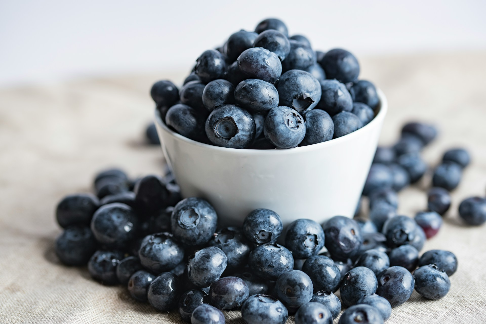
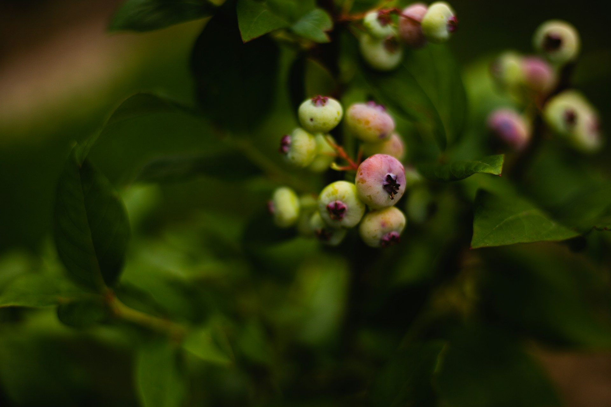
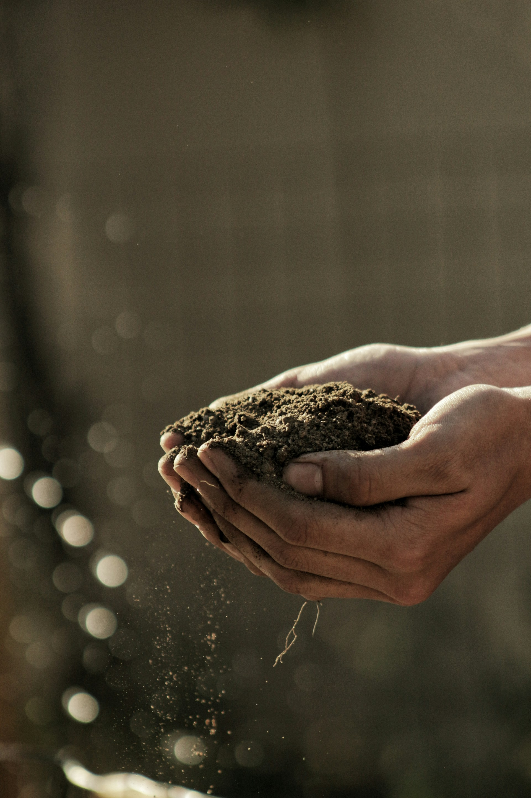
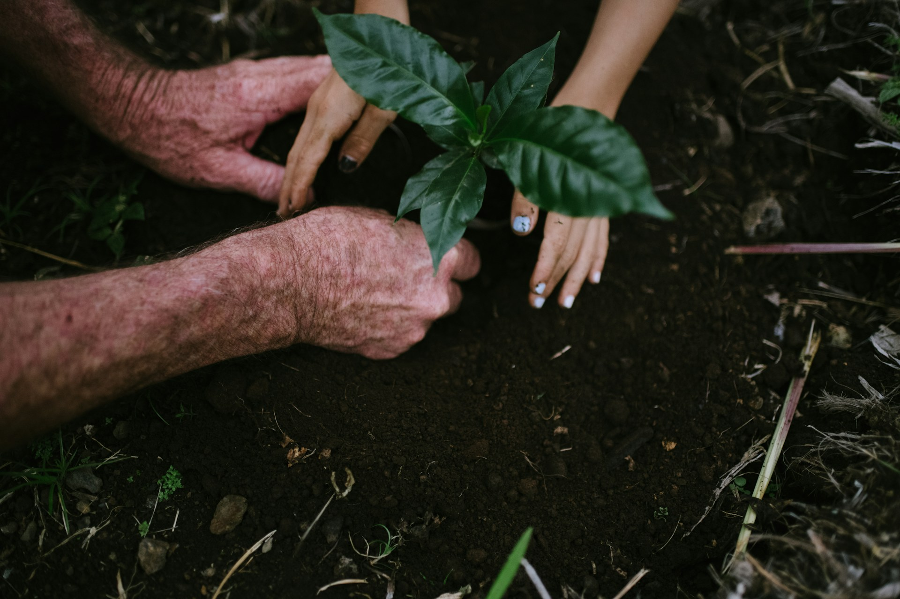
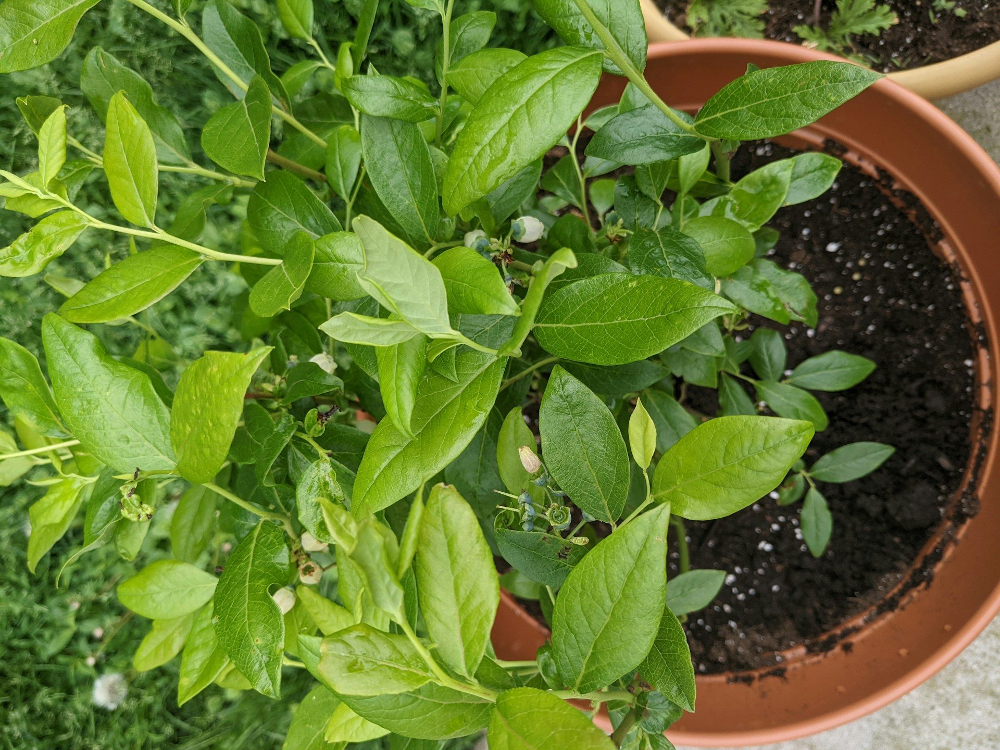
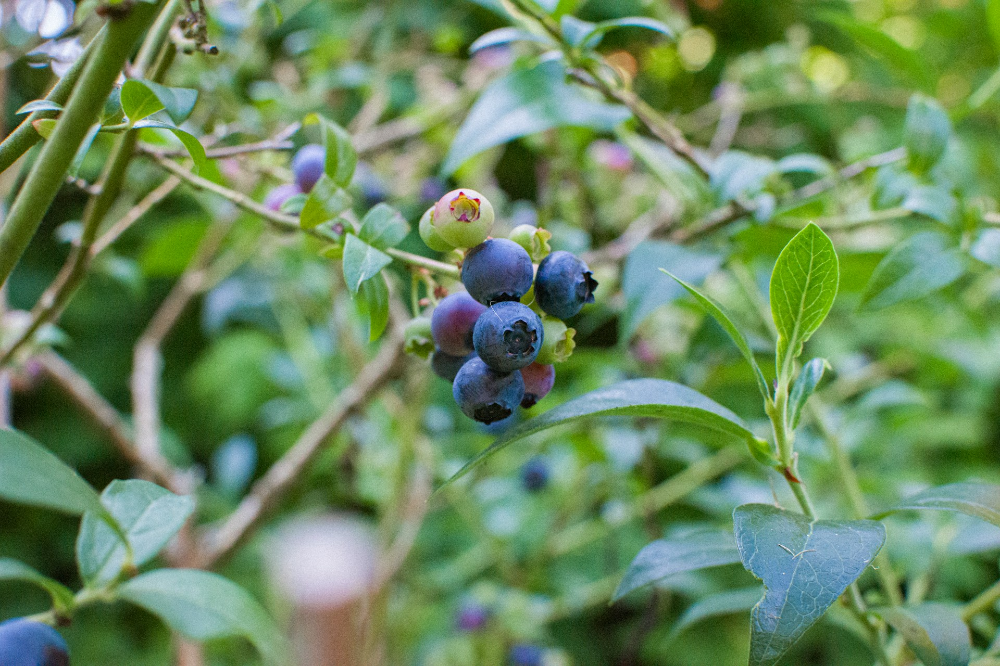

import GemeComposterCTA from '@site/src/components/GemeComposterCTA'

## Growing Blueberries: Introduction

Blueberries are a rewarding fruit for home gardeners and beginners. These shrubs (often called berry “trees” in landscaping) produce nutritious, antioxidant-rich berries each summer. 

To grow blueberries successfully, you need to meet their basic needs: full sun, acidic fertile soil, and consistent moisture. With patience, blueberries can bear fruit within 2–3 years and continue producing for decades. 

We’ll explain where and how to plant blueberry bushes, how to prepare the soil (including blueberry soil pH), the best fertilizer (organic compost), and essential care steps (watering, mulching, pruning) to keep your blueberry plants thriving.

<!-- truncate -->

<h2 className="jump-to">Jump To</h2>

1. **[The Best Place to Plant a Berry Tree](#1-best-place-to-plant-a-berry-tree-blueberry-bush)**

2. **[Blueberry Soil pH Requirements](#2-blueberry-soil-ph-and-soil-requirements)**

3. **[How Do I Plant Blueberries?](#3-how-do-i-plant-blueberries-planting-steps)**

4. **[Planting Blueberry Plants in Pots](#4-planting-blueberries-in-pots-container-gardening)**

5. **[The Best Fertilizer For BlueBerries: Compost](#5-best-fertilizer-for-blueberries-compost)**

6. **[Blueberry Plant Care Tips](#6-blueberry-plant-care-watering-mulching-pruning)**

7. **[When Can I Harvest Blueberries?](#7-harvesting-blueberries)**

## 1. Best Place to Plant a Berry Tree (Blueberry Bush)

Choose a sunny, sheltered spot for your blueberry bush. Blueberries produce best in full sun (at least 6–8 hours daily). They like **well-drained soil** – avoid low spots that stay wet. Ideal soils are sandy loams or clay loams rich in organic matter and water-holding capacity. If your soil is heavy clay or poorly drained, consider building a raised bed or mound (Figure 10). A raised bed improves drainage and keeps the roots from sitting in water. Blueberries can tolerate light afternoon shade, but shade will reduce yields.

Blueberries are acid-loving plants, so avoid planting them near concrete or lime-treated areas that could raise soil pH. Also avoid planting blueberry bushes under large trees that compete for nutrients and moisture. For best pollination and fruit set, plant two or more different cultivars if possible – this ensures cross-pollination and larger berries. In summary, **the best place to plant a blueberry “berry tree” is a sunny garden spot with fertile, well-draining, acidic soil**.

## 2. Blueberry Soil pH and Soil Requirements

Blueberries require very acidic soil – ideally a pH between 4.5 and 5.5. Test your soil in advance; if the pH is above 5.7, you’ll need to acidify (often with elemental sulfur) before planting. If the pH is too high (alkaline), blueberry leaves will yellow and growth will suffer. Conversely, if the pH is below 4.5, you may lightly lime the soil to reach around pH 5.5. Because adjusting pH takes time, plan ahead of planting.

Another key requirement is high organic matter. Blueberries grow best in soils rich in compost and organic matter. [**Before planting, mix several inches of well-aged compost into the top 8–12 inches of soil**](https://www.geme.bio/blog/how-to-use-compost-correctly). This lowers the soil pH and provides nutrients and moisture retention. Avoid adding any lime or dolomite (which would raise pH) to the soil mixture. A layered soil with compost also keeps the root zone slightly acidic.

If your native soil is poor or too alkaline, consider planting blueberries on mounds or in large containers with an acidic potting mix. Gardeners in high-pH regions (like parts of eastern US and Europe) often grow blueberries in raised beds filled with a custom mix of compost. This ensures a stable acidic environment. Always keep the soil moist and mulched; blueberry roots are shallow and can dry out quickly.

## 3. How Do I Plant Blueberries: Planting Steps

Follow these steps to plant blueberry bushes:

1. **Purchase healthy plants**. Buy 2- or 3-year-old blueberry shrubs from a nursery. Choose varieties adapted to your climate. Plan to plant at least two different cultivars for cross-pollination.

2. **Prepare the soil**. Clear the area of grass and weeds. Incorporate a 6-inch layer of compost into the top 8–12 inches of soil. This enriches the planting bed and ensures an acidic, loose soil. Test and adjust the pH if needed (see above).

3. **Dig the hole**. Dig each planting hole twice as wide as the root ball but no deeper than the container. Blueberry roots are shallow, so plant at the same depth they were in the pot. Break up any compacted soil in the bottom.

4. **Mix planting material**. If your soil is not naturally acidic or is heavy clay, fill the hole with a blend of your soil plus fully-decomposed compost (about half compost). Do not use fresh manure or lime. The goal is a friable, acidic mix.

5. **Set the plant**. Place the blueberry bush in the hole. Spread the roots gently if they are circling. The top of the root ball should be slightly above ground level to allow for settling. Backfill around the roots with your soil-compost mix, firming lightly to eliminate air pockets.

6. **Mulch and water**. Immediately water thoroughly to settle the soil. Apply a 2–3 inch layer of acid mulch (pine needles, pine bark, or wood chips) around the base. Mulch conserves moisture, suppresses weeds, and keeps the soil cool. Over time, gradually build mulch depth to 4 inches.

7. **Space plants properl**y**. Leave about 4–5 feet between each bush, and 6–8 feet between rows. This spacing allows sunlight penetration and air circulation, improving fruit production.

Planting is usually done in early spring or fall when temperatures are moderate. Avoid planting in hot summer or freezing winter. After planting, protect young bushes from strong winds or late frosts if possible. With patience and proper care, your blueberry shrubs will establish and start to produce fruit within a couple of years.

## 4. Planting Blueberries in Pots (Container Gardening)

Blueberries can also be grown successfully in containers, which is ideal for patios or regions with poor soil. Use large, sturdy containers (at least 24 inches deep and wide) with drainage holes. Fill pots with an acidic planting mix: a 50/50 blend of potting soil and compost is recommended. Alternatively, use a mix of potting soil and peat moss. Wet the mix well before planting.

- **Container planting tips**: Plant the blueberry at the same depth as it was in its nursery pot. Water thoroughly after planting. Place containers in a sunny location, but in very hot climates provide afternoon shade or sun protection. Blueberries in pots dry out faster, so keep the soil consistently moist but not waterlogged. Elevating pots slightly off the ground (on bricks or pot feet) helps drainage and prevents standing water.

- **Fertilizing potted blueberries**: Because container soil leaches nutrients quickly, fertilize lightly in spring with an acid-formulated fertilizer. Avoid fertilizers with nitrates or chlorides; blueberries prefer ammonium-based fertilizer. One can use a half-dose of a 21-0-0 (ammonium sulfate) or an acid specialty fertilizer in early spring and again in early summer. Overfertilizing can harm roots, so err on the side of under-fertilizing when in doubt.

- **Care for container blueberries**: Keep the potting mix evenly moist. Mulch the top with pine bark or needles even in pots to stabilize soil moisture and pH. If temperatures drop below freezing where you are, move the containers to a protected spot or insulate the pots in winter. With the right container and care, potted blueberries can thrive and even produce as well as those in the ground.

## 5. Best Fertilizer for Blueberries: Compost

Blueberries are not heavy feeders, but they do benefit from organic fertilization. Rich compost is often the best fertilizer for blueberries. Well-aged compost supplies nitrogen slowly, improves soil structure, and feeds the blueberry’s shallow roots. For new plantings, mixing at least 6 inches of compost into the soil before planting provides essential nutrients. In established plantings, top-dress the bushes with compost annually (in early spring or fall) under the mulch to slowly release nutrients.

Unlike most garden crops, blueberries thrive on ammonium nitrogen and low pH. Commercial inorganic fertilizers like [ammonium sulfate](https://en.wikipedia.org/wiki/Ammonium_sulfate) (21-0-0) or acid-loving plant fertilizers can be used sparingly. However, organic sources are preferred for home gardeners. For example, an electric kitchen composter like the GEME Composter can turn kitchen scraps (vegetable peels, coffee grounds, eggshells) into sterile, high-quality compost within a day. This homemade compost is ideal for blueberries because it’s fine-textured and slightly acidic. The GEME Composter (an advanced microbial composter) even yields compost that meets EU standards for safety and nutrients, making it a convenient way to recycle waste and feed blueberries.

<GemeComposterCTA 
 imgSrc="/img/geme-bio-composter.jpg"
 productTitle="GEME Bio-waste Composter"
 features={[
    "✅ Compost Kitchen Waste Within 8 Hours",
    "✅ Better Compost For Soil & Blueberry Plant",
    "✅ Quiet, Odor-Free, Mature Compost",
    "✅ Composting Reduces Landfills & Greenhouse Gases"
 ]}
buttonText="Start Growing Blueberries Using GEME Composter"
  href="https://www.geme.bio/product/geme?utm_medium=blog&utm_source=geme_website&utm_campaign=general_seo_content&utm_content=how-to-grow-blueberries"
/>

### Fertilizer tips for blueberries

1. Use only fertilizers with ammonium (NH₄⁺) nitrogen, not nitrate (NO₃⁻). Common acid fertilizers (21-0-0, rhododendron food) work well.

2. Avoid high-pH fertilizers and manures. Animal manures and bone meal tend to be alkaline and can raise soil pH undesirably. Also avoid fast-release chemical fertilizers (16-16-16 or garden blends) that contain mostly nitrate; blueberries cannot use nitrate form efficiently.

3. If soil tests show low phosphorus or potassium, choose sulfate-based potash (potassium sulfate) and triple superphosphate to avoid changing pH.

Overall, the best fertilizer for blueberries is regular applications of organic matter (compost, leaf mold, pine bark fines) combined with occasional acid-specific fertilizer. This approach feeds blueberries gently and maintains the acidic, nutrient-rich soil they love.

## 6. Blueberry Plant Care: Watering, Mulching, Pruning

Proper care keeps blueberry plants healthy year-round. Key tasks include water, mulch, and pruning:

1. **Watering**: Blueberry roots are shallow and the plants have few fine root hairs. Keep the soil consistently moist. Avoid drought stress by watering deeply once or twice a week during dry spells. Apply water slowly (soaker hose or drip irrigation) to soak the root zone. In summer, morning watering is best. Don’t let the soil dry out completely – blueberries will wilt easily.

2. **Mulching**: Year-round organic mulch is essential. After planting, mulch with 2-4 inches of pine bark, wood chips, aged sawdust, or pine needles. Mulch conserves moisture, keeps weeds down, and acidifies the soil as it breaks down. Refresh the mulch layer annually as it decomposes, but avoid piling mulch against the plant crowns.

3. **Pruning**: Each winter (dormant season), prune to remove dead wood and renew fruiting canes. For young plants, cut back the top one-third of each cane to encourage lateral branching. Remove any weak or crossing branches to open up the center. For mature bushes, cut out 2–3 of the oldest canes at ground level each year to stimulate new cane growth. Pruning improves air flow and sunlight penetration, and it increases berry size on the remaining canes. Renewal pruning ensures the plants stay vigorous for decades.

### Other care tips

1. **Frost protection**: Blueberry blossoms can be damaged by late spring frost. If a hard freeze is forecast after blooming, cover bushes with frost cloth overnight.

2. **Bird and pest protection**: As berries ripen, birds love to feast. Use bird netting or a lightweight row cover to protect fruit when it begins to turn blue. Common pests include aphids and mites; usually healthy plants tolerate low levels.

3. **Winter protection**: In very cold climates, mulch heavily around plants in late fall or consider burlap wraps to prevent crown heaving. Some varieties are less winter-hardy, so check your zone recommendations.

4. **Fertilization schedule**: After the first year, fertilize lightly in early spring and again in late spring (e.g. two equal doses), then stop by midsummer. Excess fall fertilizing can stimulate late growth that may not harden off before winter.

By following these care steps, your blueberry bushes will grow vigorously and produce abundant fruit.

## 7. Harvesting Blueberries

Blueberries ripen over the summer – usually from late June through early September for northern climates. Harvesting at the right time is crucial for the best flavor. Only pick berries that are fully blue (no pink or green tinge). Ripe berries will come off the bush easily when gently tugged. Berries do not continue to ripen after picking, so wait until they are maximum color and sweetness.

It’s best to harvest in the morning after the dew has dried but before the afternoon heat, to reduce field heat in the fruit. A mature highbush blueberry bush can yield about 6–8 pounds (7–9 pints) of berries per year. Check bushes every 2–3 days and pick ripe berries frequently – leaving overripe fruit can cause berry splitting or molding.

After picking, store blueberries unwashed in the fridge. They generally keep a couple of weeks chilled. Use your blueberries fresh or freeze them for later use in smoothies, baking, or jams. With proper care, your homegrown blueberries will reward you with sweet, juicy harvests year after year.

Each of the above steps – site selection, soil preparation, planting, fertilizing, watering, and pruning – is critical to growing blueberries successfully. By choosing the right location, adjusting the blueberry soil pH to 4.5–5.5, using rich organic compost as fertilizer, and providing attentive care (especially watering and mulching), even beginner gardeners in the US or Europe can enjoy fresh blueberries. 

Embrace a little planning and effort, and soon you’ll have your own productive blueberry plants (or container blueberries) bursting with berries.

## Related Articles

- [**How to Use Compost Properly**](/blog/how-to-use-compost-correctly)

- [**The Difference Between Garden Soil And Compost**](/blog/garden-soil-vs-compost-pros-and-cons)

- [**How to Grow Tomato Plants Without Salmonella**](/blog/how-to-grow-tomatoes-safely)

- [**How to Plant a Garden**](/blog/how-to-plant-a-garden-best-gardening-guide-for-beginners)

- [**The Best electric Composter for Safe Compost to Use**](/blog/the-best-composter-to-reduce-food-waste)

## Sources

1. University of Minnesota: How to Grow Blueberry Plants https://extension.umn.edu/fruit/growing-blueberries-home-garden

2. University of Maine: Growing Blueberries From Seed https://extension.umaine.edu/blueberries/factsheets/cultivated-lowbush-blueberries/growing-blueberries-from-seed/ 

3. Ontario, Ministry of Agriculture, Food and Agribusiness <a href="https://www.ontario.ca/page/growing-blueberries-home-gardens-and-small-scale-production" rel="nofollow">GGrowing blueberries for home gardens and small scale production</a>

_Ready to transform your gardening game? Subscribe to our [newsletter](http://geme.bio/signup) for expert composting tips and sustainable gardening advice._
