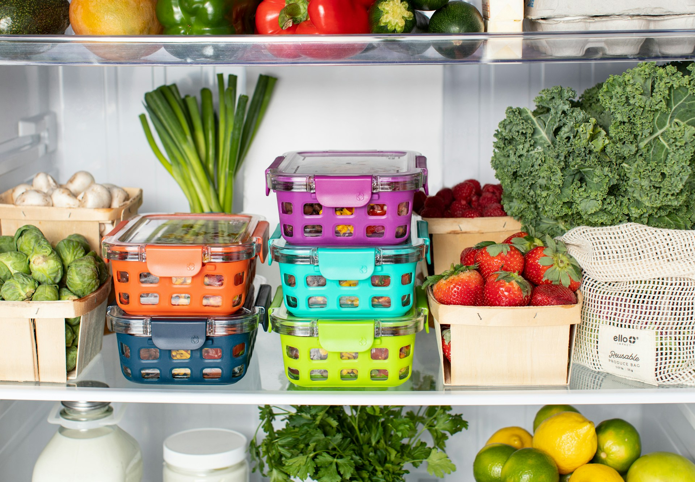
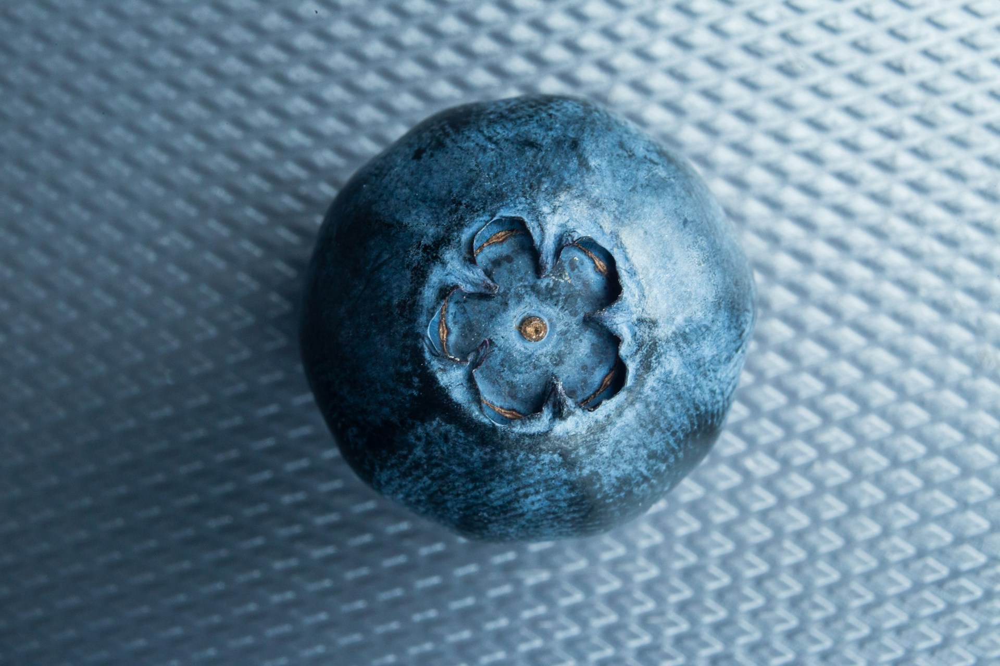

import GemeComposterCTA from '@site/src/components/GemeComposterCTA'

## How Long Do Blueberries Last? A Complete Guide to Storing Blueberries for Freshness

Blueberries are delicious, nutritious, and incredibly versatile—great in smoothies, cereal, baking, or as a snack. But they also have a short shelf life, especially if not stored correctly. Whether you buy them fresh from a farmer’s market or pick them from your backyard bush, knowing how to store blueberries properly can make a big difference in how long they stay good. In this guide, we’ll explain how long blueberries last, the best ways to store them, and how to tell if they’ve gone bad.

We’ll also answer common questions like:

- How long do blueberries last in the fridge?

- Can you freeze blueberries to make them last longer?

- What affects the shelf life of blueberries?

- How to extend the freshness of blueberries naturally?

Let’s dive into how to keep your blueberries fresh, flavorful, and safe to eat for as long as possible.

<!-- truncate -->

<h2 className="jump-to">Jump To</h2>

1. **[How Long Do Blueberries Last?](#1-how-long-do-blueberries-last)**

2. **[How Long Do Blueberries Last in the Fridge?](#2-how-long-do-blueberries-last-in-the-fridge)**

3. **[How Long Do Washed Blueberries Last in the Fridge?](#3-how-long-do-washed-blueberries-last-in-the-fridge)**

4. **[Whole Blueberries VS Cut Blueberries: How To Store Blueberries in the Fridge](#4-how-long-do-blueberries-last-in-the-refrigerator-whole-vs-cut)**

5. **[What Affects How Long Blueberries Last?](#5-what-affects-how-long-blueberries-last)**

6. **[How to Tell If Blueberries Are Bad](#6-how-to-tell-if-blueberries-have-gone-bad)**

7. **[Tips For Longer Blueberries Storage](#7-tips-to-make-blueberries-last-longer)**

## 1. How Long Do Blueberries Last?

Fresh blueberries, like most berries, are highly perishable due to their thin skin and high moisture content. If left at room temperature, blueberries typically last only 1 to 2 days before beginning to spoil. That’s why most people refrigerate them after purchase or harvest.

Here’s a quick summary table:

| **Storage Method** | **Shelf Life** |
| --- | --- |
| Room temperature (counter) | 1–2 days |
| In the fridge (unwashed) | 7–14 days |
| In the fridge (washed) | 3–5 days |
| In the freezer | Up to 12 months |

## 2. How Long Do Blueberries Last in the Fridge?

If stored properly, blueberries last 7 to 14 days in the fridge. To maximize freshness:

- Do not wash blueberries before refrigerating. Moisture speeds up mold growth.

- Keep them in their original container or a breathable container (with holes or vents).

- Store them in the crisper drawer, which has higher humidity and stable temperature.

### Pro Tip:

Spread blueberries out on a paper towel in a shallow container to absorb excess moisture. Cover loosely to allow air circulation.

## 3. How Long Do Washed Blueberries Last in the Fridge?

If you’ve already washed your blueberries, they will only last 3 to 5 days in the refrigerator. Wet blueberries spoil faster because moisture promotes the growth of mold and bacteria. To slow this down, thoroughly dry washed blueberries with a paper towel before storing.

So, if you’re wondering how long do blueberries last in fridge after a rinse—plan to eat them within a few days.

## 4. How Long Do Blueberries Last in the Refrigerator (Whole vs. Cut)?

If you've sliced or crushed blueberries for a recipe or dessert, they will spoil much faster. Chopped blueberries should be used within 1–2 days and always stored in a covered container in the refrigerator.

Why the difference? Once berries are cut, they lose their protective skin, exposing the inner fruit to oxidation and bacteria. This speeds up spoilage.

## 5. What Affects How Long Blueberries Last?

Several factors impact the shelf life of blueberries, both inside and outside the fridge:

1. **Ripeness at time of purchase**: Very ripe berries will spoil faster. Choose blueberries that are plump, dry, and have a silvery-white “bloom” on the surface—this natural coating protects the berries.

2. **Storage method**: Unwashed berries stored in a breathable container last much longer than washed berries sealed in airtight plastic.

3. **Temperature**: Blueberries should be stored below 40°F (4°C). Room-temperature storage significantly reduces their shelf life.

4. **Humidity levels**: Too much humidity promotes mold, while too little causes drying. A balance (like in a refrigerator’s crisper drawer) is ideal.

5. **Handling**: Berries that are bruised or crushed spoil faster.

### How to Store Blueberries for Maximum Freshness

1. **Refrigerator (Short-Term Storage)**

To keep blueberries fresh for 1–2 weeks, follow these steps:

- Leave unwashed until ready to eat.

- Place them in the fridge immediately after purchasing or picking.

- Keep them in the original clamshell packaging or transfer to a shallow container lined with paper towels.

- Store in the low humidity drawer or center shelf.

:::tip

Remove any moldy or squished berries to prevent them from affecting the others..

:::

2. **Freezer (Long-Term Storage)**

If you won’t finish your blueberries within a week, freezing is the best option.

How to Freeze Blueberries:

1. Gently rinse the blueberries and let them dry completely.

2. Spread them out on a baking sheet in a single layer.

3. Freeze for a few hours until solid.

4. Transfer to a freezer-safe bag or container, label with the date, and seal tightly.

Frozen blueberries will last up to 12 months and are perfect for smoothies, oatmeal, baking, and sauces.

3. **Room Temperature (Temporary Storage)**

You can leave blueberries at room temperature if you plan to eat them within 24–48 hours. However, this method is only advisable if the room is cool and the berries are unwashed.

## 6. How to Tell if Blueberries Have Gone Bad

Not sure if your blueberries are still good? Here are signs that they’ve spoiled:

- **Mold**: White, fuzzy patches mean it’s time to throw them out.

- **Shriveled or dried berries**: Dehydrated blueberries are past their prime but might still be usable in baking.

- **Off smell**: Sour or fermented odor means they’re no longer safe to eat.

- **Leaky or mushy berries**: These are signs of rot and bacterial growth.

If only one or two berries are moldy, you can salvage the rest by removing the bad ones, rinsing the good ones thoroughly, and drying them completely before storing.

**However, when you notice that many of your blueberries are bad, don't just toss them in the trash, compost them instead.**

Compost is decomposed organic matter from food waste, garden clippings, leaves, and other biodegradable materials. It's often called “black gold” because it can enrich soil, promote plant growth, and reduce landfills and greenhouse gas emission.

<GemeComposterCTA 
 imgSrc="/img/geme-bio-composter.jpg"
 productTitle="GEME Bio-waste Composter"
 features={[
    "✅ Compost Moldy Blueberries For Environment Protection",
    "✅ Better Compost For Soil Health & Garden Plants",
    "✅ Quiet, Odor-Free, Mature Compost",
    "✅ Reduce Landfills & Greenhouse Gases"
 ]}
buttonText="Use GEME Kitchen Composter For Food Waste"
  href="https://www.geme.bio/product/geme?utm_medium=blog&utm_source=geme_website&utm_campaign=general_seo_content&utm_content=how-long-do-blueberries-last-in-fridge"
/>

## 7. Tips to Make Blueberries Last Longer

Want to stretch the life of your blueberries? Here are some easy tricks:

- **Vinegar rinse (for mold prevention)**: Mix 1 part white vinegar to 3 parts water and soak berries for 1 minute. Rinse and dry completely before storing in the fridge. This kills mold spores.

- **Use breathable containers**: Avoid airtight plastic; instead, opt for mesh, baskets, or vented containers.

- **Dry storage**: Add a paper towel at the bottom of the container to absorb moisture.

- **Inspect often**: Remove overripe or moldy berries immediately.

### Common Questions About Storing Blueberries

Q: **Should I wash blueberries before refrigerating?**
A: No. Washing adds moisture that speeds up spoilage. Wash right before eating.

Q: **Can I refreeze thawed blueberries?**
A: It’s not recommended. The texture and flavor degrade. Use thawed berries within 1–2 days.

Q: **Are wrinkled blueberries still safe to eat?**
A: If there's no mold or off smell, yes! They’re fine for cooking or baking.

Q: **Can blueberries last longer in vacuum-sealed containers?**
A: Yes, vacuum sealing can extend shelf life by reducing air exposure, but berries must be dry and unwashed before sealing.

### Storing Blueberries: Fridge vs. Freezer vs. Countertop

| Storage Method | Best For | Shelf Life | Pro Tips |
|---------------|----------|------------|-----------|
| Refrigerator | Daily snacking & baking | 7–14 days (unwashed) | Use paper towels & breathable container |
| Freezer | Long-term storage | Up to 12 months | Freeze individually, store in bags |
| Room Temp | Same-day use | 1–2 days | Avoid moisture & heat |

## Final Thoughts

Understanding how long blueberries last and how to store them properly can help you reduce food waste and enjoy this antioxidant-packed fruit at its freshest. Whether you store them on the counter for a quick snack or freeze them for later, proper handling is key.

Remember:

- **How long do blueberries last in the fridge?** Usually 7–14 days unwashed.

- **How long do blueberries last in the refrigerator if washed?** Only 3–5 days.

- **Want them to last longer?** Store them dry, cold, and in breathable containers.

- **Need long-term storage?** Freeze them for use up to a year.

With these tips, you can enjoy blueberries longer and keep every pint you buy or harvest in top condition.

## Related Articles

- [**How to Grow Blueberries**](/blog/how-to-grow-blueberries)

- [**How to Grow Tomato Plants Without Salmonella**](/blog/how-to-grow-tomatoes-safely)

- [**How to Plant a Garden**](/blog/how-to-plant-a-garden-best-gardening-guide-for-beginners)

- [**The Best electric Composter for Composting Food Waste**](/blog/the-best-composter-to-reduce-food-waste)

- [**The Difference Between Garden Soil And Compost**](/blog/garden-soil-vs-compost-pros-and-cons)

## Sources

1. WikiHow: How to tell if blueberries are bad https://www.wikihow.com/Tell-if-Blueberries-Are-Bad

2. National Institutes of Health (NIH): Shelf Life Determination of Fresh Blueberries 
https://pmc.ncbi.nlm.nih.gov/articles/PMC4745484/ 

_Ready to transform your gardening game? Subscribe to our [newsletter](http://geme.bio/signup) for expert composting tips and sustainable gardening advice._
