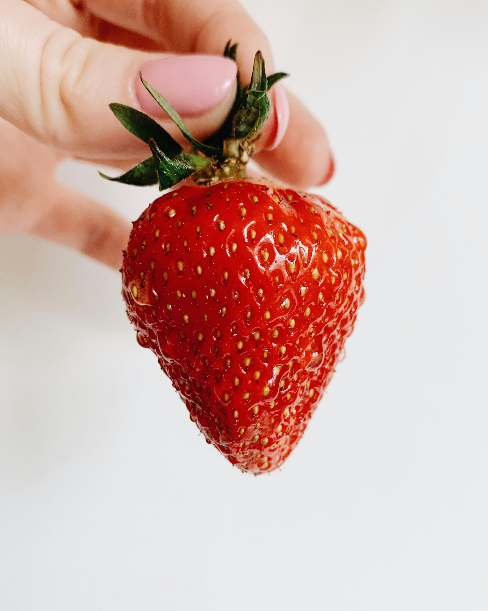
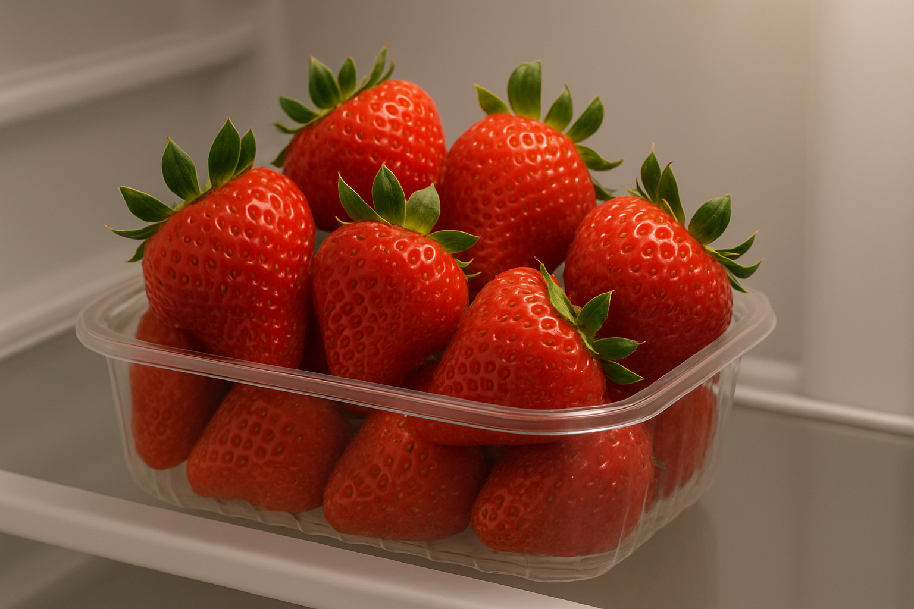
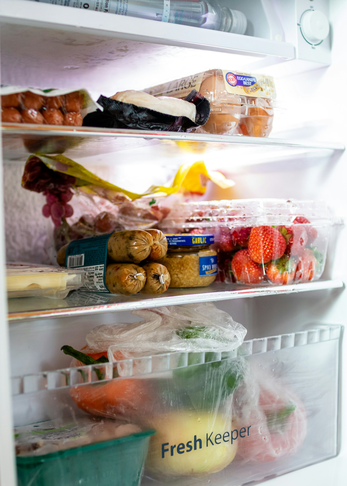
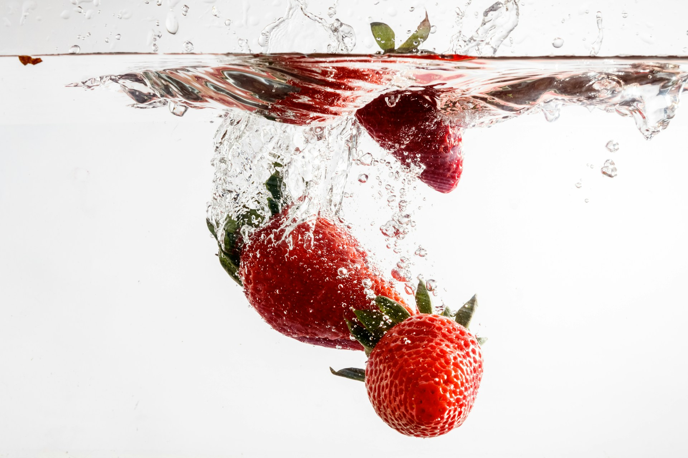
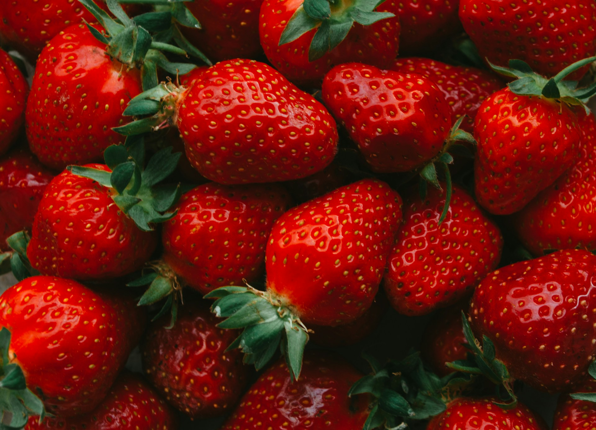
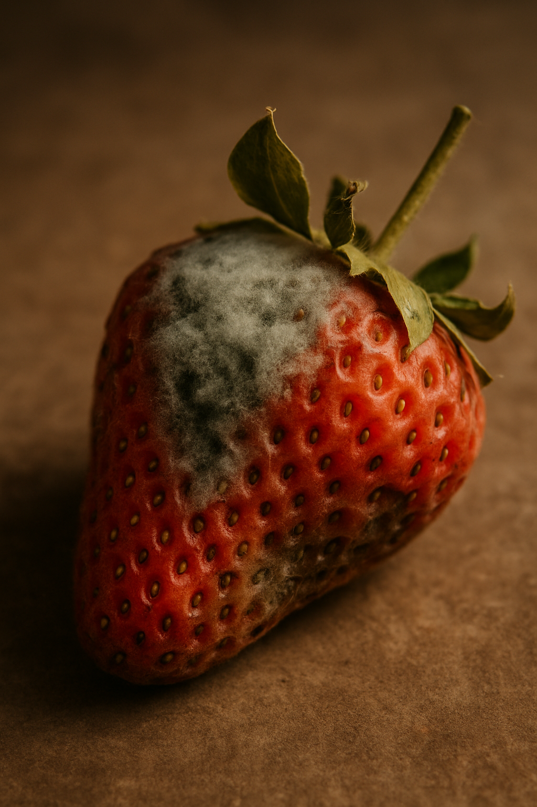
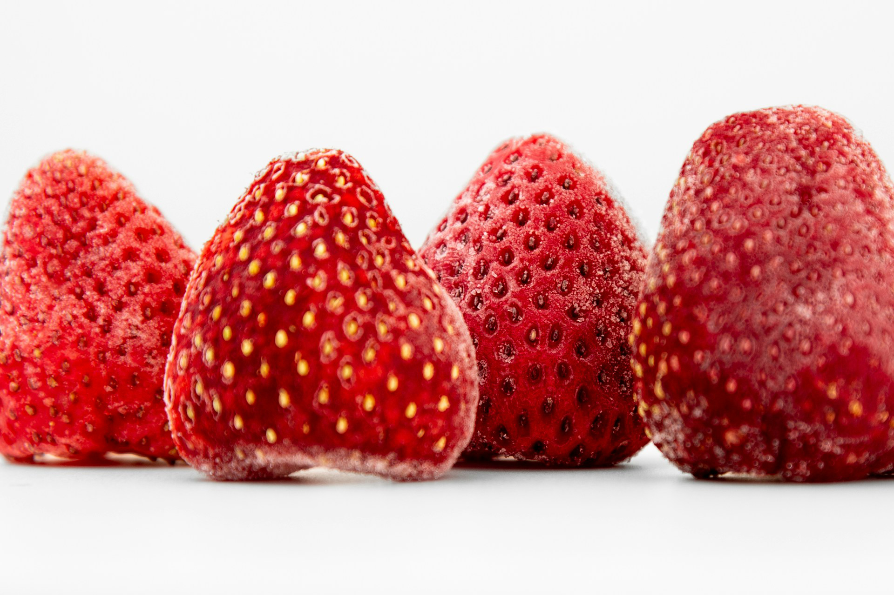

import GemeComposterCTA from '@site/src/components/GemeComposterCTA'

Strawberries are delicious but notoriously perishable. Their tender, thin skins, high moisture and sugar content, and rapid respiration make them prone to bruising, microbial spoilage (especially mold such as Botrytis), and flavor loss. 

In warm or humid conditions, they spoil very quickly. Minimizing handling, keeping them cool and dry, and using gentle storage methods are key. With the right techniques, you can keep strawberries fresh longer, reduce waste, and even recycle food waste into rich compost for your garden.

The tips below (**drawn from USDA and university extension guidance**) will help home cooks, gardeners, and sustainability advocates store strawberries safely and effectively.

<!-- truncate -->

<h2 className="jump-to">Jump To</h2>

1. **[Why Strawberries Spoil Quickly?](#1-why-strawberries-spoil-quickly)**

2. **[How Long Do Strawberries Last in the Fridge?](#2-how-long-do-strawberries-last-in-the-fridge-vs-room-temp)**

3. **[The Best Way to Store Strawberries](#3-best-way-to-store-strawberries-short-term-and-long-term)**

4. **[Dos & Don'ts of Washing and Prep Strawberries](#4-dos-and-donts-of-washing-and-prep)**

5. **[Eco-Friendly Storage Ways to Keep Strawberries Fresh](#5-eco-friendly-storage-hacks-to-keep-strawberries-fresh)**

6. **[Recognizing Spoilage: When to Compost Strawberries](#6-recognizing-spoilage-when-to-compost)**

7. **[Strawberries Compost: How to Compost Properly](#7-strawberry-compost-how-to-compost-berries-properly)**

## 1. Why Strawberries Spoil Quickly

1. **High moisture and delicate skin**: Strawberries are about 90% water, so any extra moisture speeds decay. Their soft flesh and delicate skin bruise easily, creating entry points for bacteria and mold.

2. **Rapid respiration**: As a soft fruit, strawberries breathe and ripen fast. Room-temperature air (especially above 60°F) can accelerate metabolism and aging. In fact, cooling slows their respiration dramatically [**(one extension study notes decay is up to 10× faster at room temperature than at 32°F)**](https://extension.psu.edu).

3. **Susceptible to mold**: Strawberries commonly harbor mold spores. Once one berry goes bad, Botrytis (gray mold) can quickly spread to neighbors. For example, USDA guidance warns that if one berry in a container is moldy, nearby berries should be discarded.

4. **Contamination risk**: Like all produce, strawberries can pick up bacteria like Salmonella or pesticides on their surface. Food-safety experts advise gentle rinsing and prompt refrigeration to reduce risk of foodborne illness.

Because of these factors, fresh strawberries last only a few days without special care. However, by controlling temperature, humidity, and moisture, you can extend their shelf life.

## 2. How Long Do Strawberries Last in the Fridge (vs. Room Temp)?

Studies and USDA guidelines give ballpark shelf lives under different conditions:

| **Storage Condition** | **Approx. Shelf Life** |
| --- | --- |
| **Refrigerator, 32–36°F (0–2°C), 90–95% RH** – ideal crisper conditions | **Up to 1–2 weeks** |
| **Regular Fridge (~40°F, 4°C)** | **~3–7 days** (about 3 days at typical 40°F, [up to ~7 days if very fresh and dry](https://anrcatalog.ucanr.edu)) |
| **Room temperature (~68–72°F / 20–22°C)** | Typically **≤1 day**. USDA notes strawberries can be held at room temp up to 24 hours *without refrigeration*; after that spoilage accelerates. |
| **Frozen** | **6–12 months** in a proper freezer (whole or sliced, in airtight containers, often with sugar or syrup to preserve quality). |

In practice, if you buy or pick strawberries and plan to use them within a day, you may keep them at room temp briefly (on a cool counter) for convenience. 

But for any longer storage, refrigeration is best. The USDA “Foodkeeper” chart and extension sources emphasize that refrigeration (below 41°F) is required for all fresh berries, since [*unrefrigerated, they spoil very fast*](https://district.schoolnutritionandfitness.com).

:::tip

Place strawberries in the coldest part of your fridge that still stays above freezing (many recommend the crisper drawer). Use them within a few days, or transfer to long-term storage (below).

:::

## 3. Best Way to Store Strawberries: Short-Term and Long-Term

### **Short-term (up to a week)**: Keep unwashed strawberries refrigerated as soon as possible. Follow these steps:

1. **Inspect and sort**: Remove any berries that are crushed, mushy, or moldy immediately. Even a single moldy berry can taint others. Discard spoiled ones (compost them, see below) and gently separate the rest.

2. **Storage method**: Place berries in their original clamshell or in a shallow container lined with paper towels. The UC Davis extension recommends keeping strawberries in a breathable package (closed clamshell or a partially open bag) to maintain high humidity The plastic clamshell lets airflow but traps moisture to prevent shriveling. Alternatively, loosely cover them with a lid or cloth to preserve humidity. Avoid airtight bags or plastic wrap that trap condensation.

3. **Temperature & humidity**: Optimal home storage is 32–36°F (0–2°C) with about 90–95% humidity. In practice, your fridge’s crisper drawer (set to “high humidity”) is ideal.

4. **Avoid crowding**: Overfilling containers can bruise berries. Arrange them in a single layer if possible, or at most two shallow layers, to reduce pressure.

### **Long-term (freezing or preserving)**: If you have more strawberries than you can eat in a few days, consider freezing or preserving:

1. **Freezing**: Rinse and hull strawberries (remove caps) just before freezing, not beforehand. The USDA advises adding a little lemon juice to prevent browning and nutrient loss. You can freeze them whole, sliced, or as pureed jam. Spread berries on a tray to pre-freeze individually, then transfer to airtight freezer bags. **Frozen strawberries last 6–12 months** and are great for smoothies or baking.

2. **Jam/Canning**: Home canning jam or preserves is an option if you have very ripe berries and sugar on hand. Follow a tested recipe (like the USDA or university extension guidelines) to ensure safety. Note that canning berries without sugar or adjusting acidity can be risky; freezing is generally easier and safer for strawberries.

3. **Drying**: You can dehydrate strawberry slices or make leather. Use a dehydrator or oven on low heat. Dried strawberries last many months.

:::warning

Refrigeration is strongly advised for any cut or hulled berries. The USDA notes: [“**Seal, date, and refrigerate cut berries immediately and use by the following day**”](https"//fns-prod.azureedge.us). Fruit cut or mashed is very perishable.

:::

## 4. Do’s and Don’ts of Washing and Prep

1. **Don't wash strawberries until before eating or cooking**. Excess moisture from washing encourages mold growth. USDA and UC guidance both stress that berries should remain dry in storage.

2. **Do wash under cool running water right before use**. Gently rinse and spin dry (or pat dry) to remove dirt and any lingering pesticides. USDA advises washing in cold water and recommends not removing the green caps (calyx) until after washing; this prevents the berry from absorbing extra water and diluting flavor.

3. **Do inspect and remove moldy/soft berries immediately**. If any berry shows fuzz or dark soft spots, discard it and any touching neighbors. This step should be done before refrigerating to prevent cross-contamination.

4. **Do keep berries whole if possible**. Slicing or crushing accelerates spoilage. If you must hull or slice berries, do so right before eating (or immediately refrigerate leftovers). The USDA instructs that any cut strawberries should be refrigerated and eaten by the next day.

5. **Do use clean utensils and containers**. Avoid contaminating stored berries by handling with washed hands and using sanitized cutting boards/knives. Food-safety guidelines emphasize preventing any introduction of bacteria or soil onto the fruit.

6. **Don’t stack or pile too deeply**. Heavy piles can cause bruising on bottom berries. Use shallow layers.

By following these handling tips, you maximize the shelf life and safety of your berries.

## 5. Eco-Friendly Storage Hacks to Keep Strawberries Fresh

Use sustainable containers and hacks to extend freshness and minimize waste:

1. **Breathable or reusable containers**: Keep strawberries in a glass or ceramic container with a loose lid, or use the original cardboard clamshell they came in. You can also repurpose a clean, vented plastic veggie basket or colander (lined with cloth or paper towel). The goal is good airflow with moderate humidity.

2. **Paper towels to absorb moisture**: Line your container (or layer between fruit) with paper towels or clean cloth. They wick away excess moisture that might otherwise cause mold. Replace damp layers daily.

3. **Beeswax wraps or cotton cloths**: Instead of cling film, cover containers with beeswax food wraps or breathable cotton cloth to keep light air exposure without trapping humidity.

4. **Store caps-on**: Leave the green stems on (except when freezing) to reduce punctures and moisture ingress.

5. **Avoid ethylene**: Strawberries do not produce much ethylene and aren’t sensitive to it, but avoid storing them with heavily ethylene-producing fruits (like bananas or apples) just in case.

6. **Counter trick (very short term)**: For the same-day use, some people rinse and drain berries in a colander, line a bowl with a dry paper towel, and keep them on the counter (just covered) for a few hours – but remember: this is only for immediate use.

Above all, keep them dry. Any trick or container that removes moisture without dessicating the berries will help them last longer.

## 6. Recognizing Spoilage: When to Compost

Even with good care, strawberries eventually spoil. Look for these signs of spoilage:

1. **Mold or mildew**: Any fuzzy white, gray or green patches mean the berry is bad. Discard or better compost the moldy berry and any it contacted.

2. **Soft, mushy or leaking**: If a berry is very soft, watery, or leaking juice, it has begun to decay. It’s best to toss or compost it.

3. **Off smells**: Fresh strawberries smell sweet and fruity. A sour or fermenting odor is a clear sign of spoilage.

4. **Browning or shriveling**: Dark or translucent spots indicate breakdown. Small spots might be salvageable by cutting away, but extensive browning means it’s time to compost.

If only a few berries spoil, salvage the rest quickly. Eat or preserve the still-firm berries as soon as possible. To prevent waste, **compost any rotten berries or trimmings** (see below). Never eat moldy strawberries, and wash hands after handling spoiled produce.

> **💚 However, when you notice that many of your strawberries are bad, don't just discard them, compost them instead.**

By composting, you recycle nutrients back into soil for future plants. For example, finished strawberry compost is excellent for mixing into the soil of next season’s vegetable or flower beds.

## 7. Strawberry Compost: How to Compost Berries Properly

Turning spoiled strawberries (and their tops or juice) into compost is an eco-friendly way to cut waste and nourish the garden. Here’s how to compost strawberry scraps:

1. **Scrape and chop**: Remove any moldy or husked strawberry pieces and chop them roughly (or freeze them if you’re not composting immediately). Smaller pieces decompose faster.

2. **Balance with browns**: Mix strawberry scraps into your composter with “brown” materials (dry leaves, cardboard, straw). Because berries are 75–90% water, balancing with dry carbon helps prevent sliminess and bad odors.

For home kitchens, modern electric composters can make composting even easier. The GEME Kitchen Composter is one example. It uses microbial fermentation, heat, and stirring to turn food scraps (like strawberry tops, peels or leftover berries) into compost in as little as 6–8 hours. 

It even heats the waste above 75°C to kill pathogens like Salmonella, producing dry, sanitized, and mature compost. For sustainability-minded cooks, such a composter can make recycling fruit scraps effortless and odor-free.

<GemeComposterCTA 
 imgSrc="/img/geme-bio-composter.jpg"
 productTitle="GEME Bio-waste Composter"
 features={[
    "✅ Compost Spoiled Strawberries within 8 hours",
    "✅ Better Compost For Soil Health & Garden Plants",
    "✅ Quiet, Odor-Free, Mature Compost",
    "✅ Reduce Landfill Waste & Greenhouse Gases"
 ]}
buttonText="Use GEME Kitchen Composter to Compost Food Waste"
  href="https://www.geme.bio/product/geme?utm_medium=blog&utm_source=geme_website&utm_campaign=general_seo_content&utm_content=best-way-to-store-strawberries"
/>

By using the kitchen composter, you can sustainably convert strawberry scraps into garden gold. 

## 8. Summary and Key Tips

1. **Why they spoil**: Strawberries spoil fast because of their delicate skin, high water content, and tendency to mold.

2. **Fridge vs. counter**: Refrigerate berries as soon as possible. At 40°F they last only ~3–7 days; at near-freezing (32°F, 95% RH) up to ~2 weeks. Left at room temp, they can go bad in a day or so.

3. **Storage basics**: Store unwashed berries in a vented container or their original clamshell on a shelf or crisper. Use high humidity if possible. Do not wash until use.

4. **Do’s and Don’ts**: Handle berries gently. Don’t hull or cut them until ready to use, and remove any spoiled ones immediately.

5. **Eco storage hacks**: Use sustainable solutions – glass containers, beeswax wraps, or breathable bags – and line containers with towels to wick away moisture.

6. **Spoilage signs**: Moldy, mushy, or foul-smelling berries should be discarded. Compost all spoiled pieces to avoid waste.

7. **Composting**: Fruit scraps, including whole strawberries, can be composted. Chop them up and mix with “brown” materials; for a high-tech approach, a GEME Kitchen Composter can safely and odorlessly turn them into rich compost.

By following these storage and handling tips from food-safety and horticulture authorities (USDA, UC Davis, Penn State, etc.), you’ll keep your strawberries fresh longer and minimize waste. 

Proper refrigeration (at the best temperature and humidity) and wise preparation are the keys to enjoying your berries at their peak. And when they inevitably go past prime, composting ensures that nothing goes to waste in your sustainable kitchen and garden.

## Sources:

Recommendations are drawn from USDA Food & Nutrition Service and university extension publications on produce storage. 

1. https://extension.psu.edu

2. https://fns-prod.azureedge.us

3. https://anrcatalog.ucanr.edu

4. https://district.schoolnutritionandfitness.com

## Related Articles

- [**How Long Do Blueberries Last in the Fridge**](/blog/how-long-do-blueberries-last-in-fridge)

- [**How to Grow Blueberries**](/blog/how-to-grow-blueberries)

- [**How to Grow Tomato Plants Without Salmonella**](/blog/how-to-grow-tomatoes-safely)

- [**The Best electric Composter for Composting Food Waste**](/blog/the-best-composter-to-reduce-food-waste)

- [**The Difference Between Garden Soil And Compost**](/blog/garden-soil-vs-compost-pros-and-cons)

_Ready to transform your gardening game? Subscribe to our [newsletter](http://geme.bio/signup) for expert composting tips and sustainable gardening advice._
