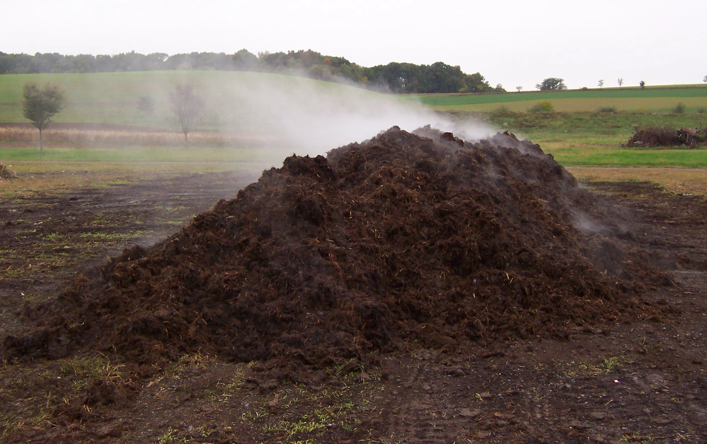
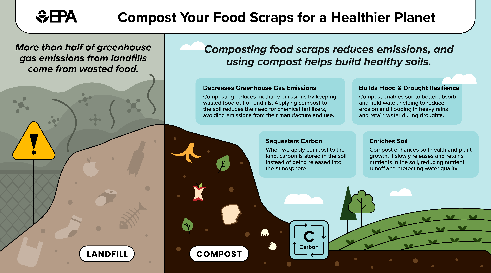
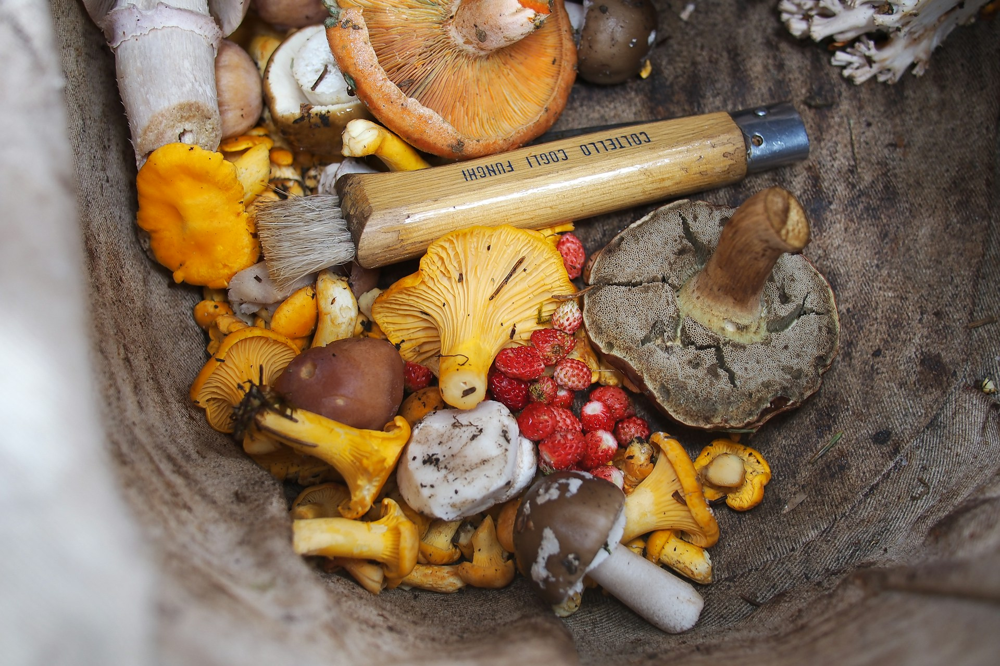
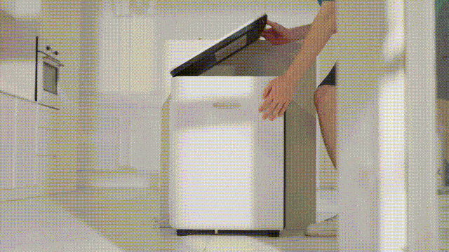
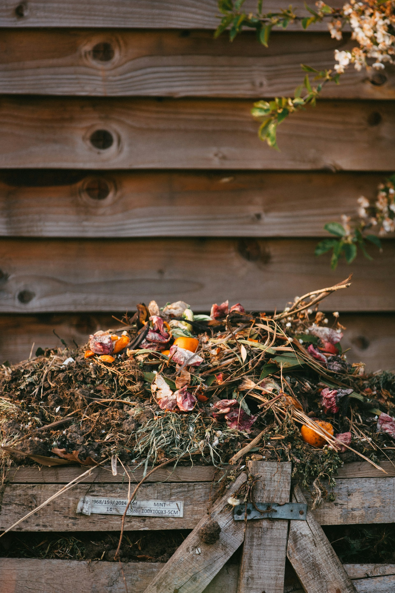

import GemeComposterCTA from '@site/src/components/GemeComposterCTA' 
import RelatedArticles from '@site/src/components/RelatedArticles'

Composting is nature’s recycling. It uses microorganisms to turn organic waste (kitchen scraps, yard trimmings, etc.) into nutrient-rich soil amendments. This managed, aerobic process (requiring air) feeds beneficial microbes that break down “greens” (nitrogen-rich) and “browns” (carbon-rich) materials, releasing heat and nutrients. An actively maintained compost pile can reach 130–160°F during decomposition, killing pathogens and weed seeds as it cooks. The final product is dark, crumbly compost that enriches garden soil. 

Embedding a photo, for example, reveals a steaming compost heap – evidence of intense microbial activity at work.

A garden compost pile heating up and steaming as microbes break down yard and kitchen waste (Picture from rodaleinstitute.org).

<!-- truncate -->

<h2 class="jump-to">Jump To</h2>

1. **[Why Compost at Home??](#1-why-compost-at-home)**

2. **[What Can You Add to a Backyard Compost Pile / an Electric Composter??](#2-what-can-you-add-to-a-backyard-compost-pile--an-electric-composter)**

3. **[Start A Backyard Compost Pile](#3-getting-started-backyard-compost-pile)**

4. **[Eletric Composter: How They Work](#4-electric-composters-how-they-work)**

5. **[The GEME Electric Composter](#5-the-geme-electric-composter)**

6. **[Compost Pile VS GEME Electric Composter: Pros and Cons](#6-backyard-compost-vs-geme-electric-composter-pros-and-cons)**

7. **[Tips For Successful Composting](#7-tips-for-successful-composting)**

## 1. Why Compost at Home?

Composting offers many practical and environmental benefits. It reduces landfill waste and greenhouse gas emissions by recycling kitchen scraps and yard trim into valuable compost. Instead of paying for fertilisers, gardeners get a free, nutrient-rich soil amendment which enriches soil health, improves moisture retention, and supports plant growth. Because compost retains water and nutrients, it helps prevent erosion and runoff, making gardens more resilient to drought and flooding. 

### 1. Options for Composting at Home

There are different ways to compost at home:

- Backyard/garden compost pile.

- Home electric composter.

### 2. Ingredients for Composting

The ingredients for composting include a proper balance of the following materials:

- Carbon-rich materials (“browns”). 

- Nitrogen-rich materials (“greens”).

- Water (moisture).

- Air (oxygen).

## 2. What Can You Add to a Backyard Compost Pile / an Electric Composter?

Both backyard piles and indoor electric composters can handle many of the same materials. Acceptable “greens” (nitrogen-rich items) include fruit and vegetable scraps, coffee grounds, eggshells, and grass clippings. Acceptable “browns” (carbon-rich items) are dry leaves, straw, shredded paper (non-glossy), cardboard (no wax coating), and wood chips. These should be added in layers or mixed with the greens; a good rule of thumb is to use at least 2–3 times as much brown as green. The Carbon and Nitrogen balance gives microbes what they need (energy from carbon, protein from nitrogen).

| **Nitrogen-Rich Materials (“Greens”)**          | **Carbon-Rich Materials (“Browns”)**                       |
|-------------------------------------------------|------------------------------------------------------------|
| Fruit and vegetable scraps                      | Dry leaves                                                 |
| Grass clippings                                | Plant stalks and twigs                                     |
| Coffee grounds and paper filters                | Shredded paper (non-glossy, uncolored) and brown bags      |
| Paper tea bags (no staples)                     | Shredded cardboard (no wax coating, tape, or glue)         |
| Eggshells (crushed)                             | Untreated wood chips                                       |

Avoid composting non-organic or problematic items. Don’t add plastics, metals, glass, or chemically treated wood. In traditional backyard compost, large bones, meat, dairy, oils, and pet waste are also usually avoided because they attract pests and may not fully break down. (Small amounts of cooked food or meat can be composted if your pile gets very hot or if you’ll add the mix to a municipal composter.)

Electric composters (like GEME) can handle a wider variety of kitchen waste safely. Because they heat the material above 160°F, some electric units can process meats, dairy, cooked foods, and even weeds. For example, the GEME home electric composter can take fruit and vegetable scraps, coffee grounds, eggshells, and also meat scraps, shellfish, dairy, nuts, seeds, fish bones, tea bags, and even weeds. The heat kills pathogens, and the grinding action pulverises tough items, so you can safely compost scraps that you would normally toss. 

### 2.1 What to Avoid Adding to a Backyard Compost Pile / an Electric Composter

| **Backyard Compost Pile – Avoid**                  | **GEME Electric Composter – Avoid**                                                                                   |
|----------------------------------------------------|-----------------------------------------------------------------------------------------------------------------------|
| Meat, fish, and bones*†                            | Big bones                                                                                                             |
| Cheese and dairy products*†                        | Compostable foodservice ware and compostable bags†                                                                     |
| Fats, oils, and grease*†                           | Diseased and pest-infested plants                                                                                     |
| Cooked food (small amounts are fine)*†             | Herbicide-treated plants and grass                                                                                    |
| Compostable foodservice ware and compostable bags† | Aggressive weeds/weeds with seeds                                                                                     |
| Herbicide-treated plants and grass                 | Diseased and pest-infested plants                                                                                     |
| Aggressive weeds/weeds with seeds                  | Non-biodegradable cat litter                                                                                          |
| Diseased and pest-infested plants                  | Dryer lint                                                                                                            |
| Treated or painted wood                           | Glossy paper                                                                                                          |
| Pet waste and cat litter                          | Produce stickers                                                                                                      |
| Dryer lint                                        |                                                                                                                       |
| Glossy paper                                      |                                                                                                                       |
| Produce stickers                                  |                                                                                                                       |
| * These foods can attract animals in a backyard compost pile. † Backyard composting piles generally do not reach high enough temperatures to fully decompose these materials. These materials can be composted at commercial composting facilities. Check first to make sure your specific facility accepts them.                                  | GEME electric composter can avoid animals from getting in. † Do not add compostable bags or cutlery, as their durable PLA will not fully break down and will contaminate the final compost, while their physical shapes can easily tangle or jam the stirring shaft, potentially damaging the machine.                                                                                                                      |

## 3. Getting Started: Backyard Compost Pile

Creating a backyard compost pile is straightforward and requires minimal equipment. Start by selecting a dry, shady spot in your yard with good drainage. You can compost on bare ground or use a bin (wire, wood, plastic, or concrete blocks all work). Bins can help keep things tidy and retain heat, but even an open pile will compost if managed.

**Step 1 – Gather Ingredients**: Keep two containers: one for “greens” (kitchen scraps) and one for “browns” (yard waste). For kitchen scraps, use a covered container or bucket in your kitchen. For browns, stockpile dry leaves, twigs, and shredded paper. When you’re ready to add to the pile, chop or shred large items into smaller pieces (twigs, corn cobs, etc.) to speed decomposition.

**Step 2 – Build the Pile:** Lay down a base of coarse browns (twigs, small branches or wood chips about 4–6 inches deep). This creates airflow at the bottom. Then add alternating layers of greens and browns (like lasagna). Aim for a 1:2 or 1:3 ratio of greens to browns by volume. For example, cover your fruit and veggie scraps with a 2–3 inch layer of dry leaves or straw. Moisten dry materials as you layer so the pile is as damp as a wrung-out sponge.

**Step 3 – Maintain the Pile:** Turn or aerate the pile every 1–2 weeks by mixing the materials with a pitchfork or shovel. This introduces oxygen and speeds decomposition. Keep the pile moist but not soggy – add water during dry spells. If the pile is too dry, decomposition will stall (add water and more greens); if it smells bad, it may be too wet or lacking air (add more dry browns and turn it). A well-balanced, turned pile heats up nicely and breaks down in a few months.

**Step 4 – Harvest Finished Compost:** After about 3–5 months (in an active, well-turned pile; up to a year if left undisturbed), the compost at the bottom will look dark, crumbly, and soil-like. Stop adding new materials and let the pile cure for 1–2 months. Use a shovel or screen to sift out any large, undecomposed bits (egg shells, twigs, etc.) – these can go in the next batch. The result is nutrient-rich compost ready to be mixed into garden beds, potted plants, or used as mulch.

## 4. Electric Composters: How They Work

Electric composters (also called kitchen composters or food recyclers) are countertop appliances that accelerate decomposition using heat, grinding, and aeration. You add kitchen scraps, press start, and the machine heats the waste to high temperatures (often 160–212°F) to kill pathogens and break down fibres. Simultaneously, an internal grinder or blade shreds the scraps into small pieces, and a mixing or stirring mechanism introduces oxygen by continuously agitating the material. Many units include a carbon filter or sealed design to minimise smells.

However, note that not all electric recyclers produce finished compost. Basic models act like dehydrators: they dry and grind the scraps, resulting in a dry pulp rather than fully biologically composted soil. This output often needs further composting in a traditional pile to become true humus. Newer units (like GEME) add beneficial microbes or moisture to create a more complete composting process.

The advantage of electric units is convenience and speed. Because they operate indoors, they work year-round and produce results in hours to days rather than months. They also handle a wider variety of waste: meat, fish, dairy, and cooked foods that are avoided in backyard piles can usually go into an electric composter, since the high heat eliminates pathogens. This versatility means less food waste ends up in the trash. 

<GemeComposterCTA 
 imgSrc="/img/geme-bio-composter.jpg"
 productTitle="GEME Bio-waste Composter"
 features={[
    "✅ Compost Spoiled Strawberries within 8 hours",
    "✅ Better Compost For Soil Health & Garden Plants",
    "✅ Quiet, Odor-Free, Mature Compost",
    "✅ Reduce Landfill Waste & Greenhouse Gases"
 ]}
buttonText="Use GEME Kitchen Composter to Compost Food Waste"
  href="https://www.geme.bio/product/geme?utm_medium=blog&utm_source=geme_website&utm_campaign=general_seo_content&utm_content=best-way-to-store-strawberries"
/>

In summary, an electric composter like GEME offers a fast, indoor solution for kitchen scraps, especially where outdoor composting is impractical. It can convert most food waste into a compostable form in under a day. 

## 5. The GEME Electric Composter

The GEME is a specific brand of electric composter designed to produce real compost at home. Unlike simpler kitchen dehydrators, the GEME uses a patented microbial technology (the GEME-Kobold system) to actively ferment the waste. You add a starter culture of beneficial bacteria once during setup, then you can continuously add food scraps (up to ~4.4 lbs per day). Its internal mixing shaft constantly turns the contents, exposing the waste to air and microbes.

A GEME cycle runs 6–8 hours. By the end of each cycle, over 95% of the food scraps have been broken down. The machine vents clean, filtered air and holds onto the remaining 5% of material, which continues to compost inside the unit. The device can hold many cycles’ worth of waste (about 2 months for a family) before it needs to be emptied. When full, you simply open it and take out finished compost – it is true, microbial-rich compost, not just dried pulp.

### Key features of the GEME include:

- **True Composting (not just dehydration):** By using live microbes, the GEME’s output is genuine compost with nutrients and soil microbes, not merely ground dehydrated waste.

- **Fast Processing:** It transforms scraps into compostable material in as little as 6–8 hours per cycle, far quicker than a backyard compost pile.

- **Continuous Use:** You can add food waste anytime, even while a cycle is running; there’s no need to wait or pause collection.

- **Odour Control:** The GEME has a sealed, filter-equipped design that traps smells so your kitchen stays fresh.

- **Capacity:** It holds about 19 litres of material and can process up to 5 kg of waste per day, suiting a medium household.

- **Ease of Maintenance:** Parts are removable and dishwasher-safe, and the permanent filter never needs replacing.

Operating a GEME is user-friendly: pour in scraps, press a button, and let technology handle the rest. When it’s time to empty the compost (every few weeks to months, depending on use), you get a dry, odourless potting mix–like material ready for plants.

The GEME’s design makes composting nearly automatic. It cuts out much of the work and waiting of traditional composting. It does cost several hundred dollars (around $700–$900) and uses some power, but the convenience and ability to compost all food scraps year-round make it worthwhile for many households.

## 6. Backyard Compost vs GEME Electric Composter: Pros and Cons

When choosing between a backyard pile and an electric composter like GEME, consider the trade-offs:

- **Space & Location:** Backyard compost needs an outdoor space (or at least a basement/garage compost bin), whereas the GEME sits on your kitchen counter or a small indoor spot. If you live in an apartment or have limited yard space, an electric composter lets you recycle indoors.

- **Initial Cost:** Starting a backyard pile is essentially free (save for the cost of a simple bin). An electric composter is a significant purchase.

- **Maintenance & Labour:** A pile requires periodic turning and attention to moisture and odour. The GEME largely manages itself; you empty ashes of compost occasionally and add fresh scraps – no turning or mixing by hand. Cleaning is minimal (wash out the bin occasionally).

- **Speed:** Backyards take months to produce finished compost, whereas GEME yields usable material in a day or two. If you want rapid results, GEME wins.

- **Volume of Compost:** A backyard pile can handle large volumes of both yard and kitchen waste. The GEME is limited to its 19L bin and 5 kg daily input. For a very large garden, the pile may ultimately produce more total compost, while it takes much more time and labour.

- **Material Flexibility:** The GEME handles meat, fish, dairy and cooked foods that you’d normally avoid outside. An outdoor pile is best with only plant-based scraps (or requires extra care if adding animal products). 

- **Quality of Output:** Well-managed backyard compost is fully mature and ready to use. Most electric composters produce a dry, pulverised mix that often benefits from a final cure. The GEME’s microbial process produces true compost. In practice, it would be much better to mix the compost into a garden area and let it finish decomposing for a week or two before planting.

- **Odour & Pests:** Outdoor piles can emit odours if imbalanced and may attract animals if meat/dairy is present. The GEME’s sealed, filtered system keeps smells contained and eliminates pest issues.

In essence, backyard composting is cost-effective and sustainable if you have the space and patience. It’s perfect for gardeners who enjoy hands-on compost making and have yard waste to balance kitchen scraps. Meanwhile, an electric composter like GEME is a premium option for those prioritising convenience, speed, and 24/7 composting – especially in urban or winter settings. Many users find the main value is time saved: **💚GEME can produce a bag of compost in days that a backyard pile would take months to create.**

## 7. Tips for Successful Composting

Whether you choose a compost pile or an electric composter, some general tips help ensure success:

- **Balance Greens and Browns:** Aim for about a 1:2 or 1:3 ratio of wet to dry materials by volume. More browns prevent odours and excess moisture.

- **Stay Aerated:** In piles, turn regularly. In electric bins, ensure vents are clear. Oxygen-loving microbes need air to work.

- **Monitor Moisture:** Compost should be damp, not drippy wet. If your pile or machine contents seem parched, add a little water; if it’s soggy, add dry material.

- **Chop or Shred Waste:** Smaller pieces compost faster. Chop woody stems or tough scraps before adding them to your compost pile.

- **Maintain Heat:** Pile temperatures indicate activity. If a backyard pile isn’t heating, add more greens or cover it to retain warmth. For GEME, simply ensure it is plugged in and clean.

- **Prevent Pests:** In outdoor bins, use lids and bury food scraps under browns. Indoor bins like GEME rely on the airtight design.

- **Mix Outputs:** Even after using an electric composter, consider mixing its output into garden soil. This final “curing” step lets any remaining microbes finish their work. 

## Conclusion

Understanding composting basics is the first step to cutting waste and enriching your garden. Now you know what composting is, what you can compost, and how to manage it. A backyard compost pile is simple and cost-free – just layer your kitchen scraps with yard waste, keep it aerated and moist, and let nature do the rest. Alternatively, a GEME electric composter offers a high-tech shortcut: it uses microbes and heat to turn food waste into compost in hours instead of months. The GEME can take some of the hard work and any odour out of composting, especially for urban or busy households.

Both methods ultimately produce the same goal: turning what would be trash into a valuable soil amendment. Even if you have a backyard pile, using an electric kitchen composter can accelerate your processing of kitchen scraps.

Choose the method that fits your lifestyle and space. The key is simply to start composting. By understanding the process and what materials to use, anyone can make compost at home. Whether you turn the soil by hand or press a button on an electric composter, you’ll be reducing waste and nourishing plants one veggie peel at a time.

## Sources:

1. https://epa.gov

2. https://rodaleinstitute.org

3. https://gardeningknowhow.com

4. https://thecompostculture.com

<RelatedArticles
  slugs={[
  "the-best-composter-to-reduce-food-waste",
  "garden-soil-vs-compost-pros-and-cons",
  "how-long-do-blueberries-last-in-fridge",
  "how-to-grow-blueberries",
  "how-to-grow-tomatoes-safely",
  ]}
/>

_Ready to transform your gardening game? Subscribe to our [newsletter](http://geme.bio/signup) for expert composting tips and sustainable gardening advice._

