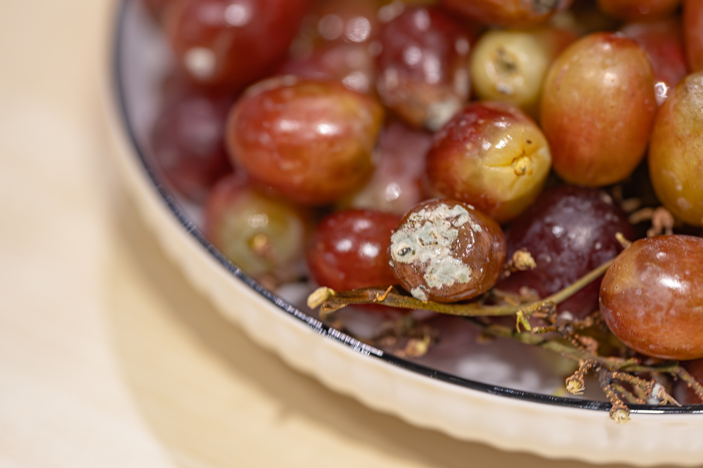
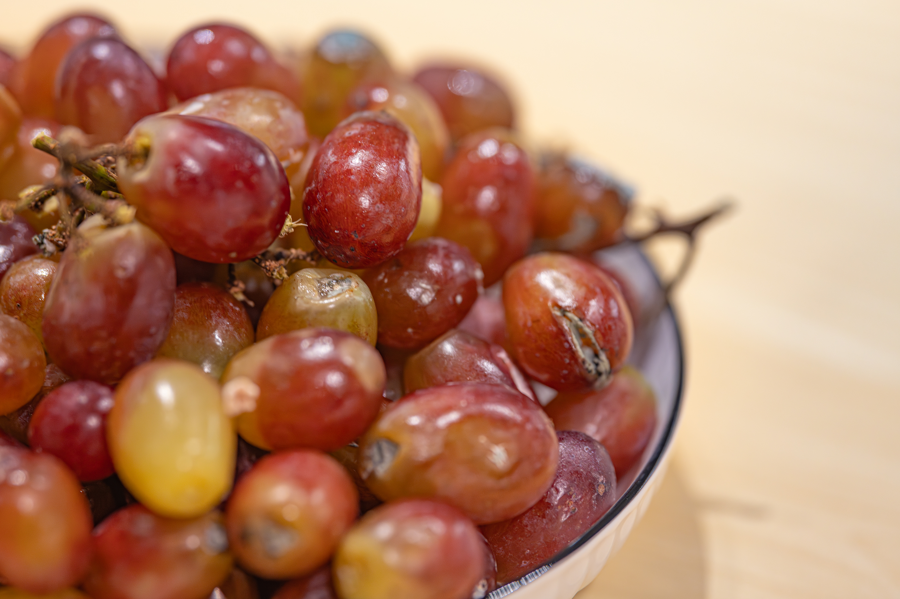
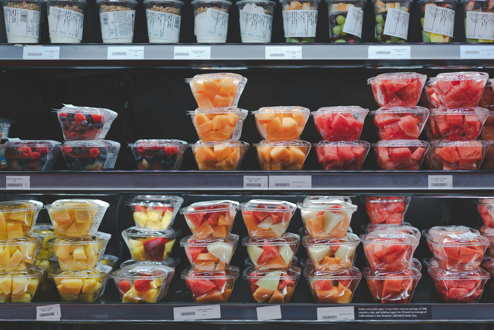
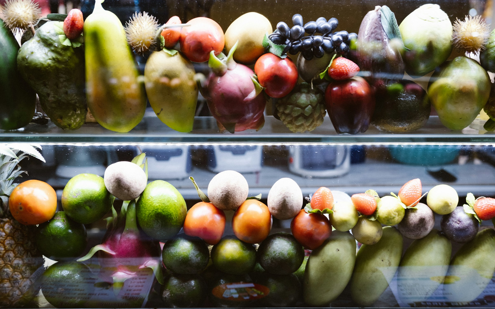
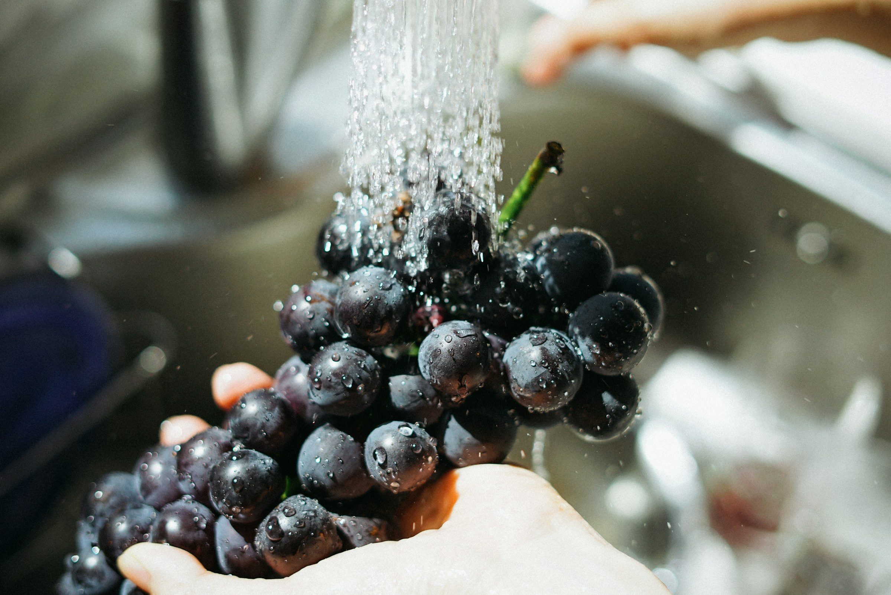
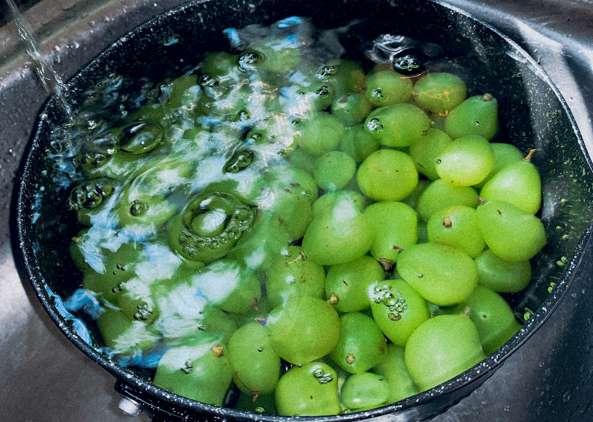

import GemeComposterCTA from '@site/src/components/GemeComposterCTA' 
import GemeTerra2CTA from '@site/src/components/GemeTerra2CTA' 
import RelatedArticles from '@site/src/components/RelatedArticles'

Grapes are a delicious and nutritious fruit, but they can spoil quickly if not handled properly. And, of course, you can compost spoiled or moldy fruits like grapes. 

In this practical guide, we’ll cover everything from explaining mold on grapes – how to spot it and what it means – and answering the big question: Can I compost spoiled or moldy grapes? We’ll also show you how to store grapes, how to wash grapes, and how long grapes can last in the fridge from trusted food safety and composting sources, along with step-by-step advice to keep your grapes fresh longer and to ensure your compost is healthy. 

<!-- truncate -->

<h2 className="jump-to">Jump To</h2>

1. **[Mold on Grapes: How to identify and prevent Mold on Fruits?](#1-mold-on-grapes-identifying-and-preventing-spoilage)**

2. **[What to Do With Moldy Grapes?](#2-what-to-do-with-moldy-grapes)**

3. **[Can I Compost Moldy Grapes?](#3-composting-grapes-best-practices)**

4. **[How to Store Grapes](#4-how-to-store-grapes)**

5. **[How Long Do Grapes Last in the Fridge?](#5-how-long-do-grapes-last-in-the-fridge)**

6. **[How to Wash Grapes](#6-how-to-wash-grapes)**

7. **[Tips For What to Do With Moldy Fruits](#7-key-takeaways)**

## 1. Mold on Grapes: Identifying and Preventing Spoilage

Even with proper storage, grapes will eventually spoil. One of the most visible issues is mold.  Mold on grapes usually appears as fuzzy or powdery patches in colours like white, green, or grey. (A thin white coating called “bloom” is normal and harmless – it’s a natural wax that protects the grape. But fuzzy patches or dark spots are actual mold.) Common grape molds include Botrytis cinerea (grey mold) and Penicillium species.

Mold thrives in moist, warm conditions. In grapes, you’ll often find mold starting near damaged stems or cracks in the skin, or on grapes at the bottom of the bunch where condensation collects. If you spot any fuzz or discolouration on a grape, that grape is spoiled. 

Even a little mold is a warning sign. According to food safety experts, you should **throw out** or **compost** the grapes that show visible mold, along with any others that were touching them.

- If you only find 1–2 moldy grapes at the end of a stem, it’s safest to discard the entire bunch, because mold threads and spores can spread invisibly between grapes.

- If more than about 25% of the grapes in a batch are moldy, experts advise tossing the whole lot. Even small amounts of mold can pose a risk, and cutting around mold is difficult on soft fruits.

- **Consuming small amounts of moldy grapes by accident is unlikely to cause serious harm** (mold toxins usually require larger exposures), but it’s best to err on the side of caution, especially for children, pets, or immunocompromised individuals.

To **prevent mold on grapes**, keep them dry and cold. Wash your hands and utensils to avoid introducing extra mold spores. Inspect grapes daily and promptly remove any with soft spots or damage. Some sources even recommend storing berries (including grapes) on a dry paper towel to soak up extra moisture. 

If grapes begin to look tired (slightly shrivelled), use or freeze them immediately to avoid mold setting in.

## 2. What to Do with Moldy Grapes

When grapes turn moldy, don’t eat them. The next question is often: Should you throw them away, or can they go into the compost?  If you have a backyard compost pile or a kitchen composter, composting is the best option for moldy or spoiled grapes. 

Composting moldy fruit recycles nutrients back into the soil and is generally safe if done properly. However, be mindful of a few things:

- **Discard food waste cautiously**. As noted, remove any grapes that are mushy or actively rotting. Only moldy grape parts should go to the electric composter or the compost pile.

- **Avoid cross-contamination**. If moldy grapes were stored with other produce, be sure to remove and compost those nearby grapes, too.

- **Cover compost properly in a pile**. Fresh fruit scraps should be buried in your compost under a layer of "browns" (leaves, straw, newspaper) to deter pests and flies. However, using a home electric composter like the GEME composter can avoid the annoying pests or flies that usually are attracted to open food waste.

<GemeTerra2CTA 
 imgSrc="/img/geme-terra-2-composter.jpg"
 productTitle="GEME Terra II Composter"
 features={[
    "✅ Best Way Of Composting at Home",
    "✅ Quiet, Odour-Free, Real Compost",
    "✅ Rich Compost Output For Garden Soil & Plants",
    "✅ Reduce Landfill Waste & Greenhouse Gases"
 ]}
buttonText="Get Your GEME Terra II"
  href="https://www.geme.bio/product/terra2?utm_medium=blog&utm_source=geme_website&utm_campaign=general_seo_content&utm_content=can-i-compost-moldy-grapes"
/>

The key idea: **adding moldy fruits can actually help your compost**. Mold and fungi are important decomposers; they break down tough plant material and feed other microbes. 

Most mold species on food will be killed by the heat of an active compost pile. In fact, a well-maintained compost pile can reach 130–160°F, which is hot enough to kill the spores of most pathogens and molds. So any harmful fungi on the grapes are not likely to survive a thorough composting process. 

But the question is, most families don't have enough space or kitchen waste to build a large compost pile that can reach a high enough temperature to kill the pathogens and molds. Your compost will stay cold in a simple small pile, especially in autumn or winter days, and can take months to finish. **Thus, a kitchen composter is recommended as the best solution, as it can heat up your compost to 160-210°F, and break down the moldy grapes to finished compost within a day**.

If you throw grapes in the composter, follow the composting rules (see below) and be sure to cover them with browns. 

<GemeComposterCTA 
 imgSrc="/img/geme-bio-composter.jpg"
 productTitle="GEME Bio-waste Composter"
 features={[
    "✅ Compost Spoiled or Moldy Fruits within 8 hours",
    "✅ Rich Compost For Soil Health & Garden Plants",
    "✅ Quiet, Odour-Free, Real Compost",
    "✅ Reduce Landfill Waste & Greenhouse Gases"
 ]}
buttonText="Use GEME Kitchen Composter to Reduce Food Waste"
  href="https://www.geme.bio/product/geme?utm_medium=blog&utm_source=geme_website&utm_campaign=general_seo_content&utm_content=can-i-compost-moldy-grapes"
/>

## 3. Composting Grapes: Best Practices

If you decide to compost your grapes (spoiled or not), here’s how to do it effectively:

- **Scrap collection**. Toss grape stems, skins, and leftover grapes into your GEME composter as part of the “greens” (nitrogen-rich) materials. The EPA explicitly lists “fruits and vegetables” as acceptable compost inputs.

- **Chop or crush if needed**. For a compost pile, breaking grapes into smaller pieces (or stepping on them) speeds up decomposition. However, even whole grapes will compost after months. **If you use a GEME electric composter, you can skip this step as the stirring system inside the machine will break the moldy grapes automatically.** 

- **Maintain the brown/green balance**. A healthy compost needs more browns (carbon) than greens (nitrogen). Aim for about 2–3 parts brown (dry leaves, straw, shredded paper) to 1 part green (food scraps like moldy grapes or other fruits) by volume. As you add grapes (greens), mix in plenty of dry leaves, shredded newspaper, or straw. This also helps cover the moist fruit.

- **Bury fruit scraps**. When adding grapes into a compost pile, always cover them with 4–8 inches of browns (as EPA recommends). Even better, bury them under 8–10 inches of material. This keeps fruit flies and rodents away. An odour-free, covered pile should not attract pests if well-managed. When using the GEME composter, you can skip this step, too. **The GEME composter is designed to minimise odours to zero and keep animals away.**

- **Turn and monitor**. Occasionally turn or aerate your pile. This not only mixes the materials but also helps the pile heat up (130–160 °F). High temperatures accelerate breakdown and sterilise any dangerous microbes. **When in GEME composter, this will also be done automatically. Hands free!** 

- **Keep moisture balanced**. The compost should be about as damp as a wrung-out sponge. If it’s too wet (which fruit scraps can cause), add more dry browns. If it’s too dry, add water and more greens.

Following these steps, your grapes – even ones that were moldy – will safely turn into rich compost in a day when using the GEME electric composter (or a few months for a barkyard compost pile). 

Remember that large backyard compost piles can take 3–6 months to mature fully, while smaller piles might take up to a year. **So, it's clearly better to use a composter for a safer, simpler, and shorter composting process**. Finished compost should be dark and earthy-smelling, with no visible food scraps.

If you compost in a cooler or outdoor pile that never heats up much (under 120 °F), just take extra care: bury the moldy grapes deeper and mix well to distribute heat.

### Key features of the GEME include:

- **True Composting (not just dehydration):** By using live microbes, the GEME’s output is genuine compost with nutrients and soil microbes, not merely ground dehydrated waste.

- **Fast Processing:** It transforms scraps into compostable material in as little as 6–8 hours per cycle, far quicker than a backyard compost pile.

- **Continuous Use:** You can add food waste anytime, even while a cycle is running; there’s no need to wait or pause collection.

- **Odour Control:** The GEME has a sealed, filter-equipped design that traps smells so your kitchen stays fresh.

- **Capacity:** It holds about 19 litres of material and can process up to 5 kg of waste per day, suiting a medium household.

- **Ease of Maintenance:** Parts are removable and dishwasher-safe, and the permanent filter never needs replacing.

## 4. How to Store Grapes

Proper storage is the first step to keeping grapes fresh and safe to eat. Grapes should be refrigerated to slow down decay and mold growth.  Store unwashed grapes in a ventilated container in the coldest part of your fridge (usually the back of the crisper drawer) for best results. 

Ideal refrigerator temperatures for grapes are near 32°F with 85–90% humidity. In these cold, humid conditions, grapes can stay firm and juicy; however, leaving grapes at room temperature will cause them to spoil much faster.

- **Keep grapes unwashed until eating**.  Washing adds moisture that can speed up mold, so only wash grapes right before you plan to eat them. Store them in a ventilated bag or container – many grapes come in a perforated bag or a plastic bin with holes.  This allows air flow and helps prevent condensation.

- **Avoid ethylene and strong odours**. Grapes emit a little ethylene gas as they ripen.  Keep grapes away from ethylene-sensitive produce (like lettuce, broccoli, and cucumbers) to prevent speeding up spoilage. Also, avoid storing grapes near very fragrant foods (like onions or garlic) or strong odours, since grapes can absorb those odours.

- **Handle gently**. Bruised or squashed grapes will spoil faster. In general, grapes last longer when still on the stem (being attached protects them). If you remove grapes from the stem, do so carefully by rolling them between your fingers. Any grapes that fall off naturally should be inspected: if they are damaged, discoloured, or moldy, toss them into the composter.

Following these steps will extend the life of your grapes.  For example, keeping grapes around 40°F or below can give them about a week of fridge life.  Under ideal conditions (dry, cold, and unwashed) they can sometimes last even longer – up to two or three weeks for very firm, thick-skinned varieties.

## 5. How Long Do Grapes Last in the Fridge?

The shelf life of grapes depends on how ripe they are at purchase and how you store them. Generally, you can expect about 7 days of quality in a standard home refrigerator (about 38–40°F) if grapes are ripe when stored. 

However, if you keep grapes in the very coldest part of the fridge (near 32°F) and with high humidity, some sources say grapes can last up to 3 weeks. In practice, most home refrigerators are around 34–38°F, so plan on eating grapes within 1–2 weeks for best quality.

Here are some signs to watch for as grapes age: wrinkling or shrivelling of the skin, soft or mushy spots, brown patches, or a fermented (alcoholic) smell. If you see these signs, the grapes have passed their prime and are likely unsafe to eat.  Also look for the telltale fuzzy spots of mold (discussed below) – a clear sign the grapes should be discarded and composted.

## 6. How to Wash Grapes

Washing grapes properly can remove dirt, bacteria, and pesticide residues from the surface.  However, washing also introduces moisture, so it’s best to wash grapes only right before eating. 

The FDA recommends a simple cleaning method for all fresh produce: rinse under cool running water and rub gently with your hands. You do not need to use any soap, detergent, or produce wash – these are not safe to ingest.

For grapes, a thorough approach is:

- **Step 1: Inspect and remove any bad grapes**. Before washing, dump the grapes into a bowl and pick out any that are already moldy, rotten, or crushed. Discard those immediately.

- **Step 2: Soak briefly (optional)**. You can fill the bowl with cool water and soak the grapes for 5–10 minutes. This helps loosen dirt and the natural waxy “bloom” on the grape skins. (However, don’t soak them overnight – a quick soak is enough.)

- **Step 3: Rinse under running water**. Drain the soaked water and then pour the grapes into a colander. Run cool tap water over them while gently moving the grapes with your hands so all surfaces are washed.

- **Step 4: (Optional) Scrub off the bloom**. If you want to remove the whitish “bloom” or any residues, sprinkle a little baking soda or salt on the grapes and gently rub. Then rinse again thoroughly until the foam is gone.

- **Step 5: Dry the grapes**. After rinsing, pat or air-dry the grapes to remove surface moisture. Extra moisture will promote mold during storage.

Throughout this process, wash your hands first and use clean utensils or bowls.  According to the FDA, you should wash your hands for at least 20 seconds with soap before handling produce. Keeping things clean helps prevent transferring germs to the fruit.

Some people also wash grapes in a vinegar solution or use a produce wash. A common method is to add 1–2 tablespoons of vinegar (white or apple cider vinegar) to the soaking water to help remove pesticides. If you use vinegar, be sure to rinse the grapes thoroughly afterwards to remove any sour taste. Overall, a careful water rinse is usually sufficient for home use.

Remember: **washing grapes prematurely is not advised**. The minute grapes are wet, their clock starts ticking towards spoilage. So only wash grapes when you’re about to eat or use them.

## 7. Key Takeaways

- **Store grapes cold and dry**. Keep grapes in the fridge (ideally near 32°F, 85–90% humidity) in a vented container. Unwashed grapes can last about 1 week at 40°F, or up to 2–3 weeks if kept very cold. Avoid sealing them airtight or washing them until just before use.

- **Wash grapes just before eating**. Rinse grapes under cool, running water, rubbing gently with your hands. You may briefly soak them or lightly scrub them with baking soda or salt to remove residue. No soap or detergent needed.

- **Watch for mold**. Moldy grapes should be discarded from your eating stash. If you see fuzzy white, green, or grey patches, throw the affected grapes and any other fruits touching them into the GEME composter. If a large portion is moldy, it’s best to discard the whole batch. Let them return to nature as real compost. 

- **Safe to compost**. Spoiled or moldy grapes can be safely composted as long as you use the GEME composter or if you are able to manage the backyard compost pile properly. Treat grapes as “greens”: chop if you like, then bury them under plenty of browns (leaves, newspaper). If you have a compost pile, remember to aerate it so it heats up to kill harmful microbes.

- **Prevent pests in compost**. Cover fruit scraps well and bury them to discourage flies or rodents. A well-constructed, maintained compost pile should not attract pests. If you want a hands-free solution, the GEME kitchen composter will meet all your needs.

- **Zero-waste mindset**. By storing grapes correctly and composting any spoilage, you reduce food waste and return nutrients to the garden. Even moldy grapes serve a purpose in compost, helping create rich, fertile soil for future plants.

Following these tips will help you enjoy more of your grapes without waste – and turn the rest into garden gold.

## Sources:

1. https://www.fda.gov/

2. https://extension.oregonstate.edu/

3. https://www.epa.gov/

4. https://www.fns.usda.gov/

5. https://19january2021snapshot.epa.gov/index.html

<RelatedArticles
  slugs={[
  "the-best-composter-to-reduce-food-waste",
  "compost-pile-vs-electric-composter",
  "how-to-make-bananas-last-longer",
  "garden-soil-vs-compost-pros-and-cons",
  "how-long-do-blueberries-last-in-fridge",
  "how-long-do-apples-last-in-the-fridge",
  "how-to-grow-tomatoes-safely",
  ]}
/>

_Ready to transform your gardening game? Subscribe to our [newsletter](http://geme.bio/signup) for expert composting tips and sustainable gardening advice._

